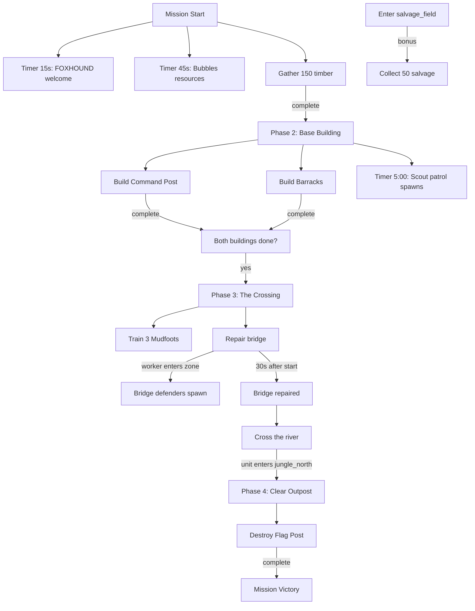

# Mission 1-1: BEACHHEAD

## Header
- **ID**: `mission_1`
- **Chapter**: 1 — First Landing
- **Map**: 128x96 tiles (4096x3072px)
- **Setting**: Southern coast of Copper-Silt Reach. Sandy beach transitions to jungle. River with damaged bridge bisects the map. Enemy outpost in the north.
- **Win**: Complete all primary objectives (establish base, repair bridge, clear outpost)
- **Lose**: Lodge destroyed
- **Par Time**: 15 minutes
- **Unlocks**: River Rat, Mudfoot, Command Post, Barracks, Watchtower, Fish Trap, Burrow, Sandbag Wall

## Zone Map
```
    0         32        64        96       128
  0 |---------|---------|---------|---------|
    | jungle_nw         | enemy_outpost     |
    |  (mangrove)       | (fortified)       |
 16 |                   |                   |
    |---------|---------|---------|---------|
 24 | jungle_north      | patrol_route      |
    |  (grass+trees)    | (enemy patrols)   |
 32 |---------|---------|---------|---------|
    |         | bridge  |                   |
 40 |  river  | cross   |  river            |
    |  (water, impassable except bridge)    |
 48 |---------|---------|---------|---------|
    | mud_banks         | mud_banks         |
 52 |---------|---------|---------|---------|
    | jungle_south      | salvage_field     |
    | (mangrove,timber) |  (wreckage)       |
 64 |---------|---------|---------|---------|
    | dirt_clearing     | beach_east        |
    | (base area)       | (open sand)       |
 76 |---------|---------|---------|---------|
    | landing_zone (beach)                  |
    | (player start, lodge)                 |
 96 |---------|---------|---------|---------|
```

## Zones (tile coordinates)
```typescript
zones: {
  landing_zone:   { x: 16, y: 76, width: 96, height: 20 },
  dirt_clearing:  { x: 24, y: 64, width: 40, height: 12 },
  jungle_south:   { x: 8,  y: 52, width: 48, height: 12 },
  salvage_field:  { x: 80, y: 52, width: 40, height: 16 },
  mud_banks:      { x: 0,  y: 44, width: 128, height: 8 },
  river:          { x: 0,  y: 36, width: 128, height: 8 },
  bridge_crossing:{ x: 56, y: 34, width: 16, height: 12 },
  jungle_north:   { x: 8,  y: 20, width: 112, height: 14 },
  enemy_outpost:  { x: 64, y: 4,  width: 48, height: 16 },
  jungle_nw:      { x: 8,  y: 4,  width: 48, height: 16 },
}
```

## Terrain Regions
```typescript
terrain: {
  width: 128, height: 96,
  regions: [
    { terrainId: "grass", fill: true },
    // Beach (southern coast)
    { terrainId: "beach", rect: { x: 0, y: 76, w: 128, h: 20 } },
    // River (east-west, sinuous)
    { terrainId: "water", river: {
      points: [[0,40],[20,38],[40,36],[64,38],[80,40],[100,38],[128,40]],
      width: 6
    }},
    // Mud banks flanking river
    { terrainId: "mud", rect: { x: 0, y: 32, w: 128, h: 4 } },
    { terrainId: "mud", rect: { x: 0, y: 44, w: 128, h: 4 } },
    { terrainId: "mud", circle: { cx: 20, cy: 36, r: 4 } },
    { terrainId: "mud", circle: { cx: 100, cy: 42, r: 3 } },
    // Mangrove groves
    { terrainId: "mangrove", rect: { x: 8, y: 52, w: 48, h: 12 } },
    { terrainId: "mangrove", rect: { x: 8, y: 4, w: 48, h: 16 } },
    { terrainId: "mangrove", circle: { cx: 100, cy: 24, r: 8 } },
    // Dirt clearing for player base
    { terrainId: "dirt", rect: { x: 24, y: 64, w: 40, h: 12 } },
    { terrainId: "dirt", rect: { x: 56, y: 46, w: 6, h: 18 } }, // path to bridge
    // Salvage wreckage area
    { terrainId: "dirt", rect: { x: 84, y: 56, w: 20, h: 8 } },
    // Enemy outpost clearing
    { terrainId: "dirt", rect: { x: 68, y: 6, w: 40, h: 12 } },
  ],
  overrides: [
    // Bridge (2 tiles wide, spanning river)
    ...bridgeTiles(58, 34, 58, 42), // generates bridge tiles from y=34 to y=42
  ]
}
```

## Placements

### Player (landing_zone)
```typescript
// Lodge (Captain's field HQ)
{ type: "burrow", faction: "ura", x: 40, y: 80 },
// Starting workers
{ type: "river_rat", faction: "ura", x: 36, y: 82 },
{ type: "river_rat", faction: "ura", x: 42, y: 83 },
{ type: "river_rat", faction: "ura", x: 38, y: 85 },
{ type: "river_rat", faction: "ura", x: 44, y: 81 },
```

### Resources
```typescript
// Timber (mangrove grove south)
{ type: "mangrove_tree", faction: "neutral", x: 12, y: 54 },
{ type: "mangrove_tree", faction: "neutral", x: 18, y: 56 },
{ type: "mangrove_tree", faction: "neutral", x: 24, y: 55 },
{ type: "mangrove_tree", faction: "neutral", x: 30, y: 58 },
{ type: "mangrove_tree", faction: "neutral", x: 15, y: 60 },
{ type: "mangrove_tree", faction: "neutral", x: 22, y: 62 },
{ type: "mangrove_tree", faction: "neutral", x: 36, y: 57 },
{ type: "mangrove_tree", faction: "neutral", x: 42, y: 59 },
// Fish (river bank)
{ type: "fish_spot", faction: "neutral", x: 30, y: 44 },
{ type: "fish_spot", faction: "neutral", x: 50, y: 46 },
{ type: "fish_spot", faction: "neutral", x: 75, y: 44 },
// Salvage (wreckage field)
{ type: "salvage_cache", faction: "neutral", x: 88, y: 58 },
{ type: "salvage_cache", faction: "neutral", x: 94, y: 60 },
{ type: "salvage_cache", faction: "neutral", x: 90, y: 56 },
```

### Enemies
```typescript
// Scout patrol near river (Phase 2 trigger)
// Spawned by trigger, not placed at start

// Bridge defenders (Phase 3, spawned when bridge repair starts)
// 4 Gators + 2 Skinks north of bridge

// Enemy outpost (Phase 4, static placement)
{ type: "flag_post", faction: "scale_guard", x: 80, y: 10 },
{ type: "gator", faction: "scale_guard", x: 76, y: 8 },
{ type: "gator", faction: "scale_guard", x: 82, y: 8 },
{ type: "gator", faction: "scale_guard", x: 78, y: 12 },
{ type: "gator", faction: "scale_guard", x: 84, y: 12 },
{ type: "gator", faction: "scale_guard", x: 80, y: 14 },
{ type: "gator", faction: "scale_guard", x: 86, y: 10 },
{ type: "skink", faction: "scale_guard", x: 74, y: 6 },
{ type: "viper", faction: "scale_guard", x: 88, y: 6 },
```

## Phases

### Phase 1: LANDFALL (0:00 - ~3:00)
**Entry**: Mission start
**State**: Lodge placed, 4 River Rats, 100 fish / 50 timber. Only landing_zone and jungle_south visible.
**Objectives**:
- "Gather 150 timber from the mangrove grove" (PRIMARY)

**Triggers**:
```
[0:15] foxhound-welcome
  Condition: timer(15)
  Action: dialogue("foxhound", "Captain, you're on the ground. Mangrove grove to the northwest — timber for construction. Get your workers moving.")

[0:45] bubbles-resources
  Condition: timer(45)
  Action: dialogue("col_bubbles", "Priority one: establish resource flow. Harvest timber, haul it back to the lodge. We need materials before we can build anything.")

timber-gathered
  Condition: resourceThreshold("timber", "gte", 150) [NEW — needs implementation]
  Action: [completeObjective("gather-timber"), dialogue("foxhound", "Resource stockpile building nicely, Captain."), startPhase("base-building")]
```

### Phase 2: BASE BUILDING (~3:00 - ~8:00)
**Entry**: 150 timber gathered
**New objectives**:
- "Build a Command Post" (PRIMARY)
- "Build a Barracks" (PRIMARY)

**Triggers**:
```
phase2-briefing
  Condition: enableTrigger (fired by Phase 1 completion)
  Action: exchange([
    { speaker: "Col. Bubbles", text: "Good work, Captain. You've got materials. Build a Command Post for logistics — that's your upgrade path. Then a Barracks for infantry." },
    { speaker: "FOXHOUND", text: "Command Post also unlocks Watchtowers and Fish Traps. You'll want both." }
  ])

command-post-built
  Condition: buildingCount("ura", "command_post", "gte", 1)
  Action: [completeObjective("build-command-post"), dialogue("col_bubbles", "Command Post operational. Now get that Barracks up — we need boots on the ground.")]

barracks-built
  Condition: buildingCount("ura", "barracks", "gte", 1)
  Action: [completeObjective("build-barracks"), dialogue("col_bubbles", "Barracks online. Train some Mudfoots, Captain. We're going to need them.")]

[5:00] scout-patrol
  Condition: timer(300)
  Action: [
    spawn("skink", "scale_guard", 52, 30, 2),
    dialogue("foxhound", "Movement near the river, Captain. Scale-Guard scouts. They're not aggressive yet — but they know this area.")
  ]

both-buildings-done
  Condition: objectiveComplete("build-command-post") AND objectiveComplete("build-barracks")
  Action: [enableTrigger("phase3-briefing")]
```

### Phase 3: THE CROSSING (~8:00 - ~12:00)
**Entry**: Both Command Post and Barracks built
**New objectives**:
- "Train 3 Mudfoots" (PRIMARY)
- "Repair the bridge" (PRIMARY)
- "Cross the river" (PRIMARY)

**Triggers**:
```
phase3-briefing
  Condition: enabled by Phase 2
  Action: exchange([
    { speaker: "Col. Bubbles", text: "Captain, we need to push north. The bridge crossing is our only path — it's damaged but repairable." },
    { speaker: "FOXHOUND", text: "Send a worker to the bridge. They can patch it. But expect Scale-Guard resistance once you start work." },
    { speaker: "Col. Bubbles", text: "Train up some Mudfoots first. You'll want fighters before you start hammering." }
  ])

mudfoots-trained
  Condition: unitCount("ura", "mudfoot", "gte", 3)
  Action: [completeObjective("train-mudfoots"), dialogue("col_bubbles", "Squad's ready. Move on that bridge, Captain.")]

bridge-repair-start
  Condition: areaEntered("ura", "bridge_crossing", { unitType: "river_rat" })
  Action: [
    dialogue("foxhound", "Bridge repair underway. This will draw attention, Captain."),
    spawn("gator", "scale_guard", 60, 28, 4),
    spawn("skink", "scale_guard", 64, 26, 2),
    dialogue("col_bubbles", "Contacts north of the bridge! Defend the workers!")
  ]

bridge-repaired
  Condition: timer(30) after bridge-repair-start [implemented as secondary timer trigger]
  Action: [completeObjective("repair-bridge"), dialogue("foxhound", "Bridge is passable. Send your forces across.")]

river-crossed
  Condition: areaEntered("ura", "jungle_north")
  Action: [completeObjective("cross-river"), enableTrigger("phase4-briefing")]
```

### Phase 4: CLEAR THE OUTPOST (~12:00+)
**Entry**: URA unit crosses river
**New objectives**:
- "Destroy the enemy Flag Post" (PRIMARY)

**Triggers**:
```
phase4-briefing
  Condition: enabled by Phase 3
  Action: exchange([
    { speaker: "FOXHOUND", text: "Enemy outpost ahead, northeast. Flag Post is their command structure — destroy it and they'll scatter." },
    { speaker: "Col. Bubbles", text: "Take it out, Captain. That outpost is the last obstacle to securing this beachhead." }
  ])

outpost-approach
  Condition: areaEntered("ura", "enemy_outpost")
  Action: dialogue("foxhound", "You're in their perimeter. Multiple hostiles. Watch the flanks.")

outpost-destroyed
  Condition: buildingCount("scale_guard", "flag_post", "eq", 0)
  Action: [completeObjective("destroy-outpost")]

mission-complete
  Condition: allPrimaryComplete()
  Action: exchange([
    { speaker: "Gen. Whiskers", text: "Outstanding work, Captain. Beachhead is secured. The Copper-Silt Reach campaign has begun." },
    { speaker: "Col. Bubbles", text: "Reinforcements and supplies inbound. Rest your troops — the next push won't be this easy. HQ out." }
  ], followed by: victory())
```

### Bonus Objective
```
salvage-discovery
  Condition: areaEntered("ura", "salvage_field")
  Action: dialogue("foxhound", "Wreckage to the east, Captain. Usable salvage in there.")

salvage-collected
  Condition: resourceThreshold("salvage", "gte", 50)
  Action: completeObjective("bonus-salvage")
```

## Trigger Flowchart


## Balance Notes
- **Starting resources**: 100 fish, 50 timber — enough for initial gathering, not enough to build immediately
- **Command Post cost**: 200 fish, 100 timber — requires ~3 minutes of gathering
- **Barracks cost**: 150 fish, 75 timber — can build shortly after Command Post
- **Mudfoot train time**: 15 seconds each, cost 75 fish — 3 Mudfoots = ~60 seconds + 225 fish
- **Enemy scaling** (difficulty):
  - Support: scout patrol 1 Skink, bridge defenders 3 Gators, outpost 4 enemies
  - Tactical: as written (2 Skinks, 6 defenders, full outpost)
  - Elite: 3 Skinks, 8 defenders, outpost + reinforcement wave
- **Par time**: 15 minutes on Tactical — generous for tutorial pace
