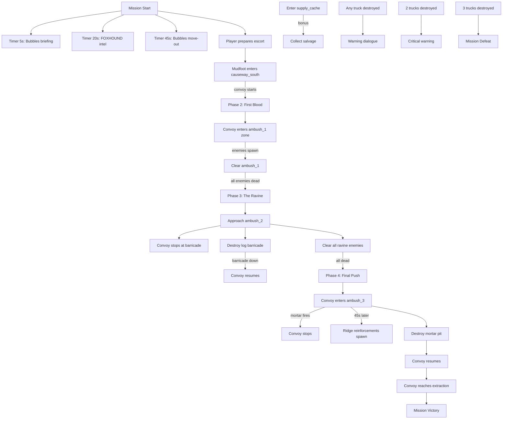

# Mission 1-2: THE CAUSEWAY

## Header
- **ID**: `mission_2`
- **Chapter**: 1 — First Landing
- **Map**: 128x128 tiles (4096x4096px)
- **Setting**: Dense jungle interior of Copper-Silt Reach. A narrow dirt causeway cuts north through swamp and canopy. Scale-Guard ambush territory. OEF must escort a supply convoy from the southern depot to the northern firebase staging area.
- **Win**: All 3 convoy trucks reach the northern extraction point
- **Lose**: Lodge destroyed OR all 3 convoy trucks destroyed
- **Par Time**: 20 minutes
- **Unlocks**: Shellcracker (heavy infantry)

## Zone Map
```
    0         32        64        96       128
  0 |---------|---------|---------|---------|
    | jungle_nw         | extraction_point  |
    |  (thick canopy)   | (clearing, dest.) |
  8 |                   |                   |
    |---------|---------|---------|---------|
 16 | swamp_north       | ambush_3          |
    |  (deep bog)       | (ridge overlook)  |
 24 |---------|---------|---------|---------|
    | ambush_2          | jungle_ne         |
    | (ravine+fallen    | (dense canopy,    |
 32 |  logs, choke)     |  patrol route)    |
    |---------|---------|---------|---------|
 40 | causeway_mid      | supply_cache      |
    |  (narrow road,    | (hidden salvage)  |
 48 |   exposed)        |                   |
    |---------|---------|---------|---------|
 56 | swamp_south       | ambush_1          |
    |  (shallow bog,    | (treeline with    |
 64 |   mangrove)       |  concealed units) |
    |---------|---------|---------|---------|
 72 | causeway_south    | jungle_se         |
    |  (road start,     | (light trees,     |
 80 |   open terrain)   |  timber source)   |
    |---------|---------|---------|---------|
 88 | depot_zone (player start)             |
    | (lodge, convoy trucks, staging area)  |
 96 |                                       |
    |                                       |
104 |                                       |
    |                                       |
112 |                                       |
    |                                       |
120 |                                       |
    |                                       |
128 |---------|---------|---------|---------|
```

## Zones (tile coordinates)
```typescript
zones: {
  depot_zone:        { x: 8,  y: 88, width: 112, height: 40 },
  causeway_south:    { x: 8,  y: 72, width: 48,  height: 16 },
  jungle_se:         { x: 64, y: 72, width: 56,  height: 16 },
  swamp_south:       { x: 8,  y: 56, width: 48,  height: 16 },
  ambush_1:          { x: 64, y: 56, width: 56,  height: 16 },
  causeway_mid:      { x: 8,  y: 40, width: 48,  height: 16 },
  supply_cache:      { x: 64, y: 40, width: 56,  height: 16 },
  ambush_2:          { x: 8,  y: 24, width: 48,  height: 16 },
  jungle_ne:         { x: 64, y: 24, width: 56,  height: 16 },
  swamp_north:       { x: 8,  y: 16, width: 48,  height: 8  },
  ambush_3:          { x: 64, y: 8,  width: 56,  height: 16 },
  jungle_nw:         { x: 8,  y: 0,  width: 48,  height: 16 },
  extraction_point:  { x: 64, y: 0,  width: 56,  height: 8  },
}
```

## Terrain Regions
```typescript
terrain: {
  width: 128, height: 128,
  regions: [
    { terrainId: "grass", fill: true },
    // Dense jungle canopy (most of the map)
    { terrainId: "jungle", rect: { x: 0, y: 0, w: 128, h: 88 } },
    // Dirt causeway (north-south road, 8 tiles wide, slightly winding)
    { terrainId: "dirt", path: {
      points: [[32,88],[30,80],[28,72],[32,64],[36,56],[34,48],[30,40],[28,32],[32,24],[36,16],[40,8],[44,4]],
      width: 8
    }},
    // Depot clearing (south)
    { terrainId: "dirt", rect: { x: 8, y: 88, w: 112, h: 40 } },
    // Extraction clearing (north)
    { terrainId: "dirt", rect: { x: 68, y: 0, w: 48, h: 8 } },
    // Swamp / bog zones
    { terrainId: "swamp", rect: { x: 0, y: 56, w: 24, h: 16 } },
    { terrainId: "swamp", rect: { x: 0, y: 16, w: 24, h: 8 } },
    { terrainId: "swamp", circle: { cx: 16, cy: 64, r: 6 } },
    { terrainId: "swamp", circle: { cx: 12, cy: 20, r: 5 } },
    // Mud patches along causeway edges
    { terrainId: "mud", rect: { x: 20, y: 70, w: 8, h: 4 } },
    { terrainId: "mud", rect: { x: 22, y: 46, w: 6, h: 4 } },
    { terrainId: "mud", rect: { x: 24, y: 30, w: 8, h: 4 } },
    // Ambush ridge (ambush_3 — elevated terrain)
    { terrainId: "rock", rect: { x: 72, y: 8, w: 40, h: 12 } },
    // Mangrove pockets
    { terrainId: "mangrove", rect: { x: 8, y: 58, w: 16, h: 10 } },
    { terrainId: "mangrove", circle: { cx: 100, cy: 60, r: 6 } },
    // Supply cache clearing
    { terrainId: "dirt", rect: { x: 76, y: 42, w: 16, h: 8 } },
    // Ambush 2 ravine (impassable flanking terrain)
    { terrainId: "water", rect: { x: 4, y: 26, w: 12, h: 4 } },
  ],
  overrides: []
}
```

## Placements

### Player (depot_zone)
```typescript
// Lodge (Captain's field HQ)
{ type: "burrow", faction: "ura", x: 24, y: 96 },
// Starting combat units
{ type: "mudfoot", faction: "ura", x: 20, y: 94 },
{ type: "mudfoot", faction: "ura", x: 22, y: 98 },
{ type: "mudfoot", faction: "ura", x: 26, y: 98 },
{ type: "mudfoot", faction: "ura", x: 28, y: 94 },
{ type: "mudfoot", faction: "ura", x: 30, y: 96 },
{ type: "mudfoot", faction: "ura", x: 18, y: 96 },
// Starting workers
{ type: "river_rat", faction: "ura", x: 32, y: 100 },
{ type: "river_rat", faction: "ura", x: 36, y: 100 },
// Pre-built buildings
{ type: "barracks", faction: "ura", x: 40, y: 96 },
{ type: "command_post", faction: "ura", x: 48, y: 96 },
// Convoy trucks (scripted entities, follow causeway path)
{ type: "convoy_truck", faction: "ura", x: 56, y: 100, scriptId: "truck_1" },
{ type: "convoy_truck", faction: "ura", x: 60, y: 100, scriptId: "truck_2" },
{ type: "convoy_truck", faction: "ura", x: 64, y: 100, scriptId: "truck_3" },
```

### Resources
```typescript
// Timber (jungle southeast)
{ type: "jungle_tree", faction: "neutral", x: 70, y: 74 },
{ type: "jungle_tree", faction: "neutral", x: 76, y: 76 },
{ type: "jungle_tree", faction: "neutral", x: 82, y: 78 },
{ type: "jungle_tree", faction: "neutral", x: 88, y: 74 },
{ type: "jungle_tree", faction: "neutral", x: 74, y: 80 },
{ type: "jungle_tree", faction: "neutral", x: 80, y: 82 },
// Fish (swamp ponds)
{ type: "fish_spot", faction: "neutral", x: 14, y: 62 },
{ type: "fish_spot", faction: "neutral", x: 10, y: 18 },
// Salvage (hidden supply cache)
{ type: "salvage_cache", faction: "neutral", x: 80, y: 44 },
{ type: "salvage_cache", faction: "neutral", x: 84, y: 46 },
{ type: "salvage_cache", faction: "neutral", x: 78, y: 48 },
// Crate drops (bonus resources on convoy path, reward for exploring off-road)
{ type: "supply_crate", faction: "neutral", x: 100, y: 36 },
```

### Enemies

#### Ambush 1 (causeway_south / ambush_1 — Phase 2)
```typescript
// Spawned by trigger when convoy enters ambush_1 zone
// 4 Gators in treeline, 2 Skinks flanking from jungle
```

#### Ambush 2 (ambush_2 — Phase 3)
```typescript
// Static placement: dug-in along ravine
{ type: "gator", faction: "scale_guard", x: 14, y: 26 },
{ type: "gator", faction: "scale_guard", x: 18, y: 28 },
{ type: "gator", faction: "scale_guard", x: 22, y: 26 },
{ type: "gator", faction: "scale_guard", x: 26, y: 30 },
{ type: "gator", faction: "scale_guard", x: 30, y: 28 },
{ type: "skink", faction: "scale_guard", x: 12, y: 30 },
{ type: "skink", faction: "scale_guard", x: 34, y: 30 },
// Log barricade (destructible, blocks road)
{ type: "log_barricade", faction: "scale_guard", x: 28, y: 28 },
```

#### Ambush 3 (ambush_3 — Phase 4)
```typescript
// Elevated ridge — ranged advantage
{ type: "gator", faction: "scale_guard", x: 76, y: 10 },
{ type: "gator", faction: "scale_guard", x: 80, y: 12 },
{ type: "gator", faction: "scale_guard", x: 84, y: 10 },
{ type: "gator", faction: "scale_guard", x: 88, y: 14 },
{ type: "viper", faction: "scale_guard", x: 92, y: 10 },
{ type: "viper", faction: "scale_guard", x: 96, y: 12 },
{ type: "skink", faction: "scale_guard", x: 100, y: 8 },
{ type: "skink", faction: "scale_guard", x: 104, y: 10 },
// Mortar emplacement on ridge
{ type: "mortar_pit", faction: "scale_guard", x: 88, y: 8 },
```

#### Patrols (jungle_ne — active throughout)
```typescript
// Roaming patrol that may intercept convoy or flanking player units
{ type: "skink", faction: "scale_guard", x: 80, y: 28, patrol: [[80,28],[90,32],[100,28],[90,24]] },
{ type: "skink", faction: "scale_guard", x: 82, y: 30, patrol: [[82,30],[92,34],[102,30],[92,26]] },
```

## Phases

### Phase 1: MUSTERING (0:00 - ~4:00)
**Entry**: Mission start
**State**: Lodge placed, 6 Mudfoots, 2 River Rats, pre-built Barracks + Command Post, 3 convoy trucks idling in depot. 200 fish / 100 timber / 50 salvage. Only depot_zone and causeway_south visible.
**Objectives**:
- "Prepare your escort force" (TUTORIAL — auto-completes when convoy departs)

**Triggers**:
```
[0:05] bubbles-briefing
  Condition: timer(5)
  Action: exchange([
    { speaker: "Col. Bubbles", text: "Captain, listen up. Three supply trucks need to reach Firebase Delta up north. The causeway is the only road through this swamp, and Scale-Guard knows it." },
    { speaker: "Col. Bubbles", text: "Those trucks are loaded with munitions and construction materials. We lose them, we lose our foothold in the Reach." }
  ])

[0:20] foxhound-intel
  Condition: timer(20)
  Action: exchange([
    { speaker: "FOXHOUND", text: "Intel shows at least three prepared ambush positions along the causeway. They've had days to dig in." },
    { speaker: "FOXHOUND", text: "I'll mark contacts as we spot them. Keep your soldiers ahead of the convoy — those trucks can't shoot back." }
  ])

[0:45] bubbles-move-out
  Condition: timer(45)
  Action: exchange([
    { speaker: "Col. Bubbles", text: "You've got a Barracks and some Mudfoots. Train more if you want, but don't take forever — every minute is a minute they use to reinforce." },
    { speaker: "Col. Bubbles", text: "When you're ready, move a unit north onto the causeway. The convoy will follow your lead." }
  ])

convoy-start
  Condition: areaEntered("ura", "causeway_south", { unitType: "mudfoot" })
  Action: [
    dialogue("col_bubbles", "Convoy is rolling. Stay ahead of the trucks, Captain. They'll follow the road — you handle the ambushes."),
    setConvoyState("truck_1", "moving"),
    setConvoyState("truck_2", "moving"),
    setConvoyState("truck_3", "moving"),
    startPhase("first-ambush")
  ]
```

### Phase 2: FIRST BLOOD (~4:00 - ~9:00)
**Entry**: Convoy begins moving (player unit enters causeway_south)
**State**: Convoy trucks begin scripted movement along causeway path. Trucks move at 60% unit speed. Trucks stop when enemies are within 8 tiles. Fog reveals causeway_south and ambush_1 zones.
**New objectives**:
- "Escort the convoy past the first ambush" (PRIMARY)
- "Keep at least 1 truck alive" (PRIMARY — persistent)

**Triggers**:
```
ambush-1-trigger
  Condition: convoyEntersZone("ambush_1") [fires when lead truck reaches y=60]
  Action: [
    spawn("gator", "scale_guard", 72, 58, 4),
    spawn("skink", "scale_guard", 80, 62, 2),
    dialogue("foxhound", "Ambush! Contacts in the treeline, east side! They're targeting the trucks!"),
    dialogue("col_bubbles", "Get your Mudfoots in front of those trucks NOW!")
  ]

truck-damaged-warning
  Condition: entityHealth("convoy_truck", "any", "lte", 50)
  Action: dialogue("foxhound", "Truck taking heavy damage! Pull your fighters in close — don't let them pick off the convoy!")

truck-destroyed-1
  Condition: entityDestroyed("convoy_truck", "any")
  Action: dialogue("col_bubbles", "We lost a truck! Damn it — protect the rest, Captain. We can still make this work with two.")

truck-destroyed-2
  Condition: entityDestroyedCount("convoy_truck", "gte", 2)
  Action: dialogue("col_bubbles", "Two trucks down! One left, Captain — if we lose that last one, it's over. Everything rides on it.")

ambush-1-cleared
  Condition: zoneEnemyCount("ambush_1", "eq", 0) AND zoneEnemyCount("causeway_south", "eq", 0)
  Action: [
    completeObjective("clear-ambush-1"),
    dialogue("foxhound", "First ambush site clear. Convoy's moving again. Road narrows up ahead — stay sharp."),
    revealZone("causeway_mid"),
    revealZone("supply_cache"),
    startPhase("ravine-ambush")
  ]
```

### Phase 3: THE RAVINE (~9:00 - ~15:00)
**Entry**: First ambush cleared
**State**: Convoy resumes. Fog reveals causeway_mid, ambush_2, supply_cache zones. Log barricade blocks road in ambush_2 — must be destroyed before convoy can pass. Dug-in enemies with ranged advantage.
**New objectives**:
- "Clear the road barricade" (PRIMARY)
- "Escort the convoy past the ravine" (PRIMARY)
- "Find the supply cache" (BONUS)

**Triggers**:
```
phase3-briefing
  Condition: enabled by Phase 2 completion
  Action: exchange([
    { speaker: "FOXHOUND", text: "Road ahead crosses a ravine. I'm reading a barricade — they've dropped logs across the causeway. Convoy can't pass until it's cleared." },
    { speaker: "Col. Bubbles", text: "Send your boys in. Clear the barricade, clear the hostiles. The convoy will hold position until the road is open." }
  ])

barricade-approach
  Condition: areaEntered("ura", "ambush_2")
  Action: [
    dialogue("foxhound", "Multiple contacts along the ravine. They're dug in. Watch the flanks — Skinks in the treeline."),
    setConvoyState("all", "stopped")
  ]

barricade-destroyed
  Condition: entityDestroyed("log_barricade")
  Action: [
    completeObjective("clear-barricade"),
    dialogue("col_bubbles", "Barricade is down. Convoy, roll forward!"),
    setConvoyState("all", "moving")
  ]

supply-cache-found
  Condition: areaEntered("ura", "supply_cache")
  Action: [
    dialogue("foxhound", "Looks like Scale-Guard left supplies behind east of the road. Salvage for the taking, Captain."),
    grantResources("salvage", 100)
  ]

supply-cache-collected
  Condition: resourceThreshold("salvage", "gte", 150)
  Action: completeObjective("bonus-supply-cache")

ravine-cleared
  Condition: zoneEnemyCount("ambush_2", "eq", 0)
  Action: [
    completeObjective("clear-ravine"),
    dialogue("foxhound", "Ravine clear. One more stretch, Captain. And it's the worst one."),
    revealZone("ambush_3"),
    revealZone("swamp_north"),
    revealZone("extraction_point"),
    startPhase("final-push")
  ]
```

### Phase 4: FINAL PUSH (~15:00+)
**Entry**: Ravine cleared
**State**: Convoy resumes. Fog reveals ambush_3, swamp_north, jungle_nw, extraction_point. Final ambush includes elevated ridge with mortar emplacement. Strongest enemy force. Reinforcement wave triggers partway through.
**New objectives**:
- "Destroy the mortar pit on the ridge" (PRIMARY)
- "Escort the convoy to the extraction point" (PRIMARY)

**Triggers**:
```
phase4-briefing
  Condition: enabled by Phase 3 completion
  Action: exchange([
    { speaker: "FOXHOUND", text: "Last stretch. Ridge overlooking the road at the north end — they've got a mortar up there. If that thing fires on the convoy, it's over fast." },
    { speaker: "Col. Bubbles", text: "That mortar is your priority. Take the ridge, kill the gun, then bring the trucks home." }
  ])

mortar-fires
  Condition: convoyEntersZone("ambush_3") [fires when lead truck reaches y=16]
  Action: [
    dialogue("foxhound", "Mortar firing! Incoming on the convoy! Take out that emplacement, Captain!"),
    activateEntity("mortar_pit", "attack_convoy"),
    setConvoyState("all", "stopped")
  ]

ridge-reinforcements
  Condition: timer(45) after mortar-fires
  Action: [
    spawn("gator", "scale_guard", 68, y: 14, 4),
    spawn("skink", "scale_guard", 72, 10, 2),
    dialogue("foxhound", "Reinforcements from the northwest! They're trying to box you in!")
  ]

mortar-destroyed
  Condition: entityDestroyed("mortar_pit")
  Action: [
    completeObjective("destroy-mortar"),
    dialogue("col_bubbles", "Mortar's down! Clear the ridge and get those trucks moving!"),
    setConvoyState("all", "moving")
  ]

ridge-cleared
  Condition: zoneEnemyCount("ambush_3", "eq", 0)
  Action: dialogue("foxhound", "Ridge is clear. Road's open all the way to extraction. Bring them home.")

convoy-arrives
  Condition: convoyEntersZone("extraction_point")
  Action: [completeObjective("escort-convoy")]

mission-complete
  Condition: allPrimaryComplete()
  Action: exchange([
    { speaker: "Col. Bubbles", text: "Convoy's in! Outstanding work, Captain. Firebase Delta has the supplies it needs." },
    { speaker: "Gen. Whiskers", text: "The causeway is ours. First Landing holds. I'm sending you a new unit — Shellcrackers. Heavy infantry. You've earned the firepower." },
    { speaker: "Col. Bubbles", text: "Get some rest. The next op won't wait long. HQ out." }
  ], followed by: victory())
```

### Truck Destruction — Mission Failure
```
all-trucks-destroyed
  Condition: entityDestroyedCount("convoy_truck", "gte", 3)
  Action: exchange([
    { speaker: "Col. Bubbles", text: "All trucks destroyed. The convoy is gone, Captain. Firebase Delta won't get its supplies." },
    { speaker: "Gen. Whiskers", text: "Mission failed. Pull your forces back to the depot. We'll have to find another way." }
  ], followed by: defeat())
```

## Dialogue Script

| Trigger ID | Speaker | Line |
|---|---|---|
| bubbles-briefing-1 | Col. Bubbles | "Captain, listen up. Three supply trucks need to reach Firebase Delta up north. The causeway is the only road through this swamp, and Scale-Guard knows it." |
| bubbles-briefing-2 | Col. Bubbles | "Those trucks are loaded with munitions and construction materials. We lose them, we lose our foothold in the Reach." |
| foxhound-intel-1 | FOXHOUND | "Intel shows at least three prepared ambush positions along the causeway. They've had days to dig in." |
| foxhound-intel-2 | FOXHOUND | "I'll mark contacts as we spot them. Keep your soldiers ahead of the convoy — those trucks can't shoot back." |
| bubbles-move-out-1 | Col. Bubbles | "You've got a Barracks and some Mudfoots. Train more if you want, but don't take forever — every minute is a minute they use to reinforce." |
| bubbles-move-out-2 | Col. Bubbles | "When you're ready, move a unit north onto the causeway. The convoy will follow your lead." |
| convoy-start | Col. Bubbles | "Convoy is rolling. Stay ahead of the trucks, Captain. They'll follow the road — you handle the ambushes." |
| ambush-1-trigger-1 | FOXHOUND | "Ambush! Contacts in the treeline, east side! They're targeting the trucks!" |
| ambush-1-trigger-2 | Col. Bubbles | "Get your Mudfoots in front of those trucks NOW!" |
| truck-damaged | FOXHOUND | "Truck taking heavy damage! Pull your fighters in close — don't let them pick off the convoy!" |
| truck-destroyed-1 | Col. Bubbles | "We lost a truck! Damn it — protect the rest, Captain. We can still make this work with two." |
| truck-destroyed-2 | Col. Bubbles | "Two trucks down! One left, Captain — if we lose that last one, it's over. Everything rides on it." |
| ambush-1-cleared | FOXHOUND | "First ambush site clear. Convoy's moving again. Road narrows up ahead — stay sharp." |
| phase3-briefing-1 | FOXHOUND | "Road ahead crosses a ravine. I'm reading a barricade — they've dropped logs across the causeway. Convoy can't pass until it's cleared." |
| phase3-briefing-2 | Col. Bubbles | "Send your boys in. Clear the barricade, clear the hostiles. The convoy will hold position until the road is open." |
| barricade-approach | FOXHOUND | "Multiple contacts along the ravine. They're dug in. Watch the flanks — Skinks in the treeline." |
| barricade-destroyed | Col. Bubbles | "Barricade is down. Convoy, roll forward!" |
| supply-cache-found | FOXHOUND | "Looks like Scale-Guard left supplies behind east of the road. Salvage for the taking, Captain." |
| ravine-cleared | FOXHOUND | "Ravine clear. One more stretch, Captain. And it's the worst one." |
| phase4-briefing-1 | FOXHOUND | "Last stretch. Ridge overlooking the road at the north end — they've got a mortar up there. If that thing fires on the convoy, it's over fast." |
| phase4-briefing-2 | Col. Bubbles | "That mortar is your priority. Take the ridge, kill the gun, then bring the trucks home." |
| mortar-fires | FOXHOUND | "Mortar firing! Incoming on the convoy! Take out that emplacement, Captain!" |
| ridge-reinforcements | FOXHOUND | "Reinforcements from the northwest! They're trying to box you in!" |
| mortar-destroyed | Col. Bubbles | "Mortar's down! Clear the ridge and get those trucks moving!" |
| ridge-cleared | FOXHOUND | "Ridge is clear. Road's open all the way to extraction. Bring them home." |
| mission-complete-1 | Col. Bubbles | "Convoy's in! Outstanding work, Captain. Firebase Delta has the supplies it needs." |
| mission-complete-2 | Gen. Whiskers | "The causeway is ours. First Landing holds. I'm sending you a new unit — Shellcrackers. Heavy infantry. You've earned the firepower." |
| mission-complete-3 | Col. Bubbles | "Get some rest. The next op won't wait long. HQ out." |
| all-trucks-destroyed-1 | Col. Bubbles | "All trucks destroyed. The convoy is gone, Captain. Firebase Delta won't get its supplies." |
| all-trucks-destroyed-2 | Gen. Whiskers | "Mission failed. Pull your forces back to the depot. We'll have to find another way." |

## Trigger Flowchart


## Balance Notes
- **Starting resources**: 200 fish, 100 timber, 50 salvage — enough to train 4-5 additional Mudfoots before departing
- **Starting force**: 6 Mudfoots, 2 River Rats — River Rats stay behind to gather, Mudfoots escort
- **Convoy truck HP**: 400 each — can survive ~30 seconds of focused Gator fire, ~15 seconds of mortar fire
- **Convoy speed**: 60% of Mudfoot walk speed — player must actively lead, not chase
- **Convoy stop logic**: Trucks halt when any enemy is within 8 tiles; resume when zone is clear
- **Ambush 1 strength**: 4 Gators + 2 Skinks — manageable with 6 Mudfoots, teaches "screen the convoy"
- **Ambush 2 strength**: 5 Gators + 2 Skinks + barricade — requires focused attack, teaches "clear obstacles"
- **Ambush 3 strength**: 4 Gators + 2 Vipers + 2 Skinks + mortar — hardest fight, mortar forces aggression
- **Reinforcement wave**: 4 Gators + 2 Skinks arrive 45s into Phase 4 — punishes slow play
- **Bonus salvage**: 100 salvage in supply_cache — rewards exploration off the main path
- **Enemy scaling** (difficulty):
  - Support: ambushes have 60% units, no mortar reinforcements
  - Tactical: as written
  - Elite: ambushes have 140% units, mortar has splash damage, second reinforcement wave at 90s
- **Par time**: 20 minutes on Tactical — accounts for cautious escort pace
- **Shellcracker unlock**: Heavy infantry with high HP and melee damage, slow movement — ideal for future frontline holding
