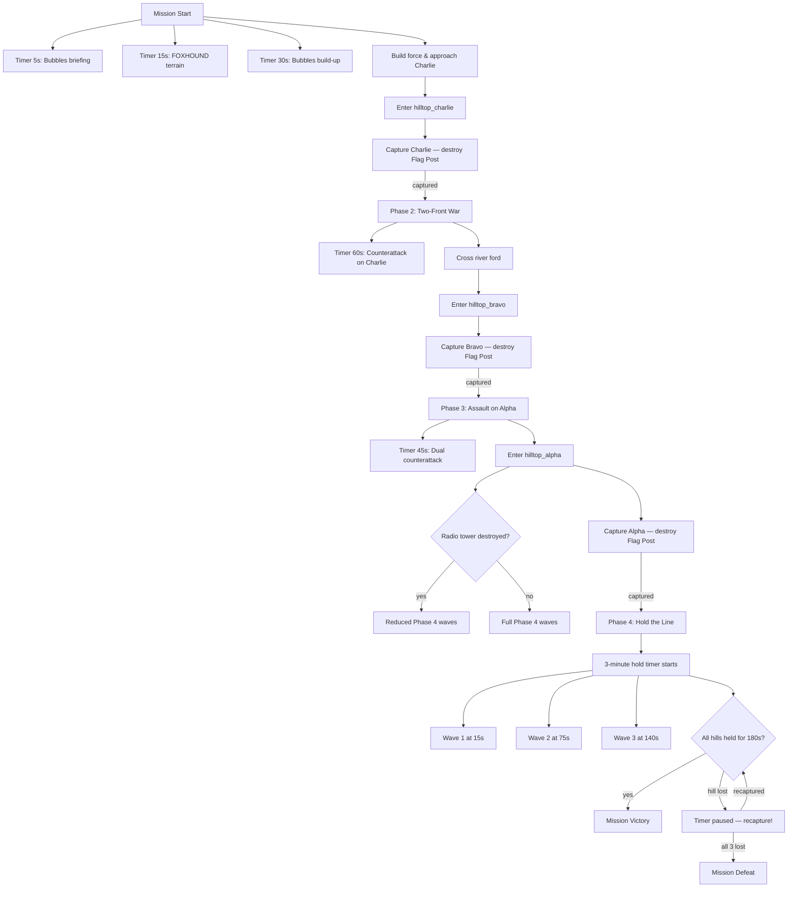

# Mission 1-3: FIREBASE DELTA

## Header
- **ID**: `mission_3`
- **Chapter**: 1 — First Landing
- **Map**: 128x128 tiles (4096x4096px)
- **Setting**: Three jungle hilltops overlooking the central Copper-Silt river valley. Scale-Guard controls all three positions. OEF must assault uphill, capture each firebase, then hold against coordinated counterattack waves.
- **Win**: Capture and hold all 3 hilltops for 3 minutes after the final capture
- **Lose**: Lodge destroyed OR all 3 hilltops recaptured by Scale-Guard
- **Par Time**: 25 minutes
- **Unlocks**: Mortar Otter (artillery), Gun Tower, Stone Wall

## Zone Map
```
    0         32        64        96       128
  0 |---------|---------|---------|---------|
    | jungle_nw         | hilltop_alpha     |
    |  (dense canopy)   | (fortified hill,  |
    |                   |  radio tower)     |
 16 |---------|---------|---------|---------|
    | river_gorge       | jungle_ne         |
    |  (deep water,     |  (Scale-Guard     |
 24 |   impassable)     |   staging area)   |
    |---------|---------|---------|---------|
 32 | hilltop_bravo     | valley_center     |
    | (elevated,        | (open ground,     |
    |  gun emplacements)|  kill zone)       |
 40 |---------|---------|---------|---------|
    | jungle_west       | river_south       |
    |  (timber,         | (fordable in      |
 48 |   mangrove)       |  2 spots)         |
    |---------|---------|---------|---------|
 56 | approach_south    | hilltop_charlie   |
    |  (dirt trail,     | (elevated,        |
    |   concealed)      |  watchtower)      |
 64 |---------|---------|---------|---------|
    | jungle_sw         | rally_point       |
    |  (thick brush,    | (clearing near    |
 72 |   slow movement)  |  river ford)      |
    |---------|---------|---------|---------|
 80 | base_camp         | resource_field    |
    | (lodge, barracks, | (timber, fish,    |
    |  command post)    |  salvage)         |
 88 |---------|---------|---------|---------|
    | depot_south                           |
    | (reinforcement staging)               |
 96 |                                       |
    |                                       |
104 |                                       |
    |                                       |
112 |                                       |
    |                                       |
120 |                                       |
    |                                       |
128 |---------|---------|---------|---------|
```

## Zones (tile coordinates)
```typescript
zones: {
  depot_south:       { x: 8,  y: 88, width: 112, height: 40 },
  base_camp:         { x: 8,  y: 80, width: 48,  height: 8  },
  resource_field:    { x: 64, y: 80, width: 56,  height: 8  },
  jungle_sw:         { x: 8,  y: 64, width: 48,  height: 16 },
  rally_point:       { x: 64, y: 64, width: 56,  height: 16 },
  approach_south:    { x: 8,  y: 56, width: 48,  height: 8  },
  hilltop_charlie:   { x: 64, y: 56, width: 48,  height: 8  },
  jungle_west:       { x: 8,  y: 40, width: 48,  height: 16 },
  river_south:       { x: 64, y: 40, width: 56,  height: 16 },
  hilltop_bravo:     { x: 8,  y: 32, width: 48,  height: 8  },
  valley_center:     { x: 64, y: 32, width: 56,  height: 8  },
  river_gorge:       { x: 8,  y: 16, width: 48,  height: 16 },
  jungle_ne:         { x: 64, y: 16, width: 56,  height: 16 },
  jungle_nw:         { x: 8,  y: 0,  width: 48,  height: 16 },
  hilltop_alpha:     { x: 64, y: 0,  width: 56,  height: 16 },
}
```

## Terrain Regions
```typescript
terrain: {
  width: 128, height: 128,
  regions: [
    { terrainId: "grass", fill: true },
    // Dense jungle (most of map)
    { terrainId: "jungle", rect: { x: 0, y: 0, w: 128, h: 80 } },
    // Hilltop Alpha (northeast — highest elevation)
    { terrainId: "rock", rect: { x: 72, y: 2, w: 40, h: 12 } },
    { terrainId: "dirt", rect: { x: 76, y: 4, w: 32, h: 8 } },
    // Hilltop Bravo (west-center — medium elevation)
    { terrainId: "rock", rect: { x: 12, y: 32, w: 36, h: 8 } },
    { terrainId: "dirt", rect: { x: 16, y: 34, w: 28, h: 4 } },
    // Hilltop Charlie (southeast — lowest, closest to player)
    { terrainId: "rock", rect: { x: 68, y: 56, w: 40, h: 8 } },
    { terrainId: "dirt", rect: { x: 72, y: 58, w: 32, h: 4 } },
    // River gorge (impassable except at fords)
    { terrainId: "water", river: {
      points: [[0,24],[16,22],[32,20],[48,24],[64,28],[80,44],[96,48],[112,44],[128,46]],
      width: 8
    }},
    // Ford crossings (shallow water — passable)
    { terrainId: "mud", rect: { x: 44, y: 22, w: 8, h: 4 } },
    { terrainId: "mud", rect: { x: 84, y: 44, w: 8, h: 4 } },
    // Base camp clearing
    { terrainId: "dirt", rect: { x: 12, y: 80, w: 40, h: 8 } },
    // Resource field
    { terrainId: "grass", rect: { x: 68, y: 80, w: 48, h: 8 } },
    // Approach trails (dirt paths through jungle)
    { terrainId: "dirt", path: {
      points: [[32,84],[28,72],[24,64],[20,56],[16,48],[20,40],[24,34]],
      width: 4
    }},
    { terrainId: "dirt", path: {
      points: [[80,84],[84,72],[88,64],[84,58]],
      width: 4
    }},
    { terrainId: "dirt", path: {
      points: [[48,24],[56,20],[64,16],[72,8]],
      width: 4
    }},
    // Mangrove groves
    { terrainId: "mangrove", rect: { x: 12, y: 42, w: 24, h: 10 } },
    // Valley center (open, dangerous)
    { terrainId: "grass", rect: { x: 68, y: 32, w: 48, h: 8 } },
    // Jungle southwest (thick brush — reduced move speed)
    { terrainId: "thicket", rect: { x: 12, y: 66, w: 40, h: 12 } },
    // Depot staging area
    { terrainId: "dirt", rect: { x: 8, y: 88, w: 112, h: 40 } },
  ],
  overrides: []
}
```

## Placements

### Player (base_camp)
```typescript
// Lodge (Captain's field HQ)
{ type: "burrow", faction: "ura", x: 24, y: 84 },
// Pre-built structures
{ type: "barracks", faction: "ura", x: 32, y: 82 },
{ type: "command_post", faction: "ura", x: 40, y: 82 },
// Starting combat units
{ type: "mudfoot", faction: "ura", x: 20, y: 86 },
{ type: "mudfoot", faction: "ura", x: 22, y: 88 },
{ type: "mudfoot", faction: "ura", x: 24, y: 86 },
{ type: "mudfoot", faction: "ura", x: 26, y: 88 },
{ type: "mudfoot", faction: "ura", x: 28, y: 86 },
{ type: "mudfoot", faction: "ura", x: 30, y: 88 },
{ type: "shellcracker", faction: "ura", x: 34, y: 86 },
{ type: "shellcracker", faction: "ura", x: 36, y: 88 },
// Starting workers
{ type: "river_rat", faction: "ura", x: 44, y: 86 },
{ type: "river_rat", faction: "ura", x: 46, y: 88 },
{ type: "river_rat", faction: "ura", x: 48, y: 86 },
```

### Resources
```typescript
// Timber (resource_field and jungle_west)
{ type: "jungle_tree", faction: "neutral", x: 72, y: 82 },
{ type: "jungle_tree", faction: "neutral", x: 78, y: 84 },
{ type: "jungle_tree", faction: "neutral", x: 84, y: 82 },
{ type: "jungle_tree", faction: "neutral", x: 90, y: 86 },
{ type: "jungle_tree", faction: "neutral", x: 96, y: 84 },
{ type: "jungle_tree", faction: "neutral", x: 102, y: 82 },
{ type: "jungle_tree", faction: "neutral", x: 16, y: 44 },
{ type: "jungle_tree", faction: "neutral", x: 22, y: 46 },
{ type: "jungle_tree", faction: "neutral", x: 28, y: 48 },
{ type: "jungle_tree", faction: "neutral", x: 34, y: 44 },
// Fish (river fords and base pond)
{ type: "fish_spot", faction: "neutral", x: 48, y: 24 },
{ type: "fish_spot", faction: "neutral", x: 88, y: 46 },
{ type: "fish_spot", faction: "neutral", x: 108, y: 84 },
// Salvage (scattered across hilltops — captured as bonus)
{ type: "salvage_cache", faction: "neutral", x: 80, y: 60 },
{ type: "salvage_cache", faction: "neutral", x: 24, y: 34 },
{ type: "salvage_cache", faction: "neutral", x: 84, y: 6 },
```

### Enemies

#### Hilltop Charlie (closest to player)
```typescript
// Flag Post (capture objective)
{ type: "flag_post", faction: "scale_guard", x: 84, y: 60 },
// Garrison
{ type: "gator", faction: "scale_guard", x: 76, y: 58 },
{ type: "gator", faction: "scale_guard", x: 80, y: 62 },
{ type: "gator", faction: "scale_guard", x: 88, y: 58 },
{ type: "gator", faction: "scale_guard", x: 92, y: 62 },
{ type: "skink", faction: "scale_guard", x: 96, y: 58 },
// Watchtower (pre-built enemy defense)
{ type: "watchtower", faction: "scale_guard", x: 100, y: 60 },
```

#### Hilltop Bravo (across the river, west)
```typescript
// Flag Post (capture objective)
{ type: "flag_post", faction: "scale_guard", x: 28, y: 36 },
// Garrison — stronger than Charlie
{ type: "gator", faction: "scale_guard", x: 20, y: 34 },
{ type: "gator", faction: "scale_guard", x: 24, y: 38 },
{ type: "gator", faction: "scale_guard", x: 32, y: 34 },
{ type: "gator", faction: "scale_guard", x: 36, y: 38 },
{ type: "gator", faction: "scale_guard", x: 40, y: 36 },
{ type: "viper", faction: "scale_guard", x: 16, y: 36 },
{ type: "skink", faction: "scale_guard", x: 44, y: 34 },
// Gun emplacement
{ type: "gun_emplacement", faction: "scale_guard", x: 22, y: 32 },
```

#### Hilltop Alpha (furthest, strongest)
```typescript
// Flag Post (capture objective)
{ type: "flag_post", faction: "scale_guard", x: 88, y: 8 },
// Garrison — strongest position
{ type: "gator", faction: "scale_guard", x: 80, y: 6 },
{ type: "gator", faction: "scale_guard", x: 84, y: 10 },
{ type: "gator", faction: "scale_guard", x: 88, y: 4 },
{ type: "gator", faction: "scale_guard", x: 92, y: 10 },
{ type: "gator", faction: "scale_guard", x: 96, y: 6 },
{ type: "gator", faction: "scale_guard", x: 100, y: 8 },
{ type: "viper", faction: "scale_guard", x: 76, y: 4 },
{ type: "viper", faction: "scale_guard", x: 104, y: 4 },
{ type: "skink", faction: "scale_guard", x: 108, y: 8 },
// Radio tower (destroying it reduces counterattack strength)
{ type: "radio_tower", faction: "scale_guard", x: 92, y: 2 },
// Gun emplacement
{ type: "gun_emplacement", faction: "scale_guard", x: 82, y: 2 },
```

#### Patrols (valley_center and jungle_ne)
```typescript
// Valley patrol — crosses open ground
{ type: "skink", faction: "scale_guard", x: 72, y: 34, patrol: [[72,34],[88,36],[104,34],[88,32]] },
{ type: "skink", faction: "scale_guard", x: 74, y: 36, patrol: [[74,36],[90,38],[106,36],[90,34]] },
// NE jungle patrol — guards approach to Alpha
{ type: "gator", faction: "scale_guard", x: 72, y: 20, patrol: [[72,20],[80,18],[88,22],[80,24]] },
{ type: "gator", faction: "scale_guard", x: 74, y: 22, patrol: [[74,22],[82,20],[90,24],[82,26]] },
```

## Phases

### Phase 1: RECONNAISSANCE (~0:00 - ~6:00)
**Entry**: Mission start
**State**: Lodge + Barracks + Command Post pre-built. 6 Mudfoots, 2 Shellcrackers, 3 River Rats. 300 fish / 150 timber / 75 salvage. Only base_camp, resource_field, jungle_sw, rally_point visible.
**Objectives**:
- "Capture Hilltop Charlie" (PRIMARY)

**Triggers**:
```
[0:05] bubbles-briefing
  Condition: timer(5)
  Action: exchange([
    { speaker: "Col. Bubbles", text: "Captain, Firebase Delta is a triangle of three hilltops overlooking the river valley. Scale-Guard holds all three." },
    { speaker: "Col. Bubbles", text: "We take those hills, we control the central Reach. Hilltop Charlie is closest — start there." }
  ])

[0:15] foxhound-terrain
  Condition: timer(15)
  Action: exchange([
    { speaker: "FOXHOUND", text: "Terrain report: Charlie is southeast, lightly garrisoned. Bravo is west across the river — stronger. Alpha is far north, heavily fortified with a radio tower." },
    { speaker: "FOXHOUND", text: "The river gorge cuts the map in two. Two ford crossings — one west, one east. Plan your approach." }
  ])

[0:30] bubbles-build-up
  Condition: timer(30)
  Action: dialogue("col_bubbles", "Build up your force. Those Shellcrackers will soak damage on the uphill push. Move when you're ready.")

approach-charlie
  Condition: areaEntered("ura", "hilltop_charlie")
  Action: [
    dialogue("foxhound", "Contact at Charlie. Garrison of Gators plus a watchtower. Hit them hard and fast — don't give them time to call for help."),
    revealZone("hilltop_charlie")
  ]

charlie-captured
  Condition: buildingCount("scale_guard", "flag_post", "eq", 2) [one of three destroyed]
  Action: [
    completeObjective("capture-charlie"),
    dialogue("col_bubbles", "Charlie is ours! Good. Get some troops dug in there — they'll try to take it back."),
    dialogue("foxhound", "Recommend building defenses on the hilltop. Watchtower, walls — whatever you can manage before the next push."),
    startPhase("two-front-war")
  ]
```

### Phase 2: TWO-FRONT WAR (~6:00 - ~14:00)
**Entry**: Hilltop Charlie captured
**State**: Fog reveals hilltop_bravo, valley_center, jungle_west, river_south, approach_south zones. Player can now build on captured hilltop. First counterattack wave spawns targeting Charlie.
**New objectives**:
- "Capture Hilltop Bravo" (PRIMARY)
- "Defend Hilltop Charlie" (PRIMARY — persistent)
- "Destroy the radio tower on Alpha" (BONUS — reduces final counterattack)

**Triggers**:
```
phase2-briefing
  Condition: enabled by Phase 1 completion
  Action: exchange([
    { speaker: "Col. Bubbles", text: "Don't get comfortable. Bravo is next — west side, across the river. Use the southern ford to cross." },
    { speaker: "FOXHOUND", text: "Be warned: they'll counterattack Charlie while you're pushing Bravo. Split your force or build defenses." }
  ])

[phase2 + 60s] charlie-counterattack-1
  Condition: timer(60) after phase2 start
  Action: [
    spawn("gator", "scale_guard", 108, 52, 4),
    spawn("skink", "scale_guard", 112, 56, 2),
    dialogue("foxhound", "Counterattack on Charlie! Hostiles approaching from the east!"),
    dialogue("col_bubbles", "Hold that hill, Captain! If they retake it, we lose everything.")
  ]

charlie-lost
  Condition: areaControl("hilltop_charlie", "scale_guard")
  Action: [
    dialogue("col_bubbles", "They've retaken Charlie! Get it back, Captain — NOW!"),
    failObjective("defend-charlie"),
    addObjective("recapture-charlie", "Recapture Hilltop Charlie", "PRIMARY")
  ]

charlie-recaptured
  Condition: areaControl("hilltop_charlie", "ura") AND objectiveActive("recapture-charlie")
  Action: [
    completeObjective("recapture-charlie"),
    dialogue("col_bubbles", "Charlie's back in our hands. Don't let it slip again.")
  ]

ford-crossing
  Condition: areaEntered("ura", "river_south", { unitType: "any_combat" })
  Action: dialogue("foxhound", "Crossing the ford. Water's shallow here but you're exposed. Move fast.")

approach-bravo
  Condition: areaEntered("ura", "hilltop_bravo")
  Action: [
    dialogue("foxhound", "Bravo ahead. Gun emplacement on the west face — it'll chew up your infantry. Flank it or rush with Shellcrackers."),
    revealZone("hilltop_bravo")
  ]

bravo-captured
  Condition: buildingCount("scale_guard", "flag_post", "eq", 1) [two of three destroyed]
  Action: [
    completeObjective("capture-bravo"),
    dialogue("col_bubbles", "Bravo is down! Two hills secured. One more — the big one."),
    dialogue("foxhound", "Alpha is across the gorge, northeast. Heavily defended. Radio tower is calling in reinforcements — take that out and the counterattack will be weaker."),
    startPhase("assault-alpha")
  ]
```

### Phase 3: ASSAULT ON ALPHA (~14:00 - ~20:00)
**Entry**: Hilltop Bravo captured
**State**: Fog reveals hilltop_alpha, jungle_ne, jungle_nw, river_gorge. Second counterattack wave targets both Charlie and Bravo. Alpha has the strongest garrison.
**New objectives**:
- "Capture Hilltop Alpha" (PRIMARY)
- "Defend Hilltop Bravo" (PRIMARY — persistent)

**Triggers**:
```
phase3-briefing
  Condition: enabled by Phase 2 completion
  Action: exchange([
    { speaker: "Col. Bubbles", text: "Alpha is the keystone. Radio tower, gun emplacement, full garrison. This is the hard one, Captain." },
    { speaker: "FOXHOUND", text: "Cross at the western ford, push through the northwest jungle, and hit them from the flank. The front approach through the valley is a kill zone." },
    { speaker: "Col. Bubbles", text: "Build defenses on Charlie and Bravo. They will hit both while you push Alpha." }
  ])

[phase3 + 45s] dual-counterattack
  Condition: timer(45) after phase3 start
  Action: [
    spawn("gator", "scale_guard", 108, 52, 3),
    spawn("skink", "scale_guard", 112, 56, 2),
    spawn("gator", "scale_guard", 4, 28, 3),
    spawn("viper", "scale_guard", 8, 32, 1),
    dialogue("foxhound", "Counterattack on both hills! Charlie from the east, Bravo from the west!"),
    dialogue("col_bubbles", "Hold your positions! Don't pull defenders for the Alpha push — that's what they want!")
  ]

radio-tower-destroyed
  Condition: entityDestroyed("radio_tower")
  Action: [
    completeObjective("bonus-radio-tower"),
    dialogue("foxhound", "Radio tower is down! Scale-Guard comms are disrupted — their counterattack coordination is crippled."),
    setCounterattackStrength("reduced")
  ]

approach-alpha
  Condition: areaEntered("ura", "hilltop_alpha")
  Action: [
    dialogue("foxhound", "You're in Alpha's perimeter. Gun emplacement dead ahead — heaviest resistance on the map."),
    dialogue("col_bubbles", "Everything we've got, Captain. Take that hill.")
  ]

alpha-captured
  Condition: buildingCount("scale_guard", "flag_post", "eq", 0) [all three destroyed]
  Action: [
    completeObjective("capture-alpha"),
    dialogue("col_bubbles", "Alpha is OURS! All three hilltops secured! But they won't take this lying down —"),
    dialogue("foxhound", "Massive Scale-Guard formation moving from the north. They're throwing everything at us. Brace for final counterattack."),
    startPhase("hold-the-line")
  ]
```

### Phase 4: HOLD THE LINE (~20:00+)
**Entry**: All 3 hilltops captured
**State**: Final defense phase. 3-minute survival timer begins. Three coordinated counterattack waves hit all hilltops. If radio tower was destroyed, waves are 30% weaker. Player must hold all 3 hilltops.
**New objectives**:
- "Hold all 3 hilltops for 3 minutes" (PRIMARY)

**Triggers**:
```
phase4-briefing
  Condition: enabled by Phase 3 completion
  Action: exchange([
    { speaker: "Col. Bubbles", text: "Three minutes, Captain. Hold every hill for three minutes and Firebase Delta is permanently ours. Reinforcements are en route but they need time." },
    { speaker: "FOXHOUND", text: "Multiple hostile formations inbound from all directions. This is their last shot. Make it count." }
  ])

[phase4 + 0s] survival-timer-start
  Condition: phase4 starts
  Action: startTimer("hold_timer", 180)

[phase4 + 15s] wave-1
  Condition: timer(15) after phase4 start
  Action: [
    spawn("gator", "scale_guard", 120, 52, 4),
    spawn("skink", "scale_guard", 116, 48, 3),
    spawn("gator", "scale_guard", 4, 28, 3),
    spawn("gator", "scale_guard", 76, 20, 4),
    dialogue("foxhound", "First wave incoming! All sectors!")
  ]

[phase4 + 75s] wave-2
  Condition: timer(75) after phase4 start
  Action: [
    spawn("gator", "scale_guard", 112, 56, 3),
    spawn("viper", "scale_guard", 120, 60, 2),
    spawn("gator", "scale_guard", 8, 24, 4),
    spawn("skink", "scale_guard", 4, 20, 2),
    spawn("gator", "scale_guard", 68, 18, 3),
    spawn("viper", "scale_guard", 72, 14, 2),
    dialogue("col_bubbles", "Second wave! They're hitting harder! Keep those lines tight!")
  ]

[phase4 + 140s] wave-3
  Condition: timer(140) after phase4 start
  Action: [
    spawn("gator", "scale_guard", 108, 48, 5),
    spawn("viper", "scale_guard", 116, 52, 3),
    spawn("gator", "scale_guard", 12, 30, 4),
    spawn("viper", "scale_guard", 8, 26, 2),
    spawn("gator", "scale_guard", 80, 22, 5),
    spawn("skink", "scale_guard", 84, 18, 3),
    dialogue("foxhound", "Final wave! This is everything they've got! Hold the line, Captain!")
  ]

hilltop-lost-during-hold
  Condition: anyHilltopControl("scale_guard") during hold_timer
  Action: [
    dialogue("col_bubbles", "They've retaken a hilltop! Get it back before the timer resets!"),
    pauseTimer("hold_timer"),
    addObjective("retake-hilltop", "Recapture the lost hilltop", "PRIMARY")
  ]

hilltop-retaken
  Condition: allHilltopsControl("ura") AND timerPaused("hold_timer")
  Action: [
    completeObjective("retake-hilltop"),
    resumeTimer("hold_timer"),
    dialogue("col_bubbles", "Hill secured! Timer running again — hold on!")
  ]

all-hilltops-lost
  Condition: allHilltopsControl("scale_guard")
  Action: exchange([
    { speaker: "Col. Bubbles", text: "We've lost all three positions. Firebase Delta is gone." },
    { speaker: "Gen. Whiskers", text: "Pull back, Captain. We'll regroup. This isn't over." }
  ], followed by: defeat())

hold-complete
  Condition: timerComplete("hold_timer") AND allHilltopsControl("ura")
  Action: [completeObjective("hold-hilltops")]

mission-complete
  Condition: allPrimaryComplete()
  Action: exchange([
    { speaker: "Gen. Whiskers", text: "Firebase Delta is secured. All three hilltops confirmed under OEF control. Outstanding tactical work, Captain." },
    { speaker: "Col. Bubbles", text: "Reinforcements are digging in. This position gives us eyes on the entire central Reach." },
    { speaker: "Gen. Whiskers", text: "I'm authorizing new ordnance for your command. Mortar Otters — artillery support. Plus Gun Tower and Stone Wall construction permits. You've earned every bit of it." },
    { speaker: "Col. Bubbles", text: "One more thing, Captain. We've received intelligence that General Whiskers' forward staff officer was captured during a recon patrol. We need to get him back. Stand by for briefing. HQ out." }
  ], followed by: victory())
```

## Dialogue Script

| Trigger ID | Speaker | Line |
|---|---|---|
| bubbles-briefing-1 | Col. Bubbles | "Captain, Firebase Delta is a triangle of three hilltops overlooking the river valley. Scale-Guard holds all three." |
| bubbles-briefing-2 | Col. Bubbles | "We take those hills, we control the central Reach. Hilltop Charlie is closest — start there." |
| foxhound-terrain-1 | FOXHOUND | "Terrain report: Charlie is southeast, lightly garrisoned. Bravo is west across the river — stronger. Alpha is far north, heavily fortified with a radio tower." |
| foxhound-terrain-2 | FOXHOUND | "The river gorge cuts the map in two. Two ford crossings — one west, one east. Plan your approach." |
| bubbles-build-up | Col. Bubbles | "Build up your force. Those Shellcrackers will soak damage on the uphill push. Move when you're ready." |
| approach-charlie | FOXHOUND | "Contact at Charlie. Garrison of Gators plus a watchtower. Hit them hard and fast — don't give them time to call for help." |
| charlie-captured-1 | Col. Bubbles | "Charlie is ours! Good. Get some troops dug in there — they'll try to take it back." |
| charlie-captured-2 | FOXHOUND | "Recommend building defenses on the hilltop. Watchtower, walls — whatever you can manage before the next push." |
| phase2-briefing-1 | Col. Bubbles | "Don't get comfortable. Bravo is next — west side, across the river. Use the southern ford to cross." |
| phase2-briefing-2 | FOXHOUND | "Be warned: they'll counterattack Charlie while you're pushing Bravo. Split your force or build defenses." |
| charlie-counterattack | FOXHOUND | "Counterattack on Charlie! Hostiles approaching from the east!" |
| charlie-counterattack-2 | Col. Bubbles | "Hold that hill, Captain! If they retake it, we lose everything." |
| charlie-lost | Col. Bubbles | "They've retaken Charlie! Get it back, Captain — NOW!" |
| charlie-recaptured | Col. Bubbles | "Charlie's back in our hands. Don't let it slip again." |
| ford-crossing | FOXHOUND | "Crossing the ford. Water's shallow here but you're exposed. Move fast." |
| approach-bravo | FOXHOUND | "Bravo ahead. Gun emplacement on the west face — it'll chew up your infantry. Flank it or rush with Shellcrackers." |
| bravo-captured-1 | Col. Bubbles | "Bravo is down! Two hills secured. One more — the big one." |
| bravo-captured-2 | FOXHOUND | "Alpha is across the gorge, northeast. Heavily defended. Radio tower is calling in reinforcements — take that out and the counterattack will be weaker." |
| phase3-briefing-1 | Col. Bubbles | "Alpha is the keystone. Radio tower, gun emplacement, full garrison. This is the hard one, Captain." |
| phase3-briefing-2 | FOXHOUND | "Cross at the western ford, push through the northwest jungle, and hit them from the flank. The front approach through the valley is a kill zone." |
| phase3-briefing-3 | Col. Bubbles | "Build defenses on Charlie and Bravo. They will hit both while you push Alpha." |
| dual-counterattack-1 | FOXHOUND | "Counterattack on both hills! Charlie from the east, Bravo from the west!" |
| dual-counterattack-2 | Col. Bubbles | "Hold your positions! Don't pull defenders for the Alpha push — that's what they want!" |
| radio-tower-destroyed | FOXHOUND | "Radio tower is down! Scale-Guard comms are disrupted — their counterattack coordination is crippled." |
| approach-alpha-1 | FOXHOUND | "You're in Alpha's perimeter. Gun emplacement dead ahead — heaviest resistance on the map." |
| approach-alpha-2 | Col. Bubbles | "Everything we've got, Captain. Take that hill." |
| alpha-captured-1 | Col. Bubbles | "Alpha is OURS! All three hilltops secured! But they won't take this lying down —" |
| alpha-captured-2 | FOXHOUND | "Massive Scale-Guard formation moving from the north. They're throwing everything at us. Brace for final counterattack." |
| phase4-briefing-1 | Col. Bubbles | "Three minutes, Captain. Hold every hill for three minutes and Firebase Delta is permanently ours. Reinforcements are en route but they need time." |
| phase4-briefing-2 | FOXHOUND | "Multiple hostile formations inbound from all directions. This is their last shot. Make it count." |
| wave-1 | FOXHOUND | "First wave incoming! All sectors!" |
| wave-2 | Col. Bubbles | "Second wave! They're hitting harder! Keep those lines tight!" |
| wave-3 | FOXHOUND | "Final wave! This is everything they've got! Hold the line, Captain!" |
| hilltop-lost | Col. Bubbles | "They've retaken a hilltop! Get it back before the timer resets!" |
| hilltop-retaken | Col. Bubbles | "Hill secured! Timer running again — hold on!" |
| all-hilltops-lost-1 | Col. Bubbles | "We've lost all three positions. Firebase Delta is gone." |
| all-hilltops-lost-2 | Gen. Whiskers | "Pull back, Captain. We'll regroup. This isn't over." |
| mission-complete-1 | Gen. Whiskers | "Firebase Delta is secured. All three hilltops confirmed under OEF control. Outstanding tactical work, Captain." |
| mission-complete-2 | Col. Bubbles | "Reinforcements are digging in. This position gives us eyes on the entire central Reach." |
| mission-complete-3 | Gen. Whiskers | "I'm authorizing new ordnance for your command. Mortar Otters — artillery support. Plus Gun Tower and Stone Wall construction permits. You've earned every bit of it." |
| mission-complete-4 | Col. Bubbles | "One more thing, Captain. We've received intelligence that General Whiskers' forward staff officer was captured during a recon patrol. We need to get him back. Stand by for briefing. HQ out." |

## Trigger Flowchart


## Balance Notes
- **Starting resources**: 300 fish, 150 timber, 75 salvage — enough for immediate unit production and first defenses
- **Starting force**: 6 Mudfoots, 2 Shellcrackers, 3 River Rats — Shellcrackers are new, player learns their role
- **Hilltop capture mechanic**: Destroy the Flag Post to capture; player can then build on the cleared hilltop
- **Hilltop Charlie garrison**: 4 Gators + 1 Skink + Watchtower — introductory assault
- **Hilltop Bravo garrison**: 5 Gators + 1 Viper + 1 Skink + Gun Emplacement — medium difficulty, teaches flanking
- **Hilltop Alpha garrison**: 6 Gators + 2 Vipers + 1 Skink + Gun Emplacement + Radio Tower — hardest assault
- **Counterattack waves** (Phase 2): 4 Gators + 2 Skinks targeting Charlie — forces split-force decisions
- **Counterattack waves** (Phase 3): Dual attack — 3 Gators + 1 Viper on Charlie, 3 Gators + 2 Skinks on Bravo
- **Hold phase waves**: 3 waves of increasing strength over 3 minutes — if radio tower destroyed, all waves lose 30% units
- **Defense building costs**: Watchtower 100 fish/75 timber, Stone Wall 25 timber per segment — player must invest between assaults
- **Ford crossing**: Units move at 40% speed through water — vulnerable chokepoint, teaches players to secure crossings
- **Radio tower bonus**: Destroying it is optional but significantly eases the final defense — rewards aggressive play
- **Enemy scaling** (difficulty):
  - Support: hilltop garrisons reduced 40%, counterattacks reduced 50%, hold timer 2 minutes
  - Tactical: as written
  - Elite: garrisons increased 30%, 4 counterattack waves, hold timer 4 minutes, enemies get Vipers in every wave
- **Par time**: 25 minutes on Tactical — multi-objective mission with significant back-and-forth
- **Mortar Otter unlock**: Long-range artillery with area damage, minimum range, slow fire rate — ideal for defense and siege
- **Gun Tower unlock**: Defensive structure with moderate range and damage — permanent automated defense
- **Stone Wall unlock**: Cheap defensive barrier — blocks pathing, forces enemies to attack or go around
