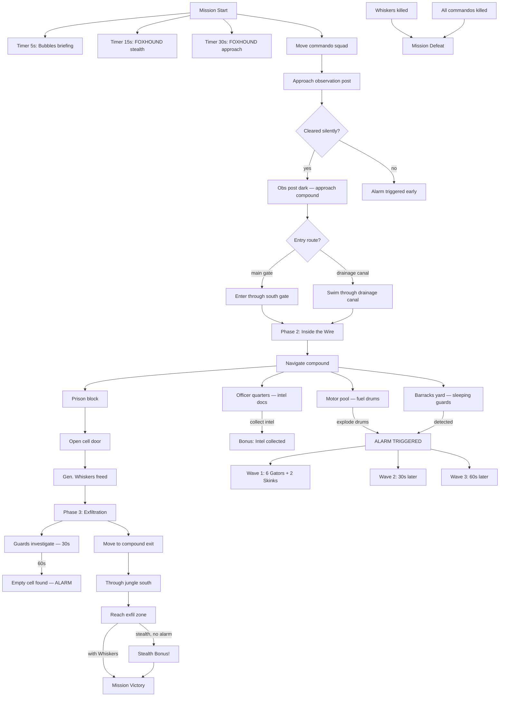

# Mission 1-4: PRISON BREAK

## Header
- **ID**: `mission_4`
- **Chapter**: 1 — First Landing
- **Map**: 128x96 tiles (4096x3072px)
- **Setting**: Scale-Guard detention compound deep in Copper-Silt jungle. Walled perimeter, guard towers, barracks, interrogation block. OEF commando squad must infiltrate, locate General Whiskers himself, and extract. Detection triggers compound-wide alarm and massive reinforcements.
- **Win**: Rescue the prisoner and extract to the southern exfil zone
- **Lose**: All commando units killed OR prisoner killed after rescue
- **Par Time**: 18 minutes
- **Unlocks**: Sapper (engineer/demolitions), Diver (stealth/water), Armory, Minefield
- **Mission Type**: COMMANDO — no lodge, no base building, small fixed squad

## Zone Map
```
    0         32        64        96       128
  0 |---------|---------|---------|---------|
    | jungle_north      | watchtower_ne     |
    |  (dense, off-map  |  (enemy tower,    |
  8 |   patrol route)   |   searchlight)    |
    |---------|---------|---------|---------|
 12 | compound_wall_n   | compound_wall_n   |
    |=================WALL=================|
 16 | motor_pool        | prison_block      |
    | (vehicles,        | (cells, prisoner, |
    |  fuel drums)      |  interrogation)   |
 24 |---------|---------|---------|---------|
    | barracks_yard     | officer_quarters  |
    |  (off-duty guards,| (command office,  |
 32 |   patrol hub)     |  intel documents) |
    |---------|---------|---------|---------|
 36 | compound_wall_s   | compound_wall_s   |
    |=================WALL=================|
 40 | jungle_approach   | drainage_canal    |
    |  (concealed path, | (water channel,   |
 48 |   trip wires)     |  stealth entry)   |
    |---------|---------|---------|---------|
 56 | jungle_west       | jungle_east       |
    |  (dense canopy,   | (patrol route,    |
 64 |   flank approach) |  guard rotation)  |
    |---------|---------|---------|---------|
 72 | staging_area      | observation_post  |
    | (player start,    | (enemy lookout,   |
 80 |  briefing point)  |  must neutralize) |
    |---------|---------|---------|---------|
 88 | exfil_zone                            |
    | (extraction point, mission end)       |
 96 |---------|---------|---------|---------|
```

## Zones (tile coordinates)
```typescript
zones: {
  exfil_zone:         { x: 8,  y: 88, width: 112, height: 8  },
  staging_area:       { x: 8,  y: 72, width: 48,  height: 16 },
  observation_post:   { x: 64, y: 72, width: 56,  height: 16 },
  jungle_west:        { x: 8,  y: 56, width: 48,  height: 16 },
  jungle_east:        { x: 64, y: 56, width: 56,  height: 16 },
  jungle_approach:    { x: 8,  y: 40, width: 48,  height: 16 },
  drainage_canal:     { x: 64, y: 40, width: 56,  height: 16 },
  compound_wall_s:    { x: 8,  y: 36, width: 112, height: 4  },
  barracks_yard:      { x: 8,  y: 24, width: 48,  height: 12 },
  officer_quarters:   { x: 64, y: 24, width: 56,  height: 12 },
  motor_pool:         { x: 8,  y: 16, width: 48,  height: 8  },
  prison_block:       { x: 64, y: 16, width: 56,  height: 8  },
  compound_wall_n:    { x: 8,  y: 12, width: 112, height: 4  },
  jungle_north:       { x: 8,  y: 0,  width: 48,  height: 12 },
  watchtower_ne:      { x: 64, y: 0,  width: 56,  height: 12 },
}
```

## Terrain Regions
```typescript
terrain: {
  width: 128, height: 96,
  regions: [
    { terrainId: "jungle", fill: true },
    // Compound interior (cleared ground)
    { terrainId: "dirt", rect: { x: 12, y: 16, w: 104, h: 20 } },
    // Compound walls (impassable except at gates and breaches)
    { terrainId: "stone_wall", rect: { x: 8, y: 12, w: 112, h: 2 } },
    { terrainId: "stone_wall", rect: { x: 8, y: 36, w: 112, h: 2 } },
    { terrainId: "stone_wall", rect: { x: 8, y: 14, w: 2, h: 22 } },
    { terrainId: "stone_wall", rect: { x: 118, y: 14, w: 2, h: 22 } },
    // Gate (south wall — main entrance, guarded)
    { terrainId: "dirt", rect: { x: 56, y: 36, w: 8, h: 2 } },
    // Drainage grate (south wall — stealth entry, requires interaction)
    { terrainId: "water", rect: { x: 96, y: 36, w: 6, h: 2 } },
    // Motor pool (concrete pad)
    { terrainId: "concrete", rect: { x: 14, y: 16, w: 40, h: 6 } },
    // Prison block (fortified building area)
    { terrainId: "concrete", rect: { x: 68, y: 16, w: 48, h: 6 } },
    // Barracks yard (packed earth)
    { terrainId: "dirt", rect: { x: 14, y: 26, w: 40, h: 8 } },
    // Officer quarters (nicer ground)
    { terrainId: "dirt", rect: { x: 68, y: 26, w: 48, h: 8 } },
    // Drainage canal (water channel from compound to jungle)
    { terrainId: "water", path: {
      points: [[99,38],[100,44],[98,50],[96,56],[94,62],[92,68]],
      width: 3
    }},
    // Jungle paths (concealed approaches)
    { terrainId: "dirt", path: {
      points: [[32,80],[28,72],[24,64],[20,56],[24,48],[28,44],[40,40],[56,38]],
      width: 3
    }},
    { terrainId: "dirt", path: {
      points: [[80,80],[84,72],[88,64],[92,56],[96,50],[99,44]],
      width: 2
    }},
    // Staging area clearing
    { terrainId: "dirt", rect: { x: 16, y: 74, w: 32, h: 12 } },
    // Observation post clearing
    { terrainId: "dirt", circle: { cx: 88, cy: 78, r: 6 } },
    // Exfil zone (riverbank)
    { terrainId: "mud", rect: { x: 8, y: 88, w: 112, h: 8 } },
  ],
  overrides: []
}
```

## Placements

### Player (staging_area)
```typescript
// NO LODGE — commando mission
// Commando squad (fixed, no reinforcements)
{ type: "mudfoot", faction: "ura", x: 24, y: 76, heroName: "Knife" },
{ type: "mudfoot", faction: "ura", x: 28, y: 78, heroName: "Shadow" },
{ type: "mudfoot", faction: "ura", x: 32, y: 76, heroName: "Ironpaw" },
{ type: "shellcracker", faction: "ura", x: 20, y: 78, heroName: "Brick" },
// Note: units have stealth-kill ability in this mission (instant kill from behind, no alert)
```

### Resources
```typescript
// No gathering in commando missions
// Medkits (single-use heal items, placed at key locations)
{ type: "medkit", faction: "neutral", x: 24, y: 56 },
{ type: "medkit", faction: "neutral", x: 92, y: 50 },
{ type: "medkit", faction: "neutral", x: 40, y: 30 },
// Intel documents (bonus objective — officer_quarters)
{ type: "intel_document", faction: "neutral", x: 80, y: 28 },
{ type: "intel_document", faction: "neutral", x: 86, y: 30 },
```

### Enemies

#### Observation Post (outer perimeter)
```typescript
// Must be neutralized to approach compound safely
{ type: "skink", faction: "scale_guard", x: 86, y: 76, detection_radius: 10 },
{ type: "skink", faction: "scale_guard", x: 92, y: 80, detection_radius: 10 },
```

#### Jungle Patrols (roaming — detection = alert)
```typescript
// East jungle patrol
{ type: "gator", faction: "scale_guard", x: 80, y: 60, patrol: [[80,60],[88,56],[96,60],[88,64]], detection_radius: 8 },
{ type: "gator", faction: "scale_guard", x: 82, y: 62, patrol: [[82,62],[90,58],[98,62],[90,66]], detection_radius: 8 },
// West jungle patrol
{ type: "skink", faction: "scale_guard", x: 20, y: 52, patrol: [[20,52],[28,48],[36,52],[28,56]], detection_radius: 10 },
// North jungle patrol
{ type: "gator", faction: "scale_guard", x: 32, y: 4, patrol: [[32,4],[48,8],[32,12],[16,8]], detection_radius: 8 },
```

#### Compound Gate Guards
```typescript
// Main gate (south wall center)
{ type: "gator", faction: "scale_guard", x: 56, y: 38, stationary: true, detection_radius: 8 },
{ type: "gator", faction: "scale_guard", x: 62, y: 38, stationary: true, detection_radius: 8 },
// Searchlight (sweeping arc at gate)
{ type: "searchlight", faction: "scale_guard", x: 60, y: 36, sweep_arc: 120, sweep_speed: 3 },
```

#### Barracks Yard
```typescript
// Off-duty guards (stationary, lower detection radius — dozing)
{ type: "gator", faction: "scale_guard", x: 20, y: 28, stationary: true, detection_radius: 5 },
{ type: "gator", faction: "scale_guard", x: 28, y: 30, stationary: true, detection_radius: 5 },
{ type: "gator", faction: "scale_guard", x: 36, y: 28, stationary: true, detection_radius: 5 },
// Yard patrol (walking a beat)
{ type: "skink", faction: "scale_guard", x: 24, y: 26, patrol: [[24,26],[40,26],[40,34],[24,34]], detection_radius: 8 },
```

#### Motor Pool
```typescript
// Guards near vehicles
{ type: "gator", faction: "scale_guard", x: 20, y: 18, stationary: true, detection_radius: 6 },
{ type: "gator", faction: "scale_guard", x: 36, y: 20, stationary: true, detection_radius: 6 },
// Fuel drums (explosive — can be detonated for area damage + distraction)
{ type: "fuel_drum", faction: "neutral", x: 28, y: 18, explosive: true },
{ type: "fuel_drum", faction: "neutral", x: 44, y: 18, explosive: true },
```

#### Officer Quarters
```typescript
// Officer (high-value — drops intel if killed)
{ type: "viper", faction: "scale_guard", x: 76, y: 28, stationary: true, detection_radius: 8 },
// Guards
{ type: "gator", faction: "scale_guard", x: 72, y: 30, stationary: true, detection_radius: 6 },
{ type: "gator", faction: "scale_guard", x: 84, y: 30, stationary: true, detection_radius: 6 },
```

#### Prison Block
```typescript
// Prison guards (high alert, larger detection radius)
{ type: "gator", faction: "scale_guard", x: 72, y: 18, stationary: true, detection_radius: 8 },
{ type: "gator", faction: "scale_guard", x: 80, y: 20, stationary: true, detection_radius: 8 },
{ type: "viper", faction: "scale_guard", x: 88, y: 18, stationary: true, detection_radius: 8 },
// Interior patrol
{ type: "skink", faction: "scale_guard", x: 76, y: 18, patrol: [[76,18],[92,18],[92,22],[76,22]], detection_radius: 8 },
// Prisoner (rescue target)
{ type: "prisoner", faction: "ura", x: 84, y: 16, heroName: "Gen. Whiskers" },
// Cell door (must be interacted with to free prisoner)
{ type: "cell_door", faction: "scale_guard", x: 84, y: 17 },
```

#### Watchtower NE
```typescript
// Tower guard with searchlight
{ type: "gator", faction: "scale_guard", x: 80, y: 4, elevated: true, detection_radius: 14 },
// Searchlight (sweeps south over compound approach)
{ type: "searchlight", faction: "scale_guard", x: 80, y: 6, sweep_arc: 180, sweep_speed: 4 },
```

#### Alarm Reinforcements (spawned ONLY if alarm triggers)
```typescript
// Wave 1 — immediate (from barracks)
// 6 Gators + 2 Skinks flood from barracks_yard
// Wave 2 — 30 seconds later (from north)
// 4 Gators + 2 Vipers + 2 Skinks from jungle_north
// Wave 3 — 60 seconds later (from all directions)
// 8 Gators + 4 Skinks + 2 Vipers converge on player position
```

## Stealth Mechanics
```typescript
stealth: {
  // Detection system
  detection_radius: "per-unit (see placements)",
  detection_cone: 120, // degrees forward-facing
  alert_propagation: 16, // tiles — alerted enemy alerts all within 16 tiles
  searchlight_detection: "instant", // if beam touches player unit = detected

  // Player abilities (this mission only)
  stealth_kill: {
    range: 1, // must be adjacent
    condition: "behind_target", // 180-degree rear arc
    effect: "instant_kill_no_alert",
    cooldown: 5 // seconds
  },

  // Alert levels
  alert_levels: {
    unaware: "patrol/stationary, normal detection",
    suspicious: "detection_radius +25%, moves toward last known position (15s)",
    alert: "compound-wide alarm, all enemies converge, reinforcements spawn"
  },

  // Noise sources
  noise: {
    combat: "alert — any combat not stealth-kill triggers nearest enemy",
    fuel_drum_explosion: "alert — compound-wide alarm",
    cell_door_open: "suspicious — guards within 12 tiles investigate"
  }
}
```

## Phases

### Phase 1: INSERTION (~0:00 - ~5:00)
**Entry**: Mission start
**State**: 4 commando units in staging_area. No resources, no building. Only staging_area, exfil_zone, jungle_west, and observation_post visible. All enemies in patrol/stationary state.
**Objectives**:
- "Neutralize the observation post" (PRIMARY)
- "Infiltrate the compound" (PRIMARY)

**Triggers**:
```
[0:05] bubbles-briefing
  Condition: timer(5)
  Action: exchange([
    { speaker: "Col. Bubbles", text: "Captain, this is a knife-in-the-dark op. No lodge, no base, no reinforcements. Four of our best — that's all you get." },
    { speaker: "Col. Bubbles", text: "Gen. Whiskers is being held in the prison block, north side of the compound. Get in, get him out, get to exfil. Simple plan." }
  ])

[0:15] foxhound-stealth
  Condition: timer(15)
  Action: exchange([
    { speaker: "FOXHOUND", text: "Stealth is everything here. If they sound the alarm, the entire garrison wakes up and reinforcements pour in. You will be overwhelmed." },
    { speaker: "FOXHOUND", text: "Your team can perform stealth kills — get behind a target, take them out silently. Stay out of detection cones and searchlight beams." }
  ])

[0:30] foxhound-approach
  Condition: timer(30)
  Action: exchange([
    { speaker: "FOXHOUND", text: "Two ways in. The main gate is guarded and has a searchlight — possible but risky. There's a drainage canal on the east side that runs under the wall. Tight squeeze, but unguarded." },
    { speaker: "FOXHOUND", text: "Enemy observation post to the east of your position. Take it out first or they'll spot you moving through the jungle." }
  ])

obs-post-approach
  Condition: areaEntered("ura", "observation_post")
  Action: dialogue("foxhound", "Observation post ahead. Two Skinks. Quiet kills only — if they radio in, the compound goes on alert.")

obs-post-cleared
  Condition: zoneEnemyCount("observation_post", "eq", 0) AND NOT alarmTriggered()
  Action: [
    completeObjective("neutralize-obs-post"),
    dialogue("col_bubbles", "Observation post is dark. Good work. Move on the compound."),
    revealZone("jungle_east"),
    revealZone("drainage_canal"),
    revealZone("jungle_approach"),
    revealZone("compound_wall_s")
  ]

obs-post-loud
  Condition: zoneEnemyCount("observation_post", "eq", 0) AND alarmTriggered()
  Action: [
    completeObjective("neutralize-obs-post"),
    dialogue("foxhound", "Obs post is down but they got a signal out. Compound is on alert — you've lost the element of surprise.")
  ]

compound-entered-gate
  Condition: areaEntered("ura", "barracks_yard") OR areaEntered("ura", "motor_pool")
  Action: [
    completeObjective("infiltrate-compound"),
    dialogue("foxhound", "You're inside the compound. Prison block is northeast. Stay quiet."),
    revealZone("barracks_yard"),
    revealZone("motor_pool"),
    revealZone("officer_quarters"),
    revealZone("prison_block"),
    startPhase("inside-the-wire")
  ]

compound-entered-canal
  Condition: areaEntered("ura", "drainage_canal") AND unitInWater("any")
  Action: [
    dialogue("foxhound", "In the drainage canal. Stay low — this feeds into the east side of the compound near the prison block."),
    revealZone("drainage_canal")
  ]

canal-exit
  Condition: areaEntered("ura", "prison_block") via drainage_canal
  Action: [
    completeObjective("infiltrate-compound"),
    dialogue("foxhound", "You're inside, east wall. Prison block is right there. Nice and quiet."),
    revealZone("barracks_yard"),
    revealZone("motor_pool"),
    revealZone("officer_quarters"),
    revealZone("prison_block"),
    startPhase("inside-the-wire")
  ]
```

### Phase 2: INSIDE THE WIRE (~5:00 - ~12:00)
**Entry**: Any player unit enters compound interior
**State**: Full compound layout revealed. Guards on patrol and stationary positions. Player must navigate to prison block, avoiding or silently eliminating guards. Multiple approach paths through compound.
**New objectives**:
- "Reach the prison block" (PRIMARY)
- "Free Gen. Whiskers" (PRIMARY)
- "Collect intel documents" (BONUS)

**Triggers**:
```
phase2-briefing
  Condition: enabled by Phase 1 completion
  Action: exchange([
    { speaker: "Col. Bubbles", text: "Prison block is northeast. Barracks yard is between you and it — off-duty guards. Move carefully." },
    { speaker: "FOXHOUND", text: "Motor pool to the northwest has fuel drums. You could blow them as a distraction, but the explosion will trigger the alarm. Last resort." }
  ])

motor-pool-fuel
  Condition: areaEntered("ura", "motor_pool")
  Action: dialogue("foxhound", "Fuel drums. One shot and they blow — massive distraction, but it'll bring the whole garrison down on you. Your call, Captain.")

fuel-explosion
  Condition: entityDestroyed("fuel_drum", "any")
  Action: [
    triggerAlarm(),
    areaEffect("motor_pool", "damage", 50, 8),
    dialogue("foxhound", "Motor pool is burning! That's the alarm — everyone in the compound knows you're here now!")
  ]

barracks-approach
  Condition: areaEntered("ura", "barracks_yard")
  Action: dialogue("foxhound", "Barracks yard. Off-duty guards — sleepy but they'll wake fast if you make noise. Stealth kills only.")

officer-quarters-approach
  Condition: areaEntered("ura", "officer_quarters")
  Action: dialogue("foxhound", "Officer quarters. Viper commander inside. Intel documents on the desk — grab them if you can, but the officer is dangerous.")

intel-collected
  Condition: entityInteracted("intel_document", "gte", 2)
  Action: [
    completeObjective("bonus-intel"),
    dialogue("foxhound", "Intel secured. Scale-Guard deployment maps — this will be valuable to HQ.")
  ]

prison-block-approach
  Condition: areaEntered("ura", "prison_block")
  Action: [
    completeObjective("reach-prison"),
    dialogue("foxhound", "Prison block. Heavy guard — two Gators, a Viper, and a Skink on interior patrol. Gen. Whiskers's cell is in the center.")
  ]

cell-door-opened
  Condition: entityInteracted("cell_door")
  Action: [
    completeObjective("rescue-whiskers"),
    dialogue("prisoner_shellworth", "Captain! I knew OEF would come. I can move — let's get out of here."),
    dialogue("col_bubbles", "Whiskers is free. Now get him to exfil — south wall, through the jungle, to the extraction point."),
    addUnit("lt_shellworth", "ura", 84, 18, { escort: true, hp: 150 }),
    alertNearbyGuards("prison_block", 12),
    startPhase("exfiltration")
  ]

// ALARM SYSTEM
alarm-triggered
  Condition: alarmTriggered()
  Action: [
    dialogue("foxhound", "ALARM! Compound is on full alert! Every Scale-Guard in the area is converging on your position!"),
    dialogue("col_bubbles", "Mission is compromised! Grab Whiskers and fight your way out — speed is everything now!"),
    spawn("gator", "scale_guard", 24, 26, 6),
    spawn("skink", "scale_guard", 32, 28, 2),
    setGlobalState("alarm_active", true)
  ]

alarm-reinforcements-2
  Condition: timer(30) after alarm-triggered
  Action: [
    spawn("gator", "scale_guard", 32, 4, 4),
    spawn("viper", "scale_guard", 40, 8, 2),
    spawn("skink", "scale_guard", 24, 6, 2),
    dialogue("foxhound", "More hostiles from the north! They keep coming!")
  ]

alarm-reinforcements-3
  Condition: timer(60) after alarm-triggered
  Action: [
    spawn("gator", "scale_guard", 12, 40, 4),
    spawn("gator", "scale_guard", 108, 44, 4),
    spawn("skink", "scale_guard", 60, 4, 2),
    spawn("viper", "scale_guard", 64, 8, 2),
    dialogue("foxhound", "Third wave inbound from all directions! Move NOW!")
  ]
```

### Phase 3: EXFILTRATION (~12:00+)
**Entry**: Gen. Whiskers freed from cell
**State**: Prisoner joins squad as escort unit (follows nearest commando, 200 HP, 8 damage — weakened but still fights). Opening the cell door alerts nearby guards (12-tile radius) — not a full alarm, but suspicious state. Player must escort Whiskers south through compound, over wall, through jungle, to exfil zone.
**New objectives**:
- "Escort Gen. Whiskers to the exfil zone" (PRIMARY)
- "Keep Gen. Whiskers alive" (PRIMARY — persistent)

**Triggers**:
```
phase3-briefing
  Condition: enabled by Phase 2 completion
  Action: exchange([
    { speaker: "FOXHOUND", text: "Whiskers is with you but he can't fight. Guards near the cell heard the door — they're investigating. You have maybe thirty seconds before they reach the block." },
    { speaker: "Col. Bubbles", text: "Fastest route out is back the way you came. If the alarm goes off, just run for it — don't stop to fight." }
  ])

guards-investigate
  Condition: timer(30) after cell-door-opened AND NOT alarmTriggered()
  Action: [
    moveEnemies("prison_block_guards", "prison_block", "investigate"),
    dialogue("foxhound", "Guards moving toward the prison block. They'll find the empty cell any second. Move, Captain.")
  ]

empty-cell-discovered
  Condition: timer(60) after cell-door-opened AND NOT alarmTriggered()
  Action: [
    triggerAlarm(),
    dialogue("foxhound", "They found the empty cell! Alarm is up — full compound alert!"),
    dialogue("col_bubbles", "RUN! Get to exfil! Extraction boat is waiting!")
  ]

compound-exit-south
  Condition: areaExited("ura", "compound_wall_s", "south") AND hasUnit("lt_shellworth")
  Action: dialogue("foxhound", "You're outside the compound wall. Jungle cover ahead — keep moving south to the exfil point.")

shellworth-damaged
  Condition: entityHealth("lt_shellworth", "lte", 75)
  Action: dialogue("prisoner_shellworth", "I'm hit! Keep going — don't stop for me!")

shellworth-critical
  Condition: entityHealth("lt_shellworth", "lte", 30)
  Action: dialogue("col_bubbles", "Whiskers is in bad shape! Get him to exfil immediately!")

shellworth-killed
  Condition: entityDestroyed("lt_shellworth")
  Action: exchange([
    { speaker: "FOXHOUND", text: "Whiskers is down. He's gone, Captain." },
    { speaker: "Col. Bubbles", text: "Mission failed. We lost him. Pull your team out — there's nothing more we can do here." }
  ], followed by: defeat())

all-commandos-killed
  Condition: unitCount("ura", "any_combat", "eq", 0)
  Action: exchange([
    { speaker: "FOXHOUND", text: "All commando units lost. We've got nothing left in there." },
    { speaker: "Col. Bubbles", text: "The team is gone. Mission is over. God help Whiskers." }
  ], followed by: defeat())

exfil-reached
  Condition: areaEntered("ura", "exfil_zone") AND hasUnit("lt_shellworth")
  Action: [completeObjective("escort-whiskers"), completeObjective("keep-whiskers-alive")]

mission-complete
  Condition: allPrimaryComplete()
  Action: exchange([
    { speaker: "Col. Bubbles", text: "Whiskers is on the boat. Your team is clear. Outstanding work, Captain — textbook extraction." },
    { speaker: "Gen. Whiskers", text: "Gen. Whiskers has invaluable intelligence on Scale-Guard operations in the Reach. You've changed the shape of this campaign." },
    { speaker: "Gen. Whiskers", text: "Your commando team has proven that OEF can strike anywhere. I'm authorizing two new specialist units — Sappers for demolitions and engineering, and Divers for stealth waterborne ops." },
    { speaker: "Gen. Whiskers", text: "You'll also have access to Armory construction and Minefield deployment. Scale-Guard won't know what hit them." },
    { speaker: "Col. Bubbles", text: "Chapter One complete, Captain. First Landing is secured. But the Reach is vast, and Scale-Guard is digging in deeper inland. Rest up — we move at dawn. HQ out." }
  ], followed by: victory())
```

### Stealth Victory Path (No Alarm)
```
stealth-complete
  Condition: allPrimaryComplete() AND NOT alarmTriggered()
  Action: [
    grantBonus("stealth_bonus", { salvage: 200, xp_multiplier: 1.5 }),
    additionalDialogue("gen_whiskers", "Not a single alarm raised. Your team is a ghost, Captain. Command is impressed.")
  ]
```

## Dialogue Script

| Trigger ID | Speaker | Line |
|---|---|---|
| bubbles-briefing-1 | Col. Bubbles | "Captain, this is a knife-in-the-dark op. No lodge, no base, no reinforcements. Four of our best — that's all you get." |
| bubbles-briefing-2 | Col. Bubbles | "Gen. Whiskers is being held in the prison block, north side of the compound. Get in, get him out, get to exfil. Simple plan." |
| foxhound-stealth-1 | FOXHOUND | "Stealth is everything here. If they sound the alarm, the entire garrison wakes up and reinforcements pour in. You will be overwhelmed." |
| foxhound-stealth-2 | FOXHOUND | "Your team can perform stealth kills — get behind a target, take them out silently. Stay out of detection cones and searchlight beams." |
| foxhound-approach-1 | FOXHOUND | "Two ways in. The main gate is guarded and has a searchlight — possible but risky. There's a drainage canal on the east side that runs under the wall. Tight squeeze, but unguarded." |
| foxhound-approach-2 | FOXHOUND | "Enemy observation post to the east of your position. Take it out first or they'll spot you moving through the jungle." |
| obs-post-approach | FOXHOUND | "Observation post ahead. Two Skinks. Quiet kills only — if they radio in, the compound goes on alert." |
| obs-post-cleared | Col. Bubbles | "Observation post is dark. Good work. Move on the compound." |
| obs-post-loud | FOXHOUND | "Obs post is down but they got a signal out. Compound is on alert — you've lost the element of surprise." |
| compound-entered-gate | FOXHOUND | "You're inside the compound. Prison block is northeast. Stay quiet." |
| compound-entered-canal-1 | FOXHOUND | "In the drainage canal. Stay low — this feeds into the east side of the compound near the prison block." |
| compound-entered-canal-2 | FOXHOUND | "You're inside, east wall. Prison block is right there. Nice and quiet." |
| phase2-briefing-1 | Col. Bubbles | "Prison block is northeast. Barracks yard is between you and it — off-duty guards. Move carefully." |
| phase2-briefing-2 | FOXHOUND | "Motor pool to the northwest has fuel drums. You could blow them as a distraction, but the explosion will trigger the alarm. Last resort." |
| motor-pool-fuel | FOXHOUND | "Fuel drums. One shot and they blow — massive distraction, but it'll bring the whole garrison down on you. Your call, Captain." |
| fuel-explosion | FOXHOUND | "Motor pool is burning! That's the alarm — everyone in the compound knows you're here now!" |
| barracks-approach | FOXHOUND | "Barracks yard. Off-duty guards — sleepy but they'll wake fast if you make noise. Stealth kills only." |
| officer-quarters | FOXHOUND | "Officer quarters. Viper commander inside. Intel documents on the desk — grab them if you can, but the officer is dangerous." |
| intel-collected | FOXHOUND | "Intel secured. Scale-Guard deployment maps — this will be valuable to HQ." |
| prison-block-approach | FOXHOUND | "Prison block. Heavy guard — two Gators, a Viper, and a Skink on interior patrol. Gen. Whiskers's cell is in the center." |
| cell-door-opened-1 | Gen. Whiskers | "Captain! I knew OEF would come. I can move — let's get out of here." |
| cell-door-opened-2 | Col. Bubbles | "Whiskers is free. Now get him to exfil — south wall, through the jungle, to the extraction point." |
| alarm-triggered-1 | FOXHOUND | "ALARM! Compound is on full alert! Every Scale-Guard in the area is converging on your position!" |
| alarm-triggered-2 | Col. Bubbles | "Mission is compromised! Grab Whiskers and fight your way out — speed is everything now!" |
| alarm-reinforcements-2 | FOXHOUND | "More hostiles from the north! They keep coming!" |
| alarm-reinforcements-3 | FOXHOUND | "Third wave inbound from all directions! Move NOW!" |
| phase3-briefing-1 | FOXHOUND | "Whiskers is with you but he can't fight. Guards near the cell heard the door — they're investigating. You have maybe thirty seconds before they reach the block." |
| phase3-briefing-2 | Col. Bubbles | "Fastest route out is back the way you came. If the alarm goes off, just run for it — don't stop to fight." |
| guards-investigate | FOXHOUND | "Guards moving toward the prison block. They'll find the empty cell any second. Move, Captain." |
| empty-cell-discovered-1 | FOXHOUND | "They found the empty cell! Alarm is up — full compound alert!" |
| empty-cell-discovered-2 | Col. Bubbles | "RUN! Get to exfil! Extraction boat is waiting!" |
| compound-exit | FOXHOUND | "You're outside the compound wall. Jungle cover ahead — keep moving south to the exfil point." |
| shellworth-damaged | Gen. Whiskers | "I'm hit! Keep going — don't stop for me!" |
| shellworth-critical | Col. Bubbles | "Whiskers is in bad shape! Get him to exfil immediately!" |
| shellworth-killed-1 | FOXHOUND | "Whiskers is down. He's gone, Captain." |
| shellworth-killed-2 | Col. Bubbles | "Mission failed. We lost him. Pull your team out — there's nothing more we can do here." |
| all-commandos-killed-1 | FOXHOUND | "All commando units lost. We've got nothing left in there." |
| all-commandos-killed-2 | Col. Bubbles | "The team is gone. Mission is over. God help Whiskers." |
| mission-complete-1 | Col. Bubbles | "Whiskers is on the boat. Your team is clear. Outstanding work, Captain — textbook extraction." |
| mission-complete-2 | Gen. Whiskers | "Gen. Whiskers has invaluable intelligence on Scale-Guard operations in the Reach. You've changed the shape of this campaign." |
| mission-complete-3 | Gen. Whiskers | "Your commando team has proven that OEF can strike anywhere. I'm authorizing two new specialist units — Sappers for demolitions and engineering, and Divers for stealth waterborne ops." |
| mission-complete-4 | Gen. Whiskers | "You'll also have access to Armory construction and Minefield deployment. Scale-Guard won't know what hit them." |
| mission-complete-5 | Col. Bubbles | "Chapter One complete, Captain. First Landing is secured. But the Reach is vast, and Scale-Guard is digging in deeper inland. Rest up — we move at dawn. HQ out." |
| stealth-bonus | Gen. Whiskers | "Not a single alarm raised. Your team is a ghost, Captain. Command is impressed." |

## Trigger Flowchart


## Balance Notes
- **Starting force**: 3 Mudfoots (Knife, Shadow, Ironpaw) + 1 Shellcracker (Brick) — no reinforcements, no production
- **No resources, no building** — pure tactical/stealth gameplay
- **Stealth kill mechanic**: Must be within 1 tile, behind target (rear 180-degree arc), 5-second cooldown — requires patience and positioning
- **Detection radii**: Skinks 8-10 tiles (scouts), Gators 5-8 tiles (guards), Vipers 8 tiles (officers), searchlights instant-detect
- **Observation post**: 2 Skinks — teaches stealth kill mechanic in low-risk environment
- **Compound garrison (no alarm)**: ~15 enemies total — manageable with stealth, overwhelming in open combat
- **Alarm reinforcements**: 3 waves totaling 24+ enemies — virtually impossible to survive long-term; forces commitment to speed
- **Gen. Whiskers**: 200 HP, 8 damage — weakened but still fights, follows nearest commando at 80% speed — slows extraction, adds tension
- **Cell door noise**: Alerts guards within 12 tiles — creates 30-second window to start exfiltration before full alarm
- **Full alarm auto-trigger**: 60 seconds after cell door opens if not already triggered — guaranteed escalation on extraction
- **Drainage canal route**: Bypasses main gate entirely, puts player near prison block — rewards reconnaissance and planning
- **Fuel drum explosion**: Area damage in 8-tile radius + immediate alarm — high-risk distraction option
- **Medkits**: 3 placed on map — enough to sustain one or two mistakes, not enough for sustained combat
- **Intel documents bonus**: 2 documents in officer quarters — risky side objective that rewards thorough infiltration
- **Stealth completion bonus**: 200 salvage + 1.5x XP multiplier — strong incentive for clean execution
- **Enemy scaling** (difficulty):
  - Support: detection radii reduced 30%, alarm reinforcements reduced 50%, 90-second cell discovery timer
  - Tactical: as written
  - Elite: detection radii increased 20%, additional patrols in compound, alarm reinforcements increased 40%, 45-second cell discovery timer, searchlights sweep faster
- **Par time**: 18 minutes on Tactical — rewards efficient pathing, punishes exploration during exfil
- **Sapper unlock**: Engineer unit that can build/repair structures, lay explosives, clear obstacles — versatile utility
- **Diver unlock**: Stealth water unit that can move unseen through water tiles, plant limpet charges — specialist infiltrator
- **Armory unlock**: Building that upgrades unit damage and unlocks veteran abilities
- **Minefield unlock**: Deployable defensive trap — area denial that damages enemies crossing it
