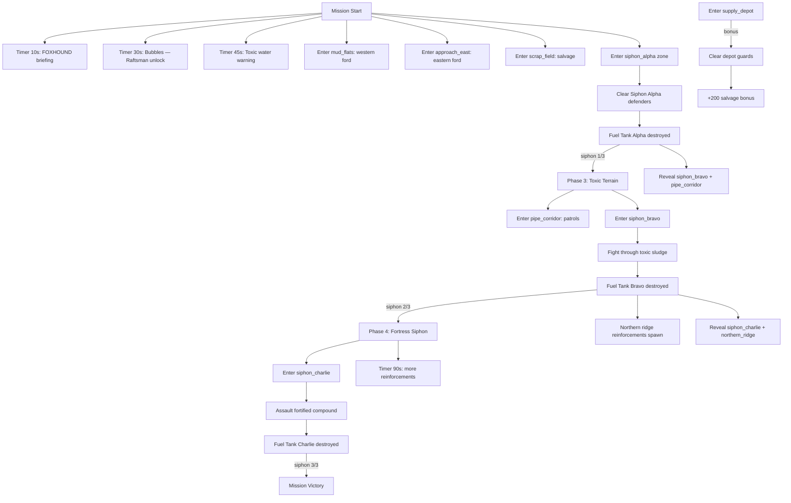

# Mission 2-1: SIPHON VALLEY

## Header
- **ID**: `mission_5`
- **Chapter**: 2 — Deep Operations
- **Map**: 160x128 tiles (5120x4096px)
- **Setting**: Wide industrial valley bisected by a polluted river. Three Scale-Guard siphon installations drain toxic runoff into the Copper-Silt waterways. Heavy pipes, rusted scaffolding, and chemical drums litter the terrain. The western siphon sits in open scrubland; the central siphon is ringed by toxic sludge pools; the eastern siphon is a walled compound on a ridge. Scale-Guard industrial territory — no jungle cover.
- **Win**: Destroy all 3 siphon installations (Fuel Tank buildings)
- **Lose**: Lodge destroyed
- **Par Time**: 20 minutes
- **Unlocks**: Raftsman (water transport unit)

## Zone Map
```
    0         32        64        96       128       160
  0 |---------|---------|---------|---------|---------|
    | northern_ridge                                  |
    |  (barren rock, enemy staging area)              |
 16 |---------|---------|---------|---------|---------|
    | siphon_alpha      | pipe_corridor     | siphon_ |
    |  (scrubland,      | (pipes, tanks,    | charlie |
    |   western         |  connects alpha   | (walled |
    |   siphon)         |  to bravo)        |  ridge  |
 40 |---------|---------|---------|---------|  comp-  |
    |         | siphon_bravo      |         |  ound)  |
    |  scrap_ | (toxic sludge     | supply_ |         |
    |  field  |  pools surround   | depot   |         |
    |         |  central siphon)  |         |         |
 60 |---------|---------|---------|---------|---------|
    | toxic_river (polluted, damage-over-time)        |
    |  (east-west, impassable except fords)           |
 72 |---------|---------|---------|---------|---------|
    | mud_flats         | approach_east               |
    |  (slow terrain)   |  (open ground, sparse cover)|
 88 |---------|---------|---------|---------|---------|
    | forward_base                | timber_grove       |
    |  (player start, lodge)      | (mangrove stand)   |
    |                             |                    |
112 |---------|---------|---------|---------|---------|
    | southern_bank (grass, safe starting area)        |
    |                                                  |
128 |---------|---------|---------|---------|---------|
```

## Zones (tile coordinates)
```typescript
zones: {
  forward_base:    { x: 8,   y: 88,  width: 56,  height: 28 },
  timber_grove:    { x: 96,  y: 88,  width: 48,  height: 24 },
  southern_bank:   { x: 0,   y: 112, width: 160, height: 16 },
  mud_flats:       { x: 0,   y: 72,  width: 56,  height: 16 },
  approach_east:   { x: 72,  y: 72,  width: 88,  height: 16 },
  toxic_river:     { x: 0,   y: 60,  width: 160, height: 12 },
  scrap_field:     { x: 0,   y: 36,  width: 32,  height: 24 },
  siphon_alpha:    { x: 8,   y: 16,  width: 48,  height: 24 },
  pipe_corridor:   { x: 56,  y: 16,  width: 40,  height: 24 },
  siphon_bravo:    { x: 56,  y: 36,  width: 48,  height: 24 },
  siphon_charlie:  { x: 120, y: 16,  width: 36,  height: 44 },
  supply_depot:    { x: 104, y: 40,  width: 20,  height: 16 },
  northern_ridge:  { x: 0,   y: 0,   width: 160, height: 16 },
}
```

## Terrain Regions
```typescript
terrain: {
  width: 160, height: 128,
  regions: [
    { terrainId: "grass", fill: true },
    // Southern safe zone
    { terrainId: "grass", rect: { x: 0, y: 88, w: 160, h: 40 } },
    // Forward base clearing
    { terrainId: "dirt", rect: { x: 12, y: 92, w: 48, h: 20 } },
    // Timber grove
    { terrainId: "mangrove", rect: { x: 100, y: 90, w: 40, h: 18 } },
    // Mud flats (slow terrain)
    { terrainId: "mud", rect: { x: 0, y: 72, w: 56, h: 16 } },
    { terrainId: "mud", circle: { cx: 40, cy: 78, r: 6 } },
    // Toxic river (east-west, polluted)
    { terrainId: "toxic_water", river: {
      points: [[0,64],[24,62],[48,66],[72,64],[96,62],[120,66],[140,64],[160,62]],
      width: 8
    }},
    // River ford (western)
    { terrainId: "mud", rect: { x: 20, y: 62, w: 8, h: 8 } },
    // River ford (eastern)
    { terrainId: "mud", rect: { x: 108, y: 60, w: 8, h: 8 } },
    // Approach east (sparse scrub)
    { terrainId: "dirt", rect: { x: 72, y: 72, w: 88, h: 16 } },
    // Scrap field
    { terrainId: "dirt", rect: { x: 4, y: 38, w: 24, h: 18 } },
    // Siphon Alpha clearing (scrubland)
    { terrainId: "dirt", rect: { x: 12, y: 18, w: 40, h: 18 } },
    // Pipe corridor (industrial)
    { terrainId: "dirt", rect: { x: 56, y: 18, w: 40, h: 20 } },
    // Siphon Bravo — toxic sludge pools
    { terrainId: "toxic_sludge", rect: { x: 60, y: 38, w: 40, h: 18 } },
    { terrainId: "toxic_sludge", circle: { cx: 72, cy: 44, r: 6 } },
    { terrainId: "toxic_sludge", circle: { cx: 88, cy: 48, r: 5 } },
    { terrainId: "toxic_sludge", circle: { cx: 80, cy: 52, r: 4 } },
    // Siphon Charlie compound (ridge)
    { terrainId: "stone", rect: { x: 124, y: 20, w: 28, h: 36 } },
    // Northern ridge (barren)
    { terrainId: "stone", rect: { x: 0, y: 0, w: 160, h: 16 } },
    // Supply depot
    { terrainId: "dirt", rect: { x: 106, y: 42, w: 16, h: 12 } },
  ],
  overrides: [
    // Ford crossing tiles (western)
    ...fordTiles(22, 62, 26, 68), // shallow crossing allowing foot traffic
    // Ford crossing tiles (eastern)
    ...fordTiles(110, 60, 114, 68),
  ]
}
```

## Placements

### Player (forward_base)
```typescript
// Lodge (Captain's field HQ)
{ type: "burrow", faction: "ura", x: 24, y: 100 },
// Starting workers
{ type: "river_rat", faction: "ura", x: 20, y: 102 },
{ type: "river_rat", faction: "ura", x: 28, y: 103 },
{ type: "river_rat", faction: "ura", x: 22, y: 105 },
{ type: "river_rat", faction: "ura", x: 30, y: 101 },
// Starting combat units
{ type: "mudfoot", faction: "ura", x: 32, y: 98 },
{ type: "mudfoot", faction: "ura", x: 36, y: 99 },
// Starting mortar
{ type: "mortar_otter", faction: "ura", x: 38, y: 102 },
```

### Resources
```typescript
// Timber (mangrove grove east)
{ type: "mangrove_tree", faction: "neutral", x: 102, y: 92 },
{ type: "mangrove_tree", faction: "neutral", x: 108, y: 94 },
{ type: "mangrove_tree", faction: "neutral", x: 114, y: 91 },
{ type: "mangrove_tree", faction: "neutral", x: 120, y: 95 },
{ type: "mangrove_tree", faction: "neutral", x: 106, y: 98 },
{ type: "mangrove_tree", faction: "neutral", x: 116, y: 100 },
{ type: "mangrove_tree", faction: "neutral", x: 126, y: 93 },
{ type: "mangrove_tree", faction: "neutral", x: 132, y: 96 },
// Fish (southern bank, safe)
{ type: "fish_spot", faction: "neutral", x: 60, y: 110 },
{ type: "fish_spot", faction: "neutral", x: 80, y: 114 },
{ type: "fish_spot", faction: "neutral", x: 140, y: 112 },
// Salvage (scrap field, contested)
{ type: "salvage_cache", faction: "neutral", x: 10, y: 40 },
{ type: "salvage_cache", faction: "neutral", x: 18, y: 44 },
{ type: "salvage_cache", faction: "neutral", x: 14, y: 48 },
// Supply depot salvage (bonus)
{ type: "salvage_cache", faction: "neutral", x: 110, y: 44 },
{ type: "salvage_cache", faction: "neutral", x: 114, y: 48 },
{ type: "salvage_cache", faction: "neutral", x: 108, y: 50 },
{ type: "salvage_cache", faction: "neutral", x: 116, y: 46 },
```

### Enemies

```typescript
// --- Siphon Alpha (lightly defended) ---
{ type: "fuel_tank", faction: "scale_guard", x: 32, y: 26 },
{ type: "siphon_drone", faction: "scale_guard", x: 28, y: 28 },
{ type: "gator", faction: "scale_guard", x: 24, y: 24 },
{ type: "gator", faction: "scale_guard", x: 36, y: 24 },
{ type: "skink", faction: "scale_guard", x: 30, y: 20 },

// --- Siphon Bravo (medium defense, toxic terrain) ---
{ type: "fuel_tank", faction: "scale_guard", x: 80, y: 44 },
{ type: "siphon_drone", faction: "scale_guard", x: 76, y: 42 },
{ type: "siphon_drone", faction: "scale_guard", x: 84, y: 46 },
{ type: "gator", faction: "scale_guard", x: 72, y: 40 },
{ type: "gator", faction: "scale_guard", x: 88, y: 40 },
{ type: "gator", faction: "scale_guard", x: 76, y: 48 },
{ type: "gator", faction: "scale_guard", x: 84, y: 50 },
{ type: "viper", faction: "scale_guard", x: 80, y: 38 },
{ type: "venom_spire", faction: "scale_guard", x: 80, y: 50 },

// --- Siphon Charlie (heavily fortified compound) ---
{ type: "fuel_tank", faction: "scale_guard", x: 140, y: 32 },
{ type: "siphon_drone", faction: "scale_guard", x: 136, y: 30 },
{ type: "siphon_drone", faction: "scale_guard", x: 144, y: 34 },
{ type: "watchtower", faction: "scale_guard", x: 128, y: 24 },
{ type: "watchtower", faction: "scale_guard", x: 148, y: 24 },
{ type: "sandbag_wall", faction: "scale_guard", x: 124, y: 36 },
{ type: "sandbag_wall", faction: "scale_guard", x: 126, y: 36 },
{ type: "sandbag_wall", faction: "scale_guard", x: 128, y: 36 },
{ type: "gator", faction: "scale_guard", x: 132, y: 28 },
{ type: "gator", faction: "scale_guard", x: 138, y: 28 },
{ type: "gator", faction: "scale_guard", x: 144, y: 28 },
{ type: "gator", faction: "scale_guard", x: 136, y: 36 },
{ type: "gator", faction: "scale_guard", x: 142, y: 36 },
{ type: "gator", faction: "scale_guard", x: 148, y: 32 },
{ type: "viper", faction: "scale_guard", x: 130, y: 22 },
{ type: "viper", faction: "scale_guard", x: 146, y: 22 },
{ type: "croc_champion", faction: "scale_guard", x: 140, y: 26 },

// --- Pipe corridor patrol ---
{ type: "skink", faction: "scale_guard", x: 64, y: 24 },
{ type: "skink", faction: "scale_guard", x: 76, y: 28 },

// --- Supply depot guard ---
{ type: "gator", faction: "scale_guard", x: 108, y: 44 },
{ type: "gator", faction: "scale_guard", x: 114, y: 48 },
```

## Phases

### Phase 1: RECON (0:00 - ~5:00)
**Entry**: Mission start
**State**: Lodge placed, 4 River Rats, 2 Mudfoots, 1 Mortar Otter. 150 fish / 100 timber / 50 salvage. Only forward_base, southern_bank, timber_grove, and mud_flats visible.
**Objectives**:
- "Locate and destroy Siphon Alpha" (PRIMARY)
- "Destroy all 3 siphon installations" (PRIMARY — tracked counter: 0/3)

**Triggers**:
```
[0:10] foxhound-briefing
  Condition: timer(10)
  Action: exchange([
    { speaker: "FOXHOUND", text: "Captain, intelligence confirms three siphon installations in this valley. They're pumping toxic runoff into the Copper-Silt river — killing everything downstream." },
    { speaker: "Col. Bubbles", text: "Those siphons are your targets. Each one has a Fuel Tank at its core — destroy the tank and the siphon goes offline." },
    { speaker: "FOXHOUND", text: "Siphon Alpha is to the northwest across the river. Lightly defended. Start there." }
  ])

[0:30] bubbles-raftsman
  Condition: timer(30)
  Action: dialogue("col_bubbles", "HQ is sending Raftsman schematics to your Barracks. These river specialists can build transport rafts. You'll want them for crossing that toxic water.")

[0:45] foxhound-toxic-warning
  Condition: timer(45)
  Action: dialogue("foxhound", "Be advised — the river is contaminated. Any unit that enters toxic water or sludge takes damage over time. Move through it fast or find the fords.")

ford-discovered-west
  Condition: areaEntered("ura", "mud_flats")
  Action: dialogue("foxhound", "Shallow ford at the western river bend, Captain. Your troops can cross there without swimming through the worst of it.")

ford-discovered-east
  Condition: areaEntered("ura", "approach_east")
  Action: dialogue("foxhound", "Eastern ford identified. Leads toward the ridgeline — that's the path to Siphon Charlie, but save that for later.")

scrap-discovery
  Condition: areaEntered("ura", "scrap_field")
  Action: dialogue("foxhound", "Scrap field to the west. Usable salvage in that wreckage, Captain.")
```

### Phase 2: FIRST SIPHON (~5:00 - ~10:00)
**Entry**: URA unit enters siphon_alpha zone
**New objectives**:
- (Existing counter updates as siphons are destroyed)

**Triggers**:
```
alpha-approach
  Condition: areaEntered("ura", "siphon_alpha")
  Action: exchange([
    { speaker: "FOXHOUND", text: "Siphon Alpha in visual range. Fuel Tank is the cylindrical structure at center. Two Gators on patrol, one Skink scout, and a Siphon Drone pumping unit." },
    { speaker: "Col. Bubbles", text: "Take out the Fuel Tank. The drone will shut down on its own once the tank is gone." }
  ])

alpha-destroyed
  Condition: buildingCount("scale_guard", "fuel_tank", "lte", 2)
  Action: [
    completeObjective("destroy-siphon-alpha"),
    updateCounter("siphons-destroyed", 1),
    exchange([
      { speaker: "FOXHOUND", text: "Siphon Alpha offline. River contamination dropping in this sector. Good hit, Captain." },
      { speaker: "Col. Bubbles", text: "One down, two to go. FOXHOUND is marking the next target — Siphon Bravo, northeast across the pipe corridor." }
    ]),
    revealZone("siphon_bravo"),
    revealZone("pipe_corridor"),
    startPhase("toxic-terrain")
  ]
```

### Phase 3: TOXIC TERRAIN (~10:00 - ~16:00)
**Entry**: Siphon Alpha destroyed
**New objectives**:
- "Destroy Siphon Bravo" (PRIMARY — tracked in siphon counter)

**Triggers**:
```
phase3-briefing
  Condition: enableTrigger (fired by alpha-destroyed)
  Action: exchange([
    { speaker: "FOXHOUND", text: "Siphon Bravo is in the center of a toxic sludge basin. That area deals continuous damage to your troops. Move fast or bring healers." },
    { speaker: "Col. Bubbles", text: "The sludge pools are the worst of it. Stick to the pipe corridor approach if you can — less exposure. But the corridor has patrols." }
  ])

corridor-patrol
  Condition: areaEntered("ura", "pipe_corridor")
  Action: [
    dialogue("foxhound", "Pipe corridor. Scale-Guard Skinks on patrol between the siphons. Watch the flanks."),
    setPatrol("pipe_corridor", ["skink_patrol_1", "skink_patrol_2"])
  ]

bravo-approach
  Condition: areaEntered("ura", "siphon_bravo")
  Action: exchange([
    { speaker: "FOXHOUND", text: "You're in the sludge zone. Toxic damage is active — your units are taking hits every few seconds." },
    { speaker: "Col. Bubbles", text: "Hit the Fuel Tank and get out. Don't linger in that filth." }
  ])

bravo-destroyed
  Condition: buildingCount("scale_guard", "fuel_tank", "lte", 1)
  Action: [
    completeObjective("destroy-siphon-bravo"),
    updateCounter("siphons-destroyed", 2),
    exchange([
      { speaker: "FOXHOUND", text: "Siphon Bravo neutralized. Two down. But Captain — enemy reinforcements are mobilizing from the northern ridge." },
      { speaker: "Col. Bubbles", text: "They know what we're doing. Last siphon is Siphon Charlie — it's a fortress on the eastern ridge. Regroup before you push." }
    ]),
    revealZone("siphon_charlie"),
    revealZone("northern_ridge"),
    spawn("gator", "scale_guard", 80, 8, 4),
    spawn("skink", "scale_guard", 72, 6, 2),
    spawn("viper", "scale_guard", 88, 10, 1),
    startPhase("fortress-siphon")
  ]
```

### Phase 4: FORTRESS SIPHON (~16:00+)
**Entry**: Siphon Bravo destroyed
**New objectives**:
- "Destroy Siphon Charlie" (PRIMARY — tracked in siphon counter)

**Triggers**:
```
phase4-briefing
  Condition: enableTrigger (fired by bravo-destroyed)
  Action: exchange([
    { speaker: "Col. Bubbles", text: "Siphon Charlie is their crown jewel. Walled compound, two watchtowers, a Croc Champion commanding the garrison. This is the real fight, Captain." },
    { speaker: "FOXHOUND", text: "Frontal assault through the sandbag line is costly. Consider flanking from the pipe corridor or looping around the eastern ford." }
  ])

charlie-approach
  Condition: areaEntered("ura", "siphon_charlie")
  Action: exchange([
    { speaker: "FOXHOUND", text: "Inside Charlie's perimeter. Heavy resistance. Watchtowers have long range — take them out first if you can." },
    { speaker: "Col. Bubbles", text: "Use your mortar on those towers. Then push the infantry in." }
  ])

[phase4 + 90s] northern-reinforcements
  Condition: timer(90) after phase4 start
  Action: [
    spawn("gator", "scale_guard", 100, 4, 3),
    spawn("viper", "scale_guard", 108, 6, 1),
    dialogue("foxhound", "Reinforcements from the northern ridge! They're heading toward Charlie to bolster the defense.")
  ]

charlie-destroyed
  Condition: buildingCount("scale_guard", "fuel_tank", "eq", 0)
  Action: [
    completeObjective("destroy-siphon-charlie"),
    updateCounter("siphons-destroyed", 3)
  ]

mission-complete
  Condition: allPrimaryComplete()
  Action: exchange([
    { speaker: "FOXHOUND", text: "All three siphons offline. Toxicity readings dropping across the valley. The river will recover." },
    { speaker: "Col. Bubbles", text: "Outstanding work, Captain. We've crippled their industrial operation in this sector." },
    { speaker: "Gen. Whiskers", text: "The Reach breathes a little easier today. Well done. Prepare for the next deployment — monsoon season is rolling in. HQ out." }
  ], followed by: victory())
```

### Bonus Objective
```
supply-depot-discovery
  Condition: areaEntered("ura", "supply_depot")
  Action: dialogue("foxhound", "Supply depot, Captain. Scale-Guard logistics cache. Lightly guarded — take it and we gain 200 salvage for the war effort.")

supply-depot-captured
  Condition: enemyCount("scale_guard", "supply_depot", "eq", 0) AND areaEntered("ura", "supply_depot")
  Action: [
    completeObjective("bonus-supply-depot"),
    grantResource("salvage", 200),
    dialogue("col_bubbles", "Supply depot secured. Those materials will serve us better than they served the Scale-Guard.")
  ]
```

## Trigger Flowchart


## Balance Notes
- **Starting resources**: 150 fish, 100 timber, 50 salvage — enough to build and reinforce before pushing
- **Raftsman unlock**: Available from Barracks once built; cost 100 fish, 50 salvage — provides toxic water traversal without damage
- **Toxic sludge damage**: 2 HP/second while standing in toxic_sludge tiles; toxic_water deals 3 HP/second — incentivizes ford usage and fast transit
- **Siphon escalation**:
  - Alpha: 2 Gators, 1 Skink, 1 Drone — winnable with starting force
  - Bravo: 4 Gators, 2 Drones, 1 Viper, 1 Venom Spire + toxic terrain — requires reinforcements and tactical movement
  - Charlie: 6 Gators, 2 Vipers, 2 Drones, 2 Watchtowers, 1 Croc Champion + walls — full assault required
- **Reinforcement pressure**: After Bravo falls, 4 Gators + 2 Skinks + 1 Viper from northern_ridge; 90 seconds into Phase 4, another 3 Gators + 1 Viper — prevents player from stalling indefinitely
- **Ford crossings**: Two fords (west at tile 22, east at tile 110) allow river crossing with reduced toxic exposure — discovering them is important for maneuvering
- **Enemy scaling** (difficulty):
  - Support: Alpha 1 Gator, Bravo 2 Gators + 1 Drone, Charlie 4 Gators + 1 Watchtower; no reinforcements
  - Tactical: as written
  - Elite: Alpha +1 Viper, Bravo +2 Gators + 1 Croc Champion, Charlie +4 Gators + 1 extra Croc Champion; reinforcements doubled
- **Par time**: 20 minutes on Tactical — assumes player builds a Barracks, trains 3-4 additional Mudfoots, and pushes methodically through each siphon
