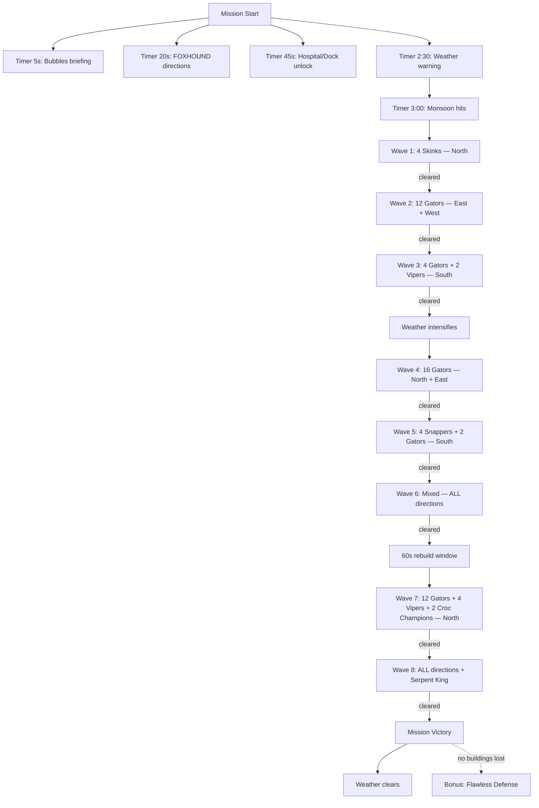

# Mission 2-2: MONSOON AMBUSH

## Header
- **ID**: `mission_6`
- **Chapter**: 2 — Deep Operations
- **Map**: 128x128 tiles (4096x4096px)
- **Setting**: Fortified hilltop outpost in the Copper-Silt highlands. A monsoon front is closing in. Scale-Guard Captain Scalebreak has marshaled his forces for a massive four-direction assault, timed to the storm. The player must build defenses during clear weather and hold against 8 waves of increasingly brutal attacks as monsoon conditions degrade visibility and movement speed. Mud, rain, and lightning dominate the second half.
- **Win**: Survive all 8 attack waves (Lodge survives)
- **Lose**: Lodge destroyed
- **Par Time**: 20 minutes
- **Unlocks**: Field Hospital, Dock

## Zone Map
```
    0         32        64        96       128
  0 |---------|---------|---------|---------|
    | corner_nw         | approach_north    |
    |  (jungle,         | (open corridor,   |
    |   resource grove) |  waves from here) |
 24 |---------|---------|---------|---------|
    |         |                   |         |
    | approach|     base          |approach |
    |  _west  |  (central fort,   | _east   |
    | (muddy  |   lodge, walls)   | (rocky  |
    |  trail) |                   |  slope) |
 48 |---------|---------|---------|---------|
    |         |                   |         |
    | approach|     base          |approach |
    |  _west  |  (continued)      | _east   |
    |         |                   |         |
 64 |---------|---------|---------|---------|
    |         |                   |         |
    |         |                   |         |
 80 |---------|---------|---------|---------|
    | corner_sw         | approach_south    |
    |  (fish pond,      | (wide valley,     |
    |   contested)      |  waves from here) |
    |                   |                   |
104 |---------|---------|---------|---------|
    | southern_fringe   | corner_se         |
    |  (sparse jungle)  | (ruined outpost)  |
    |                   |                   |
128 |---------|---------|---------|---------|
```

## Zones (tile coordinates)
```typescript
zones: {
  base:            { x: 40, y: 40,  width: 48, height: 48 },
  approach_north:  { x: 40, y: 0,   width: 48, height: 40 },
  approach_east:   { x: 88, y: 24,  width: 40, height: 64 },
  approach_south:  { x: 40, y: 88,  width: 48, height: 40 },
  approach_west:   { x: 0,  y: 24,  width: 40, height: 64 },
  corner_nw:       { x: 0,  y: 0,   width: 40, height: 24 },
  corner_se:       { x: 88, y: 104, width: 40, height: 24 },
  corner_sw:       { x: 0,  y: 80,  width: 40, height: 24 },
  southern_fringe: { x: 0,  y: 104, width: 48, height: 24 },
  resource_grove:  { x: 4,  y: 4,   width: 28, height: 20 },
  fish_pond:       { x: 4,  y: 84,  width: 28, height: 16 },
}
```

## Terrain Regions
```typescript
terrain: {
  width: 128, height: 128,
  regions: [
    { terrainId: "grass", fill: true },
    // Central base hilltop (elevated, clear ground)
    { terrainId: "dirt", rect: { x: 44, y: 44, w: 40, h: 40 } },
    { terrainId: "dirt", circle: { cx: 64, cy: 64, r: 24 } },
    // Northern approach (open field)
    { terrainId: "grass", rect: { x: 44, y: 4, w: 40, h: 36 } },
    { terrainId: "dirt", rect: { x: 56, y: 8, w: 16, h: 32 } }, // worn trail
    // Eastern approach (rocky slope)
    { terrainId: "stone", rect: { x: 92, y: 28, w: 32, h: 56 } },
    { terrainId: "dirt", rect: { x: 88, y: 48, w: 8, h: 16 } }, // trail entrance
    // Southern approach (wide valley)
    { terrainId: "grass", rect: { x: 44, y: 88, w: 40, h: 36 } },
    { terrainId: "mud", rect: { x: 52, y: 96, w: 24, h: 20 } }, // muddy valley floor
    // Western approach (muddy trail)
    { terrainId: "mud", rect: { x: 4, y: 28, w: 36, h: 56 } },
    { terrainId: "mud", circle: { cx: 20, cy: 48, r: 8 } },
    { terrainId: "mud", circle: { cx: 16, cy: 64, r: 6 } },
    // Resource grove (northwest, jungle)
    { terrainId: "mangrove", rect: { x: 4, y: 4, w: 28, h: 20 } },
    // Fish pond (southwest)
    { terrainId: "water", circle: { cx: 16, cy: 92, r: 8 } },
    { terrainId: "mud", circle: { cx: 16, cy: 92, r: 12 } },
    // Corner SE ruins
    { terrainId: "stone", rect: { x: 96, y: 108, w: 24, h: 16 } },
    // Southern fringe
    { terrainId: "mangrove", rect: { x: 4, y: 108, w: 40, h: 16 } },
  ],
  overrides: []
}
```

## Placements

### Player (base)
```typescript
// Lodge (Captain's field HQ)
{ type: "burrow", faction: "ura", x: 64, y: 64 },
// Pre-built defenses (partial fortification)
{ type: "watchtower", faction: "ura", x: 56, y: 48 },
{ type: "sandbag_wall", faction: "ura", x: 52, y: 56 },
{ type: "sandbag_wall", faction: "ura", x: 54, y: 56 },
{ type: "sandbag_wall", faction: "ura", x: 76, y: 56 },
{ type: "sandbag_wall", faction: "ura", x: 78, y: 56 },
// Starting workers
{ type: "river_rat", faction: "ura", x: 60, y: 66 },
{ type: "river_rat", faction: "ura", x: 68, y: 66 },
{ type: "river_rat", faction: "ura", x: 62, y: 70 },
{ type: "river_rat", faction: "ura", x: 66, y: 70 },
{ type: "river_rat", faction: "ura", x: 64, y: 74 },
// Starting combat units
{ type: "mudfoot", faction: "ura", x: 56, y: 60 },
{ type: "mudfoot", faction: "ura", x: 72, y: 60 },
{ type: "mudfoot", faction: "ura", x: 64, y: 58 },
```

### Resources
```typescript
// Timber (resource grove, northwest — contested, must venture out)
{ type: "mangrove_tree", faction: "neutral", x: 8, y: 8 },
{ type: "mangrove_tree", faction: "neutral", x: 14, y: 10 },
{ type: "mangrove_tree", faction: "neutral", x: 20, y: 6 },
{ type: "mangrove_tree", faction: "neutral", x: 10, y: 14 },
{ type: "mangrove_tree", faction: "neutral", x: 22, y: 16 },
{ type: "mangrove_tree", faction: "neutral", x: 16, y: 18 },
{ type: "mangrove_tree", faction: "neutral", x: 26, y: 12 },
{ type: "mangrove_tree", faction: "neutral", x: 28, y: 8 },
// Fish (fish pond, southwest — contested)
{ type: "fish_spot", faction: "neutral", x: 12, y: 88 },
{ type: "fish_spot", faction: "neutral", x: 20, y: 92 },
{ type: "fish_spot", faction: "neutral", x: 16, y: 96 },
// Salvage (corner_se ruins)
{ type: "salvage_cache", faction: "neutral", x: 100, y: 112 },
{ type: "salvage_cache", faction: "neutral", x: 108, y: 110 },
```

### Enemies
```typescript
// No enemies on map at start — all spawned by wave triggers
// See Phase 2-4 triggers for complete wave compositions
```

## Phases

### Phase 1: FORTIFY (0:00 - 3:00)
**Entry**: Mission start
**State**: Lodge placed at center with partial sandbag perimeter and one Watchtower (north face). 5 River Rats, 3 Mudfoots. 200 fish / 150 timber / 75 salvage. All zones visible (hilltop vantage). Weather: CLEAR.
**Objectives**:
- "Survive 8 attack waves" (PRIMARY — tracked counter: 0/8)
- "Prepare defenses before the storm hits" (PRIMARY — auto-completes at 3:00)

**Triggers**:
```
[0:05] bubbles-briefing
  Condition: timer(5)
  Action: exchange([
    { speaker: "Col. Bubbles", text: "Captain, Scale-Guard forces are massing on all sides. Captain Scalebreak is directing this assault personally — he wants this position." },
    { speaker: "FOXHOUND", text: "Monsoon front hits in approximately three minutes. When the rain starts, visibility drops to half range and all ground units slow by 20%." },
    { speaker: "Col. Bubbles", text: "Use the clear weather to build. Walls, watchtowers, barracks — anything you can raise before the first wave." }
  ])

[0:20] foxhound-directions
  Condition: timer(20)
  Action: exchange([
    { speaker: "FOXHOUND", text: "Four attack corridors, Captain. North is open ground — fast approach. East is a rocky slope — they'll be slower but tougher. South is a wide valley — expect numbers. West is a muddy trail — natural chokepoint." },
    { speaker: "Col. Bubbles", text: "You can't wall off everything. Pick your priorities. And get workers gathering — there's timber northwest, fish southwest." }
  ])

[0:45] foxhound-hospital
  Condition: timer(45)
  Action: dialogue("foxhound", "HQ has authorized Field Hospital schematics, Captain. Build one to heal wounded troops between waves. Dock blueprints are also available — useful if you need naval assets later.")

[2:30] weather-warning
  Condition: timer(150)
  Action: [
    dialogue("foxhound", "Thirty seconds to monsoon. Final preparations, Captain."),
    changeWeather("overcast")
  ]

[3:00] monsoon-hits
  Condition: timer(180)
  Action: [
    completeObjective("prepare-defenses"),
    changeWeather("monsoon"),
    dialogue("col_bubbles", "The storm is here. And so are they. First wave incoming!"),
    startPhase("early-waves")
  ]
```

### Phase 2: EARLY WAVES (3:00 - ~8:00)
**Entry**: Timer reaches 3:00, monsoon begins
**Weather**: MONSOON — visibility reduced to 50%, movement speed -20% for all ground units, rain particle effects active.
**Objectives**:
- "Survive 8 attack waves" (PRIMARY — continues tracking)

**Triggers**:
```
// === WAVE 1 (3:00) — Probing attack from north ===
wave-1-spawn
  Condition: timer(180)
  Action: [
    dialogue("foxhound", "Wave one — Skinks from the north! Scout force, fast movers."),
    spawn("skink", "scale_guard", 60, 2, 2),
    spawn("skink", "scale_guard", 68, 4, 2),
    setAttackTarget("scale_guard", "wave_1", "base")
  ]

wave-1-clear
  Condition: waveCleared("wave_1")
  Action: [
    updateCounter("waves-survived", 1),
    dialogue("col_bubbles", "Wave one down. That was just a probe. They'll hit harder next time.")
  ]

// === WAVE 2 (4:30) — Pincers from east + west ===
wave-2-spawn
  Condition: timer(270)
  Action: [
    dialogue("foxhound", "Wave two — Gators from east AND west! They're splitting our attention."),
    spawn("gator", "scale_guard", 120, 48, 3),
    spawn("gator", "scale_guard", 120, 56, 3),
    spawn("gator", "scale_guard", 4, 48, 3),
    spawn("gator", "scale_guard", 4, 56, 3),
    setAttackTarget("scale_guard", "wave_2_east", "base"),
    setAttackTarget("scale_guard", "wave_2_west", "base")
  ]

wave-2-clear
  Condition: waveCleared("wave_2_east") AND waveCleared("wave_2_west")
  Action: [
    updateCounter("waves-survived", 2),
    dialogue("foxhound", "Wave two cleared. No time to rest — next wave is forming.")
  ]

// === WAVE 3 (6:00) — Heavy push from south ===
wave-3-spawn
  Condition: timer(360)
  Action: [
    dialogue("foxhound", "Wave three — heavy force from the south! Gators and Vipers!"),
    spawn("gator", "scale_guard", 56, 124, 2),
    spawn("gator", "scale_guard", 72, 124, 2),
    spawn("viper", "scale_guard", 64, 122, 2),
    setAttackTarget("scale_guard", "wave_3", "base")
  ]

wave-3-clear
  Condition: waveCleared("wave_3")
  Action: [
    updateCounter("waves-survived", 3),
    exchange([
      { speaker: "Col. Bubbles", text: "Three down, five to go. Repair what you can. The worst is still coming." },
      { speaker: "FOXHOUND", text: "Brief calm before the next push. Use it." }
    ]),
    startPhase("heavy-waves")
  ]
```

### Phase 3: HEAVY WAVES (~8:00 - ~15:00)
**Entry**: Wave 3 cleared
**Weather**: MONSOON (intensifying) — visibility reduced to 40%, movement speed -25%. Lightning strikes illuminate random zones briefly.
**Objectives**:
- "Survive 8 attack waves" (PRIMARY — continues tracking)

**Triggers**:
```
[wave 3 clear + 30s] weather-intensifies
  Condition: timer(30) after wave-3-clear
  Action: [
    changeWeather("monsoon_heavy"),
    dialogue("foxhound", "Storm is intensifying. Visibility dropping further. Lightning will give you brief flashes of the approaches.")
  ]

// === WAVE 4 (8:30) — Multi-direction Gator assault ===
wave-4-spawn
  Condition: timer(510)
  Action: [
    dialogue("foxhound", "Wave four — massed Gators from the north and east!"),
    spawn("gator", "scale_guard", 56, 2, 4),
    spawn("gator", "scale_guard", 68, 4, 4),
    spawn("gator", "scale_guard", 122, 44, 4),
    spawn("gator", "scale_guard", 124, 56, 4),
    setAttackTarget("scale_guard", "wave_4_north", "base"),
    setAttackTarget("scale_guard", "wave_4_east", "base")
  ]

wave-4-clear
  Condition: waveCleared("wave_4_north") AND waveCleared("wave_4_east")
  Action: [
    updateCounter("waves-survived", 4),
    dialogue("col_bubbles", "Halfway there, Captain. They're burning through troops but they have more.")
  ]

// === WAVE 5 (10:30) — Snappers from south (heavy armor) ===
wave-5-spawn
  Condition: timer(630)
  Action: [
    dialogue("foxhound", "Wave five — Snappers from the south! Heavy armor, slow but devastating."),
    dialogue("col_bubbles", "Snappers! Focus fire on them. Don't let them reach the walls."),
    spawn("snapper", "scale_guard", 56, 126, 2),
    spawn("snapper", "scale_guard", 72, 126, 2),
    spawn("gator", "scale_guard", 64, 124, 2),
    setAttackTarget("scale_guard", "wave_5", "base")
  ]

wave-5-clear
  Condition: waveCleared("wave_5")
  Action: [
    updateCounter("waves-survived", 5),
    dialogue("foxhound", "Snappers down. Heavy casualties on their side.")
  ]

// === WAVE 6 (12:30) — All directions simultaneously ===
wave-6-spawn
  Condition: timer(750)
  Action: [
    exchange([
      { speaker: "FOXHOUND", text: "Wave six — contacts on ALL approaches! North, south, east, and west!" },
      { speaker: "Col. Bubbles", text: "They're throwing everything at us! All units to defensive positions!" }
    ]),
    spawn("gator", "scale_guard", 64, 2, 3),
    spawn("skink", "scale_guard", 56, 4, 2),
    spawn("gator", "scale_guard", 124, 52, 3),
    spawn("viper", "scale_guard", 122, 60, 1),
    spawn("gator", "scale_guard", 64, 126, 3),
    spawn("skink", "scale_guard", 72, 124, 2),
    spawn("gator", "scale_guard", 4, 52, 3),
    spawn("viper", "scale_guard", 6, 60, 1),
    setAttackTarget("scale_guard", "wave_6_n", "base"),
    setAttackTarget("scale_guard", "wave_6_e", "base"),
    setAttackTarget("scale_guard", "wave_6_s", "base"),
    setAttackTarget("scale_guard", "wave_6_w", "base")
  ]

wave-6-clear
  Condition: waveCleared("wave_6_n") AND waveCleared("wave_6_e") AND waveCleared("wave_6_s") AND waveCleared("wave_6_w")
  Action: [
    updateCounter("waves-survived", 6),
    exchange([
      { speaker: "Col. Bubbles", text: "Six down. Two more. Rebuild, rearm, retrain — you've got a window." },
      { speaker: "FOXHOUND", text: "Scalebreak is committing his reserves. The last two waves will be the worst we've seen." }
    ]),
    startPhase("final-waves")
  ]
```

### Phase 4: FINAL WAVES (~15:00+)
**Entry**: Wave 6 cleared
**Weather**: MONSOON HEAVY — visibility at 35%, movement speed -25%. Lightning strikes every 15 seconds.
**Objectives**:
- "Survive 8 attack waves" (PRIMARY — continues tracking)

**Triggers**:
```
// === LULL (60 seconds between wave 6 clear and wave 7) ===
lull-briefing
  Condition: enableTrigger (fired by wave-6-clear)
  Action: exchange([
    { speaker: "Col. Bubbles", text: "Scalebreak's sending his elite. Croc Champions and everything he has left. This is the final push." },
    { speaker: "FOXHOUND", text: "Sixty seconds to rebuild. Use every one of them, Captain." }
  ])

// === WAVE 7 (wave 6 clear + 60s) — Elite northern assault ===
wave-7-spawn
  Condition: timer(60) after wave-6-clear
  Action: [
    exchange([
      { speaker: "FOXHOUND", text: "Wave seven — massive assault from the north! Croc Champions leading the charge!" },
      { speaker: "Col. Bubbles", text: "HOLD THE LINE, Captain!" }
    ]),
    spawn("gator", "scale_guard", 48, 2, 4),
    spawn("gator", "scale_guard", 64, 2, 4),
    spawn("gator", "scale_guard", 80, 2, 4),
    spawn("viper", "scale_guard", 56, 4, 2),
    spawn("viper", "scale_guard", 72, 4, 2),
    spawn("croc_champion", "scale_guard", 60, 6, 1),
    spawn("croc_champion", "scale_guard", 68, 6, 1),
    setAttackTarget("scale_guard", "wave_7", "base")
  ]

wave-7-clear
  Condition: waveCleared("wave_7")
  Action: [
    updateCounter("waves-survived", 7),
    dialogue("col_bubbles", "Champions are down! One more wave, Captain — one more and we break them!")
  ]

// === WAVE 8 (wave 7 clear + 30s) — Final all-direction assault + Serpent King ===
wave-8-spawn
  Condition: timer(30) after wave-7-clear
  Action: [
    exchange([
      { speaker: "FOXHOUND", text: "FINAL WAVE — all directions! And Captain... we're reading a Serpent King signature from the north." },
      { speaker: "Col. Bubbles", text: "Everything they have. This is it. Every unit, every wall, every last ounce of fight. DO NOT BREAK." }
    ]),
    // North (main assault + Serpent King)
    spawn("gator", "scale_guard", 56, 2, 3),
    spawn("gator", "scale_guard", 72, 2, 3),
    spawn("viper", "scale_guard", 64, 4, 2),
    spawn("serpent_king", "scale_guard", 64, 2, 1),
    // East
    spawn("gator", "scale_guard", 124, 48, 3),
    spawn("snapper", "scale_guard", 122, 56, 1),
    // South
    spawn("gator", "scale_guard", 56, 126, 3),
    spawn("viper", "scale_guard", 68, 124, 2),
    spawn("croc_champion", "scale_guard", 64, 126, 1),
    // West
    spawn("gator", "scale_guard", 4, 48, 3),
    spawn("snapper", "scale_guard", 6, 56, 1),
    setAttackTarget("scale_guard", "wave_8_all", "base")
  ]

wave-8-clear
  Condition: waveCleared("wave_8_all")
  Action: [
    updateCounter("waves-survived", 8),
    completeObjective("survive-waves")
  ]

mission-complete
  Condition: allPrimaryComplete()
  Action: [
    changeWeather("clearing"),
    exchange([
      { speaker: "Gen. Whiskers", text: "They're pulling back. Scalebreak has lost his offensive. You held that position against everything he threw at you, Captain." },
      { speaker: "Col. Bubbles", text: "Storm's breaking. And so is their assault. Outstanding work — the highlands are ours." },
      { speaker: "FOXHOUND", text: "All Scale-Guard forces in retreat. The monsoon offensive has failed. Well done, Captain." }
    ], followed by: victory())
  ]
```

### Bonus Objective
```
no-buildings-lost
  Condition: allPrimaryComplete() AND buildingsLost("ura", "eq", 0)
  Action: [
    completeObjective("bonus-no-losses"),
    dialogue("gen_whiskers", "Not a single structure lost. Textbook defensive engagement, Captain. Truly exceptional.")
  ]
```

## Trigger Flowchart


## Balance Notes
- **Starting resources**: 200 fish, 150 timber, 75 salvage — generous to enable rapid fortification during the 3-minute build window
- **Pre-built defenses**: 1 Watchtower (north face), 4 Sandbag Walls (partial east/west coverage) — player must decide where to reinforce
- **Field Hospital**: Cost 250 fish, 100 timber — heals nearby units 1 HP/second; critical for sustaining troops between waves
- **Dock**: Cost 200 fish, 150 timber, 50 salvage — unlocked but not immediately useful on this map (no major water); available for future missions
- **Weather effects**:
  - Clear (Phase 1): Normal visibility and speed
  - Monsoon (Phase 2): 50% visibility range, -20% movement speed
  - Monsoon Heavy (Phase 3-4): 35-40% visibility, -25% movement speed, lightning flashes
  - Clearing (victory): Restores normal conditions
- **Wave pacing**: 90-second intervals in early waves, tightening to 30 seconds between waves 7 and 8 — constant pressure
- **Lull window**: 60 seconds between wave 6 and wave 7 — deliberate breathing room to rebuild and retrain
- **Approach asymmetry**: West (mud) slows attackers naturally; East (rock) has no slow but narrow entry; North (open) is the fastest lane; South (wide) brings the most troops
- **Resource tension**: Timber grove (NW) and fish pond (SW) are outside the defensive perimeter — gathering during combat is risky
- **Enemy scaling** (difficulty):
  - Support: Waves 1-3 only, no Snappers or Champions, no Serpent King in wave 8
  - Tactical: as written (full 8 waves)
  - Elite: +50% enemies per wave, wave 8 adds a second Serpent King from the south, Croc Champions appear starting in wave 5
- **Par time**: 20 minutes on Tactical — wave timing is fixed, but surviving all 8 depends on defensive preparation
