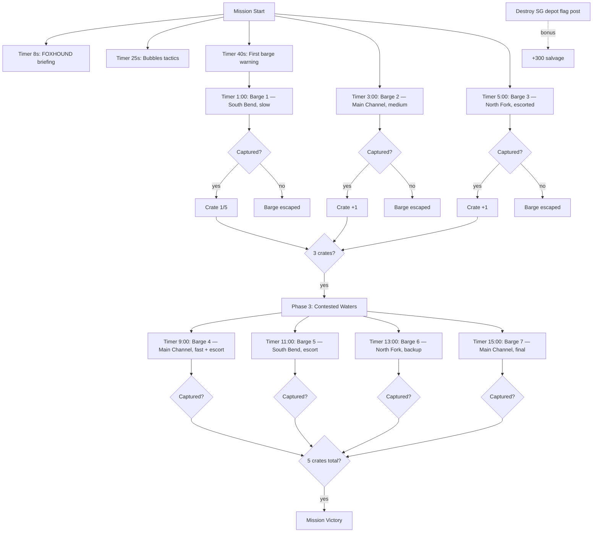

# Mission 2-3: RIVER RATS

## Header
- **ID**: `mission_7`
- **Chapter**: 2 — Deep Operations
- **Map**: 128x128 tiles (4096x4096px)
- **Setting**: A tangle of river channels cutting through dense jungle. Scale-Guard supply barges ferry munitions crates along three waterways — the Main Channel (central), the North Fork, and the South Bend. OEF must intercept and capture 5 crates before they reach the Scale-Guard depot downstream. Raftsmen and Divers are the primary tools: Raftsmen build transport rafts for interception, Divers swim underwater to ambush barges. Riverbanks are contested jungle with Scale-Guard patrols guarding the shoreline.
- **Win**: Capture 5 enemy supply crates
- **Lose**: Lodge destroyed
- **Par Time**: 18 minutes
- **Unlocks**: (No new unlocks — uses existing water units: Raftsmen and Divers)

## Zone Map
```
    0         32        64        96       128
  0 |---------|---------|---------|---------|
    | sg_depot (Scale-Guard downstream depot)|
    |  (enemy destination for barges)        |
 12 |---------|---------|---------|---------|
    | north_bank        | north_bank        |
    | (jungle, patrols) | (jungle, patrols) |
 24 |---------|---------|---------|---------|
    | north_fork (river channel — barges)    |
    |  ~~~~~~~~~~~~~~~~~~~~~~~~~~~~~~~~~~~~~>|
 32 |---------|---------|---------|---------|
    | mid_island_w      | mid_island_e      |
    | (jungle island,   | (jungle island,   |
    |  ambush position) |  watchtower)      |
 48 |---------|---------|---------|---------|
    | main_channel (primary river — barges)  |
    |  ~~~~~~~~~~~~~~~~~~~~~~~~~~~~~~~~~~~~~>|
 56 |---------|---------|---------|---------|
    | south_island      | sandbar           |
    | (mangrove, timber) | (shallow, staging)|
 68 |---------|---------|---------|---------|
    | south_bend (river channel — barges)    |
    |  ~~~~~~~~~~~~~~~~~~~~~~~~~~~~~~~~~~~~~>|
 76 |---------|---------|---------|---------|
    | south_bank        | south_bank        |
    | (jungle, resource) | (open ground)    |
 92 |---------|---------|---------|---------|
    | forward_base                           |
    |  (player start, lodge, dock area)      |
    |                                        |
112 |---------|---------|---------|---------|
    | swamp_south (mangrove swamp)           |
    |                                        |
128 |---------|---------|---------|---------|
```

## Zones (tile coordinates)
```typescript
zones: {
  forward_base:   { x: 16, y: 92,  width: 96, height: 24 },
  swamp_south:    { x: 0,  y: 112, width: 128, height: 16 },
  south_bank:     { x: 0,  y: 76,  width: 128, height: 16 },
  south_bend:     { x: 0,  y: 68,  width: 128, height: 8 },
  south_island:   { x: 8,  y: 56,  width: 40, height: 12 },
  sandbar:        { x: 72, y: 56,  width: 40, height: 12 },
  main_channel:   { x: 0,  y: 48,  width: 128, height: 8 },
  mid_island_w:   { x: 8,  y: 32,  width: 48, height: 16 },
  mid_island_e:   { x: 64, y: 32,  width: 48, height: 16 },
  north_fork:     { x: 0,  y: 24,  width: 128, height: 8 },
  north_bank:     { x: 0,  y: 12,  width: 128, height: 12 },
  sg_depot:       { x: 0,  y: 0,   width: 128, height: 12 },
}
```

## Terrain Regions
```typescript
terrain: {
  width: 128, height: 128,
  regions: [
    { terrainId: "grass", fill: true },
    // Forward base clearing
    { terrainId: "dirt", rect: { x: 20, y: 96, w: 88, h: 16 } },
    // Swamp south
    { terrainId: "mangrove", rect: { x: 0, y: 112, w: 128, h: 16 } },
    { terrainId: "water", circle: { cx: 24, cy: 120, r: 4 } },
    { terrainId: "water", circle: { cx: 80, cy: 118, r: 3 } },
    // South bank (jungle)
    { terrainId: "mangrove", rect: { x: 0, y: 78, w: 60, h: 12 } },
    { terrainId: "grass", rect: { x: 64, y: 78, w: 64, h: 12 } },
    // South Bend river channel
    { terrainId: "water", river: {
      points: [[0,72],[24,70],[48,74],[72,70],[96,72],[128,70]],
      width: 6
    }},
    // South island (mangrove)
    { terrainId: "mangrove", rect: { x: 12, y: 58, w: 32, h: 8 } },
    // Sandbar (shallow water/sand)
    { terrainId: "beach", rect: { x: 76, y: 58, w: 32, h: 8 } },
    { terrainId: "mud", circle: { cx: 88, cy: 62, r: 4 } },
    // Main Channel river (widest)
    { terrainId: "water", river: {
      points: [[0,52],[20,50],[44,54],[68,50],[92,52],[128,50]],
      width: 8
    }},
    // Mid-island west (jungle)
    { terrainId: "mangrove", rect: { x: 12, y: 34, w: 40, h: 12 } },
    { terrainId: "dirt", rect: { x: 24, y: 38, w: 12, h: 6 } }, // clearing for ambush
    // Mid-island east (cleared, watchtower)
    { terrainId: "dirt", rect: { x: 68, y: 36, w: 40, h: 8 } },
    // North Fork river channel
    { terrainId: "water", river: {
      points: [[0,28],[28,26],[56,30],[84,26],[112,28],[128,26]],
      width: 6
    }},
    // North bank (dense jungle)
    { terrainId: "mangrove", rect: { x: 0, y: 12, w: 128, h: 12 } },
    // SG depot (fortified)
    { terrainId: "stone", rect: { x: 40, y: 2, w: 48, h: 8 } },
    { terrainId: "dirt", rect: { x: 4, y: 4, w: 32, h: 6 } },
    { terrainId: "dirt", rect: { x: 92, y: 4, w: 32, h: 6 } },
  ],
  overrides: []
}
```

## Placements

### Player (forward_base)
```typescript
// Lodge (Captain's field HQ)
{ type: "burrow", faction: "ura", x: 56, y: 100 },
// Pre-built dock
{ type: "dock", faction: "ura", x: 64, y: 92 },
// Starting workers
{ type: "river_rat", faction: "ura", x: 52, y: 102 },
{ type: "river_rat", faction: "ura", x: 60, y: 104 },
{ type: "river_rat", faction: "ura", x: 48, y: 106 },
// Starting Raftsmen (water transport)
{ type: "raftsman", faction: "ura", x: 68, y: 96 },
{ type: "raftsman", faction: "ura", x: 72, y: 98 },
{ type: "raftsman", faction: "ura", x: 76, y: 96 },
// Starting Divers (underwater ambush)
{ type: "diver", faction: "ura", x: 80, y: 100 },
{ type: "diver", faction: "ura", x: 84, y: 102 },
// Starting combat (shore defense)
{ type: "mudfoot", faction: "ura", x: 44, y: 98 },
{ type: "mudfoot", faction: "ura", x: 40, y: 100 },
```

### Resources
```typescript
// Timber (south island mangrove)
{ type: "mangrove_tree", faction: "neutral", x: 16, y: 60 },
{ type: "mangrove_tree", faction: "neutral", x: 22, y: 58 },
{ type: "mangrove_tree", faction: "neutral", x: 28, y: 62 },
{ type: "mangrove_tree", faction: "neutral", x: 34, y: 59 },
{ type: "mangrove_tree", faction: "neutral", x: 40, y: 61 },
// Timber (mid-island west)
{ type: "mangrove_tree", faction: "neutral", x: 16, y: 36 },
{ type: "mangrove_tree", faction: "neutral", x: 24, y: 38 },
{ type: "mangrove_tree", faction: "neutral", x: 32, y: 34 },
{ type: "mangrove_tree", faction: "neutral", x: 44, y: 40 },
// Fish (south bend, between channels)
{ type: "fish_spot", faction: "neutral", x: 20, y: 80 },
{ type: "fish_spot", faction: "neutral", x: 48, y: 82 },
{ type: "fish_spot", faction: "neutral", x: 96, y: 78 },
// Fish (swamp south, safe)
{ type: "fish_spot", faction: "neutral", x: 32, y: 116 },
{ type: "fish_spot", faction: "neutral", x: 100, y: 120 },
// Salvage (sandbar)
{ type: "salvage_cache", faction: "neutral", x: 80, y: 60 },
{ type: "salvage_cache", faction: "neutral", x: 88, y: 58 },
{ type: "salvage_cache", faction: "neutral", x: 96, y: 62 },
```

### Enemies
```typescript
// --- Mid-island east watchtower + guards ---
{ type: "watchtower", faction: "scale_guard", x: 80, y: 36 },
{ type: "gator", faction: "scale_guard", x: 76, y: 38 },
{ type: "gator", faction: "scale_guard", x: 84, y: 38 },
{ type: "skink", faction: "scale_guard", x: 88, y: 34 },

// --- North bank patrols ---
{ type: "gator", faction: "scale_guard", x: 20, y: 16 },
{ type: "gator", faction: "scale_guard", x: 36, y: 14 },
{ type: "skink", faction: "scale_guard", x: 56, y: 16 },
{ type: "gator", faction: "scale_guard", x: 80, y: 14 },
{ type: "gator", faction: "scale_guard", x: 100, y: 16 },
{ type: "viper", faction: "scale_guard", x: 112, y: 14 },

// --- SG depot (heavily guarded) ---
{ type: "flag_post", faction: "scale_guard", x: 64, y: 6 },
{ type: "watchtower", faction: "scale_guard", x: 44, y: 4 },
{ type: "watchtower", faction: "scale_guard", x: 84, y: 4 },
{ type: "gator", faction: "scale_guard", x: 52, y: 4 },
{ type: "gator", faction: "scale_guard", x: 60, y: 8 },
{ type: "gator", faction: "scale_guard", x: 68, y: 8 },
{ type: "gator", faction: "scale_guard", x: 76, y: 4 },
{ type: "viper", faction: "scale_guard", x: 56, y: 2 },
{ type: "viper", faction: "scale_guard", x: 72, y: 2 },
{ type: "croc_champion", faction: "scale_guard", x: 64, y: 4 },

// --- South bank patrol (light) ---
{ type: "skink", faction: "scale_guard", x: 24, y: 82 },
{ type: "gator", faction: "scale_guard", x: 92, y: 80 },

// --- Supply barges (scripted entities, spawned by triggers) ---
// See Phase triggers for barge spawn details
```

## Phases

### Phase 1: RECONNAISSANCE (0:00 - ~3:00)
**Entry**: Mission start
**State**: Lodge placed, pre-built Dock. 3 River Rats, 3 Raftsmen, 2 Divers, 2 Mudfoots. 150 fish / 100 timber / 50 salvage. Forward_base, south_bank, south_bend, and swamp_south visible. Rivers partially visible.
**Objectives**:
- "Capture 5 enemy supply crates" (PRIMARY — tracked counter: 0/5)

**Triggers**:
```
[0:08] foxhound-briefing
  Condition: timer(8)
  Action: exchange([
    { speaker: "FOXHOUND", text: "Captain, Scale-Guard is running supply barges through three river channels in this sector. They're ferrying munitions to a depot downstream." },
    { speaker: "Col. Bubbles", text: "We need those supplies. Your Raftsmen can intercept barges on the water. Divers can swim under and board from below." },
    { speaker: "FOXHOUND", text: "Three channels: the South Bend closest to you, the Main Channel in the center, and the North Fork farthest out. Barges run at intervals. Each one carries a supply crate." }
  ])

[0:25] bubbles-tactics
  Condition: timer(25)
  Action: exchange([
    { speaker: "Col. Bubbles", text: "Set up interception points along the channels. Raftsmen can deploy a raft and position it in the barge's path — when the barge gets close, your units board and capture the crate." },
    { speaker: "FOXHOUND", text: "Divers are invisible while submerged. Position them near a channel and they can ambush a barge from underwater. Faster than a raft, but they can only carry one crate at a time." }
  ])

[0:40] foxhound-first-barge
  Condition: timer(40)
  Action: dialogue("foxhound", "First barge spotted entering the South Bend from the west. Intercept it, Captain.")

south-bank-patrol
  Condition: areaEntered("ura", "south_bank")
  Action: dialogue("foxhound", "Scale-Guard patrol on the south bank. Light force — a Skink and a Gator. Clear them for safe passage to the channels.")
```

### Phase 2: FIRST INTERCEPTS (~3:00 - ~9:00)
**Entry**: First barge spawns at timer(60)
**New objectives**:
- (Existing counter updates as crates are captured)

**Triggers**:
```
// === BARGE 1 (1:00) — South Bend, slow, easy ===
barge-1-spawn
  Condition: timer(60)
  Action: [
    spawnBarge("supply_barge", "scale_guard", 0, 72, "south_bend", "slow"),
    dialogue("foxhound", "Barge One is in the South Bend. Moving slow — easy target. Get a Raftsman or Diver into position.")
  ]

barge-1-capture
  Condition: bargeCaptured("barge_1")
  Action: [
    updateCounter("crates-captured", 1),
    dialogue("col_bubbles", "First crate secured! Good work. Bring it back to the lodge for credit. Four more to go.")
  ]

barge-1-escaped
  Condition: bargeReachedDepot("barge_1")
  Action: dialogue("foxhound", "Barge One reached the depot. We lost that one, Captain. More incoming — stay sharp.")

// === BARGE 2 (3:00) — Main Channel, medium speed ===
barge-2-spawn
  Condition: timer(180)
  Action: [
    spawnBarge("supply_barge", "scale_guard", 0, 52, "main_channel", "medium"),
    dialogue("foxhound", "Barge Two entering the Main Channel. Faster than the last one — you'll need to be in position already.")
  ]

barge-2-capture
  Condition: bargeCaptured("barge_2")
  Action: [
    updateCounter("crates-captured", +1),
    dialogue("foxhound", "Crate captured. Keep intercepting, Captain.")
  ]

barge-2-escaped
  Condition: bargeReachedDepot("barge_2")
  Action: dialogue("foxhound", "Barge Two is through. Missed it.")

// === BARGE 3 (5:00) — North Fork, medium speed, escorted ===
barge-3-spawn
  Condition: timer(300)
  Action: [
    spawnBarge("supply_barge", "scale_guard", 0, 28, "north_fork", "medium"),
    spawn("skink", "scale_guard", 4, 26, 2),
    dialogue("foxhound", "Barge Three on the North Fork — and it's got an escort. Two Skink scouts running the banks alongside it.")
  ]

barge-3-capture
  Condition: bargeCaptured("barge_3")
  Action: [
    updateCounter("crates-captured", +1),
    dialogue("col_bubbles", "Another crate! Their supply line is hemorrhaging.")
  ]

barge-3-escaped
  Condition: bargeReachedDepot("barge_3")
  Action: dialogue("foxhound", "Third barge reached the depot. They're getting through, Captain.")

mid-island-approach
  Condition: areaEntered("ura", "mid_island_e")
  Action: dialogue("foxhound", "Watchtower on the mid-island. Scale-Guard observation post — take it out for better control of the Main Channel.")

crate-threshold-3
  Condition: counterReached("crates-captured", 3)
  Action: [
    exchange([
      { speaker: "Col. Bubbles", text: "Three crates captured. They're going to tighten security on the remaining runs." },
      { speaker: "FOXHOUND", text: "Confirmed — enemy is adding Gator escorts to the next barges. And they're speeding up." }
    ]),
    startPhase("contested-waters")
  ]
```

### Phase 3: CONTESTED WATERS (~9:00 - ~15:00)
**Entry**: 3 crates captured
**New objectives**:
- (Existing counter continues — 3/5 captured)

**Triggers**:
```
phase3-briefing
  Condition: enableTrigger (fired by crate-threshold-3)
  Action: exchange([
    { speaker: "FOXHOUND", text: "Scale-Guard is reinforcing the channels. Gator patrols on the banks, escort boats alongside barges. This gets harder from here." },
    { speaker: "Col. Bubbles", text: "Divers are your best asset now — they can slip past escorts underwater. Raftsmen will need combat support for direct interceptions." }
  ])

// === BARGE 4 (9:00) — Main Channel, fast, heavy escort ===
barge-4-spawn
  Condition: timer(540)
  Action: [
    spawnBarge("supply_barge", "scale_guard", 0, 52, "main_channel", "fast"),
    spawn("gator", "scale_guard", 4, 48, 2),
    spawn("gator", "scale_guard", 4, 54, 2),
    dialogue("foxhound", "Barge Four — Main Channel, fast with a Gator escort on both banks. They're running hard.")
  ]

barge-4-capture
  Condition: bargeCaptured("barge_4")
  Action: [
    updateCounter("crates-captured", +1),
    dialogue("col_bubbles", "Four down, one to go! One more crate and we've gutted their supply run.")
  ]

barge-4-escaped
  Condition: bargeReachedDepot("barge_4")
  Action: dialogue("foxhound", "Barge Four made it through. Need to catch the next one, Captain.")

// === BARGE 5 (11:00) — South Bend, medium, escort ===
barge-5-spawn
  Condition: timer(660)
  Action: [
    spawnBarge("supply_barge", "scale_guard", 0, 72, "south_bend", "medium"),
    spawn("skink", "scale_guard", 4, 76, 2),
    spawn("gator", "scale_guard", 4, 68, 1),
    dialogue("foxhound", "Barge Five on the South Bend. Escorted, but slower than the last. Good opportunity.")
  ]

barge-5-capture
  Condition: bargeCaptured("barge_5")
  Action: [
    updateCounter("crates-captured", +1),
    dialogue("col_bubbles", "That's five! Outstanding interception work, Captain.")
  ]

barge-5-escaped
  Condition: bargeReachedDepot("barge_5")
  Action: dialogue("foxhound", "Fifth barge escaped. We need to catch the next run.")

// === BARGE 6 (13:00) — North Fork, fast, heavy escort (backup if player missed earlier) ===
barge-6-spawn
  Condition: timer(780) AND counterLessThan("crates-captured", 5)
  Action: [
    spawnBarge("supply_barge", "scale_guard", 0, 28, "north_fork", "fast"),
    spawn("gator", "scale_guard", 4, 24, 2),
    spawn("viper", "scale_guard", 4, 30, 1),
    dialogue("foxhound", "Bonus barge on the North Fork — heavily escorted and fast. Last chance if you're short on crates.")
  ]

barge-6-capture
  Condition: bargeCaptured("barge_6")
  Action: [
    updateCounter("crates-captured", +1),
    dialogue("foxhound", "Crate captured from the backup run.")
  ]

// === BARGE 7 (15:00) — Main Channel, final backup ===
barge-7-spawn
  Condition: timer(900) AND counterLessThan("crates-captured", 5)
  Action: [
    spawnBarge("supply_barge", "scale_guard", 0, 52, "main_channel", "fast"),
    spawn("gator", "scale_guard", 4, 48, 3),
    spawn("croc_champion", "scale_guard", 4, 54, 1),
    dialogue("foxhound", "Final supply run — Main Channel. Croc Champion escort. This is your last shot, Captain.")
  ]

barge-7-capture
  Condition: bargeCaptured("barge_7")
  Action: [
    updateCounter("crates-captured", +1),
    dialogue("col_bubbles", "Got it! That should be enough.")
  ]
```

### Phase 4: MISSION COMPLETE
**Entry**: 5 crates captured (can occur during Phase 2 or 3)
**Objectives**:
- (All primary objectives satisfied)

**Triggers**:
```
five-crates-captured
  Condition: counterReached("crates-captured", 5)
  Action: [
    completeObjective("capture-crates")
  ]

mission-complete
  Condition: allPrimaryComplete()
  Action: exchange([
    { speaker: "FOXHOUND", text: "Five crates intercepted. Scale-Guard supply line through this sector is broken." },
    { speaker: "Col. Bubbles", text: "Those munitions will arm our next operation. Excellent river work, Captain." },
    { speaker: "Gen. Whiskers", text: "The water war is ours. Scale-Guard can build all the barges they want — if our Raftsmen and Divers control the channels, nothing gets through. Well done. HQ out." }
  ], followed by: victory())
```

### Bonus Objective
```
destroy-sg-depot
  Condition: buildingCount("scale_guard", "flag_post", "eq", 0) within sg_depot zone
  Action: [
    completeObjective("bonus-destroy-depot"),
    grantResource("salvage", 300),
    dialogue("foxhound", "Scale-Guard depot destroyed. They won't be running supplies through this sector again. Massive salvage haul, Captain.")
  ]
```

## Trigger Flowchart


## Balance Notes
- **Starting resources**: 150 fish, 100 timber, 50 salvage — enough to train additional Raftsmen/Divers
- **Pre-built Dock**: Allows immediate Raftsman/Diver training without building phase
- **Barge mechanics**:
  - Barges are scripted entities that move along river channels at set speeds (slow/medium/fast)
  - Barge enters from the left (x=0) of its channel and exits right (x=128) toward sg_depot
  - Interception: move a Raftsman or Diver adjacent to barge and use "Board" action
  - Boarding takes 5 seconds (can be interrupted by enemy attack)
  - Captured crate must be returned to lodge for credit
- **Barge speed**: Slow = ~45 seconds to cross, Medium = ~30 seconds, Fast = ~20 seconds
- **Total barges**: 7 barges available across all phases, player needs 5 — allows 2 misses
- **Raftsman cost**: 100 fish, 50 salvage — can build transport raft (seats 4) or board barges
- **Diver cost**: 75 fish, 75 salvage — invisible while submerged, faster boarding (3 seconds instead of 5), but fragile on land
- **Channel danger**: North Fork is farthest from base (riskiest), South Bend closest (safest), Main Channel widest (most defended by mid-island watchtower)
- **Escort escalation**: Barges 1-2 unescorted, Barge 3 has Skink scouts, Barges 4-7 have Gator/Viper escorts
- **Enemy scaling** (difficulty):
  - Support: 5 barges total (no backups), all slow/medium speed, minimal escorts
  - Tactical: as written (7 barges, escalating escorts and speed)
  - Elite: barges move 25% faster, escorts include Snappers on barges 5+, 2 additional bank patrol Gators
- **Par time**: 18 minutes on Tactical — assumes player captures barges 1-3 cleanly and needs 2 more from the contested phase
