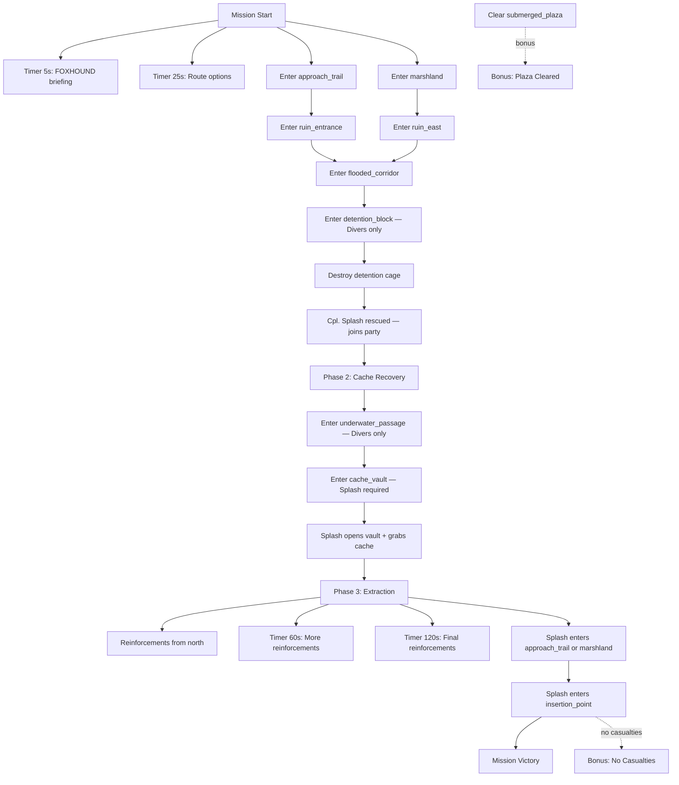

# Mission 2-4: THE UNDERWATER CACHE

## Header
- **ID**: `mission_8`
- **Chapter**: 2 — Deep Operations
- **Map**: 128x128 tiles (4096x4096px)
- **Setting**: Flooded ruins of an ancient otter settlement at the edge of the Copper-Silt delta. Rising water has submerged half the map — crumbling stone walls and collapsed arches sit beneath murky green water. Cpl. Splash was captured during a solo recon dive and is being held in a submerged Scale-Guard detention cage deep in the ruins. OEF must infiltrate the flooded zone, rescue Splash, and then recover a hidden munitions cache from a sealed underwater vault. Partial commando mission — small force, no base building, water specialists required.
- **Win**: Rescue Cpl. Splash AND recover the munitions cache
- **Lose**: All units killed OR Cpl. Splash killed (after rescue)
- **Par Time**: 16 minutes
- **Unlocks**: Cpl. Splash (hero unit — water specialist: invisible while submerged, +50% swim speed, reveals submerged objects, bonus damage vs water structures)

## Zone Map
```
    0         32        64        96       128
  0 |---------|---------|---------|---------|
    | deep_ruins_north                      |
    |  (fully submerged, ancient arches,    |
    |   Scale-Guard underwater patrols)     |
 20 |---------|---------|---------|---------|
    | detention_  | submerged_plaza          |
    |  block      | (flooded courtyard,     |
    | (Splash     |  debris, Scale-Guard    |
    |  held here) |  cage drones)           |
 40 |---------|---------|---------|---------|
    | underwater_ | cache_vault             |
    |  passage    | (sealed underwater      |
    | (connecting |  munitions vault —      |
    |  tunnel)    |  Phase 2 objective)     |
 56 |---------|---------|---------|---------|
    | flooded_corridor (partially submerged |
    |  — wade-depth, mixed terrain)         |
 68 |---------|---------|---------|---------|
    | ruin_entrance     | ruin_east         |
    | (half-submerged   | (collapsed wall,  |
    |  gateway, enemy   |  alternate route, |
    |  checkpoint)      |  patrols)         |
 84 |---------|---------|---------|---------|
    | approach_trail    | marshland         |
    | (jungle path to   | (shallow water,   |
    |  ruins)           |  mangrove cover)  |
100 |---------|---------|---------|---------|
    | insertion_point                       |
    |  (player start — commando, no lodge)  |
    |                                       |
116 |---------|---------|---------|---------|
    | river_south (southern river, evac)    |
    |                                       |
128 |---------|---------|---------|---------|
```

## Zones (tile coordinates)
```typescript
zones: {
  insertion_point:   { x: 16, y: 100, width: 96,  height: 16 },
  river_south:       { x: 0,  y: 116, width: 128, height: 12 },
  approach_trail:    { x: 8,  y: 84,  width: 48,  height: 16 },
  marshland:         { x: 64, y: 84,  width: 56,  height: 16 },
  ruin_entrance:     { x: 8,  y: 68,  width: 48,  height: 16 },
  ruin_east:         { x: 64, y: 68,  width: 52,  height: 16 },
  flooded_corridor:  { x: 0,  y: 56,  width: 128, height: 12 },
  underwater_passage:{ x: 8,  y: 40,  width: 40,  height: 16 },
  cache_vault:       { x: 56, y: 40,  width: 48,  height: 16 },
  detention_block:   { x: 8,  y: 20,  width: 40,  height: 20 },
  submerged_plaza:   { x: 56, y: 20,  width: 64,  height: 20 },
  deep_ruins_north:  { x: 0,  y: 0,   width: 128, height: 20 },
}
```

## Terrain Regions
```typescript
terrain: {
  width: 128, height: 128,
  regions: [
    { terrainId: "grass", fill: true },
    // Insertion point (jungle clearing)
    { terrainId: "dirt", rect: { x: 20, y: 104, w: 88, h: 8 } },
    { terrainId: "mangrove", rect: { x: 8, y: 100, w: 16, h: 16 } },
    { terrainId: "mangrove", rect: { x: 104, y: 100, w: 20, h: 12 } },
    // River south
    { terrainId: "water", river: {
      points: [[0,122],[32,120],[64,124],[96,120],[128,122]],
      width: 8
    }},
    // Approach trail (jungle path)
    { terrainId: "dirt", rect: { x: 20, y: 86, w: 24, h: 12 } },
    { terrainId: "mangrove", rect: { x: 8, y: 84, w: 12, h: 16 } },
    { terrainId: "mangrove", rect: { x: 44, y: 88, w: 12, h: 8 } },
    // Marshland (shallow water + mangrove)
    { terrainId: "shallow_water", rect: { x: 68, y: 86, w: 48, h: 12 } },
    { terrainId: "mangrove", circle: { cx: 80, cy: 90, r: 6 } },
    { terrainId: "mangrove", circle: { cx: 100, cy: 92, r: 5 } },
    { terrainId: "mud", circle: { cx: 88, cy: 94, r: 4 } },
    // Ruin entrance (half-submerged stone)
    { terrainId: "stone", rect: { x: 12, y: 70, w: 40, h: 12 } },
    { terrainId: "shallow_water", rect: { x: 12, y: 76, w: 40, h: 6 } },
    // Ruin east (collapsed walls)
    { terrainId: "stone", rect: { x: 68, y: 70, w: 44, h: 12 } },
    { terrainId: "shallow_water", rect: { x: 76, y: 74, w: 32, h: 8 } },
    // Flooded corridor (wade-depth throughout)
    { terrainId: "shallow_water", rect: { x: 0, y: 56, w: 128, h: 12 } },
    { terrainId: "stone", rect: { x: 16, y: 58, w: 8, h: 8 } }, // ruined pillar
    { terrainId: "stone", rect: { x: 56, y: 60, w: 8, h: 6 } }, // ruined arch
    { terrainId: "stone", rect: { x: 96, y: 58, w: 8, h: 8 } }, // ruined wall
    // Underwater passage (fully submerged tunnel)
    { terrainId: "deep_water", rect: { x: 12, y: 42, w: 32, h: 12 } },
    { terrainId: "stone", rect: { x: 8, y: 40, w: 4, h: 16 } }, // tunnel wall
    { terrainId: "stone", rect: { x: 44, y: 40, w: 4, h: 16 } }, // tunnel wall
    // Cache vault (submerged, sealed)
    { terrainId: "deep_water", rect: { x: 60, y: 42, w: 40, h: 12 } },
    { terrainId: "stone", rect: { x: 56, y: 40, w: 4, h: 16 } }, // vault wall
    { terrainId: "stone", rect: { x: 100, y: 40, w: 4, h: 16 } }, // vault wall
    // Detention block (fully submerged)
    { terrainId: "deep_water", rect: { x: 12, y: 22, w: 32, h: 16 } },
    { terrainId: "stone", rect: { x: 8, y: 20, w: 4, h: 20 } }, // wall
    { terrainId: "stone", rect: { x: 44, y: 20, w: 4, h: 20 } }, // wall
    // Submerged plaza (fully submerged)
    { terrainId: "deep_water", rect: { x: 60, y: 22, w: 56, h: 16 } },
    { terrainId: "stone", circle: { cx: 80, cy: 28, r: 4 } }, // collapsed statue
    { terrainId: "stone", circle: { cx: 100, cy: 32, r: 3 } }, // debris pile
    // Deep ruins north (fully submerged)
    { terrainId: "deep_water", rect: { x: 4, y: 2, w: 120, h: 16 } },
    { terrainId: "stone", rect: { x: 24, y: 4, w: 8, h: 8 } }, // ancient arch
    { terrainId: "stone", rect: { x: 64, y: 6, w: 12, h: 6 } }, // collapsed dome
    { terrainId: "stone", rect: { x: 96, y: 4, w: 8, h: 8 } }, // ruined column
  ],
  overrides: []
}
```

## Placements

### Player (insertion_point)
```typescript
// NO LODGE — Commando mission
// Small strike force
{ type: "mudfoot", faction: "ura", x: 40, y: 106 },
{ type: "mudfoot", faction: "ura", x: 44, y: 108 },
{ type: "mudfoot", faction: "ura", x: 48, y: 106 },
// Water specialists
{ type: "diver", faction: "ura", x: 56, y: 108 },
{ type: "diver", faction: "ura", x: 60, y: 106 },
{ type: "diver", faction: "ura", x: 64, y: 108 },
// Raftsman for transport
{ type: "raftsman", faction: "ura", x: 72, y: 106 },
```

### Resources
```typescript
// Salvage (ruin entrance rubble — limited field supplies)
{ type: "salvage_cache", faction: "neutral", x: 20, y: 72 },
{ type: "salvage_cache", faction: "neutral", x: 36, y: 74 },
// Salvage (ruin east debris)
{ type: "salvage_cache", faction: "neutral", x: 76, y: 72 },
{ type: "salvage_cache", faction: "neutral", x: 92, y: 70 },
// Munitions cache (Phase 2 objective — large, requires Divers to access)
{ type: "munitions_cache", faction: "neutral", x: 80, y: 48 },
```

### Enemies
```typescript
// --- Approach trail (light patrol) ---
{ type: "skink", faction: "scale_guard", x: 32, y: 88 },
{ type: "skink", faction: "scale_guard", x: 40, y: 86 },

// --- Marshland patrol ---
{ type: "gator", faction: "scale_guard", x: 84, y: 88 },
{ type: "skink", faction: "scale_guard", x: 96, y: 86 },

// --- Ruin entrance checkpoint ---
{ type: "gator", faction: "scale_guard", x: 24, y: 72 },
{ type: "gator", faction: "scale_guard", x: 32, y: 74 },
{ type: "gator", faction: "scale_guard", x: 40, y: 72 },
{ type: "watchtower", faction: "scale_guard", x: 36, y: 68 },

// --- Ruin east (alternate route guards) ---
{ type: "gator", faction: "scale_guard", x: 76, y: 74 },
{ type: "gator", faction: "scale_guard", x: 88, y: 72 },
{ type: "viper", faction: "scale_guard", x: 100, y: 70 },

// --- Flooded corridor (underwater patrol) ---
{ type: "gator", faction: "scale_guard", x: 28, y: 60 },
{ type: "gator", faction: "scale_guard", x: 64, y: 62 },
{ type: "skink", faction: "scale_guard", x: 100, y: 58 },

// --- Submerged plaza (cage drones + guards) ---
{ type: "cage_drone", faction: "scale_guard", x: 72, y: 28 },
{ type: "cage_drone", faction: "scale_guard", x: 92, y: 30 },
{ type: "gator", faction: "scale_guard", x: 80, y: 24 },
{ type: "gator", faction: "scale_guard", x: 96, y: 26 },
{ type: "viper", faction: "scale_guard", x: 88, y: 22 },

// --- Detention block (Splash's prison) ---
{ type: "detention_cage", faction: "scale_guard", x: 28, y: 28 },
{ type: "gator", faction: "scale_guard", x: 20, y: 26 },
{ type: "gator", faction: "scale_guard", x: 36, y: 26 },
{ type: "gator", faction: "scale_guard", x: 28, y: 34 },

// --- Deep ruins north (patrolling heavies) ---
{ type: "gator", faction: "scale_guard", x: 32, y: 8 },
{ type: "gator", faction: "scale_guard", x: 56, y: 10 },
{ type: "croc_champion", faction: "scale_guard", x: 80, y: 8 },
{ type: "viper", faction: "scale_guard", x: 108, y: 6 },
```

## Phases

### Phase 1: INFILTRATION (0:00 - ~8:00)
**Entry**: Mission start
**State**: No lodge (commando mission). 3 Mudfoots, 3 Divers, 1 Raftsman. No resource stockpile — field salvage only. Only insertion_point, approach_trail, and marshland visible.
**Objectives**:
- "Locate and rescue Cpl. Splash" (PRIMARY)
- "Keep your squad alive — no reinforcements" (ONGOING — informational)

**Triggers**:
```
[0:05] foxhound-briefing
  Condition: timer(5)
  Action: exchange([
    { speaker: "FOXHOUND", text: "Captain, Cpl. Splash was captured three days ago during a recon dive. He's being held in a flooded ruin complex ahead — an old otter settlement, now mostly underwater." },
    { speaker: "Col. Bubbles", text: "This is a commando operation. No lodge, no reinforcements. You have three Mudfoots for land combat, three Divers for the submerged zones, and a Raftsman for water transport." },
    { speaker: "FOXHOUND", text: "The ruins are layered. Surface level is wade-depth — your Mudfoots can handle it. But the deeper sections? Only Divers can operate down there. Splash is somewhere in the submerged detention block." }
  ])

[0:25] foxhound-routes
  Condition: timer(25)
  Action: exchange([
    { speaker: "FOXHOUND", text: "Two approaches to the ruins. Direct path through the jungle trail hits a Scale-Guard checkpoint at the main entrance — a Watchtower and three Gators." },
    { speaker: "FOXHOUND", text: "Or you can loop through the marshland to the east. Softer defenses but the terrain is slow — shallow water and mangrove. Your Divers can move faster through it than Mudfoots." }
  ])

approach-trail-entry
  Condition: areaEntered("ura", "approach_trail")
  Action: dialogue("foxhound", "Approach trail. Scale-Guard scouts ahead — two Skinks. Eliminate them quietly before they raise an alarm.")

marshland-entry
  Condition: areaEntered("ura", "marshland")
  Action: dialogue("foxhound", "Marshland approach. Gator patrol and a Skink scout in the shallows. Your Divers can slip past submerged if you don't want a fight.")

ruin-entrance-approach
  Condition: areaEntered("ura", "ruin_entrance")
  Action: exchange([
    { speaker: "FOXHOUND", text: "Ruin entrance. Scale-Guard checkpoint — watchtower and Gator guards. This is the front door." },
    { speaker: "Col. Bubbles", text: "You can fight through or find another way in. The eastern ruins have a collapsed wall gap." }
  ])

ruin-east-approach
  Condition: areaEntered("ura", "ruin_east")
  Action: dialogue("foxhound", "Eastern ruins. Collapsed wall section gives access to the flooded interior. Gators and a Viper on guard — fewer than the front gate, but that Viper hits hard.")

flooded-corridor-entry
  Condition: areaEntered("ura", "flooded_corridor")
  Action: exchange([
    { speaker: "FOXHOUND", text: "You're in the flooded corridor. Wade-depth here — Mudfoots can still fight but movement is slowed. Gators patrolling ahead." },
    { speaker: "Col. Bubbles", text: "The detention block is northwest, deeper down. Send your Divers ahead to scout — they move faster in water and they're invisible while submerged." }
  ])

detention-block-entry
  Condition: areaEntered("ura", "detention_block", { unitType: "diver" })
  Action: exchange([
    { speaker: "FOXHOUND", text: "Detention block located. Splash's cage is at the center — three Gator guards, fully submerged zone." },
    { speaker: "Col. Bubbles", text: "Clear those guards and break the cage. Only Divers can fight down here." }
  ])

detention-block-no-diver
  Condition: areaEntered("ura", "detention_block", { unitType: "mudfoot" })
  Action: dialogue("foxhound", "Captain, Mudfoots can't operate at this depth. Pull them back — you need Divers for this zone.")

splash-rescued
  Condition: buildingCount("scale_guard", "detention_cage", "eq", 0)
  Action: [
    completeObjective("rescue-splash"),
    spawnHero("cpl_splash", "ura", 28, 28),
    exchange([
      { speaker: "Cpl. Splash", text: "Captain! I knew OEF wouldn't leave me down here. Those Scale-Guard don't know the first thing about underwater ops — they just know how to lock cages." },
      { speaker: "Col. Bubbles", text: "Good to hear your voice, Splash. But we're not done — FOXHOUND has a secondary objective." },
      { speaker: "FOXHOUND", text: "Captain, our original intel was right. There's a munitions cache sealed in an underwater vault southeast of Splash's position. Pre-war OEF stockpile. We need it." }
    ]),
    revealZone("cache_vault"),
    revealZone("underwater_passage"),
    startPhase("cache-recovery")
  ]
```

### Phase 2: CACHE RECOVERY (~8:00 - ~14:00)
**Entry**: Cpl. Splash rescued
**State**: Splash joins as controllable hero unit (full HP, Diver abilities + enhanced vision that reveals submerged objects and hidden paths). Cache vault revealed on map.
**New objectives**:
- "Recover the munitions cache from the underwater vault" (PRIMARY)
- "Escort Splash and the cache to the extraction point" (PRIMARY — activates after cache recovered)

**Triggers**:
```
phase2-briefing
  Condition: enableTrigger (fired by splash-rescued)
  Action: exchange([
    { speaker: "Cpl. Splash", text: "The vault? I saw it during my recon dive before they nabbed me. Southeast, through the underwater passage. The passage is tight — Divers only." },
    { speaker: "FOXHOUND", text: "Splash's enhanced sonar can reveal the vault seal. He has to be part of the dive team that enters the vault." },
    { speaker: "Col. Bubbles", text: "Send Splash and your Divers through the underwater passage. Mudfoots hold the corridor against counterattack." }
  ])

splash-ability-hint
  Condition: timer(10) after splash-rescued
  Action: dialogue("foxhound", "Captain, Splash has a passive reveal ability — he can detect submerged objects and hidden passages that your other Divers can't see. Keep him close to the dive team.")

underwater-passage-entry
  Condition: areaEntered("ura", "underwater_passage", { unitType: "diver" })
  Action: dialogue("foxhound", "Underwater passage. Tight and dark — but no enemy patrols inside. Move through to the vault.")

underwater-passage-blocked
  Condition: areaEntered("ura", "underwater_passage", { unitType: "mudfoot" })
  Action: dialogue("foxhound", "Fully submerged passage, Captain. Divers only. Mudfoots will drown in there.")

cache-vault-entry
  Condition: areaEntered("ura", "cache_vault", { unitType: "cpl_splash" })
  Action: exchange([
    { speaker: "Cpl. Splash", text: "There's the vault seal. Give me a moment... got it. Old OEF cipher lock — still works." },
    { speaker: "FOXHOUND", text: "Vault is open. The munitions cache is inside. Splash, grab it." }
  ])

cache-vault-no-splash
  Condition: areaEntered("ura", "cache_vault") AND NOT unitPresent("cpl_splash", "cache_vault")
  Action: dialogue("foxhound", "Captain, the vault seal requires Splash's sonar to open. He needs to be here personally.")

cache-recovered
  Condition: objectInteracted("cpl_splash", "munitions_cache")
  Action: [
    completeObjective("recover-cache"),
    exchange([
      { speaker: "Cpl. Splash", text: "Cache secured! Full crate of pre-war munitions. Heavy, but I can carry it. Let's move." },
      { speaker: "Col. Bubbles", text: "Outstanding. Now get everyone to the extraction point — south bank, near where you inserted. Move fast." },
      { speaker: "FOXHOUND", text: "Be advised — Scale-Guard knows something's wrong. Reinforcements entering the ruins from the north." }
    ]),
    spawn("gator", "scale_guard", 20, 4, 3),
    spawn("gator", "scale_guard", 60, 6, 2),
    spawn("viper", "scale_guard", 40, 8, 1),
    spawn("croc_champion", "scale_guard", 80, 4, 1),
    startPhase("extraction")
  ]
```

### Phase 3: EXTRACTION (~14:00+)
**Entry**: Munitions cache recovered
**State**: Splash carries the cache (movement speed reduced by 30%). Enemy reinforcements flooding in from deep_ruins_north. Player must escort Splash back through the ruins to insertion_point.
**New objectives**:
- "Get Cpl. Splash to the extraction point" (PRIMARY)

**Triggers**:
```
phase3-briefing
  Condition: enableTrigger (fired by cache-recovered)
  Action: exchange([
    { speaker: "FOXHOUND", text: "Enemy reinforcements in the deep ruins — a Croc Champion leading Gators and a Viper. They're pushing south through the submerged plaza." },
    { speaker: "Col. Bubbles", text: "Splash is weighed down with that cache. He can still swim but he's slower. Cover him. Get to the extraction point." }
  ])

flooded-corridor-return
  Condition: areaEntered("cpl_splash", "flooded_corridor")
  Action: dialogue("foxhound", "Splash is in the flooded corridor. Hostiles may still be in the area — clear a path.")

[phase3 + 60s] second-reinforcement
  Condition: timer(60) after cache-recovered
  Action: [
    spawn("gator", "scale_guard", 100, 10, 3),
    spawn("skink", "scale_guard", 112, 8, 2),
    dialogue("foxhound", "More Scale-Guard from the north! They're flooding the ruins. Keep moving, Captain.")
  ]

[phase3 + 120s] third-reinforcement
  Condition: timer(120) after cache-recovered
  Action: [
    spawn("gator", "scale_guard", 48, 6, 2),
    spawn("croc_champion", "scale_guard", 32, 4, 1),
    dialogue("col_bubbles", "They're coming hard now! Almost there — push through!")
  ]

ruin-exit
  Condition: areaEntered("cpl_splash", "approach_trail") OR areaEntered("cpl_splash", "marshland")
  Action: dialogue("foxhound", "Splash is clear of the ruins. Extraction point ahead — just a short run south.")

splash-extracted
  Condition: areaEntered("cpl_splash", "insertion_point")
  Action: [
    completeObjective("extract-splash")
  ]

mission-complete
  Condition: allPrimaryComplete()
  Action: exchange([
    { speaker: "Cpl. Splash", text: "We made it, Captain. Cache intact, all fingers and toes accounted for. Those ruins were something — I want to go back when there aren't Scale-Guard trying to kill me." },
    { speaker: "Col. Bubbles", text: "Splash is safe and we've recovered a full pre-war munitions stockpile. That's a mission and a half, Captain." },
    { speaker: "Gen. Whiskers", text: "Corporal Splash is one of our best. And those munitions will arm the next phase of the campaign. Deep Operations complete, Captain — you've proven this force can operate anywhere: land, river, and underwater. Outstanding. HQ out." }
  ], followed by: victory())
```

### Bonus Objective
```
no-casualties
  Condition: allPrimaryComplete() AND unitsLost("ura", "eq", 0)
  Action: [
    completeObjective("bonus-no-casualties"),
    dialogue("gen_whiskers", "Not a single operative lost. In a commando mission through flooded enemy territory. That's the kind of precision that wins wars, Captain.")
  ]

submerged-plaza-cleared
  Condition: enemyCount("scale_guard", "submerged_plaza", "eq", 0)
  Action: [
    completeObjective("bonus-plaza-cleared"),
    dialogue("foxhound", "Submerged plaza cleared. That opens a faster route for future operations in this area. Additional salvage recovered from the debris.")
  ]
```

## Trigger Flowchart


## Balance Notes
- **No lodge, no production**: This is a fixed-force commando mission. 7 units total. Every unit lost is permanent for the mission. Player must manage HP carefully.
- **Unit roles**:
  - Mudfoots (3): Land/shallow water combat. Cannot enter deep_water zones. Hold chokepoints and provide covering fire.
  - Divers (3): Full underwater capability. Invisible while submerged. Required for detention_block, underwater_passage, and cache_vault. Fragile on land (60% HP of Mudfoot).
  - Raftsman (1): Water transport. Can ferry Mudfoots across deep water zones on a raft. Not a strong combatant.
  - Cpl. Splash (hero, after rescue): Elite Diver. Full underwater ops + sonar reveal + bonus damage vs water structures. Required to open cache vault. Slower when carrying cache.
- **Deep water**: deep_water tiles are impassable to Mudfoots/Raftsman (on foot). Only Divers and Splash can traverse them. Raftsman can build a raft to carry Mudfoots over deep water.
- **Shallow water**: shallow_water tiles slow all ground units by 30%. Divers move at normal speed. Good for Diver flanking.
- **Route choice**: West approach (trail + entrance) has a watchtower chokepoint but is direct. East approach (marshland + ruin_east) has a Viper but avoids the watchtower. Both converge at flooded_corridor.
- **Detention block**: Fully submerged. 3 Gator guards. Divers must clear them alone (3v3, but Divers have stealth advantage for first strike).
- **Cache vault**: Splash must be present to open the seal. If Splash is left behind or if non-Diver units attempt entry, they receive warnings.
- **Extraction pressure**: After cache is recovered, reinforcements spawn from the north every 60 seconds. Splash is slowed by 30% while carrying the cache. Player must fight rearguard while retreating south.
- **Enemy scaling** (difficulty):
  - Support: Reduce all patrol counts by 1. No reinforcements during extraction. Detention block has 2 guards.
  - Tactical: As written.
  - Elite: +1 Gator at each checkpoint. Detention block adds a Viper. Extraction reinforcements include 2 Croc Champions total. Splash is slowed 40% instead of 30%.
- **Par time**: 16 minutes on Tactical — fast for a mission with no production, emphasizing tactical movement over base-building
