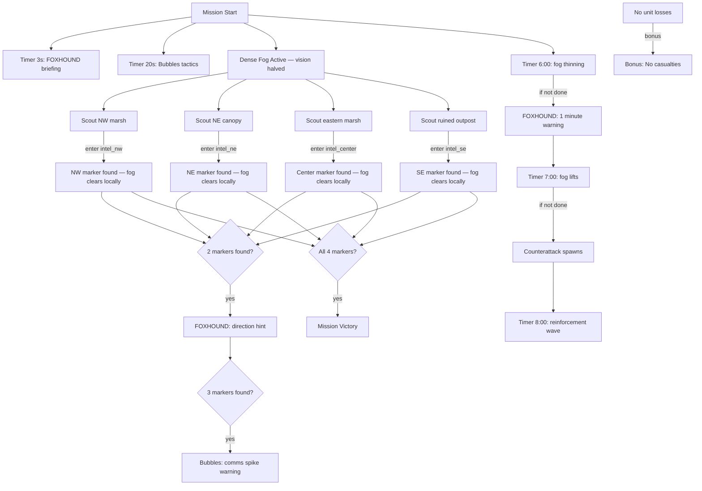

# Mission 3-1: DENSE CANOPY

## Header
- **ID**: `mission_9`
- **Chapter**: 3 — Turning Tide
- **Map**: 128x128 tiles (4096x4096px)
- **Setting**: Deep Blackmarsh interior. Dense mangrove canopy blocks aerial observation. Thick fog blankets the marsh floor. Waterlogged terrain forces narrow paths between mud flats and flooded gullies. Scale-Guard patrols move through the haze on fixed routes.
- **Win**: Discover all 4 intel markers
- **Lose**: All units killed (commando rules — no lodge)
- **Par Time**: 12 minutes
- **Unlocks**: Intel Marker system (fog reveal mechanic), Diver unit availability

## Zone Map
```
    0         32        64        96       128
  0 |---------|---------|---------|---------|
    | marsh_nw          | marsh_ne          |
    | (flooded mangrove)| (dense canopy)    |
    |  ★ INTEL-NW       |   ★ INTEL-NE      |
 16 |                   |                   |
    |---------|---------|---------|---------|
 24 | deep_marsh_west   | central_clearing  |
    | (mud flats,       | (open ground,     |
    |  waterlogged)     |  enemy patrol hub)|
 40 |                   |                   |
    |---------|---------|---------|---------|
 48 | gully_south       | marsh_east        |
    | (flooded ravine)  | (mangrove grove)  |
    |                   |  ★ INTEL-CENTER   |
 64 |---------|---------|---------|---------|
    | swamp_south       | ★ INTEL-SE        |
    | (thick mud,       | (ruined outpost)  |
    |  slow movement)   |                   |
 80 |---------|---------|---------|---------|
    | jungle_buffer     | jungle_buffer_e   |
    | (light cover)     | (light cover)     |
 96 |---------|---------|---------|---------|
    | staging_area_w    | staging_area_e    |
    | (mangrove edge)   | (open marsh)      |
112 |---------|---------|---------|---------|
    | landing_zone                          |
    | (player start — southern marsh edge)  |
128 |---------|---------|---------|---------|
```

## Zones (tile coordinates)
```typescript
zones: {
  landing_zone:      { x: 24, y: 112, width: 80, height: 16 },
  staging_area_w:    { x: 8,  y: 96,  width: 48, height: 16 },
  staging_area_e:    { x: 64, y: 96,  width: 56, height: 16 },
  jungle_buffer:     { x: 0,  y: 80,  width: 128, height: 16 },
  swamp_south:       { x: 0,  y: 64,  width: 64, height: 16 },
  gully_south:       { x: 0,  y: 48,  width: 64, height: 16 },
  marsh_east:        { x: 64, y: 48,  width: 64, height: 16 },
  deep_marsh_west:   { x: 0,  y: 24,  width: 64, height: 24 },
  central_clearing:  { x: 64, y: 24,  width: 64, height: 24 },
  marsh_nw:          { x: 0,  y: 0,   width: 64, height: 24 },
  marsh_ne:          { x: 64, y: 0,   width: 64, height: 24 },
  intel_nw:          { x: 16, y: 6,   width: 8,  height: 8 },
  intel_ne:          { x: 96, y: 8,   width: 8,  height: 8 },
  intel_center:      { x: 88, y: 52,  width: 8,  height: 8 },
  intel_se:          { x: 80, y: 68,  width: 8,  height: 8 },
}
```

## Terrain Regions
```typescript
terrain: {
  width: 128, height: 128,
  regions: [
    { terrainId: "grass", fill: true },
    // Dense mangrove canopy — NW quadrant
    { terrainId: "mangrove", rect: { x: 0, y: 0, w: 60, h: 24 } },
    { terrainId: "mangrove", rect: { x: 68, y: 0, w: 60, h: 20 } },
    // Flooded gullies (impassable water channels)
    { terrainId: "water", river: {
      points: [[0,36],[20,34],[40,38],[60,35],[80,32],[100,36],[128,34]],
      width: 4
    }},
    { terrainId: "water", river: {
      points: [[0,56],[16,54],[32,58],[48,52],[64,56],[80,54],[96,58],[128,56]],
      width: 3
    }},
    // Waterlogged pools
    { terrainId: "water", circle: { cx: 20, cy: 10, r: 6 } },
    { terrainId: "water", circle: { cx: 100, cy: 12, r: 5 } },
    { terrainId: "water", circle: { cx: 50, cy: 50, r: 4 } },
    { terrainId: "water", circle: { cx: 90, cy: 60, r: 3 } },
    // Mud flats (slow movement)
    { terrainId: "mud", rect: { x: 0, y: 24, w: 64, h: 24 } },
    { terrainId: "mud", rect: { x: 0, y: 64, w: 64, h: 16 } },
    { terrainId: "mud", circle: { cx: 32, cy: 80, r: 8 } },
    { terrainId: "mud", circle: { cx: 96, cy: 40, r: 6 } },
    { terrainId: "mud", circle: { cx: 40, cy: 100, r: 5 } },
    // Mangrove corridors (concealment routes)
    { terrainId: "mangrove", rect: { x: 0, y: 48, w: 12, h: 20 } },
    { terrainId: "mangrove", rect: { x: 64, y: 48, w: 60, h: 16 } },
    { terrainId: "mangrove", rect: { x: 56, y: 24, w: 8, h: 48 } },
    { terrainId: "mangrove", circle: { cx: 110, cy: 30, r: 8 } },
    // Central clearing (patrol hub — exposed)
    { terrainId: "dirt", rect: { x: 72, y: 28, w: 24, h: 16 } },
    // Ruined outpost (SE intel location)
    { terrainId: "dirt", rect: { x: 78, y: 66, w: 16, h: 12 } },
    // Staging area
    { terrainId: "dirt", rect: { x: 32, y: 112, w: 64, h: 16 } },
    // Jungle buffer (light cover transition)
    { terrainId: "mangrove", rect: { x: 8, y: 80, w: 20, h: 12 } },
    { terrainId: "mangrove", rect: { x: 100, y: 84, w: 20, h: 8 } },
    // Narrow passable land bridges over gullies
    { terrainId: "dirt", rect: { x: 28, y: 34, w: 4, h: 8 } },
    { terrainId: "dirt", rect: { x: 76, y: 32, w: 4, h: 6 } },
    { terrainId: "dirt", rect: { x: 44, y: 52, w: 4, h: 8 } },
    { terrainId: "dirt", rect: { x: 112, y: 54, w: 4, h: 6 } },
  ],
  overrides: []
}
```

## Placements

### Player (landing_zone)
```typescript
// No lodge — commando mission
// Strike team: 4 Mudfoots, 3 Divers (scouts), 2 Shellcrackers
{ type: "mudfoot", faction: "ura", x: 52, y: 118 },
{ type: "mudfoot", faction: "ura", x: 56, y: 120 },
{ type: "mudfoot", faction: "ura", x: 60, y: 118 },
{ type: "mudfoot", faction: "ura", x: 64, y: 120 },
{ type: "diver", faction: "ura", x: 48, y: 122 },
{ type: "diver", faction: "ura", x: 58, y: 122 },
{ type: "diver", faction: "ura", x: 68, y: 122 },
{ type: "shellcracker", faction: "ura", x: 54, y: 124 },
{ type: "shellcracker", faction: "ura", x: 62, y: 124 },
```

### Intel Markers
```typescript
{ type: "intel_marker", faction: "neutral", x: 20, y: 10 },
{ type: "intel_marker", faction: "neutral", x: 100, y: 12 },
{ type: "intel_marker", faction: "neutral", x: 92, y: 56 },
{ type: "intel_marker", faction: "neutral", x: 84, y: 72 },
```

### Enemies
```typescript
// Patrol Route Alpha — NW corridor (2 Scout Lizards, looping)
{ type: "scout_lizard", faction: "scale_guard", x: 24, y: 18,
  patrol: [[24,18],[40,18],[40,30],[24,30],[24,18]] },
{ type: "scout_lizard", faction: "scale_guard", x: 28, y: 18,
  patrol: [[28,18],[44,18],[44,30],[28,30],[28,18]] },

// Patrol Route Bravo — central clearing perimeter (3 Gators)
{ type: "gator", faction: "scale_guard", x: 76, y: 30,
  patrol: [[76,30],[92,30],[92,42],[76,42],[76,30]] },
{ type: "gator", faction: "scale_guard", x: 80, y: 32,
  patrol: [[80,32],[96,32],[96,40],[80,40],[80,32]] },
{ type: "gator", faction: "scale_guard", x: 84, y: 34 },

// Intel NW guards (2 Gators, stationary ambush)
{ type: "gator", faction: "scale_guard", x: 18, y: 8 },
{ type: "gator", faction: "scale_guard", x: 22, y: 12 },

// Intel NE guards (2 Gators + 1 Viper)
{ type: "gator", faction: "scale_guard", x: 98, y: 10 },
{ type: "gator", faction: "scale_guard", x: 102, y: 14 },
{ type: "viper", faction: "scale_guard", x: 96, y: 6 },

// Patrol Route Charlie — eastern marsh (2 Scout Lizards, wide sweep)
{ type: "scout_lizard", faction: "scale_guard", x: 100, y: 48,
  patrol: [[100,48],[120,48],[120,64],[100,64],[100,48]] },
{ type: "scout_lizard", faction: "scale_guard", x: 104, y: 52,
  patrol: [[104,52],[116,52],[116,60],[104,60],[104,52]] },

// Intel Center guards (1 Viper + 1 Snapper in mangrove)
{ type: "viper", faction: "scale_guard", x: 90, y: 54 },
{ type: "snapper", faction: "scale_guard", x: 94, y: 58 },

// Intel SE guards (ruined outpost — 3 Gators + 1 Viper)
{ type: "gator", faction: "scale_guard", x: 82, y: 70 },
{ type: "gator", faction: "scale_guard", x: 86, y: 74 },
{ type: "gator", faction: "scale_guard", x: 80, y: 68 },
{ type: "viper", faction: "scale_guard", x: 88, y: 72 },

// Deep marsh ambush (hidden in mud — 2 Gators)
{ type: "gator", faction: "scale_guard", x: 30, y: 40 },
{ type: "gator", faction: "scale_guard", x: 36, y: 44 },

// Southern gully watchers (1 Scout Lizard, patrolling)
{ type: "scout_lizard", faction: "scale_guard", x: 20, y: 56,
  patrol: [[20,56],[48,56],[48,60],[20,60],[20,56]] },
```

## Phases

### Phase 1: INTO THE FOG (0:00 - ~4:00)
**Entry**: Mission start
**State**: 9 units deployed at southern marsh edge. Dense fog limits vision to 3 tiles (half normal). Only landing_zone and staging_area visible. No base, no economy — pure recon.
**Objectives**:
- "Discover NW intel marker" (PRIMARY)
- "Discover NE intel marker" (PRIMARY)
- "Discover central intel marker" (PRIMARY)
- "Discover SE intel marker" (PRIMARY)

**Triggers**:
```
[0:03] foxhound-briefing
  Condition: timer(3)
  Action: dialogue("foxhound", "Fog's thick. Vision is halved for everyone — use that. Your Divers have better sight range, so put them on point.")

[0:20] bubbles-tactics
  Condition: timer(20)
  Action: exchange([
    { speaker: "Col. Bubbles", text: "Captain, four intel markers scattered across the Blackmarsh. Scale-Guard patrols are moving through the fog on fixed routes." },
    { speaker: "FOXHOUND", text: "Fog only clears permanently around discovered markers. Elsewhere, you're blind again the moment you leave. Split your forces — Divers forward, combat units trailing." },
    { speaker: "Col. Bubbles", text: "Avoid engagements where possible. You don't have reinforcements out here." }
  ])
```

### Phase 2: DEEP RECON (~4:00 - ~8:00)
**Entry**: First intel marker discovered
**State**: One fog pocket cleared permanently. Player now understands the reveal mechanic. Enemy patrols continue in fog.
**New context**: FOXHOUND provides directional hints toward remaining markers.

**Triggers**:
```
intel-nw-found
  Condition: areaEntered("ura", "intel_nw")
  Action: [
    completeObjective("discover-intel-nw"),
    revealFog("intel_nw", radius: 12),
    dialogue("foxhound", "Northwest marker found — Scale-Guard supply cache. Fog's clearing around the site. Three more to go.")
  ]

intel-ne-found
  Condition: areaEntered("ura", "intel_ne")
  Action: [
    completeObjective("discover-intel-ne"),
    revealFog("intel_ne", radius: 12),
    dialogue("foxhound", "Northeast marker located — that's a staging area. They're building up forces here. Fog lifting around the marker.")
  ]

intel-center-found
  Condition: areaEntered("ura", "intel_center")
  Action: [
    completeObjective("discover-intel-center"),
    revealFog("intel_center", radius: 12),
    dialogue("foxhound", "Central marker confirmed — communications relay. This is how they're coordinating patrols through the canopy.")
  ]

intel-se-found
  Condition: areaEntered("ura", "intel_se")
  Action: [
    completeObjective("discover-intel-se"),
    revealFog("intel_se", radius: 12),
    dialogue("foxhound", "Southeast marker identified — ammunition depot in the ruined outpost. That completes the picture.")
  ]

second-marker-hint
  Condition: objectiveCount("complete", "gte", 2)
  Action: dialogue("foxhound", "Two markers down. Remaining signals are pinging from the [direction of uncollected markers]. Stay sharp — patrols are tighter deeper in.")

third-marker-warning
  Condition: objectiveCount("complete", "gte", 3)
  Action: dialogue("col_bubbles", "One marker left. Scale-Guard comms traffic is spiking — they know someone's in the marsh. Find it fast, Captain.")
```

### Phase 3: FOG LIFTS (~6:00+ timer, or after all markers found)
**Entry**: Timer reaches 6:00 OR all markers found
**State**: Fog begins to thin. If markers remain undiscovered, patrols become alert and converge on player positions. If all markers found, this phase is skipped — straight to victory.

**Triggers**:
```
[6:00] fog-lifting-warning
  Condition: timer(360) AND NOT allPrimaryComplete()
  Action: dialogue("foxhound", "Fog's thinning. You have about a minute before full visibility. Finish your recon — they'll see you soon.")

[7:00] fog-lifted-counterattack
  Condition: timer(420) AND NOT allPrimaryComplete()
  Action: [
    dialogue("foxhound", "Fog's lifted — they can see you now! Scale-Guard is mobilizing from all sectors!"),
    spawn("gator", "scale_guard", 64, 4, 4),
    spawn("viper", "scale_guard", 4, 40, 3),
    spawn("scout_lizard", "scale_guard", 120, 48, 3),
    spawn("gator", "scale_guard", 80, 80, 3)
  ]

[8:00] reinforcement-wave-2
  Condition: timer(480) AND NOT allPrimaryComplete()
  Action: [
    dialogue("col_bubbles", "More contacts inbound! Get those last markers, Captain — we can't hold this position!"),
    spawn("gator", "scale_guard", 32, 8, 3),
    spawn("snapper", "scale_guard", 110, 30, 2),
    spawn("viper", "scale_guard", 60, 60, 2)
  ]
```

### Phase 4: EXTRACTION
**Entry**: All 4 markers discovered
**Triggers**:
```
mission-complete
  Condition: allPrimaryComplete()
  Action: exchange([
    { speaker: "FOXHOUND", text: "All four intel markers recovered. We have a complete map of their Blackmarsh positions. Outstanding recon, Captain." },
    { speaker: "Col. Bubbles", text: "Good work. We know where their fuel, staging, comms, and ammo are. That's everything we need for the next push. HQ out." }
  ], followed by: victory())
```

### Bonus Objective
```
no-losses
  Condition: allPrimaryComplete() AND unitCount("ura", "all", "eq", startingCount)
  Action: completeObjective("no-losses")
  Description: "Complete without losing any units"
```

## Trigger Flowchart


## Balance Notes
- **Starting resources**: 0/0/0 — no economy, pure tactical mission
- **Unit composition**: 4 Mudfoots (combat screen), 3 Divers (scout — 8-tile vision in fog vs 3-tile standard), 2 Shellcrackers (heavy hitters for emergencies)
- **Fog mechanic**: All units have vision reduced to 3 tiles. Divers retain 6 tiles. Fog re-covers explored area when units leave (standard fog of war behavior). Intel markers permanently reveal a 12-tile radius when discovered.
- **Enemy patrols**: Fixed routes, 2-tile vision in fog. Contact range is ~5 tiles. Player can shadow patrols if careful. Patrols do NOT pursue beyond their route zone.
- **Intel marker guards**: Each marker has 2-4 defenders. NW is lightest (2 Gators — tutorial introduction). SE is heaviest (3 Gators + 1 Viper).
- **Fog timer pressure**: At 6:00, fog thins. At 7:00, fog lifts and counterattack spawns. Player should aim to find all 4 markers before 7:00 on Tactical. This creates urgency without hard failure.
- **Enemy scaling** (difficulty):
  - Support: patrols have 1 fewer unit each, no ambush spawns in deep marsh, fog lifts at 8:00 instead of 7:00
  - Tactical: as written
  - Elite: patrols have 1 extra unit each, all markers guarded by +1 Viper, fog lifts at 5:30, counterattack waves are 50% larger
- **Par time**: 12 minutes on Tactical — allows cautious play with scout-ahead pattern
- **Intended feel**: Tense, atmospheric, fog-horror. Minimal combat if player uses Divers well. Punishing if player blunders into patrols. The fog is the real enemy.
