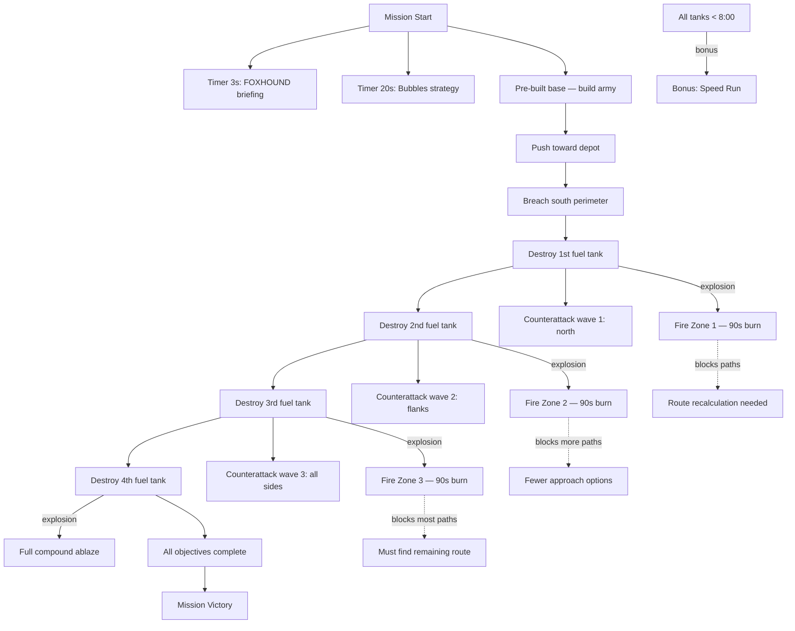

# Mission 3-2: SCORCHED EARTH

## Header
- **ID**: `mission_10`
- **Chapter**: 3 — Turning Tide
- **Map**: 128x128 tiles (4096x4096px)
- **Setting**: Scale-Guard central fuel depot deep in the Blackmarsh. Four massive fuel tanks feed the enemy's entire armored offensive. The compound sits in a cleared basin surrounded by mangrove thickets and oil-slick drainage channels. Approach roads from south and flanking routes through dense jungle on east and west.
- **Win**: Destroy all 4 fuel tanks
- **Lose**: Lodge destroyed
- **Par Time**: 15 minutes
- **Unlocks**: Terrain destruction capability (fire spread mechanic available in future missions)

## Zone Map
```
    0         32        64        96       128
  0 |---------|---------|---------|---------|
    | mangrove_nw       | mangrove_ne       |
    | (dense jungle     | (dense jungle     |
    |  concealment)     |  concealment)     |
 16 |---------|---------|---------|---------|
    | west_perimeter    | depot_north       |
    | (Venom Spires,    | (patrol route,    |
    |  watchtowers)     |  fuel pipes)      |
 24 |         |---------|---------|         |
    |         | TANK-NW | TANK-NE |         |
    |         | (fuel)  | (fuel)  |         |
 36 |         |---------|---------|         |
    | west    | depot_center      | east    |
    | approach| (oil slick,       | approach|
    |         |  central pipes)   |         |
 48 |         |---------|---------|         |
    |         | TANK-SW | TANK-SE |         |
    |         | (fuel)  | (fuel)  |         |
 56 |---------|---------|---------|---------|
    | south_perimeter                       |
    | (gate, defensive line)                |
 64 |---------|---------|---------|---------|
    | jungle_sw         | jungle_se         |
    | (mangrove,        | (mangrove,        |
    |  flank route)     |  flank route)     |
 80 |---------|---------|---------|---------|
    | approach_road_w   | approach_road_e   |
    |                   |                   |
 96 |---------|---------|---------|---------|
    | ura_base                              |
    | (pre-built base, lodge, production)   |
112 |---------|---------|---------|---------|
    | supply_line                           |
    | (resource nodes, fish, timber)        |
128 |---------|---------|---------|---------|
```

## Zones (tile coordinates)
```typescript
zones: {
  ura_base:          { x: 16, y: 96,  width: 96, height: 16 },
  supply_line:       { x: 8,  y: 112, width: 112, height: 16 },
  approach_road_w:   { x: 8,  y: 80,  width: 48, height: 16 },
  approach_road_e:   { x: 72, y: 80,  width: 48, height: 16 },
  jungle_sw:         { x: 0,  y: 64,  width: 56, height: 16 },
  jungle_se:         { x: 72, y: 64,  width: 56, height: 16 },
  south_perimeter:   { x: 16, y: 56,  width: 96, height: 8 },
  west_perimeter:    { x: 0,  y: 16,  width: 32, height: 48 },
  east_perimeter:    { x: 96, y: 16,  width: 32, height: 48 },
  depot_north:       { x: 32, y: 16,  width: 64, height: 12 },
  depot_center:      { x: 40, y: 36,  width: 48, height: 12 },
  tank_nw:           { x: 40, y: 24,  width: 20, height: 12 },
  tank_ne:           { x: 68, y: 24,  width: 20, height: 12 },
  tank_sw:           { x: 40, y: 48,  width: 20, height: 8 },
  tank_se:           { x: 68, y: 48,  width: 20, height: 8 },
  mangrove_nw:       { x: 0,  y: 0,   width: 56, height: 16 },
  mangrove_ne:       { x: 72, y: 0,   width: 56, height: 16 },
}
```

## Terrain Regions
```typescript
terrain: {
  width: 128, height: 128,
  regions: [
    { terrainId: "grass", fill: true },
    // Dense mangrove (north — concealment flanking routes)
    { terrainId: "mangrove", rect: { x: 0, y: 0, w: 56, h: 16 } },
    { terrainId: "mangrove", rect: { x: 72, y: 0, w: 56, h: 16 } },
    // Fuel depot compound (central basin)
    { terrainId: "dirt", rect: { x: 32, y: 16, w: 64, h: 48 } },
    // Oil slick hazard zones around fuel tanks (flammable terrain)
    { terrainId: "toxic_sludge", circle: { cx: 50, cy: 30, r: 6 } },
    { terrainId: "toxic_sludge", circle: { cx: 78, cy: 30, r: 6 } },
    { terrainId: "toxic_sludge", circle: { cx: 50, cy: 52, r: 6 } },
    { terrainId: "toxic_sludge", circle: { cx: 78, cy: 52, r: 6 } },
    // Oil drainage channel (connects tanks — chain reaction path)
    { terrainId: "toxic_sludge", rect: { x: 56, y: 28, w: 16, h: 4 } },
    { terrainId: "toxic_sludge", rect: { x: 48, y: 36, w: 4, h: 12 } },
    { terrainId: "toxic_sludge", rect: { x: 76, y: 36, w: 4, h: 12 } },
    { terrainId: "toxic_sludge", rect: { x: 56, y: 48, w: 16, h: 4 } },
    // Perimeter walls (destructible)
    { terrainId: "dirt", rect: { x: 30, y: 14, w: 68, h: 2 } },
    { terrainId: "dirt", rect: { x: 30, y: 56, w: 68, h: 2 } },
    // Approach roads
    { terrainId: "dirt", rect: { x: 56, y: 58, w: 16, h: 38 } },
    { terrainId: "dirt", rect: { x: 8, y: 30, w: 24, h: 4 } },
    { terrainId: "dirt", rect: { x: 96, y: 30, w: 24, h: 4 } },
    // Jungle flanking corridors
    { terrainId: "mangrove", rect: { x: 0, y: 64, w: 56, h: 16 } },
    { terrainId: "mangrove", rect: { x: 72, y: 64, w: 56, h: 16 } },
    { terrainId: "mangrove", rect: { x: 0, y: 16, w: 30, h: 48 } },
    { terrainId: "mangrove", rect: { x: 98, y: 16, w: 30, h: 48 } },
    // Player base area
    { terrainId: "dirt", rect: { x: 32, y: 96, w: 64, h: 16 } },
    // Resource areas
    { terrainId: "mud", rect: { x: 8, y: 116, w: 24, h: 8 } },
    { terrainId: "water", circle: { cx: 108, cy: 120, r: 6 } },
    // Mud patches (organic detail)
    { terrainId: "mud", circle: { cx: 20, cy: 40, r: 4 } },
    { terrainId: "mud", circle: { cx: 108, cy: 40, r: 4 } },
    { terrainId: "mud", circle: { cx: 64, cy: 80, r: 5 } },
  ],
  overrides: []
}
```

## Placements

### Player (ura_base)
```typescript
// Lodge
{ type: "burrow", faction: "ura", x: 64, y: 104 },
// Pre-built base
{ type: "command_post", faction: "ura", x: 56, y: 100 },
{ type: "barracks", faction: "ura", x: 48, y: 100 },
{ type: "armory", faction: "ura", x: 72, y: 100 },
// Starting army
{ type: "mudfoot", faction: "ura", x: 52, y: 98 },
{ type: "mudfoot", faction: "ura", x: 56, y: 96 },
{ type: "mudfoot", faction: "ura", x: 60, y: 98 },
{ type: "mudfoot", faction: "ura", x: 64, y: 96 },
{ type: "mudfoot", faction: "ura", x: 68, y: 98 },
{ type: "mudfoot", faction: "ura", x: 72, y: 96 },
{ type: "shellcracker", faction: "ura", x: 50, y: 102 },
{ type: "shellcracker", faction: "ura", x: 58, y: 102 },
{ type: "shellcracker", faction: "ura", x: 66, y: 102 },
{ type: "sapper", faction: "ura", x: 62, y: 104 },
{ type: "sapper", faction: "ura", x: 70, y: 104 },
// Workers
{ type: "river_rat", faction: "ura", x: 44, y: 106 },
{ type: "river_rat", faction: "ura", x: 48, y: 108 },
{ type: "river_rat", faction: "ura", x: 76, y: 106 },
```

### Resources
```typescript
// Timber (mangrove groves flanking base)
{ type: "mangrove_tree", faction: "neutral", x: 12, y: 86 },
{ type: "mangrove_tree", faction: "neutral", x: 18, y: 88 },
{ type: "mangrove_tree", faction: "neutral", x: 24, y: 84 },
{ type: "mangrove_tree", faction: "neutral", x: 108, y: 86 },
{ type: "mangrove_tree", faction: "neutral", x: 114, y: 88 },
// Fish
{ type: "fish_spot", faction: "neutral", x: 106, y: 120 },
{ type: "fish_spot", faction: "neutral", x: 112, y: 118 },
// Salvage (supply line)
{ type: "salvage_cache", faction: "neutral", x: 14, y: 118 },
{ type: "salvage_cache", faction: "neutral", x: 20, y: 122 },
{ type: "salvage_cache", faction: "neutral", x: 26, y: 120 },
```

### Enemies — Fuel Tanks
```typescript
// Four fuel tanks (primary objectives — destructible buildings)
{ type: "fuel_tank", faction: "scale_guard", x: 50, y: 30 },
{ type: "fuel_tank", faction: "scale_guard", x: 78, y: 30 },
{ type: "fuel_tank", faction: "scale_guard", x: 50, y: 52 },
{ type: "fuel_tank", faction: "scale_guard", x: 78, y: 52 },
```

### Enemies — Depot Garrison
```typescript
// Perimeter Venom Spires (4 towers covering approaches)
{ type: "venom_spire", faction: "scale_guard", x: 32, y: 16 },
{ type: "venom_spire", faction: "scale_guard", x: 94, y: 16 },
{ type: "venom_spire", faction: "scale_guard", x: 32, y: 56 },
{ type: "venom_spire", faction: "scale_guard", x: 94, y: 56 },

// Tank NW guards
{ type: "gator", faction: "scale_guard", x: 46, y: 26 },
{ type: "gator", faction: "scale_guard", x: 54, y: 34 },
{ type: "viper", faction: "scale_guard", x: 48, y: 30 },

// Tank NE guards
{ type: "gator", faction: "scale_guard", x: 74, y: 26 },
{ type: "gator", faction: "scale_guard", x: 82, y: 34 },
{ type: "viper", faction: "scale_guard", x: 80, y: 30 },

// Tank SW guards
{ type: "gator", faction: "scale_guard", x: 46, y: 50 },
{ type: "gator", faction: "scale_guard", x: 54, y: 54 },
{ type: "snapper", faction: "scale_guard", x: 50, y: 48 },

// Tank SE guards
{ type: "gator", faction: "scale_guard", x: 74, y: 50 },
{ type: "gator", faction: "scale_guard", x: 82, y: 54 },
{ type: "snapper", faction: "scale_guard", x: 78, y: 48 },

// Central depot patrol (looping through compound)
{ type: "scout_lizard", faction: "scale_guard", x: 56, y: 36,
  patrol: [[56,36],[72,36],[72,48],[56,48],[56,36]] },
{ type: "scout_lizard", faction: "scale_guard", x: 60, y: 40,
  patrol: [[60,40],[68,40],[68,44],[60,44],[60,40]] },

// South gate defenders
{ type: "gator", faction: "scale_guard", x: 56, y: 58, count: 2 },
{ type: "gator", faction: "scale_guard", x: 68, y: 58, count: 2 },
{ type: "viper", faction: "scale_guard", x: 62, y: 60 },

// North patrol
{ type: "gator", faction: "scale_guard", x: 48, y: 18,
  patrol: [[48,18],[80,18],[48,18]] },
{ type: "gator", faction: "scale_guard", x: 52, y: 20,
  patrol: [[52,20],[76,20],[52,20]] },
```

## Phases

### Phase 1: APPROACH (0:00 - ~5:00)
**Entry**: Mission start
**State**: Pre-built base with full production. Starting army of 6 Mudfoots, 3 Shellcrackers, 2 Sappers, 3 River Rats. 300 fish, 250 timber, 150 salvage.
**Objectives**:
- "Destroy NW fuel tank" (PRIMARY)
- "Destroy NE fuel tank" (PRIMARY)
- "Destroy SW fuel tank" (PRIMARY)
- "Destroy SE fuel tank" (PRIMARY)

**Triggers**:
```
[0:03] foxhound-briefing
  Condition: timer(3)
  Action: dialogue("foxhound", "Four fuel tanks in the depot compound. Sappers can plant charges, or you can pound them with Shellcrackers. Watch for oil slick fires — when a tank blows, oil on the ground ignites.")

[0:20] bubbles-strategy
  Condition: timer(20)
  Action: exchange([
    { speaker: "Col. Bubbles", text: "Captain, those tanks are volatile. When one blows, fire spreads through the oil drainage channels. If you hit them in the wrong order, fire blocks your approach to the others." },
    { speaker: "FOXHOUND", text: "The drainage runs between all four tanks. Fire burns for about ninety seconds before it dies. Plan your destruction sequence — outside tanks first gives you cleaner access." },
    { speaker: "Col. Bubbles", text: "Four Venom Spires on the perimeter and heavy patrols inside. Build up your force, then push in. HQ out." }
  ])
```

### Phase 2: FIRST STRIKE (~5:00 - ~8:00)
**Entry**: First fuel tank destroyed
**State**: Explosion triggers fire spread across oil-slick terrain around the destroyed tank. Fire burns for 90 seconds, dealing area damage to any unit (friendly or enemy) in the zone. Terrain in the fire area becomes scorched (impassable for 90 seconds). After fire dies, scorched terrain becomes passable dirt.

**Triggers**:
```
first-tank-destroyed
  Condition: buildingCount("scale_guard", "fuel_tank", "lte", 3)
  Action: [
    igniteZone(nearest_tank_zone, radius: 8, duration: 90),
    dialogue("foxhound", "First tank down! Fire's spreading through the drainage — keep your troops clear of the oil! Three more to go."),
    enableTrigger("counterattack-1")
  ]

counterattack-1
  Condition: enabledBy("first-tank-destroyed")
  Action: [
    dialogue("col_bubbles", "They know we're hitting their fuel. Scale-Guard is pulling forces from the northern perimeter — expect a counterattack!"),
    spawn("gator", "scale_guard", 64, 4, 4),
    spawn("viper", "scale_guard", 48, 8, 2)
  ]
```

### Phase 3: SCORCHED EARTH (~8:00 - ~12:00)
**Entry**: Second fuel tank destroyed
**State**: Two fire zones active or recently scorched. Player must navigate around burning terrain to reach remaining tanks. Counterattacks intensify. Each destroyed tank spawns a wave.

**Triggers**:
```
second-tank-destroyed
  Condition: buildingCount("scale_guard", "fuel_tank", "lte", 2)
  Action: [
    igniteZone(nearest_tank_zone, radius: 8, duration: 90),
    dialogue("foxhound", "Second tank destroyed. They're scrambling now — expect reinforcements from multiple directions."),
    spawn("gator", "scale_guard", 4, 36, 3),
    spawn("snapper", "scale_guard", 120, 36, 2)
  ]

third-tank-destroyed
  Condition: buildingCount("scale_guard", "fuel_tank", "lte", 1)
  Action: [
    igniteZone(nearest_tank_zone, radius: 8, duration: 90),
    dialogue("foxhound", "Three down! One tank left — but the fire's cut off half the compound. Find an approach."),
    spawn("gator", "scale_guard", 64, 4, 5),
    spawn("viper", "scale_guard", 4, 60, 3),
    spawn("snapper", "scale_guard", 120, 60, 2)
  ]
```

### Phase 4: TOTAL DESTRUCTION (~12:00+)
**Entry**: Fourth tank destroyed
**State**: Entire compound ablaze. Victory.

**Triggers**:
```
fourth-tank-destroyed
  Condition: buildingCount("scale_guard", "fuel_tank", "eq", 0)
  Action: [
    igniteZone("depot_center", radius: 16, duration: 120),
    completeObjective("destroy-tank-nw"),
    completeObjective("destroy-tank-ne"),
    completeObjective("destroy-tank-sw"),
    completeObjective("destroy-tank-se")
  ]

mission-complete
  Condition: allPrimaryComplete()
  Action: exchange([
    { speaker: "FOXHOUND", text: "All four depots are ablaze. Scale-Guard's armor is stranded without fuel. The Blackmarsh is burning." },
    { speaker: "Col. Bubbles", text: "Outstanding work, Captain. Their armored push is dead in its tracks. They won't run another engine out here for weeks." },
    { speaker: "Gen. Whiskers", text: "The Blackmarsh depot is gone. Scale-Guard's northern logistics are shattered. Well done. HQ out." }
  ], followed by: victory())
```

### Bonus Objective
```
speed-run
  Condition: allPrimaryComplete() AND missionTimer("lte", 480)
  Action: completeObjective("speed-run")
  Description: "Destroy all tanks within 8 minutes"
```

## Trigger Flowchart


## Balance Notes
- **Starting resources**: 300 fish, 250 timber, 150 salvage — enough to train a reinforcement wave plus upgrades
- **Pre-built base**: Command Post, Barracks, Armory, Burrow — full production available immediately
- **Fuel tank HP**: 300 each. Sapper breach charge deals 80 damage. Shellcracker deals 20 per shot at range 5. Estimated 4-5 Shellcracker volleys or 4 Sapper charges per tank.
- **Fire mechanics**:
  - Fuel tank explosion: 8-tile radius fire zone lasting 90 seconds
  - Fire damage: 5 HP/second to any unit in the zone
  - Oil drainage channels propagate fire between adjacent tank zones (chain reaction possible if tanks are close enough to active fire)
  - Scorched terrain becomes impassable during burn, then reverts to passable dirt
  - **Destruction order matters**: hitting NW first may block access to SW via the western drainage channel. Recommended first attempt: outer tanks (SW then NE), leaving clear inner paths.
- **Counterattack waves**: Triggered by each tank destruction. Waves arrive from the north (reinforcement road) and flanks. Each wave is ~30 seconds after the tank blows, giving the player time to reposition.
  - Wave 1: 4 Gators + 2 Vipers from north
  - Wave 2: 3 Gators from west, 2 Snappers from east
  - Wave 3: 5 Gators from north, 3 Vipers from west, 2 Snappers from east
- **Venom Spire placement**: 4 spires at compound corners. Sappers can plant charges on spires. Destroying spires is optional but opens approach lanes.
- **Enemy scaling** (difficulty):
  - Support: fire radius reduced to 6 tiles, burn duration 60 seconds, counterattack waves halved, starting resources +50%
  - Tactical: as written
  - Elite: fire radius increased to 10 tiles, burn duration 120 seconds, counterattack waves +50%, enemy patrol speed +20%
- **Par time**: 15 minutes on Tactical — accounts for build-up phase and careful fire management
- **Intended feel**: Explosive, strategic, escalating chaos. Each detonation changes the battlefield. The player fights the fire as much as the enemy. Late-mission compound should be a hellscape of flames and rubble.
