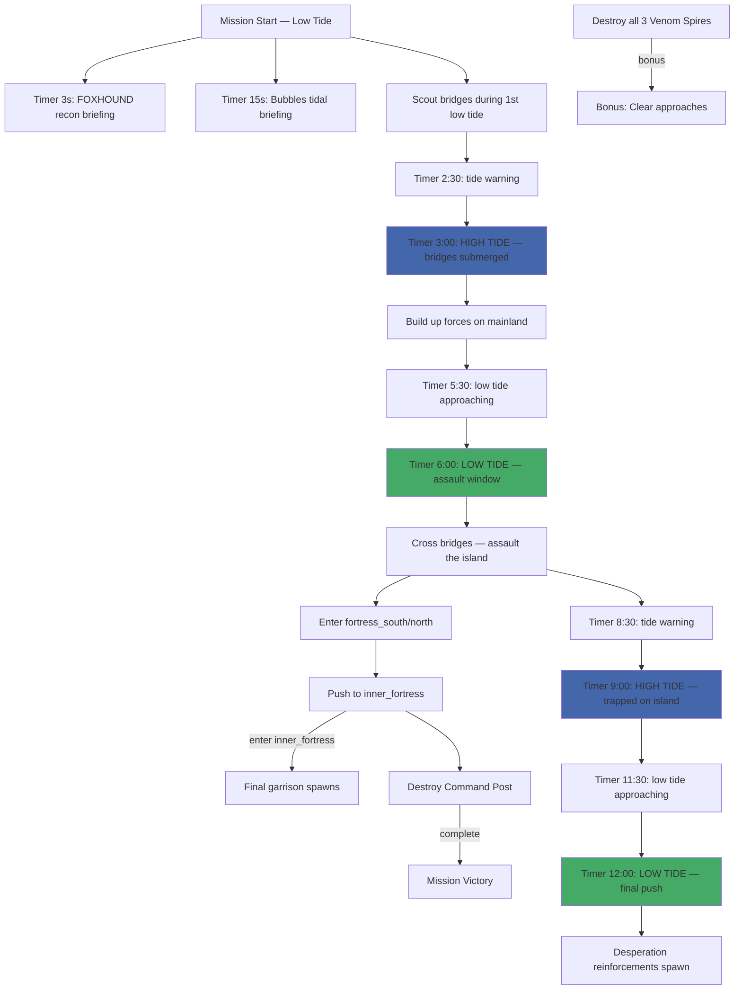

# Mission 3-3: ENTRENCHMENT

## Header
- **ID**: `mission_11`
- **Chapter**: 3 — Turning Tide
- **Map**: 160x128 tiles (5120x4096px)
- **Setting**: Stonebreak Island — a heavily fortified Scale-Guard regional command post sitting on a rocky island in the northern Blackmarsh. Tidal flats surround the fortress. Three land bridges surface during low tide, connecting the mainland to the island. The mainland shore is muddy and exposed. The fortress has layered stone walls, three Venom Spires covering the approaches, and a central Command Post.
- **Win**: Destroy the Scale-Guard Command Post on Stonebreak Island
- **Lose**: Lodge destroyed
- **Par Time**: 18 minutes
- **Unlocks**: Mortar Otter siege damage upgrade (Precision Bombardment research — -30% scatter radius)

## Zone Map
```
    0         32        64        96       128       160
  0 |---------|---------|---------|---------|---------|
    | deep_water_nw     | fortress_north              |
    | (impassable)      | (outer wall, Spire-N)       |
    |                   |                             |
 12 |                   |---------|---------|         |
    |                   | inner_fortress    |         |
    |                   | (Command Post,    |         |
    |                   |  garrison)        |         |
 24 |                   |---------|---------|         |
    | deep_water_w      | fortress_south              |
    |                   | (outer wall, Spire-W/E)     |
 32 |---------|---------|---------|---------|---------|
    |    | west_bridge   | center_bridge | east_bridge|
    |    | (tidal flat)  | (tidal flat)  | (tidal fl) |
 40 |    |               |               |           |
    |---------|---------|---------|---------|---------|
 48 | tidal_flats (water at high tide, beach at low)  |
    |                                                 |
 56 |---------|---------|---------|---------|---------|
    | mudshore_w        | mudshore_center             |
    | (staging west)    | (open mud,                  |
    |                   |  exposed)                   |
 68 |---------|---------|---------|---------|---------|
    | deep_water_sw     | mudshore_e                  |
    |                   | (staging east)              |
 80 |---------|---------|---------|---------|---------|
    | mainland_w        | mainland_center             |
    | (mangrove cover)  | (approach road)             |
 96 |---------|---------|---------|---------|---------|
    | ura_base_w        | ura_base_center             |
    | (barracks, armory)| (lodge, command post)       |
112 |---------|---------|---------|---------|---------|
    | supply_south                                    |
    | (fish, timber, salvage)                         |
128 |---------|---------|---------|---------|---------|
```

## Zones (tile coordinates)
```typescript
zones: {
  ura_base:          { x: 24, y: 96,  width: 112, height: 16 },
  supply_south:      { x: 8,  y: 112, width: 144, height: 16 },
  mainland_w:        { x: 0,  y: 80,  width: 64,  height: 16 },
  mainland_center:   { x: 64, y: 80,  width: 96,  height: 16 },
  mudshore_w:        { x: 0,  y: 56,  width: 56,  height: 24 },
  mudshore_center:   { x: 56, y: 56,  width: 48,  height: 24 },
  mudshore_e:        { x: 104,y: 56,  width: 56,  height: 24 },
  tidal_flats:       { x: 0,  y: 40,  width: 160, height: 16 },
  west_bridge:       { x: 20, y: 32,  width: 16,  height: 16 },
  center_bridge:     { x: 68, y: 32,  width: 16,  height: 16 },
  east_bridge:       { x: 120,y: 32,  width: 16,  height: 16 },
  fortress_south:    { x: 40, y: 24,  width: 80,  height: 8 },
  fortress_north:    { x: 40, y: 0,   width: 80,  height: 12 },
  inner_fortress:    { x: 56, y: 12,  width: 48,  height: 12 },
  spire_west:        { x: 44, y: 24,  width: 8,   height: 8 },
  spire_north:       { x: 72, y: 2,   width: 8,   height: 8 },
  spire_east:        { x: 108,y: 24,  width: 8,   height: 8 },
}
```

## Terrain Regions
```typescript
terrain: {
  width: 160, height: 128,
  regions: [
    { terrainId: "water", fill: true },
    // Southern mainland (player territory)
    { terrainId: "grass", rect: { x: 0, y: 80, w: 160, h: 48 } },
    // Player base clearing
    { terrainId: "dirt", rect: { x: 32, y: 96, w: 96, h: 16 } },
    // Mangrove cover on mainland
    { terrainId: "mangrove", rect: { x: 0, y: 80, w: 28, h: 16 } },
    { terrainId: "mangrove", rect: { x: 132, y: 80, w: 28, h: 16 } },
    { terrainId: "mangrove", circle: { cx: 48, cy: 88, r: 6 } },
    { terrainId: "mangrove", circle: { cx: 112, cy: 88, r: 6 } },
    // Muddy shoreline (staging areas)
    { terrainId: "mud", rect: { x: 0, y: 56, w: 160, h: 24 } },
    // Mud patches
    { terrainId: "mud", circle: { cx: 28, cy: 62, r: 5 } },
    { terrainId: "mud", circle: { cx: 132, cy: 62, r: 5 } },
    // Tidal flats (terrain changes with tide — water or beach)
    // At mission start (low tide): beach
    { terrainId: "beach", rect: { x: 0, y: 40, w: 160, h: 16 } },
    // Three land bridges (always beach at low tide, submerged at high)
    { terrainId: "beach", rect: { x: 20, y: 32, w: 16, h: 24 } },
    { terrainId: "beach", rect: { x: 68, y: 32, w: 16, h: 24 } },
    { terrainId: "beach", rect: { x: 120, y: 32, w: 16, h: 24 } },
    // Fortress island
    { terrainId: "dirt", rect: { x: 40, y: 0, w: 80, h: 32 } },
    // Inner fortress (stone floor)
    { terrainId: "dirt", rect: { x: 56, y: 12, w: 48, h: 12 } },
    // Fortress walls (stone — destructible but high HP)
    { terrainId: "dirt", rect: { x: 40, y: 10, w: 80, h: 2 } },
    { terrainId: "dirt", rect: { x: 40, y: 24, w: 80, h: 2 } },
    { terrainId: "dirt", rect: { x: 40, y: 10, w: 2, h: 16 } },
    { terrainId: "dirt", rect: { x: 118, y: 10, w: 2, h: 16 } },
    // Resource areas (south)
    { terrainId: "mud", rect: { x: 8, y: 116, w: 20, h: 8 } },
    { terrainId: "water", circle: { cx: 140, cy: 120, r: 6 } },
    // Deep water (impassable zones around island)
    // Note: default fill is water, so these are naturally deep water
  ],
  overrides: [
    // Gate breaches in fortress walls (3 entry points, one per bridge)
    // West gate
    { x: 40, y: 18, terrainId: "dirt" },
    { x: 40, y: 19, terrainId: "dirt" },
    // Center gate (north wall)
    { x: 78, y: 10, terrainId: "dirt" },
    { x: 79, y: 10, terrainId: "dirt" },
    // East gate
    { x: 118, y: 18, terrainId: "dirt" },
    { x: 118, y: 19, terrainId: "dirt" },
  ]
}
```

## Placements

### Player (ura_base)
```typescript
// Lodge
{ type: "burrow", faction: "ura", x: 80, y: 104 },
// Pre-built base
{ type: "command_post", faction: "ura", x: 72, y: 100 },
{ type: "barracks", faction: "ura", x: 56, y: 100 },
{ type: "armory", faction: "ura", x: 88, y: 100 },
// Starting army
{ type: "mudfoot", faction: "ura", x: 56, y: 98 },
{ type: "mudfoot", faction: "ura", x: 60, y: 96 },
{ type: "mudfoot", faction: "ura", x: 64, y: 98 },
{ type: "mudfoot", faction: "ura", x: 68, y: 96 },
{ type: "mudfoot", faction: "ura", x: 72, y: 98 },
{ type: "mudfoot", faction: "ura", x: 76, y: 96 },
{ type: "mudfoot", faction: "ura", x: 80, y: 98 },
{ type: "mudfoot", faction: "ura", x: 84, y: 96 },
{ type: "shellcracker", faction: "ura", x: 52, y: 102 },
{ type: "shellcracker", faction: "ura", x: 60, y: 102 },
{ type: "shellcracker", faction: "ura", x: 68, y: 102 },
{ type: "shellcracker", faction: "ura", x: 84, y: 102 },
{ type: "mortar_otter", faction: "ura", x: 76, y: 104 },
{ type: "mortar_otter", faction: "ura", x: 88, y: 104 },
{ type: "sapper", faction: "ura", x: 64, y: 104 },
{ type: "sapper", faction: "ura", x: 96, y: 102 },
// Workers
{ type: "river_rat", faction: "ura", x: 48, y: 106 },
{ type: "river_rat", faction: "ura", x: 52, y: 108 },
{ type: "river_rat", faction: "ura", x: 100, y: 106 },
```

### Resources
```typescript
// Timber
{ type: "mangrove_tree", faction: "neutral", x: 8, y: 84 },
{ type: "mangrove_tree", faction: "neutral", x: 14, y: 86 },
{ type: "mangrove_tree", faction: "neutral", x: 20, y: 88 },
{ type: "mangrove_tree", faction: "neutral", x: 136, y: 84 },
{ type: "mangrove_tree", faction: "neutral", x: 142, y: 86 },
{ type: "mangrove_tree", faction: "neutral", x: 148, y: 88 },
// Fish
{ type: "fish_spot", faction: "neutral", x: 138, y: 118 },
{ type: "fish_spot", faction: "neutral", x: 144, y: 122 },
{ type: "fish_spot", faction: "neutral", x: 12, y: 120 },
// Salvage
{ type: "salvage_cache", faction: "neutral", x: 80, y: 112 },
{ type: "salvage_cache", faction: "neutral", x: 40, y: 114 },
{ type: "salvage_cache", faction: "neutral", x: 120, y: 114 },
```

### Enemies — Fortress Garrison
```typescript
// Scale-Guard Command Post (primary objective)
{ type: "command_post", faction: "scale_guard", x: 80, y: 16 },

// Three Venom Spires covering land bridge approaches
{ type: "venom_spire", faction: "scale_guard", x: 46, y: 26 },   // west approach
{ type: "venom_spire", faction: "scale_guard", x: 76, y: 4 },    // north/center
{ type: "venom_spire", faction: "scale_guard", x: 112, y: 26 },  // east approach

// Fortress wall garrison — outer ring
{ type: "gator", faction: "scale_guard", x: 48, y: 18 },
{ type: "gator", faction: "scale_guard", x: 56, y: 22 },
{ type: "gator", faction: "scale_guard", x: 100, y: 18 },
{ type: "gator", faction: "scale_guard", x: 108, y: 22 },
{ type: "viper", faction: "scale_guard", x: 64, y: 20 },
{ type: "viper", faction: "scale_guard", x: 96, y: 20 },

// Inner fortress garrison — Command Post defenders
{ type: "gator", faction: "scale_guard", x: 72, y: 14 },
{ type: "gator", faction: "scale_guard", x: 80, y: 18 },
{ type: "gator", faction: "scale_guard", x: 88, y: 14 },
{ type: "viper", faction: "scale_guard", x: 76, y: 12, count: 2 },
{ type: "viper", faction: "scale_guard", x: 84, y: 12, count: 2 },
{ type: "snapper", faction: "scale_guard", x: 80, y: 14, count: 2 },

// Beach patrol (patrols tidal flats during low tide, retreats at high)
{ type: "scout_lizard", faction: "scale_guard", x: 40, y: 36,
  patrol: [[40,36],[120,36],[40,36]] },
{ type: "scout_lizard", faction: "scale_guard", x: 60, y: 38,
  patrol: [[60,38],[100,38],[60,38]] },

// Bridge checkpoint sentries
{ type: "gator", faction: "scale_guard", x: 28, y: 30, count: 2 },
{ type: "gator", faction: "scale_guard", x: 76, y: 30, count: 2 },
{ type: "gator", faction: "scale_guard", x: 128, y: 30, count: 2 },
```

## Phases

### Phase 1: RECON TIDE (0:00 - ~3:00) — LOW TIDE
**Entry**: Mission start. Tide is OUT. Land bridges are exposed.
**State**: Pre-built base with army. Low tide — all three land bridges passable as beach terrain. Tidal flats are exposed beach. First cycle is a recon window.
**Objectives**:
- "Destroy the Scale-Guard Command Post" (PRIMARY)

**Triggers**:
```
[0:03] foxhound-briefing
  Condition: timer(3)
  Action: dialogue("foxhound", "Tide is out for the first three minutes. The land bridges are passable — use this window to scout their defenses. Don't commit your main force yet.")

[0:15] bubbles-tidal-briefing
  Condition: timer(15)
  Action: exchange([
    { speaker: "Col. Bubbles", text: "Captain, tides cycle every three minutes. Low tide gives you a window to cross the flats. When the water rises, anyone on the bridges or flats drowns. No exceptions." },
    { speaker: "FOXHOUND", text: "Three land bridges: west, center, and east. Each one is covered by at least one Venom Spire. Those spires are secondary targets — take them down to open lanes." },
    { speaker: "Col. Bubbles", text: "Their Command Post is in the center of the fortress. Mortar Otters can hit it from outside the walls if you get close enough. Patience and timing, Captain." }
  ])

[2:30] tide-warning-1
  Condition: timer(150)
  Action: dialogue("foxhound", "Thirty seconds until high tide. Pull back from the flats or your units drown.")
```

### Phase 2: FIRST HIGH TIDE (~3:00 - ~6:00)
**Entry**: Timer reaches 3:00. Water rises.
**State**: High tide. Land bridges submerged. Tidal flats become deep water. Any unit on bridge/flat zones takes 999 damage (instant death). Player is forced to wait, build up, or reposition on the mainland.

**Triggers**:
```
[3:00] tide-rising-1
  Condition: timer(180)
  Action: [
    setTidalState("high"),
    dialogue("col_bubbles", "Tide's in! Water is covering the flats. Anything on the bridges is going under. Hold position on the mainland."),
  ]

[3:30] bubbles-buildup
  Condition: timer(210)
  Action: dialogue("col_bubbles", "Use this downtime. Train reinforcements, position your forces at the shoreline. Next low tide, you commit.")

[5:30] tide-warning-2
  Condition: timer(330)
  Action: dialogue("foxhound", "Thirty seconds to low tide. Get your assault force to the shoreline.")
```

### Phase 3: ASSAULT TIDE (~6:00 - ~9:00) — LOW TIDE
**Entry**: Timer reaches 6:00. Water recedes.
**State**: Low tide. Bridges and flats exposed again. This is the primary assault window. Player should have a larger force staged at the shoreline.

**Triggers**:
```
[6:00] tide-low-2
  Condition: timer(360)
  Action: [
    setTidalState("low"),
    dialogue("col_bubbles", "Low tide! Bridges are open. This is your assault window — three minutes to get across and establish a foothold. Move, Captain!")
  ]

bridge-crossed
  Condition: areaEntered("ura", "fortress_south") OR areaEntered("ura", "fortress_north")
  Action: dialogue("foxhound", "You're on the island! Push for the inner fortress. Watch for Spire coverage.")

[8:30] tide-warning-3
  Condition: timer(510)
  Action: dialogue("foxhound", "Tide coming in again in thirty seconds! Anyone still on the bridges needs to reach the island or fall back to shore. No middle ground.")
```

### Phase 4: SIEGE TIDE (~9:00 - ~12:00) — HIGH TIDE
**Entry**: Timer reaches 9:00. Water rises again.
**State**: High tide. Any units on the island are CUT OFF from the mainland. No reinforcements, no retreat. Units on the flats die. This creates intense "trapped on the island" pressure if the player committed troops.

**Triggers**:
```
[9:00] tide-rising-2
  Condition: timer(540)
  Action: [
    setTidalState("high"),
    dialogue("col_bubbles", "Water's rising! Your forces on the island are on their own until the next low tide. Whatever you've got — it has to be enough.")
  ]

fortress-breached
  Condition: areaEntered("ura", "inner_fortress")
  Action: [
    dialogue("foxhound", "You're inside the inner fortress! Their Command Post is right there. Expect them to throw everything they have at you."),
    spawn("gator", "scale_guard", 72, 8, 3),
    spawn("viper", "scale_guard", 88, 8, 2),
    spawn("snapper", "scale_guard", 80, 6, 2)
  ]

[11:30] tide-warning-4
  Condition: timer(690)
  Action: dialogue("foxhound", "Next low tide in thirty seconds. Reinforcements can cross then.")
```

### Phase 5: FINAL PUSH (~12:00+) — LOW TIDE
**Entry**: Timer reaches 12:00. Third low tide cycle.
**State**: Bridges open again. If player has not yet destroyed the Command Post, this is the third and most urgent window.

**Triggers**:
```
[12:00] tide-low-3
  Condition: timer(720)
  Action: [
    setTidalState("low"),
    dialogue("col_bubbles", "Third low tide. If you haven't cracked that fortress yet, this is your window. All in, Captain. Everything you've got.")
  ]

[12:00] desperation-reinforcements
  Condition: timer(720)
  Action: [
    spawn("gator", "scale_guard", 60, 6, 4),
    spawn("gator", "scale_guard", 100, 6, 4),
    spawn("viper", "scale_guard", 80, 2, 3),
    dialogue("foxhound", "Scale-Guard is pulling reserves from across the Blackmarsh! Massive enemy force converging on the island!")
  ]

cp-destroyed
  Condition: buildingCount("scale_guard", "command_post", "eq", 0)
  Action: completeObjective("destroy-enemy-cp")

mission-complete
  Condition: allPrimaryComplete()
  Action: exchange([
    { speaker: "FOXHOUND", text: "Scale-Guard Command Post is down! Stonebreak Fortress has fallen!" },
    { speaker: "Col. Bubbles", text: "Their regional command is shattered. The Blackmarsh campaign is nearly won, Captain." },
    { speaker: "Gen. Whiskers", text: "Stonebreak Island is ours. Outstanding siege work. Mortar teams — precision bombardment protocols are now standard doctrine. HQ out." }
  ], followed by: victory())
```

### Bonus Objective
```
destroy-all-spires
  Condition: buildingCount("scale_guard", "venom_spire", "eq", 0)
  Action: [
    completeObjective("destroy-all-spires"),
    dialogue("foxhound", "All Venom Spires neutralized. Approaches are wide open — no more tower fire on the bridges.")
  ]
  Description: "Destroy all 3 Venom Spires"
```

## Trigger Flowchart


## Balance Notes
- **Starting resources**: 350 fish, 250 timber, 150 salvage — enough for 1-2 training waves plus upgrades
- **Pre-built base**: Command Post, Barracks, Armory, Burrow
- **Tidal cycle**: 3-minute periods. Low (0:00-3:00), High (3:00-6:00), Low (6:00-9:00), High (9:00-12:00), Low (12:00+)
- **Drowning mechanic**: Any unit on bridge/tidal flat terrain when tide rises takes 999 damage. Audio warning at 30 seconds before tide change. Visual water-line indicator creeps up during the final 10 seconds.
- **Land bridge width**: 16 tiles each — enough for an assault force but narrow enough to be bottlenecked by Spire fire
- **Venom Spire placement**: Each covers one bridge approach. Destroying a Spire opens that approach lane. Mortar Otters can outrange Spires (range 7 vs Spire range 6) — this is the designed counter.
- **Command Post HP**: 500. Mortar Otters deal 20 damage per shot (25 shots to destroy). Sappers deal 80 per charge (7 charges). Recommended: 2 Mortar Otters + Sapper charges for fastest kill.
- **Fortress garrison**: Total of ~18 combat units + 3 Spires. Inner fortress has the heaviest concentration (6 Gators, 4 Vipers, 2 Snappers). Fortress breach trigger spawns 7 more.
- **Multi-prong assault**: Player is rewarded for splitting forces across multiple bridges. All-in on one bridge means maximum Spire coverage. Two-prong attack forces enemy to split response. West and east bridges are closest to Spire-W and Spire-E — center bridge is exposed to Spire-N but shortest path to Command Post.
- **Mortar Otter upgrade unlock**: Completing this mission unlocks the Precision Bombardment research at the Armory. This reduces Mortar Otter scatter radius by 30%, making them significantly more effective in future missions.
- **Enemy scaling** (difficulty):
  - Support: tidal cycle 4 minutes (longer windows), fortress garrison reduced by 30%, Spire HP reduced by 25%, no desperation reinforcements
  - Tactical: as written
  - Elite: tidal cycle 2.5 minutes (tighter windows), fortress garrison +30%, Spires deal +25% damage, desperation wave spawns at 10:00 instead of 12:00, extra Snapper pair in inner fortress
- **Par time**: 18 minutes on Tactical — allows 3 full tidal cycles plus build time. A skilled player can finish in 2 cycles (12 minutes).
- **Intended feel**: Epic siege warfare. The tide is an implacable clock. Moments of frantic action during low tide separated by tense build-up during high tide. The fortress should feel imposing and earn its fall.
