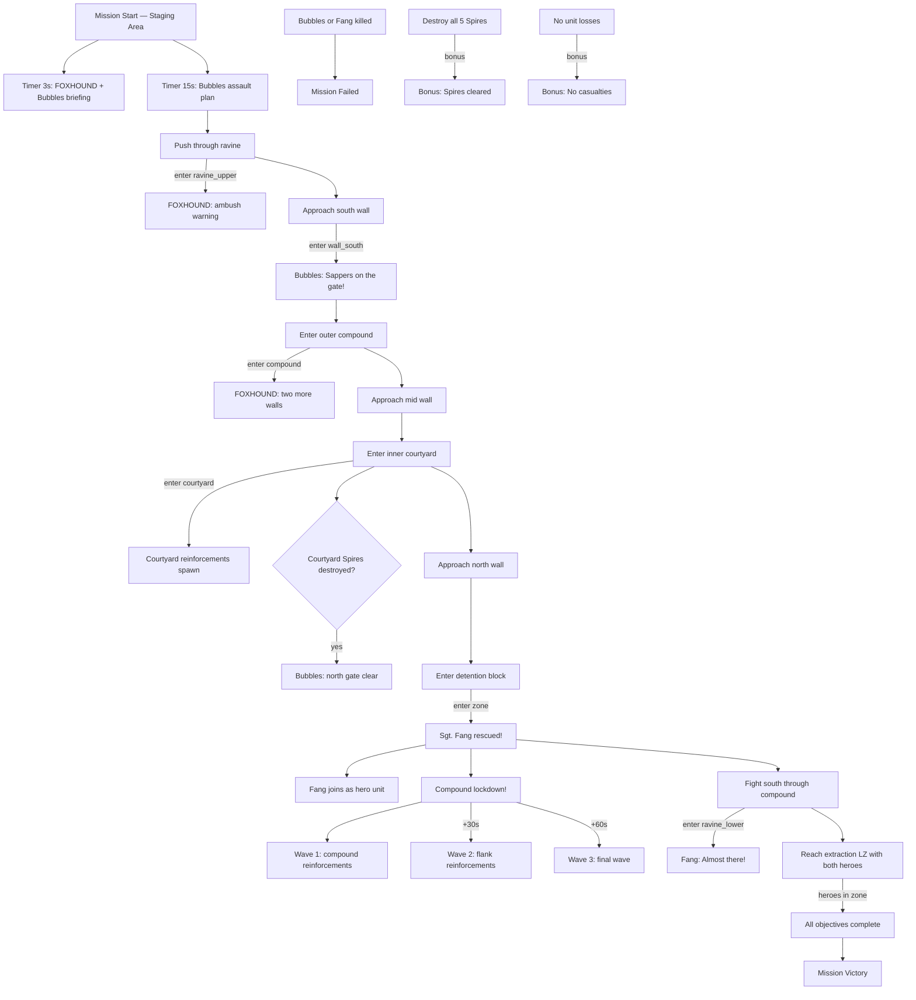

# Mission 3-4: THE STRONGHOLD (Fang Rescue)

## Header
- **ID**: `mission_12`
- **Chapter**: 3 — Turning Tide
- **Map**: 128x128 tiles (4096x4096px)
- **Setting**: Scale-Guard northern stronghold — a clifftop fortress above the Blackmarsh. The compound is built into a rocky ravine, with layered defenses: outer wall, inner courtyard, and a deep detention block carved into the cliff face. A narrow ravine approach from the south is the only ground access. Mangrove-covered flanks offer concealment but no direct route in. The fortress is the last Scale-Guard position in the Blackmarsh theater.
- **Win**: Rescue Sgt. Fang AND extract all heroes to southern LZ
- **Lose**: Col. Bubbles (hero) killed OR Sgt. Fang killed (after rescue)
- **Par Time**: 14 minutes
- **Unlocks**: Sgt. Fang (hero unit — heavy melee siege specialist, Breach Charge ability)

## Zone Map
```
    0         32        64        96       128
  0 |---------|---------|---------|---------|
    | cliff_face_w      | cliff_face_e      |
    | (impassable rock) | (impassable rock) |
  8 |---------|---------|---------|---------|
    | detention_wing_w  | detention_block   |
    | (cells, guards)   | (Sgt. Fang held   |
    |                   |  in deepest cell) |
 20 |---------|---------|---------|---------|
    | wall_north (fortified stone wall)     |
 24 |---------|---------|---------|---------|
    | inner_courtyard                       |
    | (Vipers, Snapper, central well,       |
    |  Venom Spires flanking)               |
 40 |---------|---------|---------|---------|
    | wall_mid (second defensive line)      |
 44 |---------|---------|---------|---------|
    | outer_compound_w  | outer_compound_e  |
    | (barracks, armory)| (patrols, supply) |
    |                   |                   |
 60 |---------|---------|---------|---------|
    | wall_south (outer wall + gate)        |
 64 |---------|---------|---------|---------|
    | ravine_upper                          |
    | (narrow approach, ambush points)      |
 76 |---------|---------|---------|---------|
    | ravine_lower                          |
    | (wider, mangrove flanks)              |
 88 |---------|---------|---------|---------|
    | west_flank        | east_flank        |
    | (mangrove,        | (mangrove,        |
    |  concealment)     |  concealment)     |
100 |---------|---------|---------|---------|
    | staging_area                          |
    | (rally point before assault)          |
112 |---------|---------|---------|---------|
    | extraction_lz                         |
    | (southern beach — extraction point)   |
128 |---------|---------|---------|---------|
```

## Zones (tile coordinates)
```typescript
zones: {
  extraction_lz:     { x: 32, y: 112, width: 64, height: 16 },
  staging_area:      { x: 24, y: 100, width: 80, height: 12 },
  west_flank:        { x: 0,  y: 88,  width: 32, height: 12 },
  east_flank:        { x: 96, y: 88,  width: 32, height: 12 },
  ravine_lower:      { x: 32, y: 76,  width: 64, height: 12 },
  ravine_upper:      { x: 36, y: 64,  width: 56, height: 12 },
  wall_south:        { x: 24, y: 60,  width: 80, height: 4 },
  outer_compound_w:  { x: 16, y: 44,  width: 48, height: 16 },
  outer_compound_e:  { x: 64, y: 44,  width: 48, height: 16 },
  wall_mid:          { x: 16, y: 40,  width: 96, height: 4 },
  inner_courtyard:   { x: 24, y: 24,  width: 80, height: 16 },
  wall_north:        { x: 24, y: 20,  width: 80, height: 4 },
  detention_wing_w:  { x: 16, y: 8,   width: 40, height: 12 },
  detention_block:   { x: 56, y: 8,   width: 48, height: 12 },
  cliff_face_w:      { x: 0,  y: 0,   width: 32, height: 8 },
  cliff_face_e:      { x: 96, y: 0,   width: 32, height: 8 },
}
```

## Terrain Regions
```typescript
terrain: {
  width: 128, height: 128,
  regions: [
    { terrainId: "grass", fill: true },
    // Impassable cliff face (north)
    { terrainId: "mud", rect: { x: 0, y: 0, w: 16, h: 20 } },
    { terrainId: "mud", rect: { x: 112, y: 0, w: 16, h: 20 } },
    { terrainId: "mud", rect: { x: 0, y: 0, w: 128, h: 8 } },
    // Detention block (carved into cliff)
    { terrainId: "dirt", rect: { x: 16, y: 8, w: 96, h: 12 } },
    // Fortress compound (layered stone)
    { terrainId: "dirt", rect: { x: 16, y: 20, w: 96, h: 44 } },
    // Stone walls (3 layers)
    { terrainId: "dirt", rect: { x: 24, y: 20, w: 80, h: 2 } },
    { terrainId: "dirt", rect: { x: 16, y: 40, w: 96, h: 2 } },
    { terrainId: "dirt", rect: { x: 24, y: 60, w: 80, h: 2 } },
    // Rocky cliff walls flanking the compound
    { terrainId: "mud", rect: { x: 0, y: 20, w: 16, h: 44 } },
    { terrainId: "mud", rect: { x: 112, y: 20, w: 16, h: 44 } },
    // Ravine (narrow approach — rocky walls on sides)
    { terrainId: "dirt", rect: { x: 36, y: 62, w: 56, h: 14 } },
    { terrainId: "dirt", rect: { x: 40, y: 76, w: 48, h: 12 } },
    { terrainId: "mud", rect: { x: 24, y: 64, w: 12, h: 24 } },
    { terrainId: "mud", rect: { x: 92, y: 64, w: 12, h: 24 } },
    // Mangrove flanking routes
    { terrainId: "mangrove", rect: { x: 0, y: 88, w: 32, h: 12 } },
    { terrainId: "mangrove", rect: { x: 96, y: 88, w: 32, h: 12 } },
    { terrainId: "mangrove", circle: { cx: 16, cy: 94, r: 6 } },
    { terrainId: "mangrove", circle: { cx: 112, cy: 94, r: 6 } },
    // Staging area
    { terrainId: "dirt", rect: { x: 32, y: 100, w: 64, h: 12 } },
    // Extraction beach (south)
    { terrainId: "beach", rect: { x: 32, y: 112, w: 64, h: 16 } },
    // Mud patches (organic detail)
    { terrainId: "mud", circle: { cx: 64, cy: 80, r: 4 } },
    { terrainId: "mud", circle: { cx: 48, cy: 96, r: 3 } },
    { terrainId: "mud", circle: { cx: 80, cy: 96, r: 3 } },
  ],
  overrides: [
    // Gates in fortress walls (breakable)
    // South gate
    { x: 62, y: 60, terrainId: "bridge" },
    { x: 63, y: 60, terrainId: "bridge" },
    { x: 64, y: 60, terrainId: "bridge" },
    { x: 65, y: 60, terrainId: "bridge" },
    // Mid gate
    { x: 62, y: 40, terrainId: "bridge" },
    { x: 63, y: 40, terrainId: "bridge" },
    { x: 64, y: 40, terrainId: "bridge" },
    { x: 65, y: 40, terrainId: "bridge" },
    // North gate (detention access)
    { x: 62, y: 20, terrainId: "bridge" },
    { x: 63, y: 20, terrainId: "bridge" },
    { x: 64, y: 20, terrainId: "bridge" },
    { x: 65, y: 20, terrainId: "bridge" },
  ]
}
```

## Placements

### Player (staging_area + extraction_lz)
```typescript
// Strike team — larger than Mission 4 prison break, full assault force
// Hero: Col. Bubbles (tactical commander)
{ type: "sgt_bubbles", faction: "ura", x: 64, y: 116 },

// Assault infantry (8 Mudfoots)
{ type: "mudfoot", faction: "ura", x: 48, y: 108 },
{ type: "mudfoot", faction: "ura", x: 52, y: 106 },
{ type: "mudfoot", faction: "ura", x: 56, y: 108 },
{ type: "mudfoot", faction: "ura", x: 60, y: 106 },
{ type: "mudfoot", faction: "ura", x: 68, y: 106 },
{ type: "mudfoot", faction: "ura", x: 72, y: 108 },
{ type: "mudfoot", faction: "ura", x: 76, y: 106 },
{ type: "mudfoot", faction: "ura", x: 80, y: 108 },

// Heavy support (4 Shellcrackers)
{ type: "shellcracker", faction: "ura", x: 44, y: 112 },
{ type: "shellcracker", faction: "ura", x: 56, y: 114 },
{ type: "shellcracker", faction: "ura", x: 72, y: 114 },
{ type: "shellcracker", faction: "ura", x: 84, y: 112 },

// Sappers for wall breaching (3 Sappers)
{ type: "sapper", faction: "ura", x: 50, y: 116 },
{ type: "sapper", faction: "ura", x: 64, y: 118 },
{ type: "sapper", faction: "ura", x: 78, y: 116 },

// Mortar support (2 Mortar Otters)
{ type: "mortar_otter", faction: "ura", x: 54, y: 110 },
{ type: "mortar_otter", faction: "ura", x: 74, y: 110 },

// Divers for scouting (2 Divers)
{ type: "diver", faction: "ura", x: 46, y: 104 },
{ type: "diver", faction: "ura", x: 82, y: 104 },
```

### Enemies — Layer 1: Outer Compound
```typescript
// South wall gate guards
{ type: "gator", faction: "scale_guard", x: 58, y: 62 },
{ type: "gator", faction: "scale_guard", x: 68, y: 62 },
{ type: "viper", faction: "scale_guard", x: 64, y: 64 },

// Ravine ambush patrol
{ type: "gator", faction: "scale_guard", x: 52, y: 70,
  patrol: [[52,70],[76,70],[52,70]] },
{ type: "gator", faction: "scale_guard", x: 56, y: 72,
  patrol: [[56,72],[72,72],[56,72]] },

// Outer compound — west wing
{ type: "gator", faction: "scale_guard", x: 24, y: 48, count: 2 },
{ type: "gator", faction: "scale_guard", x: 32, y: 52, count: 2 },
{ type: "viper", faction: "scale_guard", x: 28, y: 50 },

// Outer compound — east wing
{ type: "gator", faction: "scale_guard", x: 96, y: 48, count: 2 },
{ type: "gator", faction: "scale_guard", x: 88, y: 52, count: 2 },
{ type: "viper", faction: "scale_guard", x: 92, y: 50 },

// Outer perimeter Venom Spires
{ type: "venom_spire", faction: "scale_guard", x: 28, y: 60 },
{ type: "venom_spire", faction: "scale_guard", x: 100, y: 60 },
```

### Enemies — Layer 2: Inner Courtyard
```typescript
// Mid wall gate guards
{ type: "gator", faction: "scale_guard", x: 58, y: 42 },
{ type: "gator", faction: "scale_guard", x: 68, y: 42 },

// Courtyard garrison
{ type: "viper", faction: "scale_guard", x: 36, y: 30, count: 2 },
{ type: "viper", faction: "scale_guard", x: 88, y: 30, count: 2 },
{ type: "snapper", faction: "scale_guard", x: 56, y: 32 },
{ type: "snapper", faction: "scale_guard", x: 72, y: 32 },
{ type: "gator", faction: "scale_guard", x: 44, y: 36, count: 2 },
{ type: "gator", faction: "scale_guard", x: 80, y: 36, count: 2 },

// Courtyard Venom Spires (flanking the north gate)
{ type: "venom_spire", faction: "scale_guard", x: 32, y: 28 },
{ type: "venom_spire", faction: "scale_guard", x: 92, y: 28 },
```

### Enemies — Layer 3: Detention Block
```typescript
// North wall gate guards
{ type: "gator", faction: "scale_guard", x: 58, y: 22 },
{ type: "gator", faction: "scale_guard", x: 68, y: 22 },
{ type: "viper", faction: "scale_guard", x: 64, y: 18 },

// Detention block guards
{ type: "gator", faction: "scale_guard", x: 60, y: 12 },
{ type: "gator", faction: "scale_guard", x: 72, y: 12 },
{ type: "gator", faction: "scale_guard", x: 80, y: 10 },
{ type: "viper", faction: "scale_guard", x: 68, y: 14 },
{ type: "snapper", faction: "scale_guard", x: 76, y: 10 },

// Detention Venom Spire (guarding Fang's cell)
{ type: "venom_spire", faction: "scale_guard", x: 64, y: 10 },

// Sgt. Fang (prisoner — spawns as URA unit when freed)
// Not placed at start; spawned by trigger when detention_block entered
```

## Phases

### Phase 1: RAVINE APPROACH (0:00 - ~4:00)
**Entry**: Mission start
**State**: Full assault force deployed at southern staging area. No base, no economy — commando rules with a large strike team. Col. Bubbles is present as hero unit (must survive). 20 units total.
**Objectives**:
- "Rescue Sgt. Fang" (PRIMARY)
- "Extract all heroes to southern LZ" (PRIMARY)

**Triggers**:
```
[0:03] foxhound-briefing
  Condition: timer(3)
  Action: exchange([
    { speaker: "FOXHOUND", text: "Stronghold ahead, Captain. Three defensive layers: outer wall, inner courtyard, detention block. Sgt. Fang is in the deepest chamber." },
    { speaker: "Col. Bubbles", text: "This is bigger than the Whiskers rescue. We've got the firepower this time — Shellcrackers, Mortar Otters, and Sappers for the walls." }
  ])

[0:15] bubbles-plan
  Condition: timer(15)
  Action: exchange([
    { speaker: "Col. Bubbles", text: "Send your Divers forward to scout the ravine. Sappers blow the gates, Mortars suppress the defenders, infantry pushes through. Three walls, three breaches." },
    { speaker: "FOXHOUND", text: "Scale-Guard has Venom Spires covering each gate approach. Five total. Taking them down opens your lanes but draws attention." },
    { speaker: "Col. Bubbles", text: "Once we free Fang, they lock the place down. Every Scale-Guard in the Blackmarsh converges on this position. We fight our way back south to the extraction beach. In fast, out loud." }
  ])

ravine-entered
  Condition: areaEntered("ura", "ravine_upper")
  Action: dialogue("foxhound", "Ravine narrows ahead. Watch for ambush patrols between the walls.")
```

### Phase 2: OUTER BREACH (~4:00 - ~7:00)
**Entry**: URA unit enters outer_compound_w or outer_compound_e
**State**: First wall breached. Outer compound has defenders in two wings. Player must clear both wings or push through center.

**Triggers**:
```
south-wall-approach
  Condition: areaEntered("ura", "wall_south")
  Action: dialogue("col_bubbles", "Outer wall ahead. Sappers — plant charges on that gate. Everyone else, covering fire!")

outer-compound-entered
  Condition: areaEntered("ura", "outer_compound_w") OR areaEntered("ura", "outer_compound_e")
  Action: exchange([
    { speaker: "FOXHOUND", text: "You're past the outer wall. Inner courtyard ahead — Vipers and Snappers are guarding the mid-gate. Two more walls to go." },
    { speaker: "Col. Bubbles", text: "Mortar Otters — set up behind the infantry. Suppress those courtyard defenders while the Sappers move up." }
  ])
```

### Phase 3: COURTYARD ASSAULT (~7:00 - ~10:00)
**Entry**: URA unit enters inner_courtyard
**State**: Second wall breached. Inner courtyard is the heaviest defended area before the detention block. Two Venom Spires flanking the north gate. Vipers, Snappers, and Gators in concentrated positions.

**Triggers**:
```
courtyard-entered
  Condition: areaEntered("ura", "inner_courtyard")
  Action: [
    dialogue("foxhound", "Inside the courtyard. Detention block is through the north gate. Clear these guards and push through — this is the hardest room in the stronghold."),
    spawn("gator", "scale_guard", 48, 28, 2),
    spawn("gator", "scale_guard", 80, 28, 2)
  ]

courtyard-spires-down
  Condition: buildingCount("scale_guard", "venom_spire", "lte", 2) [courtyard spires only]
  Action: dialogue("col_bubbles", "Courtyard Spires are down! North gate approach is clear. Sappers, move up!")
```

### Phase 4: RESCUE (~10:00 - ~11:00)
**Entry**: URA unit enters detention_block
**State**: Deepest layer. Fang is held in the far cell. Moderate defenders remain. Once Fang is freed, he joins as a controllable hero unit.

**Triggers**:
```
detention-reached
  Condition: areaEntered("ura", "detention_block")
  Action: [
    completeObjective("rescue-fang"),
    spawn("sgt_fang", "ura", 76, 10, 1),
    exchange([
      { speaker: "Sgt. Fang", text: "Took your sweet time, Captain." },
      { speaker: "Col. Bubbles", text: "Fang, this is Bubbles. Can you fight?" },
      { speaker: "Sgt. Fang", text: "Can I fight? I've been breaking rocks with my bare hands for two weeks. Give me something to hit." },
      { speaker: "Col. Bubbles", text: "You'll get your chance. They're about to lock this place down." },
      { speaker: "Sgt. Fang", text: "Good. I know a shortcut through the west wing. Stay behind me — I'll put a hole in anything that moves." }
    ])
  ]
```

### Phase 5: FIGHTING RETREAT (~11:00+)
**Entry**: Sgt. Fang rescued (objective complete)
**State**: Compound goes into lockdown. Massive reinforcement waves spawn from all directions. Player must fight south through the same compound they breached, now swarming with fresh enemies. Fang joins the fight — he is a heavy melee specialist who deals 35 damage to buildings (can breach walls) and has the Breach Charge ability.

**Triggers**:
```
lockdown-triggered
  Condition: objectiveComplete("rescue-fang")
  Action: [
    dialogue("foxhound", "Fang is free! Compound lockdown! Reinforcements flooding in from every direction! Fight your way to the southern extraction!"),
    // Wave 1: immediate compound reinforcements
    spawn("gator", "scale_guard", 20, y: 32, 4),
    spawn("gator", "scale_guard", 108, y: 32, 4),
    spawn("viper", "scale_guard", 64, y: 50, 3),
    // Wave 2: ravine blockers
    spawn("gator", "scale_guard", 44, y: 72, 3),
    spawn("gator", "scale_guard", 84, y: 72, 3),
    spawn("scout_lizard", "scale_guard", 52, y: 80, 2),
    spawn("scout_lizard", "scale_guard", 76, y: 80, 2)
  ]

[+30s after lockdown] reinforcement-wave-2
  Condition: timer(30) after lockdown
  Action: [
    dialogue("col_bubbles", "More Scale-Guard coming in from the flanks! Keep moving — don't get bogged down!"),
    spawn("gator", "scale_guard", 8, y: 90, 4),
    spawn("snapper", "scale_guard", 120, y: 90, 3),
    spawn("viper", "scale_guard", 64, y: 64, 2)
  ]

[+60s after lockdown] reinforcement-wave-3
  Condition: timer(60) after lockdown
  Action: [
    dialogue("foxhound", "Third wave! They're pulling everything — this is it, Captain!"),
    spawn("gator", "scale_guard", 32, y: 56, 5),
    spawn("gator", "scale_guard", 96, y: 56, 5),
    spawn("viper", "scale_guard", 16, y: 80, 3),
    spawn("snapper", "scale_guard", 112, y: 80, 2)
  ]

halfway-out
  Condition: areaEntered("ura", "ravine_lower") AND objectiveComplete("rescue-fang")
  Action: dialogue("sgt_fang", "Almost there! Ravine's ahead — keep moving, don't stop for anything!")

fang-first-kill
  Condition: sgtFangKillCount("gte", 1)
  Action: dialogue("sgt_fang", "Two weeks in that cell. Feels good to hit back.")

extraction-reached
  Condition: areaEntered("ura", "extraction_lz") AND unitInZone("sgt_fang", "extraction_lz") AND unitInZone("sgt_bubbles", "extraction_lz")
  Action: completeObjective("extract-south")

// Hero death = mission failure
bubbles-death
  Condition: unitCount("ura", "sgt_bubbles", "eq", 0)
  Action: failMission()

fang-death
  Condition: unitCount("ura", "sgt_fang", "eq", 0) AND objectiveComplete("rescue-fang")
  Action: failMission()

mission-complete
  Condition: allPrimaryComplete()
  Action: exchange([
    { speaker: "Sgt. Fang", text: "Extraction confirmed. Sergeant Fang, reporting for duty." },
    { speaker: "Col. Bubbles", text: "Welcome back, Fang. The Captain got you out in one piece." },
    { speaker: "Sgt. Fang", text: "I owe this squad a debt. Won't forget it." },
    { speaker: "Gen. Whiskers", text: "Chapter 3 complete. The Blackmarsh is liberated. Every Scale-Guard stronghold in the region has fallen. Outstanding work, Captain." },
    { speaker: "Col. Bubbles", text: "Fang's siege expertise is ours now. We'll need it — the Iron Delta is next. Rest your troops. HQ out." }
  ], followed by: victory())
```

### Bonus Objective
```
no-casualties
  Condition: allPrimaryComplete() AND unitCount("ura", "all", "eq", startingCount + 1)
  Description: "Complete without losing any units"
  Note: +1 accounts for Sgt. Fang joining mid-mission

destroy-all-spires
  Condition: buildingCount("scale_guard", "venom_spire", "eq", 0)
  Action: [
    completeObjective("destroy-all-spires"),
    dialogue("foxhound", "All Venom Spires neutralized. Stronghold defenses are stripped.")
  ]
  Description: "Destroy all 5 Venom Spires"
```

## Trigger Flowchart


## Balance Notes
- **Starting force**: 20 units total. 1 hero (Col. Bubbles), 8 Mudfoots, 4 Shellcrackers, 3 Sappers, 2 Mortar Otters, 2 Divers. This is the largest commando force in the campaign so far.
- **No base, no economy**: Pure assault mission. No reinforcements except Sgt. Fang joining after rescue. Every unit lost is permanent.
- **Three defensive layers**:
  - Outer wall: 2 Spires, ~10 defenders. Moderate difficulty. Sappers breach the gate.
  - Inner courtyard: 2 Spires, ~12 defenders including Vipers and Snappers. Hardest pre-rescue fight. Mortar Otters should suppress from behind gate.
  - Detention block: 1 Spire, ~6 defenders. Lighter but still dangerous due to accumulated attrition.
- **Total enemy count before rescue**: ~28 combat units + 5 Venom Spires
- **Lockdown reinforcements**: 3 waves totaling ~30 additional enemies over 60 seconds. These flood in from flanks and rear, creating a gauntlet during retreat.
- **Sgt. Fang stats**: 150 HP, 4 armor, 18 melee damage, 35 damage vs buildings, Breach Charge (80 damage to buildings, 35s cooldown). He is a significant combat asset during the retreat.
- **Hero survival**: Both Col. Bubbles and Sgt. Fang must survive AND reach the extraction LZ. Bubbles is relatively fragile (hero with moderate HP) — player must protect him during retreat.
- **Extraction requirement**: Both heroes must be in the extraction_lz zone simultaneously. Player cannot extract piecemeal.
- **Sapper charges**: 3 gates to breach. Each gate requires 1 Sapper charge. 3 Sappers = exact amount needed with no spare. Losing a Sapper before all gates are breached means using Shellcrackers/Mortar Otters to destroy gates (slower, more exposed).
- **Venom Spire placement**: 2 at outer wall (flanking gate), 2 at courtyard (flanking north gate), 1 at detention (guarding Fang's cell). Spires have range 6. Mortar Otters outrange them at range 7.
- **Enemy scaling** (difficulty):
  - Support: garrison reduced by 30%, lockdown waves halved, Fang starts with Breach Charge off cooldown, Spire HP -25%
  - Tactical: as written
  - Elite: garrison +25%, lockdown waves +50%, 4th lockdown wave at +90s, Spires deal +30% damage, patrol routes extend further into ravine
- **Par time**: 14 minutes on Tactical — accounts for methodical 3-layer breach plus retreat
- **Intended feel**: Epic military rescue operation. Deliberate, layered assault building to a chaotic fighting retreat. The rescue of Fang is the emotional peak of Chapter 3. His dialogue should convey both toughness and gratitude. The retreat should feel desperate — the player went deep behind enemy lines and now has to claw their way back out with a full compound on alert.
