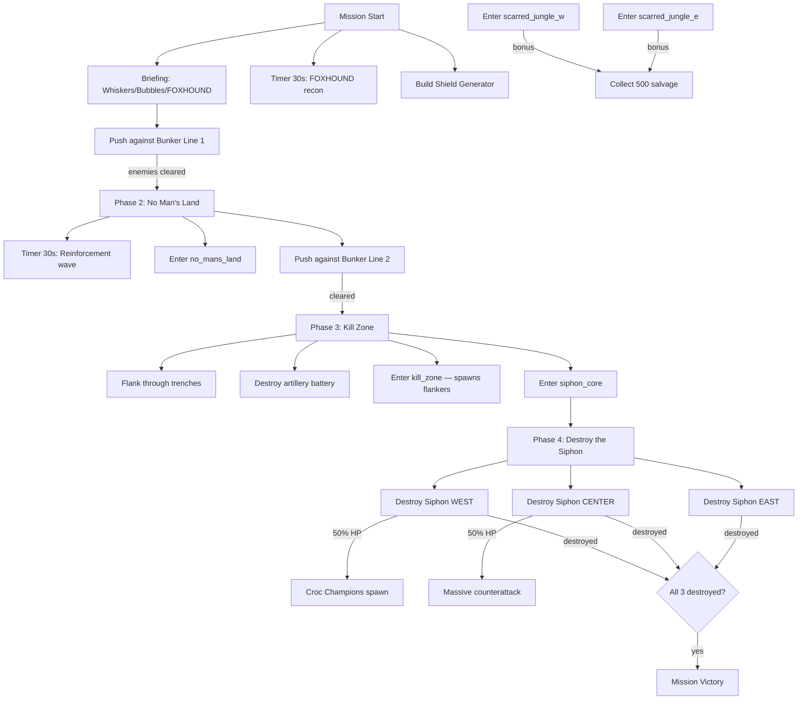

# Mission 4-1: THE GREAT SIPHON

## Header
- **ID**: `mission_13`
- **Chapter**: 4 — Final Offensive
- **Map**: 160x128 tiles (5120x4096px)
- **Setting**: The Scale-Guard central command complex at the heart of Copper-Silt Reach. A massive industrial fortress built around the Great Siphon — a three-story pumping mega-structure that drains the entire northern river system. Fortified trenchlines, concrete bunkers, and watchtowers defend three concentric perimeters. The terrain is scarred earth: stripped mangroves, toxic runoff channels, and reinforced causeways.
- **Win**: Destroy the Great Siphon (multi-stage structure, 3 sections)
- **Lose**: Lodge destroyed
- **Par Time**: 12 minutes
- **Unlocks**: Shield Generator building

## Zone Map
```
    0         32        64        96       128       160
  0 |---------|---------|---------|---------|---------|
    | enemy_reserves    | great_siphon_compound      |
    | (staging area)    | (the mega-structure)        |
 16 |---------|---------|---------|---------|---------|
    | bunker_line_3     | siphon_core     | artillery |
    | (inner defenses)  | (3 sections)    | battery   |
 32 |---------|---------|---------|---------|---------|
    | trench_west       | kill_zone       | trench_e  |
    | (fortified)       | (open ground)   | (fort.)   |
 48 |---------|---------|---------|---------|---------|
    | bunker_line_2                                   |
    | (second defensive line, bunkers + watchtowers)  |
 56 |---------|---------|---------|---------|---------|
    | scarred_jungle_w  | no_mans_land    | scarred_e |
    | (stripped mangr.)  | (craters, wire) | (ruins)   |
 72 |---------|---------|---------|---------|---------|
    | bunker_line_1                                   |
    | (first defensive line, sandbags + gators)       |
 80 |---------|---------|---------|---------|---------|
    | staging_west      | approach_road   | staging_e |
    | (player rally)    | (main advance)  | (flank)   |
 96 |---------|---------|---------|---------|---------|
    | forward_base_w    | player_base     | fwd_base_e|
    | (resource grove)  | (lodge, start)  | (salvage) |
112 |---------|---------|---------|---------|---------|
    | supply_depot                                    |
    | (reinforcement staging, rear area)              |
128 |---------|---------|---------|---------|---------|
```

## Zones (tile coordinates)
```typescript
zones: {
  player_base:            { x: 48, y: 96,  width: 64, height: 16 },
  forward_base_w:         { x: 0,  y: 96,  width: 48, height: 16 },
  forward_base_e:         { x: 112,y: 96,  width: 48, height: 16 },
  supply_depot:           { x: 32, y: 112, width: 96, height: 16 },
  staging_west:           { x: 0,  y: 80,  width: 48, height: 16 },
  approach_road:          { x: 48, y: 80,  width: 64, height: 16 },
  staging_east:           { x: 112,y: 80,  width: 48, height: 16 },
  bunker_line_1:          { x: 0,  y: 72,  width: 160,height: 8  },
  scarred_jungle_w:       { x: 0,  y: 56,  width: 48, height: 16 },
  no_mans_land:           { x: 48, y: 56,  width: 64, height: 16 },
  scarred_jungle_e:       { x: 112,y: 56,  width: 48, height: 16 },
  bunker_line_2:          { x: 0,  y: 48,  width: 160,height: 8  },
  trench_west:            { x: 0,  y: 32,  width: 48, height: 16 },
  kill_zone:              { x: 48, y: 32,  width: 64, height: 16 },
  trench_east:            { x: 112,y: 32,  width: 48, height: 16 },
  bunker_line_3:          { x: 0,  y: 16,  width: 48, height: 16 },
  siphon_core:            { x: 48, y: 16,  width: 64, height: 16 },
  artillery_battery:      { x: 112,y: 16,  width: 48, height: 16 },
  enemy_reserves:         { x: 0,  y: 0,   width: 48, height: 16 },
  great_siphon_compound:  { x: 48, y: 0,   width: 112,height: 16 },
}
```

## Terrain Regions
```typescript
terrain: {
  width: 160, height: 128,
  regions: [
    { terrainId: "grass", fill: true },
    // Scarred earth (majority of map — stripped by Scale-Guard industry)
    { terrainId: "dirt", rect: { x: 0, y: 0, w: 160, h: 96 } },
    // Player base area (surviving jungle)
    { terrainId: "grass", rect: { x: 0, y: 96, w: 160, h: 32 } },
    // Mangrove remnants
    { terrainId: "mangrove", rect: { x: 0, y: 96, w: 48, h: 16 } },
    { terrainId: "mangrove", rect: { x: 0, y: 56, w: 24, h: 16 } },
    { terrainId: "mangrove", rect: { x: 136, y: 56, w: 24, h: 16 } },
    // Toxic runoff channels (impassable water)
    { terrainId: "toxic_water", river: {
      points: [[0,52],[40,50],[80,54],[120,50],[160,52]],
      width: 3
    }},
    { terrainId: "toxic_water", river: {
      points: [[60,20],[80,18],[100,22],[120,18]],
      width: 2
    }},
    // Mud around toxic channels
    { terrainId: "mud", rect: { x: 0, y: 48, w: 160, h: 4 } },
    { terrainId: "mud", rect: { x: 0, y: 54, w: 160, h: 4 } },
    // Concrete fortification zones
    { terrainId: "concrete", rect: { x: 0, y: 72, w: 160, h: 8 } },
    { terrainId: "concrete", rect: { x: 48, y: 48, w: 64, h: 8 } },
    { terrainId: "concrete", rect: { x: 48, y: 16, w: 64, h: 16 } },
    // Siphon core — industrial metal platform
    { terrainId: "metal", rect: { x: 56, y: 4, w: 48, h: 12 } },
    // Crater field in no-man's land
    { terrainId: "mud", circle: { cx: 64, cy: 64, r: 6 } },
    { terrainId: "mud", circle: { cx: 80, cy: 60, r: 4 } },
    { terrainId: "mud", circle: { cx: 96, cy: 66, r: 5 } },
    // Approach road (dirt causeway through center)
    { terrainId: "dirt", rect: { x: 72, y: 80, w: 16, h: 48 } },
    // Salvage field east
    { terrainId: "dirt", rect: { x: 120, y: 100, w: 32, h: 8 } },
  ],
  overrides: [
    // Bridges over toxic channels (3 crossing points)
    ...bridgeTiles(36, 50, 36, 54),  // west crossing
    ...bridgeTiles(80, 50, 80, 54),  // center crossing
    ...bridgeTiles(124, 50, 124, 54), // east crossing
  ]
}
```

## Placements

### Player (player_base)
```typescript
// Lodge (Captain's field HQ)
{ type: "lodge", faction: "ura", x: 80, y: 104 },
// Command Post (pre-built for Chapter 4)
{ type: "command_post", faction: "ura", x: 72, y: 100 },
// Barracks (pre-built)
{ type: "barracks", faction: "ura", x: 88, y: 100 },
// Armory (pre-built)
{ type: "armory", faction: "ura", x: 64, y: 104 },
// Burrows (3 for pop cap)
{ type: "burrow", faction: "ura", x: 76, y: 108 },
{ type: "burrow", faction: "ura", x: 84, y: 108 },
{ type: "burrow", faction: "ura", x: 92, y: 108 },
// Starting workers
{ type: "river_rat", faction: "ura", x: 70, y: 106 },
{ type: "river_rat", faction: "ura", x: 74, y: 107 },
{ type: "river_rat", faction: "ura", x: 78, y: 106 },
{ type: "river_rat", faction: "ura", x: 82, y: 107 },
{ type: "river_rat", faction: "ura", x: 86, y: 106 },
// Starting army
{ type: "mudfoot", faction: "ura", x: 72, y: 96 },
{ type: "mudfoot", faction: "ura", x: 76, y: 96 },
{ type: "mudfoot", faction: "ura", x: 80, y: 96 },
{ type: "mudfoot", faction: "ura", x: 84, y: 96 },
{ type: "shellcracker", faction: "ura", x: 74, y: 98 },
{ type: "shellcracker", faction: "ura", x: 78, y: 98 },
{ type: "shellcracker", faction: "ura", x: 82, y: 98 },
{ type: "mortar_otter", faction: "ura", x: 80, y: 100 },
{ type: "mortar_otter", faction: "ura", x: 76, y: 100 },
{ type: "sapper", faction: "ura", x: 88, y: 98 },
{ type: "sapper", faction: "ura", x: 90, y: 98 },
```

### Resources
```typescript
// Timber (western mangrove remnants)
{ type: "mangrove_tree", faction: "neutral", x: 8,  y: 100 },
{ type: "mangrove_tree", faction: "neutral", x: 14, y: 102 },
{ type: "mangrove_tree", faction: "neutral", x: 20, y: 98 },
{ type: "mangrove_tree", faction: "neutral", x: 26, y: 104 },
{ type: "mangrove_tree", faction: "neutral", x: 10, y: 106 },
{ type: "mangrove_tree", faction: "neutral", x: 18, y: 108 },
{ type: "mangrove_tree", faction: "neutral", x: 32, y: 100 },
{ type: "mangrove_tree", faction: "neutral", x: 38, y: 103 },
{ type: "mangrove_tree", faction: "neutral", x: 42, y: 99 },
{ type: "mangrove_tree", faction: "neutral", x: 16, y: 110 },
// Fish (southern supply depot area)
{ type: "fish_spot", faction: "neutral", x: 40, y: 118 },
{ type: "fish_spot", faction: "neutral", x: 60, y: 120 },
{ type: "fish_spot", faction: "neutral", x: 80, y: 122 },
{ type: "fish_spot", faction: "neutral", x: 100, y: 118 },
// Salvage (eastern ruins + scattered across no-man's land)
{ type: "salvage_cache", faction: "neutral", x: 124, y: 100 },
{ type: "salvage_cache", faction: "neutral", x: 130, y: 104 },
{ type: "salvage_cache", faction: "neutral", x: 140, y: 98 },
{ type: "salvage_cache", faction: "neutral", x: 60, y: 62 },
{ type: "salvage_cache", faction: "neutral", x: 100, y: 58 },
// Bonus salvage (behind bunker line 2)
{ type: "salvage_cache", faction: "neutral", x: 24, y: 60 },
{ type: "salvage_cache", faction: "neutral", x: 140, y: 60 },
```

### Enemies

#### Bunker Line 1 (first defensive line)
```typescript
{ type: "sandbag_wall", faction: "scale_guard", x: 20, y: 74 },
{ type: "sandbag_wall", faction: "scale_guard", x: 40, y: 74 },
{ type: "sandbag_wall", faction: "scale_guard", x: 60, y: 74 },
{ type: "sandbag_wall", faction: "scale_guard", x: 80, y: 74 },
{ type: "sandbag_wall", faction: "scale_guard", x: 100, y: 74 },
{ type: "sandbag_wall", faction: "scale_guard", x: 120, y: 74 },
{ type: "sandbag_wall", faction: "scale_guard", x: 140, y: 74 },
{ type: "watchtower", faction: "scale_guard", x: 30, y: 72 },
{ type: "watchtower", faction: "scale_guard", x: 80, y: 72 },
{ type: "watchtower", faction: "scale_guard", x: 130, y: 72 },
{ type: "gator", faction: "scale_guard", x: 24, y: 76 },
{ type: "gator", faction: "scale_guard", x: 44, y: 76 },
{ type: "gator", faction: "scale_guard", x: 64, y: 76 },
{ type: "gator", faction: "scale_guard", x: 84, y: 76 },
{ type: "gator", faction: "scale_guard", x: 104, y: 76 },
{ type: "gator", faction: "scale_guard", x: 124, y: 76 },
{ type: "skink", faction: "scale_guard", x: 36, y: 78 },
{ type: "skink", faction: "scale_guard", x: 96, y: 78 },
```

#### Bunker Line 2 (second defensive line)
```typescript
{ type: "bunker", faction: "scale_guard", x: 24, y: 48 },
{ type: "bunker", faction: "scale_guard", x: 56, y: 48 },
{ type: "bunker", faction: "scale_guard", x: 88, y: 48 },
{ type: "bunker", faction: "scale_guard", x: 120, y: 48 },
{ type: "watchtower", faction: "scale_guard", x: 40, y: 50 },
{ type: "watchtower", faction: "scale_guard", x: 72, y: 50 },
{ type: "watchtower", faction: "scale_guard", x: 104, y: 50 },
{ type: "watchtower", faction: "scale_guard", x: 136, y: 50 },
{ type: "gator", faction: "scale_guard", x: 28, y: 52 },
{ type: "gator", faction: "scale_guard", x: 60, y: 52 },
{ type: "gator", faction: "scale_guard", x: 92, y: 52 },
{ type: "gator", faction: "scale_guard", x: 124, y: 52 },
{ type: "viper", faction: "scale_guard", x: 44, y: 52 },
{ type: "viper", faction: "scale_guard", x: 76, y: 52 },
{ type: "viper", faction: "scale_guard", x: 108, y: 52 },
{ type: "croc_champion", faction: "scale_guard", x: 80, y: 50 },
```

#### Trench Network (inner approaches)
```typescript
{ type: "gator", faction: "scale_guard", x: 16, y: 36 },
{ type: "gator", faction: "scale_guard", x: 24, y: 38 },
{ type: "gator", faction: "scale_guard", x: 32, y: 34 },
{ type: "viper", faction: "scale_guard", x: 20, y: 40 },
{ type: "gator", faction: "scale_guard", x: 120, y: 36 },
{ type: "gator", faction: "scale_guard", x: 128, y: 38 },
{ type: "gator", faction: "scale_guard", x: 136, y: 34 },
{ type: "viper", faction: "scale_guard", x: 132, y: 40 },
{ type: "snapper", faction: "scale_guard", x: 64, y: 36 },
{ type: "snapper", faction: "scale_guard", x: 96, y: 36 },
```

#### Siphon Core + Inner Defenses
```typescript
// The Great Siphon — 3-section mega-structure
{ type: "great_siphon_west", faction: "scale_guard", x: 56, y: 8, hp: 2000 },
{ type: "great_siphon_center", faction: "scale_guard", x: 76, y: 6, hp: 3000 },
{ type: "great_siphon_east", faction: "scale_guard", x: 96, y: 8, hp: 2000 },
// Inner garrison
{ type: "croc_champion", faction: "scale_guard", x: 60, y: 20 },
{ type: "croc_champion", faction: "scale_guard", x: 72, y: 18 },
{ type: "croc_champion", faction: "scale_guard", x: 88, y: 20 },
{ type: "croc_champion", faction: "scale_guard", x: 100, y: 18 },
{ type: "gator", faction: "scale_guard", x: 52, y: 22 },
{ type: "gator", faction: "scale_guard", x: 64, y: 24 },
{ type: "gator", faction: "scale_guard", x: 80, y: 22 },
{ type: "gator", faction: "scale_guard", x: 96, y: 24 },
{ type: "gator", faction: "scale_guard", x: 108, y: 22 },
{ type: "viper", faction: "scale_guard", x: 56, y: 14 },
{ type: "viper", faction: "scale_guard", x: 76, y: 12 },
{ type: "viper", faction: "scale_guard", x: 96, y: 14 },
```

#### Artillery Battery (east flank)
```typescript
{ type: "venom_spire", faction: "scale_guard", x: 120, y: 20 },
{ type: "venom_spire", faction: "scale_guard", x: 136, y: 22 },
{ type: "venom_spire", faction: "scale_guard", x: 148, y: 18 },
{ type: "gator", faction: "scale_guard", x: 124, y: 24 },
{ type: "gator", faction: "scale_guard", x: 140, y: 26 },
{ type: "snapper", faction: "scale_guard", x: 132, y: 20 },
```

#### Enemy Reserves (spawned by triggers, not placed at start)
```typescript
// Phase 2 reinforcements — spawned when bunker_line_1 is breached
// Phase 3 counterattack — spawned when siphon_core is entered
// Phase 4 desperation wave — spawned when first siphon section destroyed
```

## Phases

### Phase 1: BREACH THE LINE (0:00 - ~5:00)
**Entry**: Mission start
**State**: Pre-built base with economy running. Full army. 400 fish / 300 timber / 200 salvage. All zones south of bunker_line_1 visible. Everything north is fogged.
**Objectives**:
- "Breach Bunker Line 1" (PRIMARY)
- "Build a Shield Generator to protect your base" (SECONDARY — tutorial for new unlock)

**Triggers**:
```
[0:00] mission-briefing
  Condition: missionStart()
  Action: exchange([
    { speaker: "Gen. Whiskers", text: "This is it, Captain. The Great Siphon — the heart of Scale-Guard's occupation machine. That monstrosity drains every river in the northern Reach." },
    { speaker: "Col. Bubbles", text: "Three defensive lines between us and the target. Sandbags, bunkers, trenches. They've had months to dig in." },
    { speaker: "FOXHOUND", text: "The siphon itself is a triple-section pumping station. You'll need to destroy all three sections. Each one is heavily armored — sustained fire required." },
    { speaker: "Gen. Whiskers", text: "New tech from the workshop, Captain — Shield Generators. Build one at your base. It'll absorb incoming artillery while you push forward." },
    { speaker: "Col. Bubbles", text: "Hit them hard, hit them fast. The longer we sit out here, the more reinforcements they call in. Move out." }
  ])

[0:30] foxhound-recon
  Condition: timer(30)
  Action: dialogue("foxhound", "Bunker Line 1 — sandbags, three watchtowers, six to eight Gators dug in. Recommend Mortar Otters to soften them before the infantry push.")

shield-generator-built
  Condition: buildingCount("ura", "shield_generator", "gte", 1)
  Action: dialogue("col_bubbles", "Shield Generator online. That'll keep their artillery off our backs. Good thinking, Captain.")

bunker-line-1-clear
  Condition: enemyCountInZone("bunker_line_1", "lte", 0) AND buildingCountInZone("scale_guard", "bunker_line_1", "eq", 0)
  Action: [
    completeObjective("breach-line-1"),
    dialogue("foxhound", "Bunker Line 1 is down. Pushing forward — second line is visible now."),
    revealZone("no_mans_land"),
    revealZone("scarred_jungle_w"),
    revealZone("scarred_jungle_e"),
    revealZone("bunker_line_2"),
    startPhase("no-mans-land")
  ]
```

### Phase 2: NO MAN'S LAND (~5:00 - ~8:00)
**Entry**: Bunker Line 1 cleared
**New objectives**:
- "Break through Bunker Line 2" (PRIMARY)

**Triggers**:
```
phase2-briefing
  Condition: enableTrigger (fired by Phase 1 completion)
  Action: exchange([
    { speaker: "FOXHOUND", text: "Second line is harder. Concrete bunkers, Viper marksmen, and a Croc Champion anchoring the center. Recommend flanking through the scarred jungle." },
    { speaker: "Col. Bubbles", text: "They're also calling reinforcements from the north. We don't have all day, Captain." }
  ])

[phase2 + 30s] reinforcement-wave-1
  Condition: timer(30) after phase2 start
  Action: [
    spawn("gator", "scale_guard", 80, 4, 4),
    spawn("viper", "scale_guard", 76, 2, 2),
    dialogue("foxhound", "Reinforcements moving south from the reserve area. They're trying to shore up Line 2.")
  ]

no-mans-land-entered
  Condition: areaEntered("ura", "no_mans_land")
  Action: dialogue("foxhound", "You're in the open, Captain. No cover. Move fast or you'll get pinned.")

bunker-line-2-clear
  Condition: enemyCountInZone("bunker_line_2", "lte", 0) AND buildingCountInZone("scale_guard", "bunker_line_2", "eq", 0)
  Action: [
    completeObjective("breach-line-2"),
    dialogue("col_bubbles", "Second line broken! One more between us and the siphon."),
    revealZone("trench_west"),
    revealZone("kill_zone"),
    revealZone("trench_east"),
    revealZone("bunker_line_3"),
    startPhase("kill-zone")
  ]
```

### Phase 3: THE KILL ZONE (~8:00 - ~11:00)
**Entry**: Bunker Line 2 cleared
**New objectives**:
- "Reach the Great Siphon" (PRIMARY)

**Triggers**:
```
phase3-briefing
  Condition: enableTrigger (fired by Phase 2 completion)
  Action: exchange([
    { speaker: "FOXHOUND", text: "Inner defenses. Trenches on both flanks, open kill zone in the center. Croc Champions and Snappers dug in deep." },
    { speaker: "Gen. Whiskers", text: "Don't march into that kill zone head-on, Captain. Use the flanks. That's what the Sappers are for — blow a path through the trench walls." },
    { speaker: "Col. Bubbles", text: "And watch the east — they've got Venom Spires in an artillery battery. Take those out or they'll shred your forces in the center." }
  ])

kill-zone-entered
  Condition: areaEntered("ura", "kill_zone")
  Action: [
    dialogue("foxhound", "You're in the kill zone. Multiple firing arcs converging on your position. Find cover or push through fast."),
    spawn("gator", "scale_guard", 20, 8, 3),
    spawn("gator", "scale_guard", 140, 8, 3)
  ]

artillery-destroyed
  Condition: buildingCountInZone("scale_guard", "artillery_battery", "eq", 0)
  Action: dialogue("col_bubbles", "Artillery battery silenced. That opens up the center approach.")

siphon-core-entered
  Condition: areaEntered("ura", "siphon_core")
  Action: [
    completeObjective("reach-siphon"),
    revealZone("siphon_core"),
    revealZone("great_siphon_compound"),
    revealZone("enemy_reserves"),
    panCamera(76, 8, 2000),
    dialogue("gen_whiskers", "There it is. The Great Siphon. Three pumping sections — west, center, east. Destroy them all, Captain. End this."),
    startPhase("destroy-siphon")
  ]
```

### Phase 4: DESTROY THE SIPHON (~11:00+)
**Entry**: URA unit enters siphon_core zone
**New objectives**:
- "Destroy Siphon Section — WEST" (PRIMARY)
- "Destroy Siphon Section — CENTER" (PRIMARY)
- "Destroy Siphon Section — EAST" (PRIMARY)

**Triggers**:
```
phase4-briefing
  Condition: enableTrigger (fired by Phase 3 completion)
  Action: exchange([
    { speaker: "FOXHOUND", text: "All three sections must go down. They're armored — small arms won't cut it. Sappers and Mortars are your best bet." },
    { speaker: "Col. Bubbles", text: "Expect a counterattack when you start hitting the siphon. They'll throw everything they have left." }
  ])

siphon-west-50
  Condition: healthThreshold("great_siphon_west", 50)
  Action: [
    dialogue("foxhound", "West section at half integrity. Keep the pressure on."),
    spawn("croc_champion", "scale_guard", 40, 6, 2)
  ]

siphon-west-destroyed
  Condition: healthThreshold("great_siphon_west", 0)
  Action: [
    completeObjective("destroy-siphon-west"),
    dialogue("col_bubbles", "West section is down! The whole structure is shaking — two more to go!")
  ]

siphon-center-50
  Condition: healthThreshold("great_siphon_center", 50)
  Action: [
    dialogue("foxhound", "Center section cracking. They're sending everything — Croc Champions from the reserves!"),
    spawn("croc_champion", "scale_guard", 60, 2, 2),
    spawn("croc_champion", "scale_guard", 100, 2, 2),
    spawn("gator", "scale_guard", 80, 2, 4)
  ]

siphon-center-destroyed
  Condition: healthThreshold("great_siphon_center", 0)
  Action: [
    completeObjective("destroy-siphon-center"),
    dialogue("gen_whiskers", "Center section gone! The whole pump system is failing. Finish it, Captain!")
  ]

siphon-east-50
  Condition: healthThreshold("great_siphon_east", 50)
  Action: dialogue("foxhound", "East section at half. Almost there, Captain.")

siphon-east-destroyed
  Condition: healthThreshold("great_siphon_east", 0)
  Action: completeObjective("destroy-siphon-east")

mission-complete
  Condition: allPrimaryComplete()
  Action: exchange([
    { speaker: "Gen. Whiskers", text: "The Great Siphon is destroyed. The rivers run free again. Outstanding work, Captain." },
    { speaker: "FOXHOUND", text: "Scale-Guard command frequencies are in chaos. Their northern supply chain just collapsed." },
    { speaker: "Col. Bubbles", text: "That's the beginning of the end for them. But they're not beaten yet — we still have to take the delta. Consolidate your forces. HQ out." }
  ], followed by: victory())
```

### Bonus Objective
```
flank-salvage-w
  Condition: areaEntered("ura", "scarred_jungle_w")
  Action: dialogue("foxhound", "Salvage caches in the western ruins. Grab what you can.")

flank-salvage-e
  Condition: areaEntered("ura", "scarred_jungle_e")
  Action: dialogue("foxhound", "More salvage in the eastern scarred zone. Could fund additional units.")

all-salvage-collected
  Condition: resourceThreshold("salvage", "gte", 500)
  Action: completeObjective("bonus-war-chest")
```

## Trigger Flowchart


## Balance Notes
- **Starting resources**: 400 fish, 300 timber, 200 salvage — Chapter 4 economy means the player should have a running base, not a cold start
- **Shield Generator cost**: 300 timber, 150 salvage — expensive but worth it against artillery
- **Siphon section HP**: West 2000, Center 3000, East 2000 — Center is the hardest, can be saved for last
- **Total enemy count**: ~50 static + ~20 spawned by triggers = ~70 enemies total
- **Reinforcement pacing**: Waves every 60-90 seconds once Phase 2 starts, escalating in Phase 4
- **Key tactical decision**: Attack center head-on (faster but costlier) vs. flank through trenches (slower but safer)
- **Enemy scaling** (difficulty):
  - Support: 4 Gators per bunker line, no Croc Champions at Line 2, siphon HP reduced 25%
  - Tactical: as written
  - Elite: +2 enemies per zone, Croc Champion at Line 1, siphon HP +25%, reinforcements arrive 30s faster
- **Par time**: 12 minutes on Tactical — aggressive play rewarded, turtling punished by reinforcement waves
