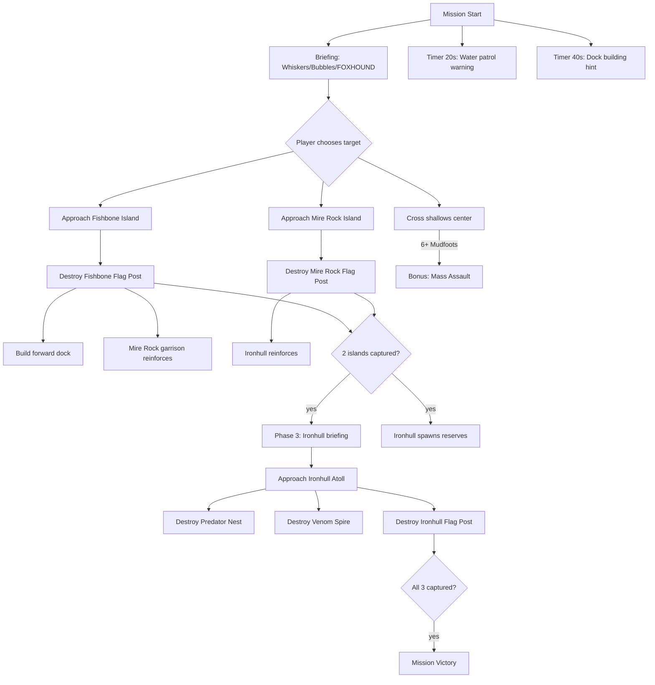

# Mission 4-2: IRON DELTA

## Header
- **ID**: `mission_14`
- **Chapter**: 4 — Final Offensive
- **Map**: 160x160 tiles (5120x5120px)
- **Setting**: The Iron Delta — the widest navigable river system in Copper-Silt Reach, now a Scale-Guard naval stronghold. Three fortified island outposts control the waterways: Fishbone Island (west), Ironhull Atoll (center), and Mire Rock (east). Deep channels between islands are patrolled by Scale-Guard river forces. The only way across is water — boats, rafts, and swimmers. The player must seize all three islands to control the delta and cut Scale-Guard supply lines for the final push.
- **Win**: Capture all 3 island outposts (destroy each island's Flag Post)
- **Lose**: Lodge destroyed
- **Par Time**: 15 minutes
- **Unlocks**: All remaining units and buildings (full roster available from this point forward)

## Zone Map
```
    0         32        64        96       128       160
  0 |---------|---------|---------|---------|---------|
    |  deep_channel_nw  | ironhull_atoll            |
    |  (open water)     | (center island, largest)   |
 20 |---------|---------|---------|---------|---------|
    |         | channel_west      | channel_east      |
    |         | (deep water)      | (deep water)      |
 32 |---------|---------|---------|---------|---------|
    | fishbone_island   |         | mire_rock_island  |
    | (west island)     | central | (east island)     |
    |                   | channel |                   |
 52 |---------|---------|---------|---------|---------|
    |         |  shallows         |                   |
    |         |  (ford-able)      |                   |
 64 |---------|---------|---------|---------|---------|
    | deep_channel_sw   |         | deep_channel_se   |
    | (open water)      |         | (open water)      |
 80 |---------|---------|---------|---------|---------|
    | reef_west         | southern_channel| reef_east |
    | (shallow reef)    | (patrol route)  | (reef)    |
 96 |---------|---------|---------|---------|---------|
    |         | landing_island                        |
    | coast_w | (player start — southern island)      |
    |         |                                       |
120 |---------|---------|---------|---------|---------|
    | coast_sw          | player_base     | coast_se  |
    | (mangrove beach)  | (lodge area)    | (beach)   |
140 |---------|---------|---------|---------|---------|
    | supply_shore                                    |
    | (rear supply area, docks)                       |
160 |---------|---------|---------|---------|---------|
```

## Zones (tile coordinates)
```typescript
zones: {
  player_base:        { x: 48, y: 120, width: 64,  height: 20 },
  supply_shore:       { x: 0,  y: 140, width: 160, height: 20 },
  coast_sw:           { x: 0,  y: 120, width: 48,  height: 20 },
  coast_se:           { x: 112,y: 120, width: 48,  height: 20 },
  landing_island:     { x: 40, y: 96,  width: 80,  height: 24 },
  reef_west:          { x: 0,  y: 80,  width: 40,  height: 16 },
  reef_east:          { x: 120,y: 80,  width: 40,  height: 16 },
  southern_channel:   { x: 40, y: 80,  width: 80,  height: 16 },
  deep_channel_sw:    { x: 0,  y: 64,  width: 48,  height: 16 },
  deep_channel_se:    { x: 112,y: 64,  width: 48,  height: 16 },
  shallows:           { x: 48, y: 52,  width: 64,  height: 12 },
  fishbone_island:    { x: 0,  y: 28,  width: 56,  height: 28 },
  central_channel:    { x: 56, y: 32,  width: 48,  height: 20 },
  mire_rock_island:   { x: 104,y: 28,  width: 56,  height: 28 },
  channel_west:       { x: 32, y: 20,  width: 40,  height: 12 },
  channel_east:       { x: 88, y: 20,  width: 40,  height: 12 },
  ironhull_atoll:     { x: 48, y: 0,   width: 72,  height: 24 },
  deep_channel_nw:    { x: 0,  y: 0,   width: 48,  height: 28 },
}
```

## Terrain Regions
```typescript
terrain: {
  width: 160, height: 160,
  regions: [
    // Base layer — water everywhere
    { terrainId: "deep_water", fill: true },
    // Player's southern island
    { terrainId: "grass", rect: { x: 40, y: 96, w: 80, h: 24 } },
    { terrainId: "beach", rect: { x: 40, y: 118, w: 80, h: 4 } },
    { terrainId: "dirt", rect: { x: 48, y: 100, w: 64, h: 16 } },
    // Southern shore (player base mainland)
    { terrainId: "grass", rect: { x: 0, y: 120, w: 160, h: 40 } },
    { terrainId: "beach", rect: { x: 0, y: 118, w: 40, h: 4 } },
    { terrainId: "beach", rect: { x: 120, y: 118, w: 40, h: 4 } },
    { terrainId: "mangrove", rect: { x: 0, y: 124, w: 40, h: 12 } },
    { terrainId: "mangrove", rect: { x: 124, y: 124, w: 36, h: 12 } },
    // Fishbone Island (west)
    { terrainId: "grass", rect: { x: 4, y: 30, w: 48, h: 24 } },
    { terrainId: "beach", rect: { x: 4, y: 28, w: 48, h: 2 } },
    { terrainId: "beach", rect: { x: 4, y: 54, w: 48, h: 2 } },
    { terrainId: "beach", rect: { x: 2, y: 30, w: 2, h: 24 } },
    { terrainId: "beach", rect: { x: 52, y: 30, w: 2, h: 24 } },
    { terrainId: "dirt", rect: { x: 12, y: 34, w: 32, h: 16 } },
    { terrainId: "mangrove", rect: { x: 6, y: 32, w: 8, h: 12 } },
    // Ironhull Atoll (center-north, largest)
    { terrainId: "grass", rect: { x: 52, y: 2, w: 64, h: 20 } },
    { terrainId: "beach", rect: { x: 52, y: 0, w: 64, h: 2 } },
    { terrainId: "beach", rect: { x: 52, y: 22, w: 64, h: 2 } },
    { terrainId: "beach", rect: { x: 50, y: 2, w: 2, h: 20 } },
    { terrainId: "beach", rect: { x: 116, y: 2, w: 2, h: 20 } },
    { terrainId: "dirt", rect: { x: 60, y: 4, w: 48, h: 16 } },
    { terrainId: "concrete", rect: { x: 72, y: 6, w: 24, h: 12 } },
    // Mire Rock Island (east)
    { terrainId: "grass", rect: { x: 108, y: 30, w: 48, h: 24 } },
    { terrainId: "beach", rect: { x: 108, y: 28, w: 48, h: 2 } },
    { terrainId: "beach", rect: { x: 108, y: 54, w: 48, h: 2 } },
    { terrainId: "beach", rect: { x: 106, y: 30, w: 2, h: 24 } },
    { terrainId: "beach", rect: { x: 156, y: 30, w: 2, h: 24 } },
    { terrainId: "dirt", rect: { x: 116, y: 34, w: 32, h: 16 } },
    { terrainId: "mud", rect: { x: 108, y: 42, w: 16, h: 8 } },
    // Shallow fords (wadeable water between islands)
    { terrainId: "shallow_water", rect: { x: 48, y: 52, w: 64, h: 12 } },
    // Reef areas (shallow but rocky — slow movement)
    { terrainId: "reef", rect: { x: 4, y: 82, w: 32, h: 12 } },
    { terrainId: "reef", rect: { x: 124, y: 82, w: 32, h: 12 } },
    // Supply docks (southern shore)
    { terrainId: "dirt", rect: { x: 56, y: 140, w: 48, h: 8 } },
    { terrainId: "concrete", rect: { x: 64, y: 142, w: 32, h: 4 } },
  ],
  overrides: [
    // Dock pilings on landing island (south-facing)
    ...dockTiles(60, 118, 80, 118), // landing island south dock
    // Dock pilings on Fishbone (east-facing)
    ...dockTiles(52, 38, 52, 46),
    // Dock pilings on Mire Rock (west-facing)
    ...dockTiles(106, 38, 106, 46),
    // Dock pilings on Ironhull (south-facing)
    ...dockTiles(72, 22, 96, 22),
  ]
}
```

## Placements

### Player (player_base + landing_island)
```typescript
// Lodge on southern mainland
{ type: "lodge", faction: "ura", x: 80, y: 130 },
// Command Post (pre-built)
{ type: "command_post", faction: "ura", x: 72, y: 126 },
// Barracks (pre-built)
{ type: "barracks", faction: "ura", x: 88, y: 126 },
// Armory (pre-built)
{ type: "armory", faction: "ura", x: 64, y: 130 },
// Dock (pre-built — essential for this mission)
{ type: "dock", faction: "ura", x: 80, y: 122 },
// Burrows (3)
{ type: "burrow", faction: "ura", x: 76, y: 134 },
{ type: "burrow", faction: "ura", x: 84, y: 134 },
{ type: "burrow", faction: "ura", x: 92, y: 134 },
// Shield Generator (from Mission 13 unlock)
{ type: "shield_generator", faction: "ura", x: 96, y: 130 },
// Starting workers
{ type: "river_rat", faction: "ura", x: 70, y: 132 },
{ type: "river_rat", faction: "ura", x: 74, y: 133 },
{ type: "river_rat", faction: "ura", x: 78, y: 132 },
{ type: "river_rat", faction: "ura", x: 82, y: 133 },
{ type: "river_rat", faction: "ura", x: 86, y: 132 },
{ type: "river_rat", faction: "ura", x: 90, y: 133 },
// Starting land army (on landing island)
{ type: "mudfoot", faction: "ura", x: 56, y: 104 },
{ type: "mudfoot", faction: "ura", x: 60, y: 104 },
{ type: "mudfoot", faction: "ura", x: 64, y: 104 },
{ type: "mudfoot", faction: "ura", x: 68, y: 104 },
{ type: "mudfoot", faction: "ura", x: 72, y: 104 },
{ type: "shellcracker", faction: "ura", x: 80, y: 106 },
{ type: "shellcracker", faction: "ura", x: 84, y: 106 },
{ type: "shellcracker", faction: "ura", x: 88, y: 106 },
{ type: "mortar_otter", faction: "ura", x: 76, y: 108 },
{ type: "mortar_otter", faction: "ura", x: 82, y: 108 },
{ type: "sapper", faction: "ura", x: 92, y: 104 },
// Starting naval units
{ type: "raftsman", faction: "ura", x: 68, y: 116 },
{ type: "raftsman", faction: "ura", x: 74, y: 116 },
{ type: "raftsman", faction: "ura", x: 80, y: 116 },
{ type: "diver", faction: "ura", x: 86, y: 116 },
{ type: "diver", faction: "ura", x: 90, y: 116 },
```

### Resources
```typescript
// Timber (mangrove shores SW and SE)
{ type: "mangrove_tree", faction: "neutral", x: 6,  y: 126 },
{ type: "mangrove_tree", faction: "neutral", x: 12, y: 128 },
{ type: "mangrove_tree", faction: "neutral", x: 18, y: 130 },
{ type: "mangrove_tree", faction: "neutral", x: 24, y: 126 },
{ type: "mangrove_tree", faction: "neutral", x: 30, y: 132 },
{ type: "mangrove_tree", faction: "neutral", x: 128, y: 126 },
{ type: "mangrove_tree", faction: "neutral", x: 134, y: 128 },
{ type: "mangrove_tree", faction: "neutral", x: 140, y: 130 },
{ type: "mangrove_tree", faction: "neutral", x: 146, y: 126 },
{ type: "mangrove_tree", faction: "neutral", x: 152, y: 132 },
// Timber on Fishbone Island (small grove)
{ type: "mangrove_tree", faction: "neutral", x: 8,  y: 34 },
{ type: "mangrove_tree", faction: "neutral", x: 10, y: 38 },
{ type: "mangrove_tree", faction: "neutral", x: 12, y: 42 },
// Fish (abundant — delta is rich fishing ground)
{ type: "fish_spot", faction: "neutral", x: 30, y: 90 },
{ type: "fish_spot", faction: "neutral", x: 50, y: 88 },
{ type: "fish_spot", faction: "neutral", x: 70, y: 92 },
{ type: "fish_spot", faction: "neutral", x: 90, y: 86 },
{ type: "fish_spot", faction: "neutral", x: 110, y: 90 },
{ type: "fish_spot", faction: "neutral", x: 130, y: 88 },
{ type: "fish_spot", faction: "neutral", x: 60, y: 60 },
{ type: "fish_spot", faction: "neutral", x: 100, y: 58 },
// Salvage (on enemy islands — reward for capture)
{ type: "salvage_cache", faction: "neutral", x: 20, y: 40 },
{ type: "salvage_cache", faction: "neutral", x: 28, y: 44 },
{ type: "salvage_cache", faction: "neutral", x: 36, y: 38 },
{ type: "salvage_cache", faction: "neutral", x: 120, y: 40 },
{ type: "salvage_cache", faction: "neutral", x: 128, y: 44 },
{ type: "salvage_cache", faction: "neutral", x: 136, y: 38 },
{ type: "salvage_cache", faction: "neutral", x: 76, y: 8 },
{ type: "salvage_cache", faction: "neutral", x: 84, y: 12 },
{ type: "salvage_cache", faction: "neutral", x: 92, y: 8 },
```

### Enemies

#### Fishbone Island (west — lightly defended)
```typescript
{ type: "flag_post", faction: "scale_guard", x: 28, y: 40 },
{ type: "watchtower", faction: "scale_guard", x: 16, y: 36 },
{ type: "watchtower", faction: "scale_guard", x: 40, y: 44 },
{ type: "gator", faction: "scale_guard", x: 20, y: 38 },
{ type: "gator", faction: "scale_guard", x: 24, y: 42 },
{ type: "gator", faction: "scale_guard", x: 32, y: 36 },
{ type: "gator", faction: "scale_guard", x: 36, y: 42 },
{ type: "skink", faction: "scale_guard", x: 44, y: 38 },
{ type: "skink", faction: "scale_guard", x: 12, y: 44 },
// Dock defense
{ type: "gator", faction: "scale_guard", x: 50, y: 40 },
{ type: "gator", faction: "scale_guard", x: 50, y: 44 },
```

#### Mire Rock Island (east — medium defense)
```typescript
{ type: "flag_post", faction: "scale_guard", x: 132, y: 40 },
{ type: "watchtower", faction: "scale_guard", x: 120, y: 34 },
{ type: "watchtower", faction: "scale_guard", x: 144, y: 34 },
{ type: "watchtower", faction: "scale_guard", x: 132, y: 48 },
{ type: "bunker", faction: "scale_guard", x: 124, y: 40 },
{ type: "gator", faction: "scale_guard", x: 116, y: 38 },
{ type: "gator", faction: "scale_guard", x: 120, y: 42 },
{ type: "gator", faction: "scale_guard", x: 128, y: 36 },
{ type: "gator", faction: "scale_guard", x: 136, y: 42 },
{ type: "gator", faction: "scale_guard", x: 140, y: 38 },
{ type: "gator", faction: "scale_guard", x: 148, y: 40 },
{ type: "viper", faction: "scale_guard", x: 126, y: 46 },
{ type: "viper", faction: "scale_guard", x: 138, y: 46 },
{ type: "croc_champion", faction: "scale_guard", x: 132, y: 44 },
```

#### Ironhull Atoll (center-north — heavily fortified, the command island)
```typescript
{ type: "flag_post", faction: "scale_guard", x: 84, y: 10 },
{ type: "predator_nest", faction: "scale_guard", x: 76, y: 8 },
{ type: "watchtower", faction: "scale_guard", x: 60, y: 6 },
{ type: "watchtower", faction: "scale_guard", x: 72, y: 4 },
{ type: "watchtower", faction: "scale_guard", x: 96, y: 4 },
{ type: "watchtower", faction: "scale_guard", x: 108, y: 6 },
{ type: "bunker", faction: "scale_guard", x: 64, y: 12 },
{ type: "bunker", faction: "scale_guard", x: 100, y: 12 },
{ type: "venom_spire", faction: "scale_guard", x: 84, y: 18 },
{ type: "croc_champion", faction: "scale_guard", x: 68, y: 10 },
{ type: "croc_champion", faction: "scale_guard", x: 80, y: 14 },
{ type: "croc_champion", faction: "scale_guard", x: 96, y: 10 },
{ type: "gator", faction: "scale_guard", x: 56, y: 8 },
{ type: "gator", faction: "scale_guard", x: 60, y: 14 },
{ type: "gator", faction: "scale_guard", x: 72, y: 16 },
{ type: "gator", faction: "scale_guard", x: 88, y: 16 },
{ type: "gator", faction: "scale_guard", x: 100, y: 14 },
{ type: "gator", faction: "scale_guard", x: 108, y: 10 },
{ type: "viper", faction: "scale_guard", x: 64, y: 6 },
{ type: "viper", faction: "scale_guard", x: 104, y: 6 },
{ type: "snapper", faction: "scale_guard", x: 76, y: 12 },
{ type: "snapper", faction: "scale_guard", x: 92, y: 12 },
```

#### Water Patrols (roaming between islands)
```typescript
// Western channel patrol
{ type: "gator", faction: "scale_guard", x: 40, y: 24,
  patrol: [[40,24],[40,48],[28,60],[40,24]] },
{ type: "gator", faction: "scale_guard", x: 44, y: 26,
  patrol: [[44,26],[44,50],[32,62],[44,26]] },
// Eastern channel patrol
{ type: "gator", faction: "scale_guard", x: 116, y: 24,
  patrol: [[116,24],[116,48],[128,60],[116,24]] },
{ type: "gator", faction: "scale_guard", x: 120, y: 26,
  patrol: [[120,26],[120,50],[132,62],[120,26]] },
// Central channel patrol
{ type: "gator", faction: "scale_guard", x: 72, y: 28,
  patrol: [[72,28],[88,28],[96,40],[72,40],[72,28]] },
{ type: "gator", faction: "scale_guard", x: 76, y: 30,
  patrol: [[76,30],[92,30],[100,42],[76,42],[76,30]] },
// Southern channel patrol
{ type: "skink", faction: "scale_guard", x: 60, y: 84,
  patrol: [[60,84],[100,84],[60,84]] },
{ type: "skink", faction: "scale_guard", x: 64, y: 86,
  patrol: [[64,86],[104,86],[64,86]] },
```

## Phases

### Phase 1: CONTROL THE WATERWAYS (0:00 - ~5:00)
**Entry**: Mission start
**State**: Pre-built base on southern mainland with dock. Army staged on landing island. 500 fish / 300 timber / 250 salvage. Landing island and southern shore visible. All three enemy islands fogged.
**Objectives**:
- "Capture Fishbone Island — destroy the Flag Post" (PRIMARY)
- "Capture Mire Rock Island — destroy the Flag Post" (PRIMARY)
- "Capture Ironhull Atoll — destroy the Flag Post" (PRIMARY)

**Triggers**:
```
[0:00] mission-briefing
  Condition: missionStart()
  Action: exchange([
    { speaker: "Gen. Whiskers", text: "The Iron Delta, Captain. Three islands control the waterways that feed the entire northern Reach. Scale-Guard holds all three." },
    { speaker: "Col. Bubbles", text: "Fishbone Island to the west, Mire Rock to the east, Ironhull Atoll in the center-north. Each one has a Flag Post — destroy it, the island is ours." },
    { speaker: "FOXHOUND", text: "This is amphibious warfare, Captain. Raftsmen can ferry troops across. Divers can swim undetected through deep channels. Use the shallows in the center for mass crossings." },
    { speaker: "Col. Bubbles", text: "Fishbone looks weakest. Start there, build a forward dock, and leapfrog to the next. Control the water, control the delta." }
  ])

[0:20] foxhound-water-patrol
  Condition: timer(20)
  Action: dialogue("foxhound", "Water patrols between the islands. Skinks in the south channel, Gators in the north. Time your crossings between patrol sweeps — or send Divers to eliminate the patrols first.")

[0:40] bubbles-dock-hint
  Condition: timer(40)
  Action: dialogue("col_bubbles", "Build additional docks on captured islands, Captain. Shorter water crossings mean faster reinforcement.")
```

### Phase 2: FISHBONE SECURED (~5:00 - ~8:00)
**Entry**: Fishbone Island Flag Post destroyed
**New objectives**: (Fishbone captured — remaining objectives continue)

**Triggers**:
```
fishbone-approach
  Condition: areaEntered("ura", "fishbone_island")
  Action: dialogue("foxhound", "Landfall on Fishbone. Watchtowers have eyes on the eastern beach — hit them from the mangrove side.")

fishbone-captured
  Condition: buildingCount("scale_guard", "flag_post", "eq", 2)  // One of 3 destroyed
  Action: [
    completeObjective("capture-fishbone"),
    exchange([
      { speaker: "Col. Bubbles", text: "Fishbone Island is ours! Establish a forward dock there — you'll need it for the push to Ironhull." },
      { speaker: "FOXHOUND", text: "Mire Rock garrison is mobilizing. They know we're in the delta now. Expect heavier resistance on the next island." }
    ]),
    spawn("gator", "scale_guard", 112, 34, 3),
    spawn("viper", "scale_guard", 108, 36, 2)
  ]

fishbone-dock-built
  Condition: buildingCountInZone("ura", "fishbone_island", "dock", "gte", 1)
  Action: dialogue("foxhound", "Forward dock on Fishbone operational. Troops can stage here for the next crossing.")
```

### Phase 3: TWO-FRONT ASSAULT (~8:00 - ~12:00)
**Entry**: Mire Rock or second island captured
**State**: Player should be building forward infrastructure on captured islands. Water control is shifting.

**Triggers**:
```
mire-rock-approach
  Condition: areaEntered("ura", "mire_rock_island")
  Action: exchange([
    { speaker: "FOXHOUND", text: "Mire Rock. Mud terrain slows movement on the western shore. The bunker on the east side has a Croc Champion inside." },
    { speaker: "Col. Bubbles", text: "Suppress that bunker with Mortar Otters before you push infantry in." }
  ])

mire-rock-captured
  Condition: buildingCount("scale_guard", "flag_post", "eq", 1)  // Two of 3 destroyed
  Action: [
    completeObjective("capture-mire-rock"),
    exchange([
      { speaker: "Col. Bubbles", text: "Mire Rock is down! One island left — Ironhull Atoll." },
      { speaker: "FOXHOUND", text: "Ironhull is their command island, Captain. Predator Nest, Venom Spire, Croc Champions — the full package. This is the big one." },
      { speaker: "Gen. Whiskers", text: "Bring everything you've got, Captain. Take that atoll and we own the delta." }
    ]),
    spawn("croc_champion", "scale_guard", 80, 20, 2),
    spawn("gator", "scale_guard", 72, 22, 4)
  ]

[phase3 + 60s] ironhull-reinforcement
  Condition: timer(60) after second island captured
  Action: [
    spawn("gator", "scale_guard", 60, 10, 3),
    spawn("gator", "scale_guard", 100, 10, 3),
    dialogue("foxhound", "Ironhull is pulling in reserves. The Predator Nest is spawning fresh Gators. Move fast before they dig in deeper.")
  ]
```

### Phase 4: IRONHULL ASSAULT (~12:00+)
**Entry**: URA unit enters ironhull_atoll zone
**State**: Final island. Everything the enemy has left.

**Triggers**:
```
ironhull-approach
  Condition: areaEntered("ura", "ironhull_atoll")
  Action: exchange([
    { speaker: "FOXHOUND", text: "On the atoll. They've concentrated everything here — watchtowers at every approach, Venom Spire covering the center, Croc Champions at the flag." },
    { speaker: "Col. Bubbles", text: "Hit the Venom Spire first — it'll shred your forces if you ignore it. Then push for the Flag Post." }
  ])

predator-nest-destroyed
  Condition: buildingCount("scale_guard", "predator_nest", "eq", 0)
  Action: dialogue("foxhound", "Predator Nest is down. No more reinforcements from the atoll. Clean up what's left.")

ironhull-captured
  Condition: buildingCount("scale_guard", "flag_post", "eq", 0)  // All 3 destroyed
  Action: completeObjective("capture-ironhull")

mission-complete
  Condition: allPrimaryComplete()
  Action: exchange([
    { speaker: "Gen. Whiskers", text: "The Iron Delta is ours. Every waterway, every island — OEF controls the heart of the Reach." },
    { speaker: "FOXHOUND", text: "Scale-Guard naval capacity is shattered. They can't resupply their inland positions anymore." },
    { speaker: "Col. Bubbles", text: "Intel reports the Serpent King has retreated to his citadel. We know where he is, Captain. Rest your troops — the next mission is the one that matters." }
  ], followed by: victory())
```

### Bonus Objective
```
all-islands-no-lodge-damage
  Condition: allPrimaryComplete() AND healthThreshold("lodge", 100)
  Action: completeObjective("bonus-untouchable-base")

shallows-crossing
  Condition: unitCount("ura", "mudfoot", "gte", 6, zone: "shallows")
  Action: [
    dialogue("foxhound", "Mass crossing through the shallows. Bold move, Captain."),
    completeObjective("bonus-mass-assault")
  ]
```

## Trigger Flowchart


## Balance Notes
- **Starting resources**: 500 fish, 300 timber, 250 salvage — generous economy needed for amphibious force construction
- **Water traversal costs**: Raftsman carries 4 units per trip, Divers swim independently. Building forward docks (200 timber each) is the intended infrastructure play
- **Island difficulty curve**: Fishbone (10 enemies) < Mire Rock (14 enemies + bunker) < Ironhull (22 enemies + buildings)
- **Water patrol timing**: Patrols cycle every 20 seconds. Player can time crossings between sweeps or eliminate patrols with Divers
- **Forward dock strategy**: Building docks on Fishbone and Mire Rock cuts crossing distance in half. Strongly encouraged by dialogue
- **Order flexibility**: Player can attack any island first, but Fishbone is signposted as easiest. Ironhull must be taken last (dialogue gates the narrative climax)
- **Total enemy count**: ~55 static + ~15 spawned reinforcements = ~70 enemies
- **Enemy scaling** (difficulty):
  - Support: Water patrols removed, Fishbone has 6 enemies, Ironhull has 16, no Predator Nest spawn
  - Tactical: as written
  - Elite: Water patrols doubled, each island +4 enemies, Ironhull gets second Venom Spire, reinforcements spawn every 45s
- **Par time**: 15 minutes on Tactical — largest map, multiple objectives, water traversal adds time
