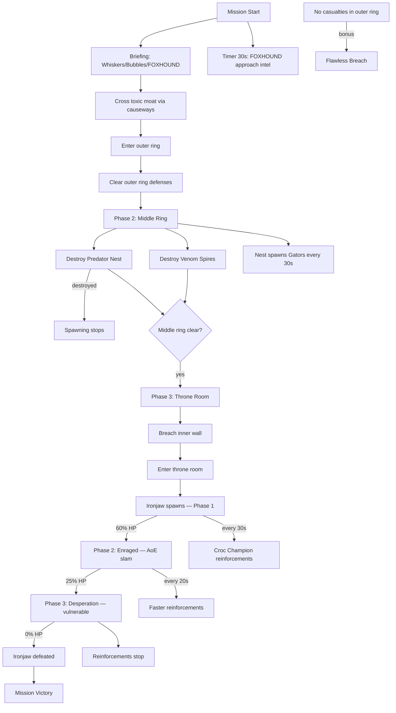

# Mission 4-3: SERPENT'S LAIR

## Header
- **ID**: `mission_15`
- **Chapter**: 4 — Final Offensive
- **Map**: 128x128 tiles (4096x4096px)
- **Setting**: Kommandant Ironjaw's personal citadel — a concentric fortress built into the volcanic rock of the Reach's highest bluff. Three rings of defense surround the throne room at the center. A toxic moat circles the outer wall. Inside, Scale-Guard's most elite forces guard their commander. This is where the Serpent King makes his last stand — or where the OEF campaign dies.
- **Win**: Defeat Kommandant Ironjaw (boss unit — 3 phases)
- **Lose**: Lodge destroyed OR all units killed inside the citadel
- **Par Time**: 15 minutes
- **Unlocks**: (none — all units/buildings already available)

## Zone Map
```
    0         32        64        96       128
  0 |---------|---------|---------|---------|
    | cliffs_nw         | cliffs_ne                |
    | (impassable)      | (impassable)             |
 12 |---------|---------|---------|---------|
    |    | outer_wall_north                |    |
    |    | (fortified perimeter)           |    |
 20 |---------|---------|---------|---------|
    |    | outer_ring_w  | outer_ring_e    |    |
    |    | (garrison)    | (garrison)      |    |
 28 |---------|---------|---------|---------|
    |    |    | middle_wall               |    |
    |    |    | (second perimeter)        |    |
 36 |---------|---------|---------|---------|
    |    |    | middle_ring               |    |
    |    |    | (elite guard barracks)    |    |
 44 |---------|---------|---------|---------|
    |    |    |    | inner_wall    |       |    |
    |    |    |    | (final wall)  |       |    |
 48 |---------|---------|---------|---------|
    |    |    |    | throne_room   |       |    |
    |    |    |    | (Ironjaw)     |       |    |
 60 |---------|---------|---------|---------|
    |    |    | middle_ring_south          |    |
    |    |    | (champion garrison)        |    |
 68 |---------|---------|---------|---------|
    |    | outer_ring_south                |    |
    |    | (staging yard, patrols)         |    |
 80 |---------|---------|---------|---------|
    | toxic_moat                                   |
    | (toxic water, damages units)                 |
 88 |---------|---------|---------|---------|
    | approach_west     | approach_road   | app_e  |
    | (jungle cover)    | (main road)     |(ruins) |
100 |---------|---------|---------|---------|
    | siege_staging     | forward_camp    | flank_e|
    | (siege weapons)   | (player rally)  | (path) |
112 |---------|---------|---------|---------|
    | player_base                                  |
    | (lodge, full base, all buildings)            |
128 |---------|---------|---------|---------|
```

## Zones (tile coordinates)
```typescript
zones: {
  player_base:        { x: 16, y: 112, width: 96, height: 16 },
  siege_staging:      { x: 8,  y: 100, width: 40, height: 12 },
  forward_camp:       { x: 48, y: 100, width: 32, height: 12 },
  flank_east:         { x: 88, y: 100, width: 32, height: 12 },
  approach_west:      { x: 8,  y: 88,  width: 40, height: 12 },
  approach_road:      { x: 48, y: 88,  width: 32, height: 12 },
  approach_east:      { x: 88, y: 88,  width: 32, height: 12 },
  toxic_moat:         { x: 0,  y: 80,  width: 128,height: 8  },
  outer_ring_south:   { x: 24, y: 68,  width: 80, height: 12 },
  outer_wall_north:   { x: 24, y: 12,  width: 80, height: 8  },
  outer_ring_w:       { x: 24, y: 20,  width: 36, height: 8  },
  outer_ring_e:       { x: 68, y: 20,  width: 36, height: 8  },
  middle_ring:        { x: 36, y: 28,  width: 56, height: 16 },
  middle_ring_south:  { x: 36, y: 60,  width: 56, height: 8  },
  inner_wall:         { x: 48, y: 44,  width: 32, height: 4  },
  throne_room:        { x: 48, y: 48,  width: 32, height: 12 },
  cliffs_nw:          { x: 0,  y: 0,   width: 24, height: 20 },
  cliffs_ne:          { x: 104,y: 0,   width: 24, height: 20 },
}
```

## Terrain Regions
```typescript
terrain: {
  width: 128, height: 128,
  regions: [
    { terrainId: "grass", fill: true },
    // Volcanic rock (citadel foundation — entire northern half)
    { terrainId: "rock", rect: { x: 0, y: 0, w: 128, h: 88 } },
    // Cliffs (impassable edges)
    { terrainId: "cliff", rect: { x: 0, y: 0, w: 24, h: 20 } },
    { terrainId: "cliff", rect: { x: 104, y: 0, w: 24, h: 20 } },
    // Toxic moat (ring around citadel)
    { terrainId: "toxic_water", rect: { x: 8, y: 80, w: 112, h: 8 } },
    { terrainId: "toxic_water", rect: { x: 8, y: 12, w: 16, h: 68 } },
    { terrainId: "toxic_water", rect: { x: 104, y: 12, w: 16, h: 68 } },
    // Outer ring — cleared ground
    { terrainId: "dirt", rect: { x: 24, y: 12, w: 80, h: 68 } },
    // Middle ring — paved fortress
    { terrainId: "concrete", rect: { x: 36, y: 28, w: 56, h: 40 } },
    // Throne room — metal/stone
    { terrainId: "metal", rect: { x: 48, y: 48, w: 32, h: 12 } },
    // Approach terrain (south of moat)
    { terrainId: "jungle", rect: { x: 8, y: 88, w: 40, h: 12 } },
    { terrainId: "dirt", rect: { x: 48, y: 88, w: 32, h: 12 } },
    { terrainId: "dirt", rect: { x: 88, y: 88, w: 32, h: 12 } },
    // Player base — grass clearing
    { terrainId: "grass", rect: { x: 16, y: 100, w: 96, h: 28 } },
    { terrainId: "dirt", rect: { x: 32, y: 112, w: 64, h: 16 } },
    // Mud at moat edges
    { terrainId: "mud", rect: { x: 8, y: 78, w: 112, h: 2 } },
    { terrainId: "mud", rect: { x: 8, y: 88, w: 112, h: 2 } },
    // Mangrove along approach
    { terrainId: "mangrove", rect: { x: 0, y: 96, w: 16, h: 16 } },
    { terrainId: "mangrove", rect: { x: 112, y: 96, w: 16, h: 16 } },
  ],
  overrides: [
    // Causeway bridges over toxic moat (3 crossing points)
    ...bridgeTiles(32, 80, 32, 88),   // west causeway
    ...bridgeTiles(64, 80, 64, 88),   // center causeway (main gate)
    ...bridgeTiles(96, 80, 96, 88),   // east causeway
    // Gate breaches in outer wall (pre-damaged)
    ...gateTiles(64, 12, 4),          // north gate (sealed)
    ...gateTiles(32, 68, 4),          // south-west gate
    ...gateTiles(64, 76, 4),          // south gate (main)
    ...gateTiles(96, 68, 4),          // south-east gate
  ]
}
```

## Placements

### Player (player_base)
```typescript
// Lodge (Captain's field HQ)
{ type: "lodge", faction: "ura", x: 64, y: 120 },
// Full base (pre-built for Chapter 4 finale)
{ type: "command_post", faction: "ura", x: 52, y: 116 },
{ type: "barracks", faction: "ura", x: 76, y: 116 },
{ type: "armory", faction: "ura", x: 44, y: 120 },
{ type: "siege_workshop", faction: "ura", x: 84, y: 120 },
{ type: "shield_generator", faction: "ura", x: 56, y: 124 },
{ type: "dock", faction: "ura", x: 72, y: 124 },
// Burrows (4)
{ type: "burrow", faction: "ura", x: 36, y: 118 },
{ type: "burrow", faction: "ura", x: 48, y: 124 },
{ type: "burrow", faction: "ura", x: 80, y: 124 },
{ type: "burrow", faction: "ura", x: 92, y: 118 },
// Starting workers
{ type: "river_rat", faction: "ura", x: 50, y: 114 },
{ type: "river_rat", faction: "ura", x: 54, y: 115 },
{ type: "river_rat", faction: "ura", x: 58, y: 114 },
{ type: "river_rat", faction: "ura", x: 62, y: 115 },
{ type: "river_rat", faction: "ura", x: 66, y: 114 },
{ type: "river_rat", faction: "ura", x: 70, y: 115 },
// Full assault army
{ type: "mudfoot", faction: "ura", x: 48, y: 106 },
{ type: "mudfoot", faction: "ura", x: 52, y: 106 },
{ type: "mudfoot", faction: "ura", x: 56, y: 106 },
{ type: "mudfoot", faction: "ura", x: 60, y: 106 },
{ type: "mudfoot", faction: "ura", x: 64, y: 106 },
{ type: "mudfoot", faction: "ura", x: 68, y: 106 },
{ type: "shellcracker", faction: "ura", x: 50, y: 108 },
{ type: "shellcracker", faction: "ura", x: 54, y: 108 },
{ type: "shellcracker", faction: "ura", x: 58, y: 108 },
{ type: "shellcracker", faction: "ura", x: 62, y: 108 },
{ type: "mortar_otter", faction: "ura", x: 66, y: 108 },
{ type: "mortar_otter", faction: "ura", x: 70, y: 108 },
{ type: "mortar_otter", faction: "ura", x: 74, y: 108 },
{ type: "sapper", faction: "ura", x: 78, y: 106 },
{ type: "sapper", faction: "ura", x: 82, y: 106 },
{ type: "sapper", faction: "ura", x: 86, y: 106 },
// Siege units (staged in siege_staging)
{ type: "mortar_otter", faction: "ura", x: 16, y: 104 },
{ type: "mortar_otter", faction: "ura", x: 20, y: 104 },
{ type: "sapper", faction: "ura", x: 24, y: 104 },
{ type: "sapper", faction: "ura", x: 28, y: 104 },
```

### Resources
```typescript
// Timber (mangrove flanks)
{ type: "mangrove_tree", faction: "neutral", x: 4,  y: 100 },
{ type: "mangrove_tree", faction: "neutral", x: 8,  y: 104 },
{ type: "mangrove_tree", faction: "neutral", x: 12, y: 102 },
{ type: "mangrove_tree", faction: "neutral", x: 6,  y: 108 },
{ type: "mangrove_tree", faction: "neutral", x: 116, y: 100 },
{ type: "mangrove_tree", faction: "neutral", x: 120, y: 104 },
{ type: "mangrove_tree", faction: "neutral", x: 118, y: 108 },
{ type: "mangrove_tree", faction: "neutral", x: 124, y: 102 },
// Fish (limited — this is a siege, not an economy mission)
{ type: "fish_spot", faction: "neutral", x: 20, y: 82 },
{ type: "fish_spot", faction: "neutral", x: 108, y: 82 },
// Salvage (inside the citadel — reward for breaching)
{ type: "salvage_cache", faction: "neutral", x: 32, y: 72 },
{ type: "salvage_cache", faction: "neutral", x: 96, y: 72 },
{ type: "salvage_cache", faction: "neutral", x: 44, y: 36 },
{ type: "salvage_cache", faction: "neutral", x: 84, y: 36 },
{ type: "salvage_cache", faction: "neutral", x: 56, y: 52 },
{ type: "salvage_cache", faction: "neutral", x: 72, y: 52 },
```

### Enemies

#### Outer Ring South (first line of defense inside moat)
```typescript
{ type: "sandbag_wall", faction: "scale_guard", x: 32, y: 76 },
{ type: "sandbag_wall", faction: "scale_guard", x: 48, y: 76 },
{ type: "sandbag_wall", faction: "scale_guard", x: 80, y: 76 },
{ type: "sandbag_wall", faction: "scale_guard", x: 96, y: 76 },
{ type: "watchtower", faction: "scale_guard", x: 40, y: 72 },
{ type: "watchtower", faction: "scale_guard", x: 64, y: 70 },
{ type: "watchtower", faction: "scale_guard", x: 88, y: 72 },
{ type: "gator", faction: "scale_guard", x: 28, y: 70 },
{ type: "gator", faction: "scale_guard", x: 36, y: 74 },
{ type: "gator", faction: "scale_guard", x: 52, y: 72 },
{ type: "gator", faction: "scale_guard", x: 60, y: 74 },
{ type: "gator", faction: "scale_guard", x: 68, y: 72 },
{ type: "gator", faction: "scale_guard", x: 76, y: 74 },
{ type: "gator", faction: "scale_guard", x: 92, y: 70 },
{ type: "gator", faction: "scale_guard", x: 100, y: 74 },
{ type: "viper", faction: "scale_guard", x: 44, y: 70 },
{ type: "viper", faction: "scale_guard", x: 84, y: 70 },
```

#### Outer Ring West & East
```typescript
// West garrison
{ type: "bunker", faction: "scale_guard", x: 28, y: 22 },
{ type: "gator", faction: "scale_guard", x: 30, y: 24 },
{ type: "gator", faction: "scale_guard", x: 36, y: 22 },
{ type: "gator", faction: "scale_guard", x: 42, y: 26 },
{ type: "viper", faction: "scale_guard", x: 34, y: 18 },
// East garrison
{ type: "bunker", faction: "scale_guard", x: 92, y: 22 },
{ type: "gator", faction: "scale_guard", x: 88, y: 24 },
{ type: "gator", faction: "scale_guard", x: 94, y: 22 },
{ type: "gator", faction: "scale_guard", x: 100, y: 26 },
{ type: "viper", faction: "scale_guard", x: 96, y: 18 },
```

#### Middle Ring (elite guard)
```typescript
{ type: "fortified_wall", faction: "scale_guard", x: 40, y: 28 },
{ type: "fortified_wall", faction: "scale_guard", x: 52, y: 28 },
{ type: "fortified_wall", faction: "scale_guard", x: 64, y: 28 },
{ type: "fortified_wall", faction: "scale_guard", x: 76, y: 28 },
{ type: "fortified_wall", faction: "scale_guard", x: 88, y: 28 },
{ type: "venom_spire", faction: "scale_guard", x: 48, y: 34 },
{ type: "venom_spire", faction: "scale_guard", x: 80, y: 34 },
{ type: "predator_nest", faction: "scale_guard", x: 64, y: 32 },
{ type: "croc_champion", faction: "scale_guard", x: 44, y: 36 },
{ type: "croc_champion", faction: "scale_guard", x: 56, y: 38 },
{ type: "croc_champion", faction: "scale_guard", x: 72, y: 38 },
{ type: "croc_champion", faction: "scale_guard", x: 84, y: 36 },
{ type: "gator", faction: "scale_guard", x: 40, y: 40 },
{ type: "gator", faction: "scale_guard", x: 50, y: 42 },
{ type: "gator", faction: "scale_guard", x: 64, y: 40 },
{ type: "gator", faction: "scale_guard", x: 78, y: 42 },
{ type: "gator", faction: "scale_guard", x: 88, y: 40 },
{ type: "viper", faction: "scale_guard", x: 46, y: 32 },
{ type: "viper", faction: "scale_guard", x: 64, y: 36 },
{ type: "viper", faction: "scale_guard", x: 82, y: 32 },
```

#### Inner Wall + Throne Room Approach
```typescript
{ type: "fortified_wall", faction: "scale_guard", x: 48, y: 44 },
{ type: "fortified_wall", faction: "scale_guard", x: 56, y: 44 },
{ type: "fortified_wall", faction: "scale_guard", x: 64, y: 44 },
{ type: "fortified_wall", faction: "scale_guard", x: 72, y: 44 },
{ type: "croc_champion", faction: "scale_guard", x: 52, y: 46 },
{ type: "croc_champion", faction: "scale_guard", x: 76, y: 46 },
```

#### BOSS: Kommandant Ironjaw (throne room — spawned on Phase 3 entry)
```typescript
// Not placed at start — spawned by trigger when inner wall breached
```

### Approach Defenses (outside moat)
```typescript
// Patrols on the approach road
{ type: "gator", faction: "scale_guard", x: 56, y: 92,
  patrol: [[56,92],[72,92],[56,92]] },
{ type: "gator", faction: "scale_guard", x: 60, y: 94,
  patrol: [[60,94],[76,94],[60,94]] },
{ type: "skink", faction: "scale_guard", x: 48, y: 90,
  patrol: [[48,90],[80,90],[48,90]] },
// Flanking ruins (east approach)
{ type: "gator", faction: "scale_guard", x: 96, y: 92 },
{ type: "gator", faction: "scale_guard", x: 100, y: 94 },
{ type: "viper", faction: "scale_guard", x: 104, y: 90 },
```

## Phases

### Phase 1: BREACH THE OUTER RING (0:00 - ~5:00)
**Entry**: Mission start
**State**: Full base, full army, 500 fish / 400 timber / 300 salvage. Approach zones and toxic moat visible. Citadel interior fogged.
**Objectives**:
- "Cross the toxic moat" (PRIMARY)
- "Clear the outer ring defenses" (PRIMARY)

**Triggers**:
```
[0:00] mission-briefing
  Condition: missionStart()
  Action: exchange([
    { speaker: "Gen. Whiskers", text: "The Serpent's Lair, Captain. Kommandant Ironjaw's citadel. Three rings of defense, a toxic moat, and every Croc Champion the Scale-Guard has left. He's in the throne room at the center." },
    { speaker: "Col. Bubbles", text: "Outer ring is the first obstacle. Sandbags, watchtowers, and Gators dug in behind the moat. Three causeways across — west, center, east." },
    { speaker: "FOXHOUND", text: "The moat is toxic sludge — any unit crossing through the water takes damage. Use the causeways. Sappers can widen them if you need a broader front." },
    { speaker: "Gen. Whiskers", text: "This is the man who ordered the occupation. The man who had me locked in a cage. Take his citadel apart, Captain. Ring by ring." }
  ])

[0:30] foxhound-approach
  Condition: timer(30)
  Action: dialogue("foxhound", "Approach road has Gator patrols. Western jungle offers concealment for flanking. Eastern ruins are lightly held — possible alternate entry.")

moat-crossing
  Condition: areaEntered("ura", "toxic_moat")
  Action: dialogue("foxhound", "Crossing the moat. Watch unit health — the sludge bites. Get across the causeways fast.")

outer-ring-entered
  Condition: areaEntered("ura", "outer_ring_south")
  Action: [
    completeObjective("cross-moat"),
    dialogue("col_bubbles", "Inside the outer ring! Clear these defenses — towers, sandbags, all of it."),
    revealZone("outer_ring_south"),
    revealZone("outer_ring_w"),
    revealZone("outer_ring_e")
  ]

outer-ring-clear
  Condition: enemyCountInZone("outer_ring_south", "lte", 0) AND
             enemyCountInZone("outer_ring_w", "lte", 0) AND
             enemyCountInZone("outer_ring_e", "lte", 0)
  Action: [
    completeObjective("clear-outer-ring"),
    dialogue("foxhound", "Outer ring is clear. Middle ring ahead — fortified walls and Venom Spires. This is where it gets ugly."),
    revealZone("middle_ring"),
    revealZone("middle_ring_south"),
    startPhase("middle-ring")
  ]
```

### Phase 2: SHATTER THE MIDDLE RING (~5:00 - ~10:00)
**Entry**: Outer ring cleared
**New objectives**:
- "Destroy the Venom Spires" (PRIMARY)
- "Breach the middle ring" (PRIMARY)

**Triggers**:
```
phase2-briefing
  Condition: enableTrigger (fired by Phase 1 completion)
  Action: exchange([
    { speaker: "Col. Bubbles", text: "Middle ring. Fortified walls, two Venom Spires, a Predator Nest, and four Croc Champions. Sappers on those walls, Mortars on the Spires." },
    { speaker: "FOXHOUND", text: "The Predator Nest will keep spawning defenders until you destroy it. Prioritize that." },
    { speaker: "Gen. Whiskers", text: "Ironjaw is watching. He knows we're coming. Let him watch us tear his fortress apart." }
  ])

predator-nest-destroyed
  Condition: buildingCount("scale_guard", "predator_nest", "eq", 0)
  Action: dialogue("col_bubbles", "Predator Nest is rubble. No more fresh Gators from that hole.")

[phase2 + 30s] nest-spawn-1
  Condition: timer(30) after phase2 start AND buildingCount("scale_guard", "predator_nest", "gte", 1)
  Action: spawn("gator", "scale_guard", 64, 34, 3)

[phase2 + 60s] nest-spawn-2
  Condition: timer(60) after phase2 start AND buildingCount("scale_guard", "predator_nest", "gte", 1)
  Action: spawn("gator", "scale_guard", 64, 34, 3)

[phase2 + 90s] nest-spawn-3
  Condition: timer(90) after phase2 start AND buildingCount("scale_guard", "predator_nest", "gte", 1)
  Action: [
    spawn("croc_champion", "scale_guard", 64, 34, 1),
    spawn("gator", "scale_guard", 64, 34, 2)
  ]

venom-spires-destroyed
  Condition: buildingCount("scale_guard", "venom_spire", "eq", 0)
  Action: dialogue("foxhound", "Both Venom Spires neutralized. The center approach is clear of artillery.")

middle-ring-clear
  Condition: enemyCountInZone("middle_ring", "lte", 2) AND
             enemyCountInZone("middle_ring_south", "lte", 0) AND
             buildingCount("scale_guard", "venom_spire", "eq", 0) AND
             buildingCount("scale_guard", "predator_nest", "eq", 0)
  Action: [
    completeObjective("destroy-spires"),
    completeObjective("breach-middle-ring"),
    exchange([
      { speaker: "Col. Bubbles", text: "Middle ring is broken! Inner wall is all that's left between us and Ironjaw." },
      { speaker: "FOXHOUND", text: "Two Croc Champions guarding the inner gate. The throne room is beyond. Ironjaw is in there — confirmed by thermal signatures." },
      { speaker: "Gen. Whiskers", text: "Blow that gate open. I want to look that iron-jawed monster in the eye." }
    ]),
    revealZone("inner_wall"),
    revealZone("throne_room"),
    startPhase("throne-room")
  ]
```

### Phase 3: THE SERPENT KING (~10:00 - ~15:00)
**Entry**: Middle ring breached
**New objectives**:
- "Defeat Kommandant Ironjaw" (PRIMARY)

**Triggers**:
```
phase3-briefing
  Condition: enableTrigger (fired by Phase 2 completion)
  Action: exchange([
    { speaker: "FOXHOUND", text: "Inner wall — fortified stone, two Croc Champions at the gate. Sappers can breach it." },
    { speaker: "Col. Bubbles", text: "Once you're through, it's Ironjaw and whatever personal guard he has left. Be ready for anything." }
  ])

inner-wall-breached
  Condition: buildingCountInZone("scale_guard", "inner_wall", "eq", 0)
  Action: [
    panCamera(64, 52, 2000),
    dialogue("foxhound", "Inner wall breached. Throne room is open.")
  ]

throne-room-entered
  Condition: areaEntered("ura", "throne_room")
  Action: [
    spawn("ironjaw", "scale_guard", 64, 52, 1, { hp: 5000, phase: 1 }),
    spawn("croc_champion", "scale_guard", 56, 54, 2),
    exchange([
      { speaker: "Kommandant Ironjaw", text: "So. The otters finally arrive. You've broken my walls. You've killed my soldiers. But you will not break ME." },
      { speaker: "Gen. Whiskers", text: "We'll see about that, Ironjaw. Captain — put him down." }
    ])
  ]

// BOSS PHASE 1: IRONJAW THE COMMANDER (100%-60% HP)
// Standard boss attacks — heavy melee, calls 2 Croc Champions every 30s
ironjaw-phase1-reinf
  Condition: timer(30) repeating while healthThreshold("ironjaw", "gt", 60)
  Action: spawn("croc_champion", "scale_guard", 64, 48, 2)

ironjaw-75
  Condition: healthThreshold("ironjaw", 75)
  Action: dialogue("ironjaw", "Is that all you have? The Reach belongs to the strong. It always has.")

// BOSS PHASE 2: IRONJAW ENRAGED (60%-25% HP)
ironjaw-60
  Condition: healthThreshold("ironjaw", 60)
  Action: [
    exchange([
      { speaker: "Kommandant Ironjaw", text: "ENOUGH! You want to see what a real predator can do?" },
      { speaker: "FOXHOUND", text: "Captain — he's powering up some kind of... his jaw is glowing. Area attack incoming! Spread your units!" }
    ]),
    setAbility("ironjaw", "iron_jaw_slam", true),  // Enables AoE ground slam
    setAbility("ironjaw", "call_reinforcements", "croc_champion", 20)  // Faster spawns
  ]

ironjaw-40
  Condition: healthThreshold("ironjaw", 40)
  Action: [
    dialogue("ironjaw", "You think this changes anything? Destroy me and another will take my place. The Scale-Guard endures!"),
    spawn("viper", "scale_guard", 52, 50, 2),
    spawn("viper", "scale_guard", 76, 50, 2)
  ]

// BOSS PHASE 3: IRONJAW'S LAST STAND (25%-0% HP)
ironjaw-25
  Condition: healthThreshold("ironjaw", 25)
  Action: [
    exchange([
      { speaker: "Kommandant Ironjaw", text: "I... will not... be defeated by OTTERS!" },
      { speaker: "FOXHOUND", text: "He's destabilizing! His prosthetic jaw is overloading — massive energy buildup! Hit him NOW while he's vulnerable!" },
      { speaker: "Gen. Whiskers", text: "Pour it on! Everything you've got, Captain! Finish this!" }
    ]),
    setAbility("ironjaw", "desperation_aoe", true),  // Periodic AoE pulse, but takes 50% more damage
    setAbility("ironjaw", "call_reinforcements", "none")  // Stops calling reinforcements
  ]

ironjaw-10
  Condition: healthThreshold("ironjaw", 10)
  Action: dialogue("ironjaw", "The Reach... was supposed to be... mine...")

ironjaw-defeated
  Condition: healthThreshold("ironjaw", 0)
  Action: [
    completeObjective("defeat-ironjaw"),
    panCamera(64, 52, 1500)
  ]

mission-complete
  Condition: allPrimaryComplete()
  Action: exchange([
    { speaker: "Gen. Whiskers", text: "Kommandant Ironjaw is finished. The Serpent King is no more." },
    { speaker: "Col. Bubbles", text: "The citadel is ours, Captain. Scale-Guard command structure just collapsed." },
    { speaker: "FOXHOUND", text: "Wait — intercepting Scale-Guard emergency broadcast. Their remaining forces are consolidating at the northern command post. Massive force buildup. This isn't over." },
    { speaker: "Gen. Whiskers", text: "Then we finish it. One more battle, Captain. One more push and the Reach is free. Rally every otter we have. This ends tomorrow." }
  ], followed by: victory())
```

### Bonus Objective
```
no-casualties-outer-ring
  Condition: completeObjective("clear-outer-ring") AND unitLossCount("ura", "eq", 0)
  Action: [
    dialogue("col_bubbles", "Outer ring cleared without a single casualty. Textbook assault, Captain."),
    completeObjective("bonus-flawless-breach")
  ]

all-salvage-collected
  Condition: resourceThreshold("salvage", "gte", 600)
  Action: completeObjective("bonus-war-plunder")
```

## Trigger Flowchart


## Balance Notes
- **Starting resources**: 500 fish, 400 timber, 300 salvage — heavy investment upfront, limited economy on the map (siege, not build)
- **Concentric difficulty**: Outer (18 enemies, sandags) < Middle (24 enemies + buildings, elite units) < Inner (boss + champions)
- **Predator Nest timer**: Spawns 3 Gators every 30s until destroyed. Critical priority target in Phase 2
- **Boss HP**: Ironjaw 5000 HP, three phases:
  - Phase 1 (100-60%): Heavy melee, 2 Croc Champions every 30s
  - Phase 2 (60-25%): Gains AoE ground slam, reinforcements every 20s, but smaller groups
  - Phase 3 (25-0%): Periodic AoE pulse, but takes 50% more damage and stops calling reinforcements
- **Boss counter-strategy**: Mortars and Shellcrackers at range while Mudfoots tank. Spread units to avoid AoE. Kill reinforcements fast. Phase 3 is the DPS race.
- **Total enemy count**: ~55 static + ~20 spawned (nest) + ~10 boss reinforcements = ~85 enemies
- **Toxic moat damage**: 5 HP/second to units in toxic water. Causeways are safe. Discourages bypassing the gates.
- **Enemy scaling** (difficulty):
  - Support: Outer ring has 12 enemies, middle has 16, Ironjaw has 3500 HP, reinforcements every 45s
  - Tactical: as written
  - Elite: +4 enemies per ring, Ironjaw has 6500 HP, Phase 2 starts at 70% HP, reinforcements every 15s in Phase 2
- **Par time**: 15 minutes on Tactical — this is a multi-phase siege with a boss fight, needs time
