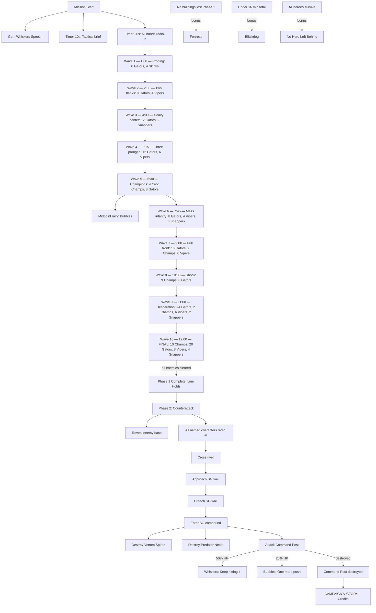

# Mission 4-4: THE RECKONING

## Header
- **ID**: `mission_16`
- **Chapter**: 4 — Final Offensive
- **Map**: 160x160 tiles (5120x5120px)
- **Setting**: The Copper-Silt Reach is a single battlefield. The southern half is the OEF's last forward operating base — everything the player has built across the campaign funnels here. The northern half is Scale-Guard's final command post — the remnants of their entire occupation force, consolidated for one desperate counterattack. Between them: a contested no-man's land of craters, burned mangroves, and flooded trenches. This is the final mission. Two phases: survive the largest Scale-Guard assault ever launched, then counterattack and destroy their command post. Every named character radios in. Every unit is available. The war ends here.
- **Win**: Phase 1 — Survive 10 assault waves. Phase 2 — Destroy the Scale-Guard Command Post.
- **Lose**: Lodge destroyed
- **Par Time**: 20 minutes
- **Unlocks**: (none — final mission)

## Zone Map
```
    0         32        64        96       128       160
  0 |---------|---------|---------|---------|---------|
    | sg_barracks_nw    | sg_command_post           |
    | (enemy prod.)     | (final objective)          |
 16 |---------|---------|---------|---------|---------|
    | sg_armory_w       | sg_inner_compound  |sg_ar_e|
    | (enemy bldgs)     | (fortified core)   |       |
 32 |---------|---------|---------|---------|---------|
    | sg_wall_north                                   |
    | (fortified wall — enemy base perimeter)         |
 40 |---------|---------|---------|---------|---------|
    | sg_staging_w      | sg_staging_center |sg_st_e |
    | (wave staging)    | (main force)      |        |
 56 |---------|---------|---------|---------|---------|
    | contested_nw      | river_crossing    |cont_ne |
    | (burned jungle)   | (bridge + fords)  |        |
 72 |---------|---------|---------|---------|---------|
    | contested_sw      | no_mans_land      |cont_se |
    | (craters)         | (open ground)     |        |
 88 |---------|---------|---------|---------|---------|
    | ura_wall_north                                  |
    | (player's forward wall — defensible)            |
 96 |---------|---------|---------|---------|---------|
    | ura_west_flank    | ura_front_base    |ura_e_f |
    | (watchtowers)     | (barracks, armory) |       |
112 |---------|---------|---------|---------|---------|
    | ura_resource_w    | ura_main_base     |ura_r_e |
    | (timber grove)    | (lodge, economy)  |(fish)  |
128 |---------|---------|---------|---------|---------|
    | ura_reserve_w     | ura_rear_base     |ura_rv_e|
    | (burrows)         | (shield gen, dock) |       |
144 |---------|---------|---------|---------|---------|
    | ura_supply_depot                                |
    | (rear supply, reinforcement rally point)        |
160 |---------|---------|---------|---------|---------|
```

## Zones (tile coordinates)
```typescript
zones: {
  // Player zones (south)
  ura_supply_depot:     { x: 16, y: 144, width: 128,height: 16 },
  ura_reserve_w:        { x: 0,  y: 128, width: 48, height: 16 },
  ura_rear_base:        { x: 48, y: 128, width: 64, height: 16 },
  ura_reserve_e:        { x: 112,y: 128, width: 48, height: 16 },
  ura_resource_w:       { x: 0,  y: 112, width: 48, height: 16 },
  ura_main_base:        { x: 48, y: 112, width: 64, height: 16 },
  ura_resource_e:       { x: 112,y: 112, width: 48, height: 16 },
  ura_west_flank:       { x: 0,  y: 96,  width: 48, height: 16 },
  ura_front_base:       { x: 48, y: 96,  width: 64, height: 16 },
  ura_east_flank:       { x: 112,y: 96,  width: 48, height: 16 },
  ura_wall_north:       { x: 0,  y: 88,  width: 160,height: 8  },
  // Contested middle ground
  contested_sw:         { x: 0,  y: 72,  width: 48, height: 16 },
  no_mans_land:         { x: 48, y: 72,  width: 64, height: 16 },
  contested_se:         { x: 112,y: 72,  width: 48, height: 16 },
  contested_nw:         { x: 0,  y: 56,  width: 48, height: 16 },
  river_crossing:       { x: 48, y: 56,  width: 64, height: 16 },
  contested_ne:         { x: 112,y: 56,  width: 48, height: 16 },
  // Enemy zones (north)
  sg_staging_w:         { x: 0,  y: 40,  width: 48, height: 16 },
  sg_staging_center:    { x: 48, y: 40,  width: 64, height: 16 },
  sg_staging_e:         { x: 112,y: 40,  width: 48, height: 16 },
  sg_wall_north:        { x: 0,  y: 32,  width: 160,height: 8  },
  sg_armory_w:          { x: 0,  y: 16,  width: 48, height: 16 },
  sg_inner_compound:    { x: 48, y: 16,  width: 64, height: 16 },
  sg_armory_e:          { x: 112,y: 16,  width: 48, height: 16 },
  sg_barracks_nw:       { x: 0,  y: 0,   width: 48, height: 16 },
  sg_command_post:      { x: 48, y: 0,   width: 112,height: 16 },
}
```

## Terrain Regions
```typescript
terrain: {
  width: 160, height: 160,
  regions: [
    { terrainId: "grass", fill: true },
    // Player base — surviving jungle and cleared ground
    { terrainId: "grass", rect: { x: 0, y: 88, w: 160, h: 72 } },
    { terrainId: "dirt", rect: { x: 48, y: 96, w: 64, h: 48 } },
    { terrainId: "mangrove", rect: { x: 0, y: 112, w: 48, h: 16 } },
    { terrainId: "mangrove", rect: { x: 112, y: 112, w: 48, h: 16 } },
    { terrainId: "concrete", rect: { x: 48, y: 128, w: 64, h: 16 } },
    // Player forward wall zone
    { terrainId: "concrete", rect: { x: 0, y: 88, w: 160, h: 8 } },
    // No-man's land — scarred, cratered earth
    { terrainId: "dirt", rect: { x: 0, y: 56, w: 160, h: 32 } },
    { terrainId: "mud", circle: { cx: 24, cy: 76, r: 6 } },
    { terrainId: "mud", circle: { cx: 56, cy: 80, r: 4 } },
    { terrainId: "mud", circle: { cx: 80, cy: 74, r: 8 } },
    { terrainId: "mud", circle: { cx: 104, cy: 78, r: 5 } },
    { terrainId: "mud", circle: { cx: 136, cy: 76, r: 6 } },
    { terrainId: "mud", circle: { cx: 40, cy: 64, r: 5 } },
    { terrainId: "mud", circle: { cx: 120, cy: 62, r: 4 } },
    // Burned mangrove (contested zone — stumps, no resources)
    { terrainId: "burned_mangrove", rect: { x: 0, y: 56, w: 48, h: 16 } },
    { terrainId: "burned_mangrove", rect: { x: 112, y: 56, w: 48, h: 16 } },
    // River through center of contested zone
    { terrainId: "water", river: {
      points: [[0,64],[32,62],[64,66],[96,62],[128,66],[160,64]],
      width: 4
    }},
    // Enemy territory — stripped industrial ground
    { terrainId: "dirt", rect: { x: 0, y: 0, w: 160, h: 56 } },
    { terrainId: "concrete", rect: { x: 0, y: 32, w: 160, h: 8 } },
    { terrainId: "concrete", rect: { x: 48, y: 16, w: 64, h: 16 } },
    { terrainId: "metal", rect: { x: 64, y: 4, w: 32, h: 8 } },
    // Supply depot (rear)
    { terrainId: "dirt", rect: { x: 16, y: 148, w: 128, h: 8 } },
  ],
  overrides: [
    // Bridges over contested river (3 crossing points)
    ...bridgeTiles(32, 62, 32, 68),   // west bridge
    ...bridgeTiles(80, 62, 80, 68),   // center bridge (main)
    ...bridgeTiles(128, 62, 128, 68), // east bridge
    // Ford crossings (shallow, slower movement)
    ...fordTiles(56, 64, 64, 68),     // west ford
    ...fordTiles(96, 62, 104, 66),    // east ford
  ]
}
```

## Placements

### Player (ura_main_base + surrounding zones)
```typescript
// Lodge (Captain's field HQ)
{ type: "lodge", faction: "ura", x: 80, y: 120 },
// Full base complex
{ type: "command_post", faction: "ura", x: 64, y: 116 },
{ type: "barracks", faction: "ura", x: 96, y: 116 },
{ type: "armory", faction: "ura", x: 56, y: 100 },
{ type: "siege_workshop", faction: "ura", x: 96, y: 100 },
{ type: "shield_generator", faction: "ura", x: 72, y: 132 },
{ type: "shield_generator", faction: "ura", x: 88, y: 132 },
{ type: "dock", faction: "ura", x: 80, y: 136 },
// Burrows (5 for large pop cap)
{ type: "burrow", faction: "ura", x: 8,  y: 132 },
{ type: "burrow", faction: "ura", x: 24, y: 136 },
{ type: "burrow", faction: "ura", x: 40, y: 132 },
{ type: "burrow", faction: "ura", x: 120, y: 132 },
{ type: "burrow", faction: "ura", x: 136, y: 136 },
// Fish Traps (pre-built economy)
{ type: "fish_trap", faction: "ura", x: 120, y: 118 },
{ type: "fish_trap", faction: "ura", x: 128, y: 120 },
{ type: "fish_trap", faction: "ura", x: 136, y: 118 },
// Forward wall (pre-built defensive line)
{ type: "fortified_wall", faction: "ura", x: 16, y: 90 },
{ type: "fortified_wall", faction: "ura", x: 32, y: 90 },
{ type: "fortified_wall", faction: "ura", x: 48, y: 90 },
{ type: "fortified_wall", faction: "ura", x: 64, y: 90 },
{ type: "fortified_wall", faction: "ura", x: 80, y: 90 },
{ type: "fortified_wall", faction: "ura", x: 96, y: 90 },
{ type: "fortified_wall", faction: "ura", x: 112, y: 90 },
{ type: "fortified_wall", faction: "ura", x: 128, y: 90 },
{ type: "fortified_wall", faction: "ura", x: 144, y: 90 },
// Watchtowers on wall line
{ type: "watchtower", faction: "ura", x: 24, y: 92 },
{ type: "watchtower", faction: "ura", x: 56, y: 92 },
{ type: "watchtower", faction: "ura", x: 80, y: 92 },
{ type: "watchtower", faction: "ura", x: 104, y: 92 },
{ type: "watchtower", faction: "ura", x: 136, y: 92 },
// Starting workers
{ type: "river_rat", faction: "ura", x: 68, y: 122 },
{ type: "river_rat", faction: "ura", x: 72, y: 123 },
{ type: "river_rat", faction: "ura", x: 76, y: 122 },
{ type: "river_rat", faction: "ura", x: 80, y: 123 },
{ type: "river_rat", faction: "ura", x: 84, y: 122 },
{ type: "river_rat", faction: "ura", x: 88, y: 123 },
{ type: "river_rat", faction: "ura", x: 92, y: 122 },
{ type: "river_rat", faction: "ura", x: 96, y: 123 },
// Starting army — the largest OEF force ever assembled
// Front line (behind wall)
{ type: "mudfoot", faction: "ura", x: 24, y: 94 },
{ type: "mudfoot", faction: "ura", x: 32, y: 94 },
{ type: "mudfoot", faction: "ura", x: 40, y: 94 },
{ type: "mudfoot", faction: "ura", x: 48, y: 94 },
{ type: "mudfoot", faction: "ura", x: 56, y: 94 },
{ type: "mudfoot", faction: "ura", x: 64, y: 94 },
{ type: "mudfoot", faction: "ura", x: 72, y: 94 },
{ type: "mudfoot", faction: "ura", x: 80, y: 94 },
{ type: "mudfoot", faction: "ura", x: 88, y: 94 },
{ type: "mudfoot", faction: "ura", x: 96, y: 94 },
{ type: "mudfoot", faction: "ura", x: 104, y: 94 },
{ type: "mudfoot", faction: "ura", x: 112, y: 94 },
// Second line (ranged)
{ type: "shellcracker", faction: "ura", x: 32, y: 98 },
{ type: "shellcracker", faction: "ura", x: 48, y: 98 },
{ type: "shellcracker", faction: "ura", x: 64, y: 98 },
{ type: "shellcracker", faction: "ura", x: 80, y: 98 },
{ type: "shellcracker", faction: "ura", x: 96, y: 98 },
{ type: "shellcracker", faction: "ura", x: 112, y: 98 },
// Artillery
{ type: "mortar_otter", faction: "ura", x: 40, y: 102 },
{ type: "mortar_otter", faction: "ura", x: 56, y: 102 },
{ type: "mortar_otter", faction: "ura", x: 72, y: 102 },
{ type: "mortar_otter", faction: "ura", x: 88, y: 102 },
{ type: "mortar_otter", faction: "ura", x: 104, y: 102 },
// Sappers (siege reserve)
{ type: "sapper", faction: "ura", x: 60, y: 106 },
{ type: "sapper", faction: "ura", x: 68, y: 106 },
{ type: "sapper", faction: "ura", x: 76, y: 106 },
{ type: "sapper", faction: "ura", x: 84, y: 106 },
// Divers and Raftsmen (flanking reserve)
{ type: "diver", faction: "ura", x: 16, y: 104 },
{ type: "diver", faction: "ura", x: 20, y: 104 },
{ type: "raftsman", faction: "ura", x: 140, y: 104 },
{ type: "raftsman", faction: "ura", x: 144, y: 104 },
```

### Resources
```typescript
// Timber (western and eastern mangrove groves)
{ type: "mangrove_tree", faction: "neutral", x: 8,  y: 114 },
{ type: "mangrove_tree", faction: "neutral", x: 14, y: 118 },
{ type: "mangrove_tree", faction: "neutral", x: 20, y: 116 },
{ type: "mangrove_tree", faction: "neutral", x: 26, y: 120 },
{ type: "mangrove_tree", faction: "neutral", x: 32, y: 114 },
{ type: "mangrove_tree", faction: "neutral", x: 10, y: 122 },
{ type: "mangrove_tree", faction: "neutral", x: 18, y: 124 },
{ type: "mangrove_tree", faction: "neutral", x: 36, y: 118 },
{ type: "mangrove_tree", faction: "neutral", x: 40, y: 122 },
{ type: "mangrove_tree", faction: "neutral", x: 120, y: 114 },
{ type: "mangrove_tree", faction: "neutral", x: 126, y: 118 },
{ type: "mangrove_tree", faction: "neutral", x: 132, y: 116 },
{ type: "mangrove_tree", faction: "neutral", x: 138, y: 120 },
{ type: "mangrove_tree", faction: "neutral", x: 144, y: 114 },
{ type: "mangrove_tree", faction: "neutral", x: 128, y: 122 },
{ type: "mangrove_tree", faction: "neutral", x: 136, y: 124 },
{ type: "mangrove_tree", faction: "neutral", x: 148, y: 118 },
{ type: "mangrove_tree", faction: "neutral", x: 152, y: 122 },
// Fish (river spots + pre-built traps)
{ type: "fish_spot", faction: "neutral", x: 116, y: 116 },
{ type: "fish_spot", faction: "neutral", x: 124, y: 114 },
{ type: "fish_spot", faction: "neutral", x: 132, y: 116 },
{ type: "fish_spot", faction: "neutral", x: 140, y: 114 },
// Salvage (no-man's land — risky to gather during defense phase)
{ type: "salvage_cache", faction: "neutral", x: 32, y: 76 },
{ type: "salvage_cache", faction: "neutral", x: 64, y: 78 },
{ type: "salvage_cache", faction: "neutral", x: 96, y: 74 },
{ type: "salvage_cache", faction: "neutral", x: 128, y: 76 },
// Salvage (enemy base — reward for counterattack)
{ type: "salvage_cache", faction: "neutral", x: 24, y: 20 },
{ type: "salvage_cache", faction: "neutral", x: 56, y: 24 },
{ type: "salvage_cache", faction: "neutral", x: 96, y: 20 },
{ type: "salvage_cache", faction: "neutral", x: 136, y: 24 },
```

### Enemies

#### Scale-Guard Base (static garrison — active during Phase 2)
```typescript
// Command Post (the final objective)
{ type: "sg_command_post", faction: "scale_guard", x: 80, y: 6, hp: 4000 },
// Base buildings
{ type: "predator_nest", faction: "scale_guard", x: 16, y: 4 },
{ type: "predator_nest", faction: "scale_guard", x: 40, y: 8 },
{ type: "barracks", faction: "scale_guard", x: 120, y: 4 },
{ type: "barracks", faction: "scale_guard", x: 140, y: 8 },
{ type: "venom_spire", faction: "scale_guard", x: 56, y: 20 },
{ type: "venom_spire", faction: "scale_guard", x: 104, y: 20 },
{ type: "watchtower", faction: "scale_guard", x: 32, y: 34 },
{ type: "watchtower", faction: "scale_guard", x: 64, y: 34 },
{ type: "watchtower", faction: "scale_guard", x: 96, y: 34 },
{ type: "watchtower", faction: "scale_guard", x: 128, y: 34 },
// Forward wall
{ type: "fortified_wall", faction: "scale_guard", x: 16, y: 36 },
{ type: "fortified_wall", faction: "scale_guard", x: 32, y: 36 },
{ type: "fortified_wall", faction: "scale_guard", x: 48, y: 36 },
{ type: "fortified_wall", faction: "scale_guard", x: 64, y: 36 },
{ type: "fortified_wall", faction: "scale_guard", x: 80, y: 36 },
{ type: "fortified_wall", faction: "scale_guard", x: 96, y: 36 },
{ type: "fortified_wall", faction: "scale_guard", x: 112, y: 36 },
{ type: "fortified_wall", faction: "scale_guard", x: 128, y: 36 },
{ type: "fortified_wall", faction: "scale_guard", x: 144, y: 36 },
// Base garrison (defending during Phase 2)
{ type: "croc_champion", faction: "scale_guard", x: 64, y: 12 },
{ type: "croc_champion", faction: "scale_guard", x: 80, y: 10 },
{ type: "croc_champion", faction: "scale_guard", x: 96, y: 12 },
{ type: "croc_champion", faction: "scale_guard", x: 72, y: 22 },
{ type: "croc_champion", faction: "scale_guard", x: 88, y: 22 },
{ type: "gator", faction: "scale_guard", x: 24, y: 18 },
{ type: "gator", faction: "scale_guard", x: 36, y: 14 },
{ type: "gator", faction: "scale_guard", x: 48, y: 18 },
{ type: "gator", faction: "scale_guard", x: 60, y: 26 },
{ type: "gator", faction: "scale_guard", x: 76, y: 28 },
{ type: "gator", faction: "scale_guard", x: 84, y: 26 },
{ type: "gator", faction: "scale_guard", x: 100, y: 28 },
{ type: "gator", faction: "scale_guard", x: 116, y: 18 },
{ type: "gator", faction: "scale_guard", x: 132, y: 14 },
{ type: "gator", faction: "scale_guard", x: 144, y: 18 },
{ type: "viper", faction: "scale_guard", x: 40, y: 22 },
{ type: "viper", faction: "scale_guard", x: 56, y: 16 },
{ type: "viper", faction: "scale_guard", x: 104, y: 16 },
{ type: "viper", faction: "scale_guard", x: 120, y: 22 },
{ type: "snapper", faction: "scale_guard", x: 52, y: 30 },
{ type: "snapper", faction: "scale_guard", x: 80, y: 30 },
{ type: "snapper", faction: "scale_guard", x: 108, y: 30 },
```

#### No-Man's Land (light presence, cleared by waves)
```typescript
// Scattered Skink scouts
{ type: "skink", faction: "scale_guard", x: 40, y: 60,
  patrol: [[40,60],[80,60],[120,60],[80,60],[40,60]] },
{ type: "skink", faction: "scale_guard", x: 100, y: 58,
  patrol: [[100,58],[140,58],[100,58]] },
```

#### Assault Waves (spawned by Phase 1 triggers — NOT placed at start)
```typescript
// All waves spawn from sg_staging zones and advance south
// See Phase 1 triggers for exact compositions
```

## Phases

### Phase 1: THE LAST STAND (0:00 - ~12:00)
**Entry**: Mission start
**State**: Full base, full army, maximum fortifications. 600 fish / 500 timber / 400 salvage. Player base and no-man's land visible. Scale-Guard base fogged. Pre-built wall line with 5 watchtowers. This is the defense phase — 10 waves, 2 minutes between each.
**Objectives**:
- "Survive the Scale-Guard final offensive — 10 waves" (PRIMARY)

**Triggers**:
```
[0:00] mission-briefing
  Condition: missionStart()
  Action: exchange([
    { speaker: "Gen. Whiskers", text: "All units, this is Gen. Whiskers. This is the day we've been fighting toward since Beachhead. The Scale-Guard have consolidated everything they have left for one final assault on our position. If we hold — they're done. If we break — the campaign was for nothing." },
    { speaker: "Gen. Whiskers", text: "I'm not going to stand here and tell you this will be easy. It won't. They outnumber us. They outweigh us. They have every reason to fight to the last scale. But we have something they don't — we're fighting for our home." },
    { speaker: "Gen. Whiskers", text: "To every otter on this line: you are the Otter Elite Force. You are the best soldiers in the Copper-Silt Reach. And today, you will prove it. Through mud and water, Captain. Hold the line." }
  ])

[0:10] bubbles-tactical
  Condition: timer(10)
  Action: exchange([
    { speaker: "Col. Bubbles", text: "Tactical brief, Captain. They'll hit us from the north across no-man's land. Three bridges, two fords. Fortified wall is our primary defense — keep your Shellcrackers on the wall, Mortars behind it." },
    { speaker: "FOXHOUND", text: "Scale-Guard staging areas are massing troops. I count ten distinct formation groups. Expect ten waves over the next twelve minutes. They'll start probing and escalate to full commitment." }
  ])

[0:20] all-hands-radio
  Condition: timer(20)
  Action: exchange([
    { speaker: "Medic Marina", text: "Field hospital is standing by, Captain. I'll keep your troops patched up as long as I can. Stay close to your Burrows for the retreat protocol." },
    { speaker: "FOXHOUND", text: "First wave forming up. Here they come." }
  ])

// === WAVE 1 (1:00) — Probing attack ===
[1:00] wave-1
  Condition: timer(60)
  Action: [
    spawn("gator", "scale_guard", 80, 44, 6),
    spawn("skink", "scale_guard", 76, 42, 4),
    dialogue("foxhound", "Wave one! Gators and Skinks, center approach. Standard probing force."),
    setWaveCounter(1)
  ]

// === WAVE 2 (2:30) — Two-pronged ===
[2:30] wave-2
  Condition: timer(150)
  Action: [
    spawn("gator", "scale_guard", 32, 44, 4),
    spawn("gator", "scale_guard", 128, 44, 4),
    spawn("viper", "scale_guard", 36, 42, 2),
    spawn("viper", "scale_guard", 124, 42, 2),
    dialogue("foxhound", "Wave two — split attack! Gators on both flanks, Vipers providing covering fire."),
    setWaveCounter(2)
  ]

// === WAVE 3 (4:00) — Heavy center push ===
[4:00] wave-3
  Condition: timer(240)
  Action: [
    spawn("gator", "scale_guard", 72, 44, 6),
    spawn("gator", "scale_guard", 88, 44, 6),
    spawn("snapper", "scale_guard", 80, 42, 2),
    dialogue("col_bubbles", "Wave three — heavy push up the center! Snappers leading the charge. Focus fire on those Snappers before they reach the wall!"),
    setWaveCounter(3)
  ]

// === WAVE 4 (5:15) — Flanking maneuver ===
[5:15] wave-4
  Condition: timer(315)
  Action: [
    spawn("gator", "scale_guard", 8, 56, 4),
    spawn("gator", "scale_guard", 152, 56, 4),
    spawn("viper", "scale_guard", 12, 54, 3),
    spawn("viper", "scale_guard", 148, 54, 3),
    spawn("gator", "scale_guard", 80, 44, 4),
    exchange([
      { speaker: "FOXHOUND", text: "Wave four! They're trying to flank — forces coming through the burned jungle on both sides AND up the center!" },
      { speaker: "Col. Bubbles", text: "West flank watchtowers, focus those flankers! East flank, same! Center holds the line!" }
    ]),
    setWaveCounter(4)
  ]

// === WAVE 5 (6:30) — Croc Champions ===
[6:30] wave-5
  Condition: timer(390)
  Action: [
    spawn("croc_champion", "scale_guard", 56, 44, 2),
    spawn("croc_champion", "scale_guard", 104, 44, 2),
    spawn("gator", "scale_guard", 48, 46, 4),
    spawn("gator", "scale_guard", 96, 46, 4),
    exchange([
      { speaker: "FOXHOUND", text: "Wave five — Croc Champions! Two on the left, two on the right. They're bringing the heavies." },
      { speaker: "Gen. Whiskers", text: "Mortar Otters, target those Champions. Don't let them reach the wall." }
    ]),
    setWaveCounter(5)
  ]

[6:30] midpoint-rally
  Condition: timer(390)
  Action: dialogue("col_bubbles", "Halfway there, Captain. Five waves down. Five to go. You're doing it.")

// === WAVE 6 (7:45) — Artillery barrage + infantry ===
[7:45] wave-6
  Condition: timer(465)
  Action: [
    spawn("gator", "scale_guard", 64, 44, 8),
    spawn("viper", "scale_guard", 56, 40, 4),
    spawn("snapper", "scale_guard", 72, 40, 3),
    dialogue("foxhound", "Wave six — massed infantry with Snapper fire support. They're trying to overwhelm the center."),
    setWaveCounter(6)
  ]

// === WAVE 7 (9:00) — Coordinated multi-front ===
[9:00] wave-7
  Condition: timer(540)
  Action: [
    spawn("gator", "scale_guard", 32, 44, 5),
    spawn("gator", "scale_guard", 80, 44, 6),
    spawn("gator", "scale_guard", 128, 44, 5),
    spawn("croc_champion", "scale_guard", 80, 42, 2),
    spawn("viper", "scale_guard", 64, 40, 3),
    spawn("viper", "scale_guard", 96, 40, 3),
    exchange([
      { speaker: "FOXHOUND", text: "Wave seven! All three approaches simultaneously! This is their biggest push yet!" },
      { speaker: "Col. Bubbles", text: "Everything on the line, Captain! Pull reserves forward if you have them!" }
    ]),
    setWaveCounter(7)
  ]

// === WAVE 8 (10:00) — Shock assault ===
[10:00] wave-8
  Condition: timer(600)
  Action: [
    spawn("croc_champion", "scale_guard", 40, 44, 3),
    spawn("croc_champion", "scale_guard", 80, 44, 3),
    spawn("croc_champion", "scale_guard", 120, 44, 3),
    spawn("gator", "scale_guard", 60, 46, 4),
    spawn("gator", "scale_guard", 100, 46, 4),
    exchange([
      { speaker: "FOXHOUND", text: "Wave eight — nine Croc Champions leading a full assault! This is their shock force!" },
      { speaker: "Medic Marina", text: "Captain, casualties are mounting. I'm doing what I can but we need that wall to hold!" },
      { speaker: "Gen. Whiskers", text: "HOLD! Do NOT give ground! We break them here or we lose everything!" }
    ]),
    setWaveCounter(8)
  ]

// === WAVE 9 (11:00) — Desperation assault ===
[11:00] wave-9
  Condition: timer(660)
  Action: [
    spawn("gator", "scale_guard", 24, 44, 6),
    spawn("gator", "scale_guard", 56, 44, 6),
    spawn("gator", "scale_guard", 104, 44, 6),
    spawn("gator", "scale_guard", 136, 44, 6),
    spawn("croc_champion", "scale_guard", 80, 42, 2),
    spawn("viper", "scale_guard", 40, 40, 3),
    spawn("viper", "scale_guard", 120, 40, 3),
    spawn("snapper", "scale_guard", 80, 40, 2),
    exchange([
      { speaker: "FOXHOUND", text: "Wave nine — everything from everywhere! Twenty-four Gators, two Champions, six Vipers, two Snappers!" },
      { speaker: "Col. Bubbles", text: "This is their all-in, Captain. They're throwing the last of their reserves at us. One more wave after this!" }
    ]),
    setWaveCounter(9)
  ]

// === WAVE 10 (12:00) — Final wave — the Broodmother's fury ===
[12:00] wave-10
  Condition: timer(720)
  Action: [
    spawn("croc_champion", "scale_guard", 32, 42, 3),
    spawn("croc_champion", "scale_guard", 80, 42, 4),
    spawn("croc_champion", "scale_guard", 128, 42, 3),
    spawn("gator", "scale_guard", 48, 44, 6),
    spawn("gator", "scale_guard", 80, 44, 8),
    spawn("gator", "scale_guard", 112, 44, 6),
    spawn("viper", "scale_guard", 64, 40, 4),
    spawn("viper", "scale_guard", 96, 40, 4),
    spawn("snapper", "scale_guard", 56, 40, 2),
    spawn("snapper", "scale_guard", 104, 40, 2),
    exchange([
      { speaker: "FOXHOUND", text: "WAVE TEN! FINAL WAVE! Everything they have — Champions, Gators, Vipers, Snappers — ALL OF IT!" },
      { speaker: "Gen. Whiskers", text: "THIS IS IT! The last wave! Hold this line and the Scale-Guard offensive is BROKEN! FOR THE REACH!" }
    ]),
    setWaveCounter(10)
  ]

wave-10-cleared
  Condition: waveCounter("eq", 10) AND enemyCountInZone("no_mans_land", "lte", 0) AND
             enemyCountInZone("contested_sw", "lte", 0) AND enemyCountInZone("contested_se", "lte", 0)
  Action: [
    completeObjective("survive-10-waves"),
    exchange([
      { speaker: "Gen. Whiskers", text: "...They're retreating. The line holds. THE LINE HOLDS!" },
      { speaker: "Col. Bubbles", text: "Ten waves, Captain. You held against ten waves. I've never seen anything like it." },
      { speaker: "Medic Marina", text: "Casualties are... significant. But we're still here. We're still standing." },
      { speaker: "FOXHOUND", text: "Scale-Guard offensive capability is spent. Their staging areas are empty. They have nothing left but what's in that base." }
    ]),
    startPhase("counterattack")
  ]
```

### Phase 2: COUNTERATTACK (~12:00 - ~20:00)
**Entry**: All 10 waves survived
**New objectives**:
- "Destroy the Scale-Guard Command Post" (PRIMARY)

**Triggers**:
```
phase2-briefing
  Condition: enableTrigger (fired by Phase 1 completion)
  Action: exchange([
    { speaker: "Gen. Whiskers", text: "Now it's our turn. They threw everything at us and we didn't break. Their base is exposed. Captain — give the order." },
    { speaker: "Col. Bubbles", text: "Scale-Guard command post is due north, behind their wall line. Predator Nests, Venom Spires, Croc Champions — a full garrison. But they have no reserves. What you see is what they have." },
    { speaker: "FOXHOUND", text: "I'm revealing their base layout now. Three bridges across the river, two fords. Their wall mirrors ours. Sappers will need to breach it." }
  ])

[phase2 + 0s] all-hands-counterattack
  Condition: enableTrigger (fired by Phase 2 start)
  Action: [
    revealZone("sg_staging_w"),
    revealZone("sg_staging_center"),
    revealZone("sg_staging_e"),
    revealZone("sg_wall_north"),
    revealZone("sg_armory_w"),
    revealZone("sg_inner_compound"),
    revealZone("sg_armory_e"),
    revealZone("sg_barracks_nw"),
    revealZone("sg_command_post"),
    exchange([
      { speaker: "Cpl. Splash", text: "Splash reporting in, Captain. My Divers are ready. We can swim the river and hit their flanks before they know we're coming." },
      { speaker: "Sgt. Fang", text: "Fang here. Give me the word and my siege team will punch through that wall like it's made of mud." }
    ])
  ]

river-crossed
  Condition: areaEntered("ura", "river_crossing")
  Action: dialogue("foxhound", "Forces crossing the river. You're in their territory now, Captain.")

contested-north-entered
  Condition: areaEntered("ura", "contested_nw") OR areaEntered("ura", "contested_ne")
  Action: dialogue("col_bubbles", "Pushing through no-man's land. Keep the momentum — don't let them regroup.")

sg-wall-approached
  Condition: areaEntered("ura", "sg_staging_center")
  Action: exchange([
    { speaker: "FOXHOUND", text: "Scale-Guard forward wall. Watchtowers, fortified positions. Sapper teams — breach those walls." },
    { speaker: "Col. Bubbles", text: "Mortars, suppress those watchtowers! Infantry, stand by to push through the breach!" }
  ])

sg-wall-breached
  Condition: enemyCountInZone("sg_wall_north", "lte", 2)
  Action: dialogue("col_bubbles", "Wall breached! Push into their compound! The command post is in sight!")

sg-compound-entered
  Condition: areaEntered("ura", "sg_inner_compound")
  Action: exchange([
    { speaker: "FOXHOUND", text: "Inside the compound. Venom Spires on both flanks — take them out. Command post is straight ahead." },
    { speaker: "Gen. Whiskers", text: "We're inside their walls, Captain. Finish this. End the occupation." }
  ])

sg-venom-spires-destroyed
  Condition: buildingCountInZone("scale_guard", "sg_inner_compound", "venom_spire", "eq", 0)
  Action: dialogue("foxhound", "Both Venom Spires down. Path to the command post is clear.")

sg-predator-nests-destroyed
  Condition: buildingCount("scale_guard", "predator_nest", "eq", 0)
  Action: dialogue("col_bubbles", "Predator Nests destroyed. No more Scale-Guard spawning. This is the end for them.")

command-post-50
  Condition: healthThreshold("sg_command_post", 50)
  Action: exchange([
    { speaker: "FOXHOUND", text: "Command post at half integrity! They're fighting to the last scale but they can't stop us now." },
    { speaker: "Gen. Whiskers", text: "Keep hitting it! Don't stop until that building is rubble!" }
  ])

command-post-25
  Condition: healthThreshold("sg_command_post", 25)
  Action: dialogue("col_bubbles", "Command post is crumbling! One more push, Captain! ONE MORE PUSH!")

command-post-destroyed
  Condition: healthThreshold("sg_command_post", 0)
  Action: completeObjective("destroy-command-post")

// ============================================================
// VICTORY — THE WAR IS OVER
// ============================================================
mission-complete
  Condition: allPrimaryComplete()
  Action: exchange([
    { speaker: "FOXHOUND", text: "...Scale-Guard command post destroyed. All Scale-Guard frequencies have gone silent. Confirming — the Scale-Guard command structure has collapsed." },

    { speaker: "Col. Bubbles", text: "Captain... we did it. It's over. The occupation of the Copper-Silt Reach is over." },

    { speaker: "Medic Marina", text: "Medical teams are moving in. So many wounded... but they're alive, Captain. They're alive because of you." },

    { speaker: "Cpl. Splash", text: "Splash here. I grew up on these rivers, Captain. I never thought I'd see them free again. Thank you. From every otter who ever called the Reach home — thank you." },

    { speaker: "Sgt. Fang", text: "Fang reporting. The last of the Scale-Guard garrison is laying down arms. No more resistance. The Reach is ours." },

    { speaker: "FOXHOUND", text: "This is FOXHOUND signing off combat operations. All OEF units — the war is won. I repeat: the war is won." },

    { speaker: "Gen. Whiskers", text: "Captain." },
    { speaker: "Gen. Whiskers", text: "When we landed at that beach — Mission One, you remember — I was in a cage. Ironjaw had me locked up in that compound and I thought that was the end. The end of the OEF. The end of everything we'd fought for." },
    { speaker: "Gen. Whiskers", text: "Then you came. A Captain with four River Rats and nothing but mangrove timber and stubbornness. And you built. You fought. You rescued me. You rescued all of us." },
    { speaker: "Gen. Whiskers", text: "Sixteen battles, Captain. From Beachhead to the Reckoning. Through monsoons and toxic sludge and three rings of fortress wall and the largest Scale-Guard army ever assembled. And you never lost. Not once." },
    { speaker: "Gen. Whiskers", text: "The Copper-Silt Reach is free tonight because of you. The rivers run clean. The villages can rebuild. The crossings are open. Our people can go home." },
    { speaker: "Gen. Whiskers", text: "I've commanded soldiers for thirty years, Captain. I've never served with a finer one than you." },
    { speaker: "Gen. Whiskers", text: "Through mud and water. OEF out." }
  ], followed by: victory(), credits: true)
```

### Bonus Objectives
```
no-buildings-lost-phase1
  Condition: completeObjective("survive-10-waves") AND allBuildingsIntact("ura")
  Action: [
    dialogue("col_bubbles", "Not a single building lost in the defense. Unbelievable, Captain."),
    completeObjective("bonus-fortress")
  ]

speed-counterattack
  Condition: completeObjective("destroy-command-post") AND timer("lt", 960)  // Under 16 minutes total
  Action: [
    dialogue("foxhound", "Command post destroyed in record time. The counterattack was devastating."),
    completeObjective("bonus-blitzkrieg")
  ]

all-named-survive
  Condition: allPrimaryComplete() AND namedUnitAlive("sgt_fang") AND namedUnitAlive("cpl_splash") AND namedUnitAlive("medic_marina")
  Action: completeObjective("bonus-no-hero-left-behind")
```

## Trigger Flowchart


## Balance Notes
- **Starting resources**: 600 fish, 500 timber, 400 salvage — the largest starting economy in the campaign. Pre-built Fish Traps provide passive income.
- **Population cap**: 5 Burrows = 30 starting pop cap. Player can build more during defense phase.
- **Pre-built defenses**: 9 fortified wall segments, 5 watchtowers. The wall line is the primary defense — losing sections creates gaps the enemy exploits.
- **Wave escalation curve**:
  - Waves 1-3: Teaching waves. Single direction, predictable. ~10-14 enemies each.
  - Waves 4-6: Multi-directional. Forces player to split attention. ~15-18 enemies each.
  - Waves 7-8: Full commitment. Multi-front with Champions. ~20-25 enemies each.
  - Waves 9-10: Apocalyptic. Everything from everywhere. ~34-42 enemies each.
- **Total wave enemies**: ~200 enemies across 10 waves. This is the hardest encounter in the campaign.
- **Phase 2 garrison**: ~30 static defenders + buildings. Weakened compared to Phase 1 assault — the enemy spent their offensive power in the waves.
- **Command Post HP**: 4000 — requires sustained siege. Sappers and Mortar Otters are optimal. Mudfoots can chip but it takes time.
- **Phase transition**: No timer between Phase 1 and Phase 2. The player controls the counterattack tempo — they can rebuild, retrain, and push when ready.
- **Key strategic decisions**:
  - Defense: Concentrate forces at center (risk flanks) vs. spread evenly (dilute firepower)
  - Counterattack: Rush through center (fast but costly) vs. systematic wing-by-wing (slow but safe)
  - Economy: Gather salvage from no-man's land during defense lulls (risky) or play safe
- **Named character radio-ins**: Every named character from the campaign appears in dialogue. This is the narrative payoff.
- **Victory sequence**: Extended dialogue with emotional beats. Credits roll after Gen. Whiskers' final speech.
- **Enemy scaling** (difficulty):
  - Support: 8 waves instead of 10, wave sizes reduced 30%, Command Post has 2500 HP, no Predator Nests in base
  - Tactical: as written
  - Elite: 12 waves, wave sizes +25%, waves arrive 15s faster, Command Post has 5500 HP, base gets third Venom Spire, Phase 2 Predator Nests spawn Croc Champions
- **Par time**: 20 minutes on Tactical — longest mission in the campaign. 12 minutes defense + 8 minutes counterattack.
